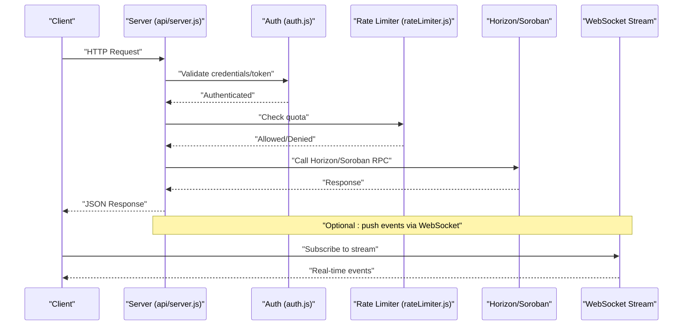
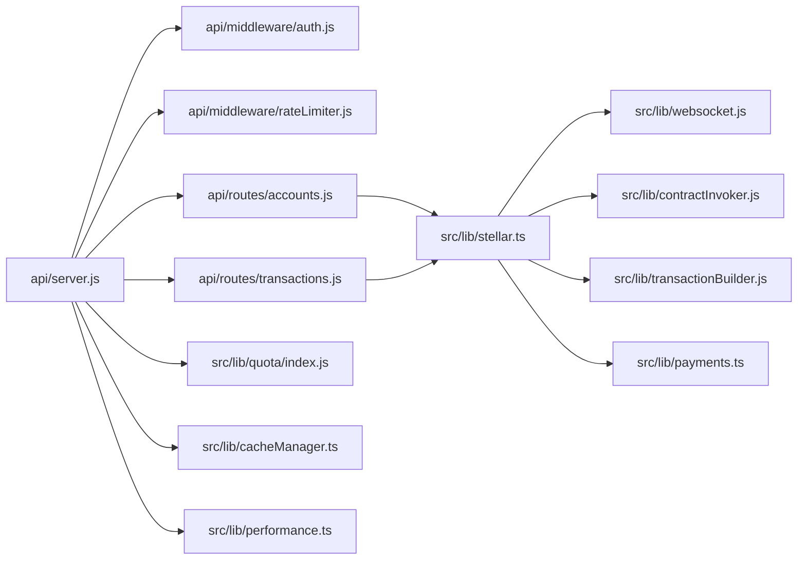

# API Reference

<cite>
**Referenced Files in This Document**
- [api/server.js](file://api/server.js)
- [api/middleware/auth.js](file://api/middleware/auth.js)
- [api/middleware/rateLimiter.js](file://api/middleware/rateLimiter.js)
- [api/routes/accounts.js](file://api/routes/accounts.js)
- [api/routes/transactions.js](file://api/routes/transactions.js)
- [docs/api/openapi.yaml](file://docs/api/openapi.yaml)
- [docs/api/RATE_LIMITING.md](file://docs/api/RATE_LIMITING.md)
- [docs/api/ERROR_REFERENCE.md](file://docs/api/ERROR_REFERENCE.md)
- [docs/api/VERSION_HISTORY.md](file://docs/api/VERSION_HISTORY.md)
- [docs/api/README.md](file://docs/api/README.md)
- [docs/api/stellar.md](file://docs/api/stellar.md)
- [docs/api/examples/js/horizon-account-example.js](file://docs/api/examples/js/horizon-account-example.js)
- [docs/api/examples/python/horizon_account_example.py](file://docs/api/examples/python/horizon_account_example.py)
- [docs/api/examples/js/invoke-contract.mjs](file://docs/api/examples/js/invoke-contract.mjs)
- [docs/api/examples/python/invoke_contract.py](file://docs/api/examples/python/invoke_contract.py)
- [docs/api/examples/js/send-payment.mjs](file://docs/api/examples/js/send-payment.mjs)
- [docs/api/examples/python/send_payment.py](file://docs/api/examples/python/send_payment.py)
- [docs/api/examples/js/create-trustline.mjs](file://docs/api/examples/js/create-trustline.mjs)
- [docs/api/examples/python/create_trustline.py](file://docs/api/examples/python/create_trustline.py)
- [docs-site/docs/api-reference/overview.md](file://docs-site/docs/api-reference/overview.md)
- [docs-site/docs/api-reference/horizon/accounts.md](file://docs-site/docs/api-reference/horizon/accounts.md)
- [docs-site/docs/api-reference/horizon/submit-transaction.md](file://docs-site/docs/api-reference/horizon/submit-transaction.md)
- [docs-site/docs/api-reference/soroban/overview.md](file://docs-site/docs/api-reference/soroban/overview.md)
- [docs-site/docs/api-reference/soroban/get-contract-data.md](file://docs-site/docs/api-reference/soroban/get-contract-data.md)
- [docs-site/docs/api-reference/soroban/get-events.md](file://docs-site/docs/api-reference/soroban/get-events.md)
- [docs-site/docs/api-reference/soroban/get-transaction.md](file://docs-site/docs/api-reference/soroban/get-transaction.md)
- [docs-site/docs/api-reference/soroban/send-transaction.md](file://docs-site/docs/api-reference/soroban/send-transaction.md)
- [docs-site/docs/api-reference/soroban/simulate-transaction.md](file://docs-site/docs/api-reference/soroban/simulate-transaction.md)
- [docs-site/docs/api-reference/error-reference.md](file://docs-site/docs/api-reference/error-reference.md)
- [docs-site/docs/api-reference/rate-limiting.md](file://docs-site/docs/api-reference/rate-limiting.md)
- [docs-site/docs/examples/js/stream-transactions.md](file://docs-site/docs/examples/js/stream-transactions.md)
- [src/lib/websocket.js](file://src/lib/websocket.js)
- [src/hooks/useAccountStream.ts](file://src/hooks/useAccountStream.ts)
- [src/lib/streaming.js](file://src/lib/streaming.js)
- [src/lib/stellar.ts](file://src/lib/stellar.ts)
- [src/lib/contractInvoker.js](file://src/lib/contractInvoker.js)
- [src/lib/transactionBuilder.js](file://src/lib/transactionBuilder.js)
- [src/lib/payments.ts](file://src/lib/payments.ts)
- [src/lib/webhooks.ts](file://src/lib/webhooks.ts)
- [src/lib/alertsService.ts](file://src/lib/alertsService.ts)
- [src/utils/security.js](file://src/utils/security.js)
- [src/lib/quota/index.js](file://src/lib/quota/index.js)
- [src/lib/cacheManager.ts](file://src/lib/cacheManager.ts)
- [src/lib/performance.ts](file://src/lib/performance.ts)
</cite>

## Table of Contents
1. Introduction
2. Project Structure
3. Core Components
4. Architecture Overview
5. Detailed Component Analysis
6. Dependency Analysis
7. Performance Considerations
8. Troubleshooting Guide
9. Conclusion
10. Appendices

## Introduction
This API Reference documents the public interfaces exposed by the dashboard’s backend and integration layers for Stellar Horizon, Soroban RPC, and real-time streaming via WebSockets. It covers custom REST endpoints, authentication, rate limiting, error handling, security considerations, client examples in JavaScript and Python, debugging approaches, performance optimization tips, versioning and deprecation policies, and migration guidance.

## Project Structure
The API surface is implemented as a small Node.js server with middleware and route modules, complemented by extensive documentation and examples:
- Backend server and routing: api/server.js, api/routes/*, api/middleware/*
- OpenAPI spec and API docs: docs/api/openapi.yaml, docs/api/*.md
- Site documentation and examples: docs-site/docs/api-reference/*, docs-site/docs/examples/*
- Client-side integrations and utilities: src/lib/* (Stellar, Soroban, streaming, caching, performance)

```mermaid
graph TB
subgraph "Backend"
S["api/server.js"]
MAuth["api/middleware/auth.js"]
MR["api/middleware/rateLimiter.js"]
RA["api/routes/accounts.js"]
RT["api/routes/transactions.js"]
end
subgraph "Docs & Examples"
OAS["docs/api/openapi.yaml"]
RL["docs/api/RATE_LIMITING.md"]
ER["docs/api/ERROR_REFERENCE.md"]
VH["docs/api/VERSION_HISTORY.md"]
EXJS["docs/api/examples/js/*"]
EXPY["docs/api/examples/python/*"]
end
subgraph "Client Integrations"
WS["src/lib/websocket.js"]
ST["src/lib/stellar.ts"]
CI["src/lib/contractInvoker.js"]
TB["src/lib/transactionBuilder.js"]
PAY["src/lib/payments.ts"]
WH["src/lib/webhooks.ts"]
AL["src/lib/alertsService.ts"]
Q["src/lib/quota/index.js"]
CM["src/lib/cacheManager.ts"]
PF["src/lib/performance.ts"]
end
S --> MAuth
S --> MR
S --> RA
S --> RT
S --- OAS
S --- RL
S --- ER
S --- VH
S --- EXJS
S --- EXPY
ST --- WS
CI --- ST
TB --- ST
PAY --- ST
WH --- ST
AL --- ST
Q --- S
CM --- S
PF --- S
```

**Diagram sources**
- [api/server.js](file://api/server.js)
- [api/middleware/auth.js](file://api/middleware/auth.js)
- [api/middleware/rateLimiter.js](file://api/middleware/rateLimiter.js)
- [api/routes/accounts.js](file://api/routes/accounts.js)
- [api/routes/transactions.js](file://api/routes/transactions.js)
- [docs/api/openapi.yaml](file://docs/api/openapi.yaml)
- [docs/api/RATE_LIMITING.md](file://docs/api/RATE_LIMITING.md)
- [docs/api/ERROR_REFERENCE.md](file://docs/api/ERROR_REFERENCE.md)
- [docs/api/VERSION_HISTORY.md](file://docs/api/VERSION_HISTORY.md)
- [docs/api/examples/js/horizon-account-example.js](file://docs/api/examples/js/horizon-account-example.js)
- [docs/api/examples/python/horizon_account_example.py](file://docs/api/examples/python/horizon_account_example.py)
- [docs/api/examples/js/invoke-contract.mjs](file://docs/api/examples/js/invoke-contract.mjs)
- [docs/api/examples/python/invoke_contract.py](file://docs/api/examples/python/invoke_contract.py)
- [docs/api/examples/js/send-payment.mjs](file://docs/api/examples/js/send-payment.mjs)
- [docs/api/examples/python/send_payment.py](file://docs/api/examples/python/send_payment.py)
- [docs/api/examples/js/create-trustline.mjs](file://docs/api/examples/js/create-trustline.mjs)
- [docs/api/examples/python/create_trustline.py](file://docs/api/examples/python/create_trustline.py)
- [src/lib/websocket.js](file://src/lib/websocket.js)
- [src/lib/stellar.ts](file://src/lib/stellar.ts)
- [src/lib/contractInvoker.js](file://src/lib/contractInvoker.js)
- [src/lib/transactionBuilder.js](file://src/lib/transactionBuilder.js)
- [src/lib/payments.ts](file://src/lib/payments.ts)
- [src/lib/webhooks.ts](file://src/lib/webhooks.ts)
- [src/lib/alertsService.ts](file://src/lib/alertsService.ts)
- [src/lib/quota/index.js](file://src/lib/quota/index.js)
- [src/lib/cacheManager.ts](file://src/lib/cacheManager.ts)
- [src/lib/performance.ts](file://src/lib/performance.ts)

**Section sources**
- [api/server.js](file://api/server.js)
- [docs/api/README.md](file://docs/api/README.md)

## Core Components
- Custom REST Server: Express-based server that wires middleware and routes.
- Authentication Middleware: Validates tokens or session context before route handlers execute.
- Rate Limiting Middleware: Enforces per-client request quotas to protect downstream services.
- Route Modules: Feature-scoped controllers for accounts and transactions.
- OpenAPI Specification: Machine-readable contract used for generation and validation.
- Documentation and Examples: Human-readable guides and runnable examples for Horizon and Soroban flows.

Key responsibilities:
- Request lifecycle: incoming HTTP -> auth -> rate limit -> route handler -> response.
- Integration layer: calls to Horizon and Soroban RPC are orchestrated from backend and/or client libraries.
- Real-time data: WebSocket streams for live ledger updates and account activity.

**Section sources**
- [api/server.js](file://api/server.js)
- [api/middleware/auth.js](file://api/middleware/auth.js)
- [api/middleware/rateLimiter.js](file://api/middleware/rateLimiter.js)
- [api/routes/accounts.js](file://api/routes/accounts.js)
- [api/routes/transactions.js](file://api/routes/transactions.js)
- [docs/api/openapi.yaml](file://docs/api/openapi.yaml)

## Architecture Overview
The system exposes a thin REST layer over Horizon and Soroban RPC, with optional local caching and quota enforcement. Real-time updates are delivered via WebSockets.

**Diagram sources**
- [api/server.js](file://api/server.js)
- [api/middleware/auth.js](file://api/middleware/auth.js)
- [api/middleware/rateLimiter.js](file://api/middleware/rateLimiter.js)
- [src/lib/websocket.js](file://src/lib/websocket.js)
- [src/lib/stellar.ts](file://src/lib/stellar.ts)

## Detailed Component Analysis

### Custom REST Endpoints
- Base path and versioning: see OpenAPI spec for base URL and version segments.
- Accounts:
  - GET /accounts/{id}
  - POST /accounts/{id}/operations
  - GET /accounts/{id}/transactions
- Transactions:
  - POST /transactions
  - GET /transactions/{hash}
  - POST /transactions/simulate
  - POST /transactions/submit

Authentication:
- Bearer token or API key passed via Authorization header.
- Optional per-route scopes enforced by middleware.

Rate Limiting:
- Per-client limits applied globally and per-route; responses include standard headers.
- Quota details and tiers documented in rate limiting guide.

Error Handling:
- Standardized error envelope with code, message, and trace id.
- See error reference for all codes and remediation steps.

Security:
- TLS required in production.
- Input validation and output sanitization.
- CORS configured per environment.

Examples:
- JavaScript and Python samples for Horizon account queries, payments, trustlines, and Soroban invocations.

For exact schemas, status codes, and headers, consult the OpenAPI specification and example files.

**Section sources**
- [docs/api/openapi.yaml](file://docs/api/openapi.yaml)
- [docs/api/RATE_LIMITING.md](file://docs/api/RATE_LIMITING.md)
- [docs/api/ERROR_REFERENCE.md](file://docs/api/ERROR_REFERENCE.md)
- [docs/api/examples/js/horizon-account-example.js](file://docs/api/examples/js/horizon-account-example.js)
- [docs/api/examples/python/horizon_account_example.py](file://docs/api/examples/python/horizon_account_example.py)
- [docs/api/examples/js/invoke-contract.mjs](file://docs/api/examples/js/invoke-contract.mjs)
- [docs/api/examples/python/invoke_contract.py](file://docs/api/examples/python/invoke_contract.py)
- [docs/api/examples/js/send-payment.mjs](file://docs/api/examples/js/send-payment.mjs)
- [docs/api/examples/python/send_payment.py](file://docs/api/examples/python/send_payment.py)
- [docs/api/examples/js/create-trustline.mjs](file://docs/api/examples/js/create-trustline.mjs)
- [docs/api/examples/python/create_trustline.py](file://docs/api/examples/python/create_trustline.py)

### Horizon API Integration Patterns
- Account retrieval and balances
- Transaction submission and status polling
- Asset and trustline operations
- Pagination and filtering patterns

Client examples demonstrate:
- Fetching account info
- Submitting payments
- Creating trustlines

**Section sources**
- [docs-site/docs/api-reference/horizon/accounts.md](file://docs-site/docs/api-reference/horizon/accounts.md)
- [docs-site/docs/api-reference/horizon/submit-transaction.md](file://docs-site/docs/api-reference/horizon/submit-transaction.md)
- [docs/api/examples/js/horizon-account-example.js](file://docs/api/examples/js/horizon-account-example.js)
- [docs/api/examples/python/horizon_account_example.py](file://docs/api/examples/python/horizon_account_example.py)
- [docs/api/examples/js/send-payment.mjs](file://docs/api/examples/js/send-payment.mjs)
- [docs/api/examples/python/send_payment.py](file://docs/api/examples/python/send_payment.py)
- [docs/api/examples/js/create-trustline.mjs](file://docs/api/examples/js/create-trustline.mjs)
- [docs/api/examples/python/create_trustline.py](file://docs/api/examples/python/create_trustline.py)

### Soroban RPC Methods
- Overview and network configuration
- Get contract data
- Simulate transaction
- Send transaction
- Get transaction details
- Get events

These methods are exposed either directly via the dashboard’s API or through client libraries that wrap Soroban RPC.

**Section sources**
- [docs-site/docs/api-reference/soroban/overview.md](file://docs-site/docs/api-reference/soroban/overview.md)
- [docs-site/docs/api-reference/soroban/get-contract-data.md](file://docs-site/docs/api-reference/soroban/get-contract-data.md)
- [docs-site/docs/api-reference/soroban/simulate-transaction.md](file://docs-site/docs/api-reference/soroban/simulate-transaction.md)
- [docs-site/docs/api-reference/soroban/send-transaction.md](file://docs-site/docs/api-reference/soroban/send-transaction.md)
- [docs-site/docs/api-reference/soroban/get-transaction.md](file://docs-site/docs/api-reference/soroban/get-transaction.md)
- [docs-site/docs/api-reference/soroban/get-events.md](file://docs-site/docs/api-reference/soroban/get-events.md)
- [docs/api/examples/js/invoke-contract.mjs](file://docs/api/examples/js/invoke-contract.mjs)
- [docs/api/examples/python/invoke_contract.py](file://docs/api/examples/python/invoke_contract.py)

### WebSocket Streaming
- Subscribe to account activity streams
- Ledger event streams
- Reconnection and backoff strategies
- Message schema and deduplication

Client hooks and utilities provide ready-to-use streaming capabilities.

**Section sources**
- [src/lib/websocket.js](file://src/lib/websocket.js)
- [src/hooks/useAccountStream.ts](file://src/hooks/useAccountStream.ts)
- [src/lib/streaming.js](file://src/lib/streaming.js)
- [docs-site/docs/examples/js/stream-transactions.md](file://docs-site/docs/examples/js/stream-transactions.md)

### Authentication and Security
- Token-based authentication via middleware
- Scope-based authorization for sensitive endpoints
- Secure transport (TLS), CORS, and input validation
- Secrets management and environment configuration

**Section sources**
- [api/middleware/auth.js](file://api/middleware/auth.js)
- [src/utils/security.js](file://src/utils/security.js)

### Rate Limiting and Quotas
- Global and per-route limits
- Headers indicating remaining quota and reset time
- Tiered plans and throttling behavior
- Backoff and retry guidance

**Section sources**
- [api/middleware/rateLimiter.js](file://api/middleware/rateLimiter.js)
- [docs/api/RATE_LIMITING.md](file://docs/api/RATE_LIMITING.md)
- [docs-site/docs/api-reference/rate-limiting.md](file://docs-site/docs/api-reference/rate-limiting.md)
- [src/lib/quota/index.js](file://src/lib/quota/index.js)

### Error Handling Strategy
- Consistent error envelope format
- Stable error codes and messages
- Guidance for retries and fallbacks
- Logging and tracing identifiers

**Section sources**
- [docs/api/ERROR_REFERENCE.md](file://docs/api/ERROR_REFERENCE.md)
- [docs-site/docs/api-reference/error-reference.md](file://docs-site/docs/api-reference/error-reference.md)

### Versioning and Deprecation Policies
- API versioning strategy and URL/version headers
- Deprecation timeline and communication channels
- Migration guides between major versions

**Section sources**
- [docs/api/VERSION_HISTORY.md](file://docs/api/VERSION_HISTORY.md)
- [docs/api/openapi.yaml](file://docs/api/openapi.yaml)

## Dependency Analysis
The backend depends on middleware and route modules, while client integrations rely on shared libraries for Stellar interactions, streaming, caching, and performance monitoring.

**Diagram sources**
- [api/server.js](file://api/server.js)
- [api/middleware/auth.js](file://api/middleware/auth.js)
- [api/middleware/rateLimiter.js](file://api/middleware/rateLimiter.js)
- [api/routes/accounts.js](file://api/routes/accounts.js)
- [api/routes/transactions.js](file://api/routes/transactions.js)
- [src/lib/stellar.ts](file://src/lib/stellar.ts)
- [src/lib/websocket.js](file://src/lib/websocket.js)
- [src/lib/contractInvoker.js](file://src/lib/contractInvoker.js)
- [src/lib/transactionBuilder.js](file://src/lib/transactionBuilder.js)
- [src/lib/payments.ts](file://src/lib/payments.ts)
- [src/lib/quota/index.js](file://src/lib/quota/index.js)
- [src/lib/cacheManager.ts](file://src/lib/cacheManager.ts)
- [src/lib/performance.ts](file://src/lib/performance.ts)

**Section sources**
- [api/server.js](file://api/server.js)
- [src/lib/stellar.ts](file://src/lib/stellar.ts)

## Performance Considerations
- Use pagination and field selection to minimize payload sizes.
- Cache frequently accessed read-only data with short TTLs.
- Implement exponential backoff and jitter for retries.
- Prefer batch operations where available.
- Monitor latency and throughput metrics; set alerts for anomalies.
- Compress responses when appropriate.
- Avoid unnecessary re-subscriptions to WebSocket streams.

[No sources needed since this section provides general guidance]

## Troubleshooting Guide
Common issues and resolutions:
- Authentication failures: verify token validity, scope, and expiration.
- Rate limit exceeded: inspect headers, implement backoff, and reduce request frequency.
- Network errors: check connectivity, DNS, and proxy settings.
- Transaction failures: simulate first, review error codes, and adjust fees/gas.
- Streaming disconnects: handle reconnects and state reconciliation.

Use tracing IDs from error envelopes to correlate logs across services.

**Section sources**
- [docs/api/ERROR_REFERENCE.md](file://docs/api/ERROR_REFERENCE.md)
- [docs-site/docs/api-reference/error-reference.md](file://docs-site/docs/api-reference/error-reference.md)
- [docs/api/RATE_LIMITING.md](file://docs/api/RATE_LIMITING.md)

## Conclusion
This API Reference consolidates the dashboard’s REST endpoints, Horizon and Soroban integration patterns, and real-time streaming capabilities. It provides actionable guidance for authentication, rate limiting, error handling, security, performance, and versioning. Use the OpenAPI spec and example files to integrate efficiently and reliably.

[No sources needed since this section summarizes without analyzing specific files]

## Appendices

### Client Implementation Examples
- JavaScript
  - Horizon account query
  - Payment submission
  - Trustline creation
  - Soroban contract invocation
- Python
  - Horizon account query
  - Payment submission
  - Trustline creation
  - Soroban contract invocation

For complete request/response schemas and usage, refer to the example files and OpenAPI spec.

**Section sources**
- [docs/api/examples/js/horizon-account-example.js](file://docs/api/examples/js/horizon-account-example.js)
- [docs/api/examples/python/horizon_account_example.py](file://docs/api/examples/python/horizon_account_example.py)
- [docs/api/examples/js/send-payment.mjs](file://docs/api/examples/js/send-payment.mjs)
- [docs/api/examples/python/send_payment.py](file://docs/api/examples/python/send_payment.py)
- [docs/api/examples/js/create-trustline.mjs](file://docs/api/examples/js/create-trustline.mjs)
- [docs/api/examples/python/create_trustline.py](file://docs/api/examples/python/create_trustline.py)
- [docs/api/examples/js/invoke-contract.mjs](file://docs/api/examples/js/invoke-contract.mjs)
- [docs/api/examples/python/invoke_contract.py](file://docs/api/examples/python/invoke_contract.py)
- [docs/api/openapi.yaml](file://docs/api/openapi.yaml)

### Debugging Approaches
- Enable verbose logging and capture request IDs.
- Validate payloads against OpenAPI schemas.
- Use simulation endpoints prior to submission.
- Inspect WebSocket frames and sequence numbers.
- Correlate errors with upstream Horizon/Soroban diagnostics.

**Section sources**
- [docs-site/docs/examples/js/stream-transactions.md](file://docs-site/docs/examples/js/stream-transactions.md)
- [docs-site/docs/api-reference/soroban/simulate-transaction.md](file://docs-site/docs/api-reference/soroban/simulate-transaction.md)

### Migration Guides
- Review version history and breaking changes.
- Update base URLs and headers as indicated.
- Replace deprecated fields and methods.
- Test thoroughly in staging before production rollout.

**Section sources**
- [docs/api/VERSION_HISTORY.md](file://docs/api/VERSION_HISTORY.md)