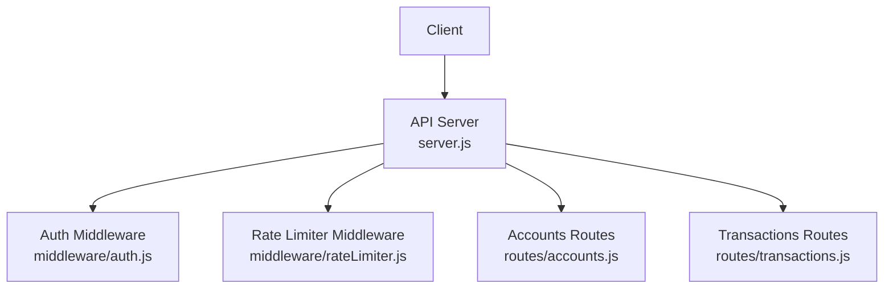
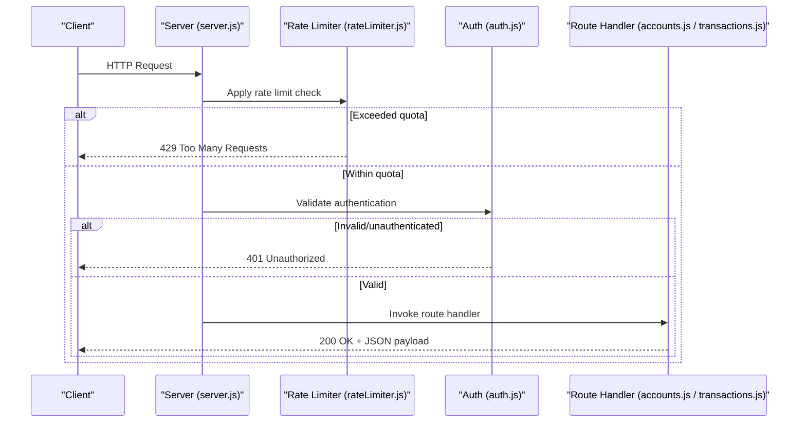
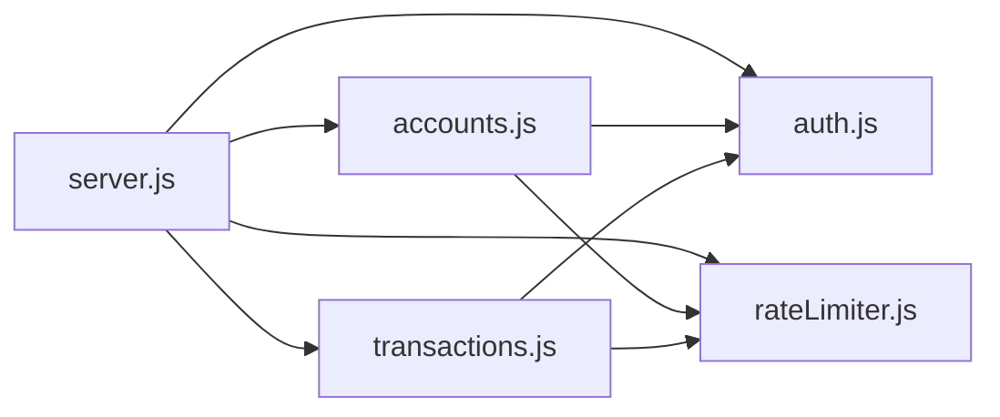

# Custom REST API

<cite>
**Referenced Files in This Document**
- [server.js](file://api/server.js)
- [accounts.js](file://api/routes/accounts.js)
- [transactions.js](file://api/routes/transactions.js)
- [auth.js](file://api/middleware/auth.js)
- [rateLimiter.js](file://api/middleware/rateLimiter.js)
</cite>

## Table of Contents
1. [Introduction](#introduction)
2. [Project Structure](#project-structure)
3. [Core Components](#core-components)
4. [Architecture Overview](#architecture-overview)
5. [Detailed Component Analysis](#detailed-component-analysis)
6. [Dependency Analysis](#dependency-analysis)
7. [Performance Considerations](#performance-considerations)
8. [Troubleshooting Guide](#troubleshooting-guide)
9. [Conclusion](#conclusion)
10. [Appendices](#appendices)

## Introduction
This document provides comprehensive REST API documentation for the custom endpoints related to accounts and transactions. It covers HTTP methods, URL patterns, request/response schemas, authentication requirements, middleware usage (authentication and rate limiting), error codes, status messages, security considerations, input validation, and best practices for client implementation.

The API is implemented as a Node.js service with Express-style routing and middleware. Authentication is enforced via middleware, and rate limiting is applied globally or per route group. The endpoints are organized by feature: accounts and transactions.

## Project Structure
The API layer is contained under the api directory with the following structure:
- server.js: Application bootstrap and global middleware registration
- routes/accounts.js: Accounts-related endpoints
- routes/transactions.js: Transactions-related endpoints
- middleware/auth.js: Authentication middleware
- middleware/rateLimiter.js: Rate limiting middleware

**Diagram sources**
- [server.js](file://api/server.js)
- [auth.js](file://api/middleware/auth.js)
- [rateLimiter.js](file://api/middleware/rateLimiter.js)
- [accounts.js](file://api/routes/accounts.js)
- [transactions.js](file://api/routes/transactions.js)

**Section sources**
- [server.js](file://api/server.js)
- [accounts.js](file://api/routes/accounts.js)
- [transactions.js](file://api/routes/transactions.js)
- [auth.js](file://api/middleware/auth.js)
- [rateLimiter.js](file://api/middleware/rateLimiter.js)

## Core Components
- Authentication Middleware: Validates requests based on tokens or session context and attaches user identity to the request object.
- Rate Limiting Middleware: Enforces request quotas per client IP or authenticated user, returning appropriate responses when limits are exceeded.
- Accounts Routes: Provide operations to retrieve account details and related metadata.
- Transactions Routes: Provide operations to list, filter, and submit transactions.

Key responsibilities:
- server.js wires up global middleware and mounts route modules.
- auth.js enforces access control and populates request.user.
- rateLimiter.js tracks and throttles request rates.
- accounts.js and transactions.js implement business logic for their respective domains.

**Section sources**
- [server.js](file://api/server.js)
- [auth.js](file://api/middleware/auth.js)
- [rateLimiter.js](file://api/middleware/rateLimiter.js)
- [accounts.js](file://api/routes/accounts.js)
- [transactions.js](file://api/routes/transactions.js)

## Architecture Overview
The API follows a layered architecture:
- Entry point registers global middleware (auth, rate limit).
- Route handlers receive validated requests and respond with JSON payloads.
- Business logic may call external services (e.g., Stellar Horizon) to fetch or submit data.

**Diagram sources**
- [server.js](file://api/server.js)
- [rateLimiter.js](file://api/middleware/rateLimiter.js)
- [auth.js](file://api/middleware/auth.js)
- [accounts.js](file://api/routes/accounts.js)
- [transactions.js](file://api/routes/transactions.js)

## Detailed Component Analysis

### Authentication Middleware
Purpose:
- Verify request authenticity using tokens or sessions.
- Attach user identity to the request object for downstream use.
- Reject unauthenticated requests with 401 Unauthorized.

Behavior:
- Reads credentials from headers or cookies.
- Validates signature/expiry if applicable.
- Populates request.user upon success.

Security considerations:
- Use HTTPS only.
- Store secrets securely; never log sensitive values.
- Prefer short-lived tokens with refresh mechanisms.

**Section sources**
- [auth.js](file://api/middleware/auth.js)

### Rate Limiting Middleware
Purpose:
- Prevent abuse by limiting request frequency per client IP or user.
- Return 429 Too Many Requests when limits are exceeded.

Behavior:
- Tracks request counts over time windows.
- Configurable limits per endpoint or globally.
- Includes standard headers indicating remaining quota and reset time.

Operational notes:
- Ensure consistent storage backend for distributed deployments.
- Monitor and tune limits based on traffic patterns.

**Section sources**
- [rateLimiter.js](file://api/middleware/rateLimiter.js)

### Accounts Endpoints
Overview:
- Retrieve account information such as balances, sequence numbers, and metadata.

Common URL pattern:
- GET /api/accounts/:accountId

Authentication:
- Requires valid authentication token.

Request parameters:
- Path parameter: accountId (string, required)

Response schema:
- 200 OK: Account object containing fields like id, balances, sequence, and timestamps.
- 401 Unauthorized: Missing or invalid token.
- 404 Not Found: Account does not exist.
- 429 Too Many Requests: Rate limit exceeded.

Example response fields:
- id: string
- balances: array of balance objects
- sequence: string
- createdAt: ISO timestamp
- updatedAt: ISO timestamp

Error handling:
- Standardized error envelope with code, message, and optional details.

Best practices:
- Cache frequently accessed account data where appropriate.
- Validate accountId format before processing.

**Section sources**
- [accounts.js](file://api/routes/accounts.js)
- [auth.js](file://api/middleware/auth.js)
- [rateLimiter.js](file://api/middleware/rateLimiter.js)

### Transactions Endpoints
Overview:
- List and filter transactions.
- Submit new transactions.

Common URL patterns:
- GET /api/transactions
- POST /api/transactions

Authentication:
- Requires valid authentication token.

GET /api/transactions
- Query parameters:
  - accountId: string (optional)
  - type: string (optional)
  - page: number (optional)
  - limit: number (optional)
  - sortBy: string (optional)
  - sortOrder: string (optional)
- Response schema:
  - 200 OK: Paginated list of transaction objects with metadata (total, page, limit).
  - 401 Unauthorized: Missing or invalid token.
  - 429 Too Many Requests: Rate limit exceeded.

POST /api/transactions
- Request body:
  - type: string (required)
  - params: object (required)
  - fee: string (optional)
  - memo: string (optional)
- Response schema:
  - 201 Created: Transaction submission result including transactionId and status.
  - 400 Bad Request: Validation errors in request body.
  - 401 Unauthorized: Missing or invalid token.
  - 429 Too Many Requests: Rate limit exceeded.

Input validation:
- Ensure required fields are present and correctly typed.
- Sanitize inputs to prevent injection.
- Validate numeric ranges and formats.

Error handling:
- Return structured errors with actionable messages.
- Include field-level errors for validation failures.

Best practices:
- Use pagination for large lists.
- Implement idempotency keys for submissions.
- Log transaction lifecycle events without exposing sensitive data.

**Section sources**
- [transactions.js](file://api/routes/transactions.js)
- [auth.js](file://api/middleware/auth.js)
- [rateLimiter.js](file://api/middleware/rateLimiter.js)

### Server Bootstrap and Global Middleware
Responsibilities:
- Initialize application and register global middleware (auth, rate limiter).
- Mount route modules for accounts and transactions.
- Configure CORS, logging, and error handling.

Flow:
- On startup, load configuration and set up middleware stack.
- Register routes under /api prefix.
- Handle uncaught exceptions and return standardized error responses.

**Section sources**
- [server.js](file://api/server.js)

## Dependency Analysis
High-level dependencies:
- server.js depends on auth.js and rateLimiter.js for cross-cutting concerns.
- accounts.js and transactions.js depend on auth.js for access control and rateLimiter.js for throttling.
- Route handlers may depend on external services (e.g., Stellar Horizon) for data retrieval and submission.

**Diagram sources**
- [server.js](file://api/server.js)
- [auth.js](file://api/middleware/auth.js)
- [rateLimiter.js](file://api/middleware/rateLimiter.js)
- [accounts.js](file://api/routes/accounts.js)
- [transactions.js](file://api/routes/transactions.js)

**Section sources**
- [server.js](file://api/server.js)
- [auth.js](file://api/middleware/auth.js)
- [rateLimiter.js](file://api/middleware/rateLimiter.js)
- [accounts.js](file://api/routes/accounts.js)
- [transactions.js](file://api/routes/transactions.js)

## Performance Considerations
- Pagination: Always paginate transaction lists to reduce payload size.
- Caching: Cache account data and read-heavy endpoints with appropriate TTLs.
- Connection pooling: Reuse database or external service connections.
- Compression: Enable gzip/br for JSON responses.
- Monitoring: Track latency, error rates, and throughput metrics.
- Backpressure: Stream large datasets when possible.

[No sources needed since this section provides general guidance]

## Troubleshooting Guide
Common issues and resolutions:
- 401 Unauthorized:
  - Ensure token is present and valid.
  - Check token expiry and refresh flow.
- 403 Forbidden:
  - Verify user permissions for requested resource.
- 404 Not Found:
  - Confirm resource identifiers are correct.
- 400 Bad Request:
  - Inspect request body for missing or malformed fields.
- 429 Too Many Requests:
  - Reduce request frequency or adjust rate limits.
- 500 Internal Server Error:
  - Review server logs for stack traces and underlying causes.

Operational tips:
- Enable detailed request logging with correlation IDs.
- Use health check endpoints to verify service readiness.
- Implement retries with exponential backoff for transient errors.

**Section sources**
- [server.js](file://api/server.js)
- [auth.js](file://api/middleware/auth.js)
- [rateLimiter.js](file://api/middleware/rateLimiter.js)
- [accounts.js](file://api/routes/accounts.js)
- [transactions.js](file://api/routes/transactions.js)

## Conclusion
The custom REST API provides secure, rate-limited endpoints for accounts and transactions. Authentication and rate limiting are enforced via middleware, ensuring robust protection against unauthorized access and abuse. Clients should follow input validation guidelines, handle errors gracefully, and implement caching and pagination strategies for optimal performance.

[No sources needed since this section summarizes without analyzing specific files]

## Appendices

### Security Considerations
- Enforce HTTPS across all endpoints.
- Validate and sanitize all inputs.
- Use least-privilege tokens and rotate secrets regularly.
- Avoid logging sensitive data.
- Implement CSRF protection for state-changing operations if using cookies.

### Input Validation Best Practices
- Define strict schemas for request bodies.
- Reject unknown fields.
- Normalize strings and numbers.
- Provide clear error messages indicating which fields failed validation.

### Client Implementation Best Practices
- Retry failed requests with exponential backoff and jitter.
- Respect rate limit headers and back off accordingly.
- Cache immutable data with appropriate invalidation strategies.
- Use idempotency keys for transaction submissions.

[No sources needed since this section provides general guidance]