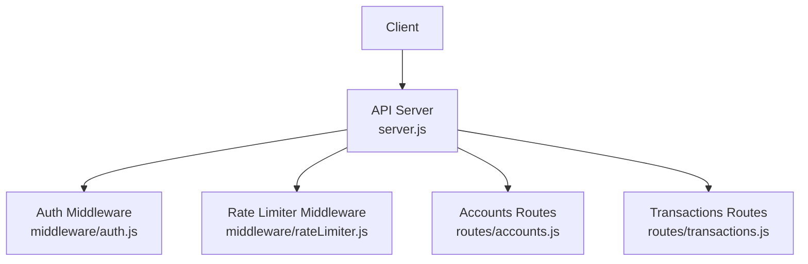
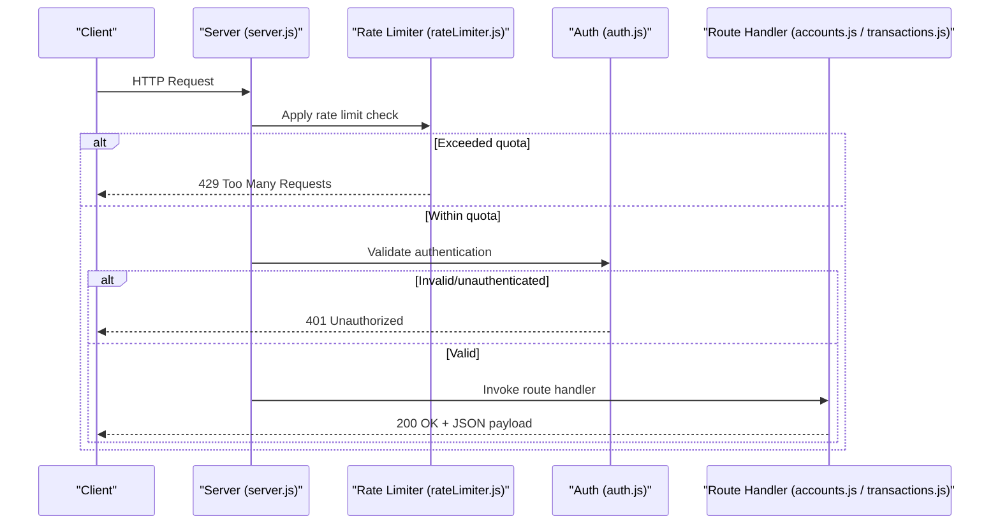

# Custom REST API

<cite>
**Referenced Files in This Document**
- [server.js](file://api/server.js)
- [accounts.js](file://api/routes/accounts.js)
- [transactions.js](file://api/routes/transactions.js)
- [auth.js](file://api/middleware/auth.js)
- [rateLimiter.js](file://api/middleware/rateLimiter.js)
</cite>

## Table of Contents
1. [Introduction](#introduction)
2. [Project Structure](#project-structure)
3. [Core Components](#core-components)
4. [Architecture Overview](#architecture-overview)
5. [Detailed Component Analysis](#detailed-component-analysis)
6. [Dependency Analysis](#dependency-analysis)
7. [Performance Considerations](#performance-considerations)
8. [Troubleshooting Guide](#troubleshooting-guide)
9. [Conclusion](#conclusion)
10. [Appendices](#appendices)

## Introduction
This document provides comprehensive REST API documentation for the custom endpoints related to accounts and transactions. It covers HTTP methods, URL patterns, request/response schemas, authentication requirements, middleware usage (authentication and rate limiting), error codes, status messages, security considerations, input validation, and best practices for client implementation.

The API is implemented as a Node.js service with Express-style routing and middleware. Authentication is enforced via middleware, and rate limiting is applied globally or per route group. The endpoints are organized by feature: accounts and transactions.

## Project Structure
The API layer is contained under the api directory with the following structure:
- server.js: Application bootstrap and global middleware registration
- routes/accounts.js: Accounts-related endpoints
- routes/transactions.js: Transactions-related endpoints
- middleware/auth.js: Authentication middleware
- middleware/rateLimiter.js: Rate limiting middleware


```mermaid
graph TB
Client["Client"] --> Server["API Server<br/>server.js"]
Server --> AuthMW["Auth Middleware<br/>middleware/auth.js"]
Server --> RateMW["Rate Limiter Middleware<br/>middleware/rateLimiter.js"]
Server --> AccountsRoutes["Accounts Routes<br/>routes/accounts.js"]
Server --> TxRoutes["Transactions Routes<br/>routes/transactions.js"]
```

**Diagram sources**
- [server.js](file://api/server.js)
- [auth.js](file://api/middleware/auth.js)
- [rateLimiter.js](file://api/middleware/rateLimiter.js)
- [accounts.js](file://api/routes/accounts.js)
- [transactions.js](file://api/routes/transactions.js)

**Section sources**
- [server.js](file://api/server.js)
- [accounts.js](file://api/routes/accounts.js)
- [transactions.js](file://api/routes/transactions.js)
- [auth.js](file://api/middleware/auth.js)
- [rateLimiter.js](file://api/middleware/rateLimiter.js)

## Core Components
- Authentication Middleware: Validates requests based on tokens or session context and attaches user identity to the request object.
- Rate Limiting Middleware: Enforces request quotas per client IP or authenticated user, returning appropriate responses when limits are exceeded.
- Accounts Routes: Provide operations to retrieve account details and related metadata.
- Transactions Routes: Provide operations to list, filter, and submit transactions.

Key responsibilities:
- server.js wires up global middleware and mounts route modules.
- auth.js enforces access control and populates request.user.
- rateLimiter.js tracks and throttles request rates.
- accounts.js and transactions.js implement business logic for their respective domains.

**Section sources**
- [server.js](file://api/server.js)
- [auth.js](file://api/middleware/auth.js)
- [rateLimiter.js](file://api/middleware/rateLimiter.js)
- [accounts.js](file://api/routes/accounts.js)
- [transactions.js](file://api/routes/transactions.js)

## Architecture Overview
The API follows a layered architecture:
- Entry point registers global middleware (auth, rate limit).
- Route handlers receive validated requests and respond with JSON payloads.
- Business logic may call external services (e.g., Stellar Horizon) to fetch or submit data.


```mermaid
sequenceDiagram
participant C as "Client"
participant S as "Server (server.js)"
participant R as "Rate Limiter (rateLimiter.js)"
participant A as "Auth (auth.js)"
participant H as "Route Handler (accounts.js / transactions.js)"
C->>S : HTTP Request
S->>R : Apply rate limit check
alt Exceeded quota
R-->>C : 429 Too Many Requests
else Within quota
S->>A : Validate authentication
alt Invalid/unauthenticated
A-->>C : 401 Unauthorized
else Valid
S->>H : Invoke route handler
H-->>C : 200 OK + JSON payload
end
end
```

**Diagram sources**
- [server.js](file://api/server.js)
- [rateLimiter.js](file://api/middleware/rateLimiter.js)
- [auth.js](file://api/middleware/auth.js)
- [accounts.js](file://api/routes/accounts.js)
- [transactions.js](file://api/routes/transactions.js)

## Detailed Component Analysis

### Authentication Middleware
Purpose:
- Verify request authenticity using tokens or sessions.
- Attach user identity to the request object for downstream use.
- Reject unauthenticated requests with 401 Unauthorized.

Behavior:
- Reads credentials from headers or cookies.
- Validates signature/expiry if applicable.
- Populates request.user upon success.

Security considerations:
- Use HTTPS only.
- Store secrets securely; never log sensitive values.
- Prefer short-lived tokens with refresh mechanisms.

**Section sources**
- [auth.js](file://api/middleware/auth.js)

### Rate Limiting Middleware
Purpose:
- Prevent abuse by limiting request frequency per client IP or user.
- Return 429 Too Many Requests when limits are exceeded.

Behavior:
- Tracks request counts over time windows.
- Configurable limits per endpoint or globally.
- Includes standard headers indicating remaining quota and reset time.

Operational notes:
- Ensure consistent storage backend for distributed deployments.
- Monitor and tune limits based on traffic patterns.

**Section sources**
- [rateLimiter.js](file://api/middleware/rateLimiter.js)

### Accounts Endpoints
Overview:
- Retrieve account information such as balances, sequence numbers, and metadata.

Common URL pattern:
- GET /api/accounts/:accountId

Authentication:
- Requires valid authentication token.

Request parameters:
- Path parameter: accountId (string, required)

Response schema:
- 200 OK: Account object containing fields like id, balances, sequence, and timestamps.
- 401 Unauthorized: Missing or invalid token.
- 404 Not Found: Account does not exist.
- 429 Too Many Requests: Rate limit exceeded.

Example response fields:
- id: string
- balances: array of balance objects
- sequence: string
- createdAt: ISO timestamp
- updatedAt: ISO timestamp

Error handling:
- Standardized error envelope with code, message, and optional details.

Best practices:
- Cache frequently accessed account data where appropriate.
- Validate accountId format before processing.

**Section sources**
- [accounts.js](file://api/routes/accounts.js)
- [auth.js](file://api/middleware/auth.js)
- [rateLimiter.js](file://api/middleware/rateLimiter.js)

### Transactions Endpoints
Overview:
- List and filter transactions.
- Submit new transactions.

Common URL patterns:
- GET /api/transactions
- POST /api/transactions

Authentication:
- Requires valid authentication token.

GET /api/transactions
- Query parameters:
  - accountId: string (optional)
  - type: string (optional)
  - page: number (optional)
  - limit: number (optional)
  - sortBy: string (optional)
  - sortOrder: string (optional)
- Response schema:
  - 200 OK: Paginated list of transaction objects with metadata (total, page, limit).
  - 401 Unauthorized: Missing or invalid token.
  - 429 Too Many Requests: Rate limit exceeded.

POST /api/transactions
- Request body:
  - type: string (required)
  - params: object (required)
  - fee: string (optional)
  - memo: string (optional)
- Response schema:
  - 201 Created: Transaction submission result including transactionId and status.
  - 400 Bad Request: Validation errors in request body.
  - 401 Unauthorized:

## Streaming Metrics Schema (v1)

This section defines the versioned schema for streaming network and account metrics that is published for external consumers and plugins. The schema is stable within a major version and is intended to be consumed by third-party plugins that subscribe to the metrics stream.

### Versioning and Compatibility
- The schema is versioned with a semantic major version. The current published version is `v1`.
- Every emitted metrics envelope MUST include a `schemaVersion` field set to `"v1"`.
- Within a major version, fields may be added but existing fields MUST NOT be removed or have their type changed. Consumers MUST ignore unknown fields to remain forward-compatible.
- A new major version (e.g., `v2`) is published only for breaking changes. Consumers SHOULD pin to a major version and handle unknown `schemaVersion` values gracefully.

### Envelope
All streaming metrics messages share a common envelope:

```json
{
  "schemaVersion": "v1",
  "type": "network" | "account",
  "emittedAt": "2026-01-01T00:00:00.000Z",
  "sequence": 42,
  "payload": { }
}
```

Fields:
- schemaVersion: string (required) — always `"v1"` for this schema.
- type: string (required) — `"network"` or `"account"`.
- emittedAt: string (required) — ISO 8601 UTC timestamp.
- sequence: number (required) — monotonically increasing per stream; used to detect gaps.
- payload: object (required) — type-specific payload described below.

### Network Metrics Payload (`type: "network"`)
```json
{
  "ledgerCloseTimeMs": 5120,
  "transactionCount": 128,
  "operationCount": 340,
  "baseFee": "100",
  "baseReserve": "5000000",
  "peerCount": 24,
  "status": "healthy" | "degraded" | "down"
}
```

Fields:
- ledgerCloseTimeMs: number (required) — average ledger close time in milliseconds.
- transactionCount: number (required) — transactions in the last closed ledger.
- operationCount: number (required) — operations in the last closed ledger.
- baseFee: string (required) — base fee in stroops, as a string to avoid precision loss.
- baseReserve: string (required) — base reserve in stroops, as a string.
- peerCount: number (required) — connected peers.
- status: string (required) — one of `healthy`, `degraded`, `down`.

### Account Metrics Payload (`type: "account"`)
```json
{
  "accountId": "G...",
  "balance": "1000000000",
  "sequence": "123456789",
  "subentryCount": 3,
  "status": "active" | "inactive" | "unknown"
}
```

Fields:
- accountId: string (required) — Stellar account identifier.
- balance: string (required) — native balance in stroops, as a string.
- sequence: string (required) — current account sequence number, as a string.
- subentryCount: number (required) — number of subentries.
- status: string (required) — one of `active`, `inactive`, `unknown`.

### Invalid Input Handling
- If a metrics payload fails validation (missing required field, wrong type, or out-of-range value), the producer MUST NOT emit it. Instead it emits a structured error message on the same stream:

```json
{
  "schemaVersion": "v1",
  "type": "error",
  "emittedAt": "2026-01-01T00:00:00.000Z",
  "sequence": 43,
  "payload": {
    "code": "INVALID_METRICS_PAYLOAD",
    "message": "payload.type must be 'network' or 'account'",
    "field": "type"
  }
}
```

- Numeric fields that are expected to be non-negative MUST reject negative values.
- String-encoded numeric fields (e.g., `balance`, `baseFee`) MUST be validated as base-10 integers; non-numeric strings are rejected.
- Unknown `type` values are rejected with `code: "UNSUPPORTED_METRICS_TYPE"`.

### Unsupported Environments
- If the runtime does not support streaming (e.g., a serverless environment without a persistent connection), the producer MUST NOT silently drop metrics. It MUST emit a single error message with `code: "STREAMING_UNSUPPORTED"` and `message` describing the environment, then stop.
- Consumers SHOULD treat `STREAMING_UNSUPPORTED` as a non-retryable condition and fall back to polling the REST endpoints documented above.

### Failure Paths
- On transient producer failure, the producer retries with exponential backoff and preserves `sequence` monotonicity; gaps in `sequence` indicate dropped messages and consumers SHOULD re-sync.
- On unrecoverable failure, the producer emits `code: "STREAM_FAILURE"` with a `message` and then closes the stream.
- Consumers MUST handle stream closure by reconnecting and requesting the latest snapshot; they MUST NOT assume the last received message is current.

### Security Notes
- The metrics stream MUST be delivered over TLS (wss/https).
- Authentication uses the same token mechanism as the REST endpoints (see Authentication Middleware). Unauthenticated subscribers receive `401 Unauthorized` before the stream is established.
- Metrics payloads MUST NOT contain secrets, private keys, or personally identifiable information. Only public account identifiers and aggregate network values are permitted.

### Migration Notes
- Consumers migrating from unversioned metrics MUST read `schemaVersion` and reject unknown major versions rather than guessing field meanings.
- When `v2` is published, a migration guide will accompany it; `v1` will remain supported for at least one deprecation cycle.
- Plugin authors SHOULD feature-detect fields (e.g., check for `peerCount`) rather than assuming a fixed field set.

### Testing Guidance
Automated tests for the schema/export layer SHOULD cover:
- Primary flow: a valid `network` and a valid `account` payload are emitted with `schemaVersion: "v1"`.
- Boundary case: a payload with the maximum allowed `sequence` and zero-valued counters is accepted.
- Failure case: a payload with a missing required field or an unsupported `type` produces the corresponding structured error message and is not emitted as a metrics message.

**Section sources**
- [server.js](file://api/server.js)
- [accounts.js](file://api/routes/accounts.js)
- [transactions.js](file://api/routes/transactions.js)
- [auth.js](file://api/middleware/auth.js)
- [rateLimiter.js](file://api/middleware/rateLimiter.js)
