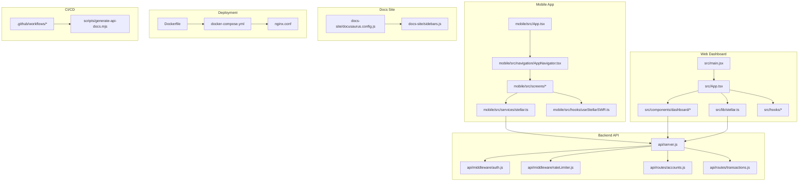
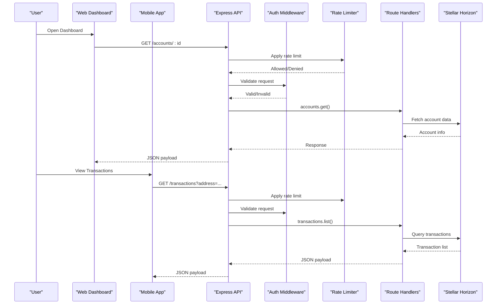
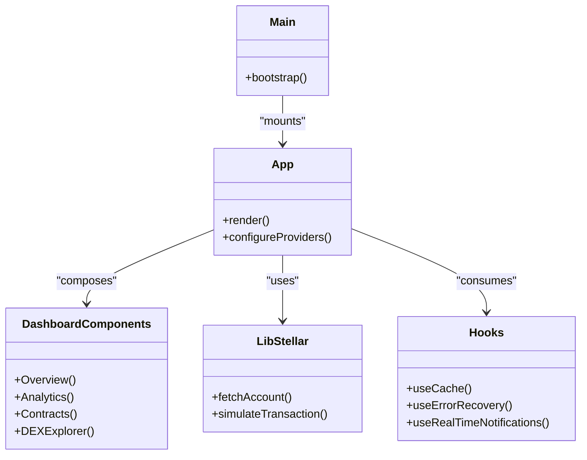
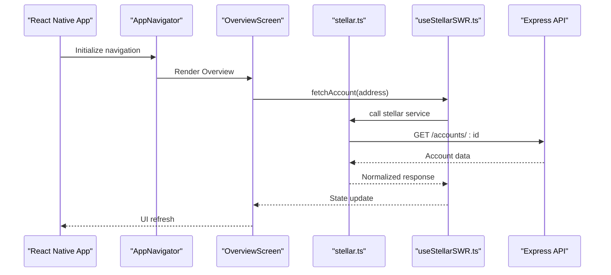
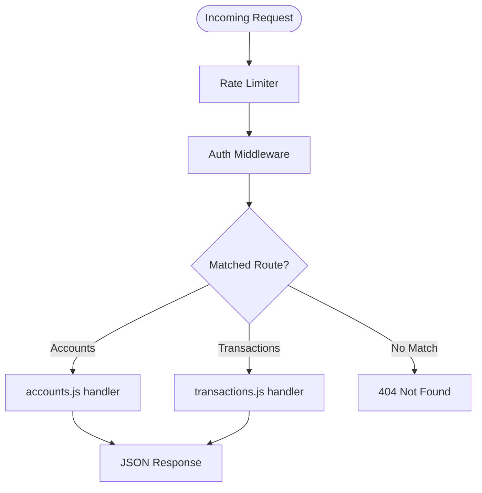
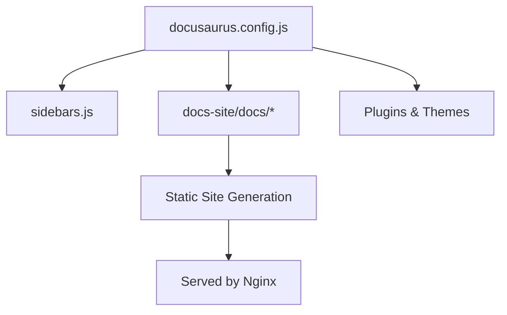
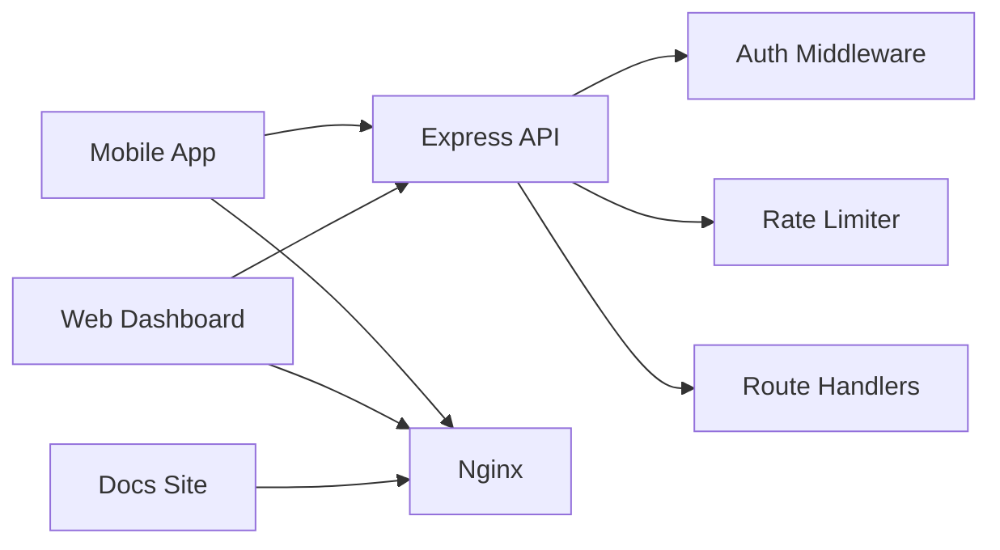
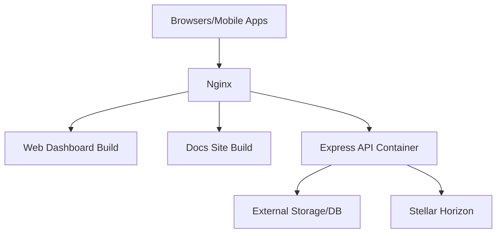

# Architecture Overview

<cite>
**Referenced Files in This Document**
- [package.json](file://package.json)
- [vite.config.js](file://vite.config.js)
- [src/main.jsx](file://src/main.jsx)
- [src/App.tsx](file://src/App.tsx)
- [api/server.js](file://api/server.js)
- [api/routes/accounts.js](file://api/routes/accounts.js)
- [api/routes/transactions.js](file://api/routes/transactions.js)
- [api/middleware/auth.js](file://api/middleware/auth.js)
- [api/middleware/rateLimiter.js](file://api/middleware/rateLimiter.js)
- [mobile/src/App.tsx](file://mobile/src/App.tsx)
- [mobile/package.json](file://mobile/package.json)
- [mobile/src/services/stellar.ts](file://mobile/src/services/stellar.ts)
- [mobile/src/navigation/AppNavigator.tsx](file://mobile/src/navigation/AppNavigator.tsx)
- [mobile/src/screens/OverviewScreen.tsx](file://mobile/src/screens/OverviewScreen.tsx)
- [mobile/src/hooks/useStellarSWR.ts](file://mobile/src/hooks/useStellarSWR.ts)
- [docs-site/docusaurus.config.js](file://docs-site/docusaurus.config.js)
- [docs-site/sidebars.js](file://docs-site/sidebars.js)
- [Dockerfile](file://Dockerfile)
- [docker-compose.yml](file://docker-compose.yml)
- [nginx.conf](file://nginx.conf)
- [.github/workflows](file://.github/workflows)
- [scripts/generate-api-docs.mjs](file://scripts/generate-api-docs.mjs)
</cite>

## Table of Contents
1. [Introduction](#introduction)
2. [Project Structure](#project-structure)
3. [Core Components](#core-components)
4. [Architecture Overview](#architecture-overview)
5. [Detailed Component Analysis](#detailed-component-analysis)
6. [Dependency Analysis](#dependency-analysis)
7. [Performance Considerations](#performance-considerations)
8. [Troubleshooting Guide](#troubleshooting-guide)
9. [Conclusion](#conclusion)
10. [Appendices](#appendices)

## Introduction
This document provides an architectural overview of the Stellar Development Dashboard system. It covers the high-level design across four primary surfaces:
- React web dashboard (frontend application)
- React Native mobile app
- Express.js backend API
- Docusaurus documentation site

It explains technology stack choices, directory organization, module dependencies, and component interactions between user interfaces and blockchain integration layers. It also addresses deployment architecture, containerization with Docker, and CI/CD pipeline configuration.

## Project Structure
The repository is organized into feature-oriented directories for each surface:
- Web dashboard: src/, stories/, tests/, scripts/
- Backend API: api/
- Mobile app: mobile/
- Documentation site: docs-site/
- Deployment artifacts: Dockerfile, docker-compose.yml, nginx.conf
- CI/CD: .github/workflows/

**Diagram sources**
- [src/main.jsx:1-50](file://src/main.jsx#L1-L50)
- [src/App.tsx:1-120](file://src/App.tsx#L1-L120)
- [api/server.js:1-120](file://api/server.js#L1-L120)
- [api/middleware/auth.js:1-80](file://api/middleware/auth.js#L1-L80)
- [api/middleware/rateLimiter.js:1-80](file://api/middleware/rateLimiter.js#L1-L80)
- [api/routes/accounts.js:1-120](file://api/routes/accounts.js#L1-L120)
- [api/routes/transactions.js:1-120](file://api/routes/transactions.js#L1-L120)
- [mobile/src/App.tsx:1-80](file://mobile/src/App.tsx#L1-L80)
- [mobile/src/navigation/AppNavigator.tsx:1-120](file://mobile/src/navigation/AppNavigator.tsx#L1-L120)
- [mobile/src/services/stellar.ts:1-120](file://mobile/src/services/stellar.ts#L1-L120)
- [mobile/src/hooks/useStellarSWR.ts:1-120](file://mobile/src/hooks/useStellarSWR.ts#L1-L120)
- [docs-site/docusaurus.config.js:1-120](file://docs-site/docusaurus.config.js#L1-L120)
- [docs-site/sidebars.js:1-80](file://docs-site/sidebars.js#L1-L80)
- [Dockerfile:1-120](file://Dockerfile#L1-L120)
- [docker-compose.yml:1-120](file://docker-compose.yml#L1-L120)
- [nginx.conf:1-120](file://nginx.conf#L1-L120)
- [.github/workflows:1-200](file://.github/workflows#L1-L200)
- [scripts/generate-api-docs.mjs:1-120](file://scripts/generate-api-docs.mjs#L1-L120)

**Section sources**
- [package.json:1-200](file://package.json#L1-L200)
- [vite.config.js:1-120](file://vite.config.js#L1-L120)
- [src/main.jsx:1-50](file://src/main.jsx#L1-L50)
- [src/App.tsx:1-120](file://src/App.tsx#L1-L120)
- [api/server.js:1-120](file://api/server.js#L1-L120)
- [api/middleware/auth.js:1-80](file://api/middleware/auth.js#L1-L80)
- [api/middleware/rateLimiter.js:1-80](file://api/middleware/rateLimiter.js#L1-L80)
- [api/routes/accounts.js:1-120](file://api/routes/accounts.js#L1-L120)
- [api/routes/transactions.js:1-120](file://api/routes/transactions.js#L1-L120)
- [mobile/src/App.tsx:1-80](file://mobile/src/App.tsx#L1-L80)
- [mobile/src/navigation/AppNavigator.tsx:1-120](file://mobile/src/navigation/AppNavigator.tsx#L1-L120)
- [mobile/src/services/stellar.ts:1-120](file://mobile/src/services/stellar.ts#L1-L120)
- [mobile/src/hooks/useStellarSWR.ts:1-120](file://mobile/src/hooks/useStellarSWR.ts#L1-L120)
- [docs-site/docusaurus.config.js:1-120](file://docs-site/docusaurus.config.js#L1-L120)
- [docs-site/sidebars.js:1-80](file://docs-site/sidebars.js#L1-L80)
- [Dockerfile:1-120](file://Dockerfile#L1-L120)
- [docker-compose.yml:1-120](file://docker-compose.yml#L1-L120)
- [nginx.conf:1-120](file://nginx.conf#L1-L120)
- [.github/workflows:1-200](file://.github/workflows#L1-L200)
- [scripts/generate-api-docs.mjs:1-120](file://scripts/generate-api-docs.mjs#L1-L120)

## Core Components
- Web Dashboard (React + Vite): Entry point initializes the React application and mounts the root component. The app composes dashboard features, hooks, and libraries that interact with the backend API and Stellar SDK where applicable.
- Mobile App (React Native): Entry point configures navigation and screens. Services encapsulate Stellar operations; hooks provide data fetching and caching patterns.
- Backend API (Express.js): Central server wires middleware (auth, rate limiting) to route handlers for accounts and transactions.
- Docs Site (Docusaurus): Configured via docusaurus.config.js and sidebars.js to render developer documentation and examples.

Key responsibilities:
- UI orchestration and state management at the frontend layer
- Data access abstraction and caching in hooks/services
- API gateway and business logic in Express routes
- Documentation generation and publishing

**Section sources**
- [src/main.jsx:1-50](file://src/main.jsx#L1-L50)
- [src/App.tsx:1-120](file://src/App.tsx#L1-L120)
- [mobile/src/App.tsx:1-80](file://mobile/src/App.tsx#L1-L80)
- [api/server.js:1-120](file://api/server.js#L1-L120)
- [docs-site/docusaurus.config.js:1-120](file://docs-site/docusaurus.config.js#L1-L120)

## Architecture Overview
The system follows a multi-surface architecture:
- Web and mobile clients consume the Express API for account and transaction operations.
- The API enforces authentication and rate limiting before delegating to route handlers.
- Clients may also integrate directly with Stellar SDK/Horizon for certain read-only or simulation flows.
- The documentation site is built independently and can be served alongside the dashboard.

**Diagram sources**
- [api/server.js:1-120](file://api/server.js#L1-L120)
- [api/middleware/auth.js:1-80](file://api/middleware/auth.js#L1-L80)
- [api/middleware/rateLimiter.js:1-80](file://api/middleware/rateLimiter.js#L1-L80)
- [api/routes/accounts.js:1-120](file://api/routes/accounts.js#L1-L120)
- [api/routes/transactions.js:1-120](file://api/routes/transactions.js#L1-L120)
- [src/App.tsx:1-120](file://src/App.tsx#L1-L120)
- [mobile/src/screens/OverviewScreen.tsx:1-120](file://mobile/src/screens/OverviewScreen.tsx#L1-L120)

## Detailed Component Analysis

### Web Dashboard (React + Vite)
- Entry and composition: main.jsx bootstraps the app; App.tsx composes layout, routing, and feature modules.
- Feature modules: components/dashboard/* implement dashboards, analytics, contracts, DEX tools, etc.
- Data access: lib/* contains utilities for Stellar integration, caching, alerts, notifications, and more.
- Hooks: hooks/* encapsulate reusable logic such as streaming, caching, performance monitoring, and error handling.
- Build tooling: vite.config.js configures development and production builds.

**Diagram sources**
- [src/main.jsx:1-50](file://src/main.jsx#L1-L50)
- [src/App.tsx:1-120](file://src/App.tsx#L1-L120)
- [src/lib/stellar.ts:1-120](file://src/lib/stellar.ts#L1-L120)
- [src/hooks/index.ts:1-120](file://src/hooks/index.ts#L1-L120)
- [vite.config.js:1-120](file://vite.config.js#L1-L120)

**Section sources**
- [src/main.jsx:1-50](file://src/main.jsx#L1-L50)
- [src/App.tsx:1-120](file://src/App.tsx#L1-L120)
- [vite.config.js:1-120](file://vite.config.js#L1-L120)

### Mobile App (React Native)
- Entry and navigation: App.tsx initializes navigation; AppNavigator.tsx defines tabs and screens.
- Screens: screens/* implement core flows like Overview, Accounts, Assets, Contracts, DEX, Faucet, Multisig, Settings.
- Services: services/stellar.ts encapsulates Stellar operations; services/offline.ts and biometrics.ts add platform capabilities.
- Hooks: useStellarSWR.ts provides data fetching and caching tailored for mobile.

**Diagram sources**
- [mobile/src/App.tsx:1-80](file://mobile/src/App.tsx#L1-L80)
- [mobile/src/navigation/AppNavigator.tsx:1-120](file://mobile/src/navigation/AppNavigator.tsx#L1-L120)
- [mobile/src/screens/OverviewScreen.tsx:1-120](file://mobile/src/screens/OverviewScreen.tsx#L1-L120)
- [mobile/src/services/stellar.ts:1-120](file://mobile/src/services/stellar.ts#L1-L120)
- [mobile/src/hooks/useStellarSWR.ts:1-120](file://mobile/src/hooks/useStellarSWR.ts#L1-L120)
- [api/server.js:1-120](file://api/server.js#L1-L120)

**Section sources**
- [mobile/src/App.tsx:1-80](file://mobile/src/App.tsx#L1-L80)
- [mobile/package.json:1-120](file://mobile/package.json#L1-L120)
- [mobile/src/navigation/AppNavigator.tsx:1-120](file://mobile/src/navigation/AppNavigator.tsx#L1-L120)
- [mobile/src/services/stellar.ts:1-120](file://mobile/src/services/stellar.ts#L1-L120)
- [mobile/src/hooks/useStellarSWR.ts:1-120](file://mobile/src/hooks/useStellarSWR.ts#L1-L120)

### Backend API (Express.js)
- Server setup: server.js registers middleware and routes.
- Middleware: auth.js handles authentication; rateLimiter.js applies request throttling.
- Routes: accounts.js and transactions.js implement endpoints for account and transaction queries.

**Diagram sources**
- [api/server.js:1-120](file://api/server.js#L1-L120)
- [api/middleware/auth.js:1-80](file://api/middleware/auth.js#L1-L80)
- [api/middleware/rateLimiter.js:1-80](file://api/middleware/rateLimiter.js#L1-L80)
- [api/routes/accounts.js:1-120](file://api/routes/accounts.js#L1-L120)
- [api/routes/transactions.js:1-120](file://api/routes/transactions.js#L1-L120)

**Section sources**
- [api/server.js:1-120](file://api/server.js#L1-L120)
- [api/middleware/auth.js:1-80](file://api/middleware/auth.js#L1-L80)
- [api/middleware/rateLimiter.js:1-120](file://api/middleware/rateLimiter.js#L1-L120)
- [api/routes/accounts.js:1-120](file://api/routes/accounts.js#L1-L120)
- [api/routes/transactions.js:1-120](file://api/routes/transactions.js#L1-L120)

### Documentation Site (Docusaurus)
- Configuration: docusaurus.config.js defines site metadata, plugins, and theme settings.
- Navigation: sidebars.js organizes documentation sections and links.

**Diagram sources**
- [docs-site/docusaurus.config.js:1-120](file://docs-site/docusaurus.config.js#L1-L120)
- [docs-site/sidebars.js:1-80](file://docs-site/sidebars.js#L1-L80)

**Section sources**
- [docs-site/docusaurus.config.js:1-120](file://docs-site/docusaurus.config.js#L1-L120)
- [docs-site/sidebars.js:1-80](file://docs-site/sidebars.js#L1-L80)

## Dependency Analysis
High-level dependency relationships:
- Web and mobile apps depend on the Express API for account and transaction data.
- The API depends on middleware for security and rate limiting.
- The docs site is independent but can be served from the same host.

**Diagram sources**
- [src/App.tsx:1-120](file://src/App.tsx#L1-L120)
- [mobile/src/App.tsx:1-80](file://mobile/src/App.tsx#L1-L80)
- [api/server.js:1-120](file://api/server.js#L1-L120)
- [api/middleware/auth.js:1-80](file://api/middleware/auth.js#L1-L80)
- [api/middleware/rateLimiter.js:1-80](file://api/middleware/rateLimiter.js#L1-L80)
- [docs-site/docusaurus.config.js:1-120](file://docs-site/docusaurus.config.js#L1-L120)
- [nginx.conf:1-120](file://nginx.conf#L1-L120)

**Section sources**
- [package.json:1-200](file://package.json#L1-L200)
- [api/server.js:1-120](file://api/server.js#L1-L120)
- [nginx.conf:1-120](file://nginx.conf#L1-L120)

## Performance Considerations
- Frontend caching and data fetching strategies are implemented via hooks and services to reduce redundant network calls.
- Rate limiting protects the API from excessive requests and improves stability under load.
- Static assets and documentation are served efficiently through Nginx.
- Consider lazy loading heavy dashboard components and using virtualized lists for large datasets.

[No sources needed since this section provides general guidance]

## Troubleshooting Guide
Common areas to inspect:
- Authentication failures: verify token validation in auth middleware and client-side headers.
- Rate limiting errors: check rate limiter configuration and client retry/backoff behavior.
- API route mismatches: ensure paths and methods match between clients and server routes.
- Mobile connectivity: validate base URL configuration and offline fallbacks.

**Section sources**
- [api/middleware/auth.js:1-80](file://api/middleware/auth.js#L1-L80)
- [api/middleware/rateLimiter.js:1-80](file://api/middleware/rateLimiter.js#L1-L80)
- [api/routes/accounts.js:1-120](file://api/routes/accounts.js#L1-L120)
- [api/routes/transactions.js:1-120](file://api/routes/transactions.js#L1-L120)
- [mobile/src/services/stellar.ts:1-120](file://mobile/src/services/stellar.ts#L1-L120)

## Conclusion
The Stellar Development Dashboard integrates a React web dashboard, a React Native mobile app, an Express.js backend API, and a Docusaurus documentation site. The architecture emphasizes clear separation of concerns, secure and rate-limited API access, and efficient data fetching patterns. Containerization and CI/CD enable consistent builds and deployments, while Nginx serves static assets and documentation alongside the application.

[No sources needed since this section summarizes without analyzing specific files]

## Appendices

### Technology Stack Summary
- Web Dashboard: React, Vite, TypeScript/JavaScript
- Mobile App: React Native, TypeScript
- Backend API: Node.js, Express.js
- Documentation: Docusaurus
- Deployment: Docker, Nginx
- CI/CD: GitHub Actions

**Section sources**
- [package.json:1-200](file://package.json#L1-L200)
- [mobile/package.json:1-120](file://mobile/package.json#L1-L120)
- [docs-site/docusaurus.config.js:1-120](file://docs-site/docusaurus.config.js#L1-L120)
- [Dockerfile:1-120](file://Dockerfile#L1-L120)
- [docker-compose.yml:1-120](file://docker-compose.yml#L1-L120)
- [nginx.conf:1-120](file://nginx.conf#L1-L120)
- [.github/workflows:1-200](file://.github/workflows#L1-L200)

### Deployment Architecture

**Diagram sources**
- [nginx.conf:1-120](file://nginx.conf#L1-L120)
- [Dockerfile:1-120](file://Dockerfile#L1-L120)
- [docker-compose.yml:1-120](file://docker-compose.yml#L1-L120)
- [api/server.js:1-120](file://api/server.js#L1-L120)

### CI/CD Pipeline Notes
- Automated workflows trigger builds, tests, and documentation generation.
- API documentation can be generated via scripts during CI.

**Section sources**
- [.github/workflows:1-200](file://.github/workflows#L1-L200)
- [scripts/generate-api-docs.mjs:1-120](file://scripts/generate-api-docs.mjs#L1-L120)