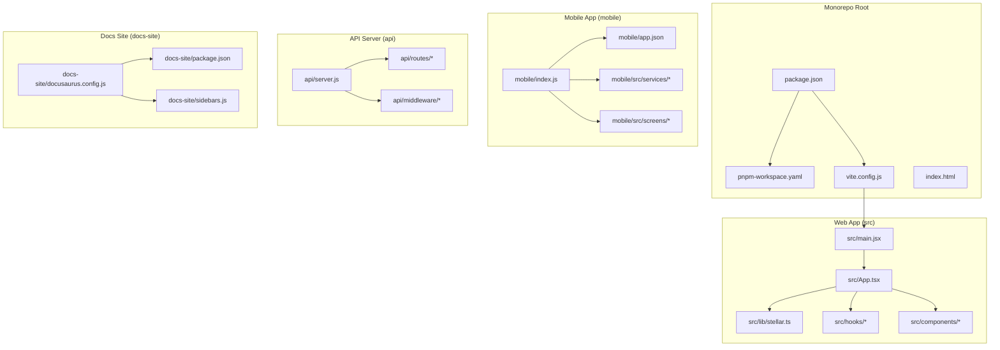
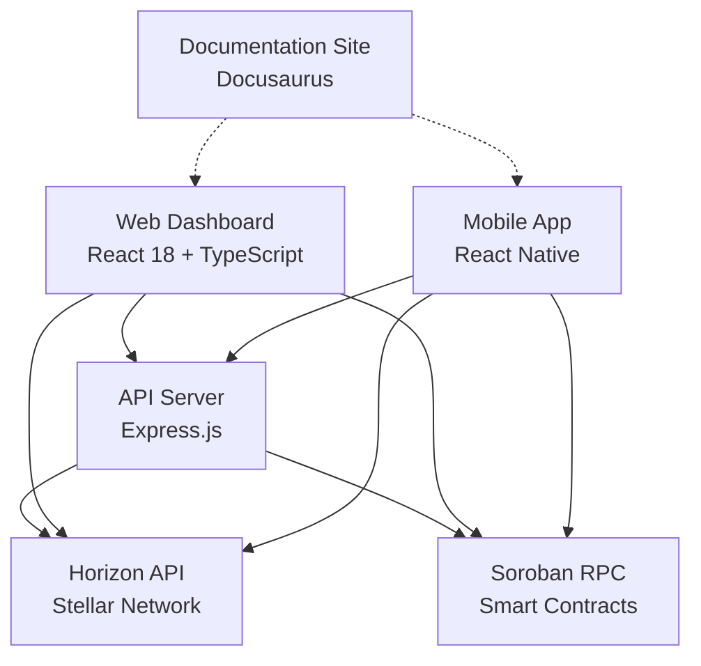
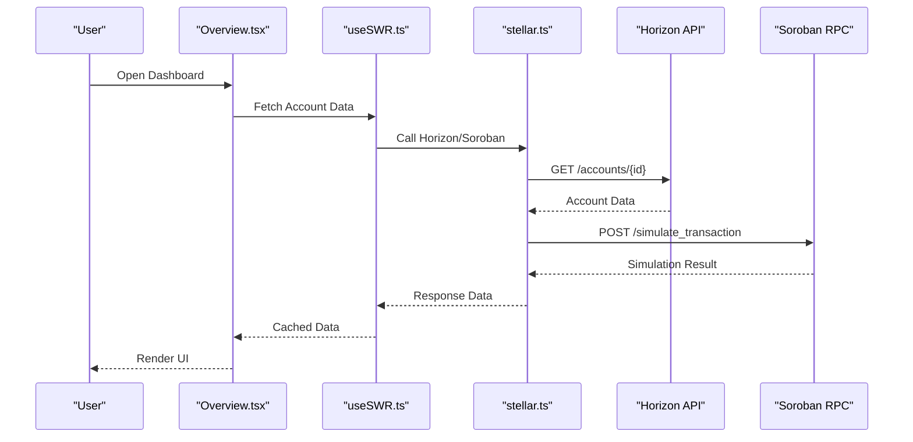
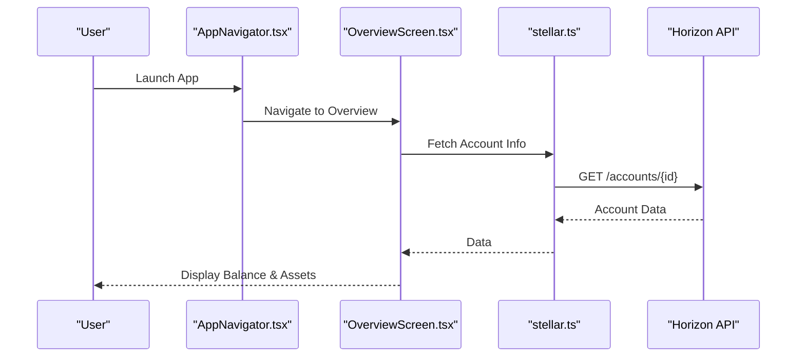
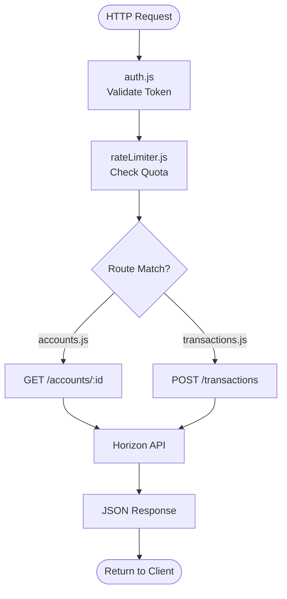
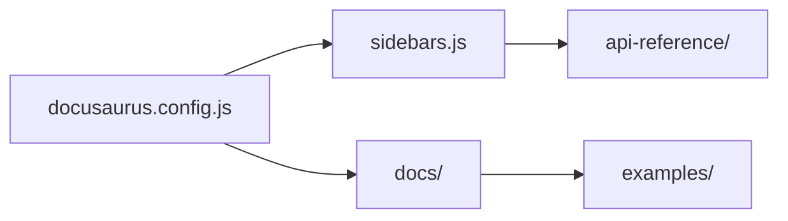
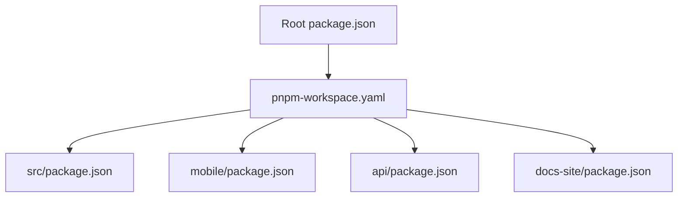

# System Architecture

<cite>
**Referenced Files in This Document**
- [package.json](file://package.json)
- [pnpm-workspace.yaml](file://pnpm-workspace.yaml)
- [vite.config.js](file://vite.config.js)
- [index.html](file://index.html)
- [src/main.jsx](file://src/main.jsx)
- [src/App.tsx](file://src/App.tsx)
- [mobile/index.js](file://mobile/index.js)
- [mobile/app.json](file://mobile/app.json)
- [api/server.js](file://api/server.js)
- [api/routes/accounts.js](file://api/routes/accounts.js)
- [api/routes/transactions.js](file://api/routes/transactions.js)
- [api/middleware/auth.js](file://api/middleware/auth.js)
- [api/middleware/rateLimiter.js](file://api/middleware/rateLimiter.js)
- [docs-site/docusaurus.config.js](file://docs-site/docusaurus.config.js)
- [docs-site/package.json](file://docs-site/package.json)
- [docs-site/sidebars.js](file://docs-site/sidebars.js)
- [src/lib/stellar.ts](file://src/lib/stellar.ts)
- [src/hooks/useAccountStream.ts](file://src/hooks/useAccountStream.ts)
- [src/hooks/useSWR.ts](file://src/hooks/useSWR.ts)
- [src/components/dashboard/Overview.tsx](file://src/components/dashboard/Overview.tsx)
- [src/components/dashboard/Transactions.tsx](file://src/components/dashboard/Transactions.tsx)
- [src/components/dashboard/Contracts.tsx](file://src/components/dashboard/Contracts.tsx)
- [mobile/src/screens/OverviewScreen.tsx](file://mobile/src/screens/OverviewScreen.tsx)
- [mobile/src/services/stellar.ts](file://mobile/src/services/stellar.ts)
</cite>

## Table of Contents
1. [Introduction](#introduction)
2. [Project Structure](#project-structure)
3. [Core Components](#core-components)
4. [Architecture Overview](#architecture-overview)
5. [Detailed Component Analysis](#detailed-component-analysis)
6. [Dependency Analysis](#dependency-analysis)
7. [Performance Considerations](#performance-considerations)
8. [Troubleshooting Guide](#troubleshooting-guide)
9. [Conclusion](#conclusion)

## Introduction
This document describes the system architecture of the Stellar Development Dashboard, a monorepo that includes:
- A React 18 web dashboard (TypeScript) for interacting with the Stellar blockchain via Horizon and Soroban RPC.
- A React Native mobile application for on-the-go account and transaction management.
- An Express.js backend API server providing authentication, rate limiting, and optional proxying to blockchain APIs.
- A Docusaurus documentation site for developer guides and API references.

The technology stack emphasizes modern frontend practices (React 18, TypeScript), robust data fetching and caching (SWR), and direct integration with Stellar’s Horizon API and Soroban RPC for smart contract operations. The monorepo structure enables shared utilities and consistent tooling across applications.

## Project Structure
The repository is organized as a monorepo with clear separation of concerns:
- src/: Web dashboard source code (components, hooks, lib, types, styles).
- mobile/: React Native app source code (screens, navigation, services, theme).
- api/: Express.js backend server (routes, middleware).
- docs-site/: Docusaurus documentation site configuration and content.
- docs/: Additional documentation assets and examples.
- public/, scripts/, tests/, stories/: Shared resources, build scripts, tests, and Storybook stories.

**Diagram sources**
- [package.json](file://package.json)
- [pnpm-workspace.yaml](file://pnpm-workspace.yaml)
- [vite.config.js](file://vite.config.js)
- [index.html](file://index.html)
- [src/main.jsx](file://src/main.jsx)
- [src/App.tsx](file://src/App.tsx)
- [mobile/index.js](file://mobile/index.js)
- [mobile/app.json](file://mobile/app.json)
- [api/server.js](file://api/server.js)
- [docs-site/docusaurus.config.js](file://docs-site/docusaurus.config.js)
- [docs-site/package.json](file://docs-site/package.json)
- [docs-site/sidebars.js](file://docs-site/sidebars.js)

**Section sources**
- [package.json](file://package.json)
- [pnpm-workspace.yaml](file://pnpm-workspace.yaml)
- [vite.config.js](file://vite.config.js)
- [index.html](file://index.html)

## Core Components
- Web Dashboard (React 18 + TypeScript):
  - Entry points: main.jsx bootstraps the app; App.tsx defines routing and layout.
  - Blockchain integration: stellar.ts encapsulates Horizon and Soroban RPC calls.
  - Data fetching: SWR-based hooks manage caching, retries, and real-time updates.
  - UI components: dashboard modules like Overview, Transactions, Contracts.

- Mobile App (React Native):
  - Entry point: index.js initializes the app; app.json configures metadata.
  - Services: stellar.ts abstracts blockchain interactions; offline and biometric services support UX.
  - Screens: Overview, Assets, Transactions, Contracts, etc., driven by navigators.

- API Server (Express.js):
  - Entry point: server.js sets up routes and middleware.
  - Routes: accounts.js, transactions.js expose endpoints for clients.
  - Middleware: auth.js handles authentication; rateLimiter.js enforces quotas.

- Documentation Site (Docusaurus):
  - Configuration: docusaurus.config.js defines site settings; sidebars.js organizes content.
  - Content: docs/ contains guides, examples, and API references.

**Section sources**
- [src/main.jsx](file://src/main.jsx)
- [src/App.tsx](file://src/App.tsx)
- [src/lib/stellar.ts](file://src/lib/stellar.ts)
- [src/hooks/useSWR.ts](file://src/hooks/useSWR.ts)
- [src/components/dashboard/Overview.tsx](file://src/components/dashboard/Overview.tsx)
- [src/components/dashboard/Transactions.tsx](file://src/components/dashboard/Transactions.tsx)
- [src/components/dashboard/Contracts.tsx](file://src/components/dashboard/Contracts.tsx)
- [mobile/index.js](file://mobile/index.js)
- [mobile/app.json](file://mobile/app.json)
- [mobile/src/services/stellar.ts](file://mobile/src/services/stellar.ts)
- [mobile/src/screens/OverviewScreen.tsx](file://mobile/src/screens/OverviewScreen.tsx)
- [api/server.js](file://api/server.js)
- [api/routes/accounts.js](file://api/routes/accounts.js)
- [api/routes/transactions.js](file://api/routes/transactions.js)
- [api/middleware/auth.js](file://api/middleware/auth.js)
- [api/middleware/rateLimiter.js](file://api/middleware/rateLimiter.js)
- [docs-site/docusaurus.config.js](file://docs-site/docusaurus.config.js)
- [docs-site/sidebars.js](file://docs-site/sidebars.js)

## Architecture Overview
The system comprises four primary layers:
- Presentation Layer: React web app and React Native mobile app provide user interfaces.
- Application Layer: Express.js API server offers business logic, authentication, and rate limiting.
- Integration Layer: Direct calls to Stellar Horizon API and Soroban RPC for blockchain data and transactions.
- Documentation Layer: Docusaurus site documents APIs, guides, and examples.

**Diagram sources**
- [src/App.tsx](file://src/App.tsx)
- [mobile/index.js](file://mobile/index.js)
- [api/server.js](file://api/server.js)
- [src/lib/stellar.ts](file://src/lib/stellar.ts)
- [docs-site/docusaurus.config.js](file://docs-site/docusaurus.config.js)

## Detailed Component Analysis

### Web Dashboard Flow
The web dashboard fetches account and transaction data using SWR hooks, which cache responses and handle network errors. Components like Overview and Transactions render data from these hooks. Blockchain interactions are abstracted through stellar.ts, which communicates with Horizon and Soroban RPC.

**Diagram sources**
- [src/components/dashboard/Overview.tsx](file://src/components/dashboard/Overview.tsx)
- [src/hooks/useSWR.ts](file://src/hooks/useSWR.ts)
- [src/lib/stellar.ts](file://src/lib/stellar.ts)

**Section sources**
- [src/components/dashboard/Overview.tsx](file://src/components/dashboard/Overview.tsx)
- [src/hooks/useSWR.ts](file://src/hooks/useSWR.ts)
- [src/lib/stellar.ts](file://src/lib/stellar.ts)

### Mobile App Flow
The mobile app uses React Navigation to switch between screens. Services like stellar.ts encapsulate blockchain calls, while offline.ts manages local state. Biometrics and notifications enhance security and UX.

**Diagram sources**
- [mobile/src/navigation/AppNavigator.tsx](file://mobile/src/navigation/AppNavigator.tsx)
- [mobile/src/screens/OverviewScreen.tsx](file://mobile/src/screens/OverviewScreen.tsx)
- [mobile/src/services/stellar.ts](file://mobile/src/services/stellar.ts)

**Section sources**
- [mobile/index.js](file://mobile/index.js)
- [mobile/app.json](file://mobile/app.json)
- [mobile/src/services/stellar.ts](file://mobile/src/services/stellar.ts)
- [mobile/src/screens/OverviewScreen.tsx](file://mobile/src/screens/OverviewScreen.tsx)

### API Server Endpoints
The Express.js server exposes REST endpoints for accounts and transactions. Middleware provides authentication and rate limiting. Clients can call these endpoints directly or use them as a proxy to Horizon/Soroban.

**Diagram sources**
- [api/server.js](file://api/server.js)
- [api/middleware/auth.js](file://api/middleware/auth.js)
- [api/middleware/rateLimiter.js](file://api/middleware/rateLimiter.js)
- [api/routes/accounts.js](file://api/routes/accounts.js)
- [api/routes/transactions.js](file://api/routes/transactions.js)

**Section sources**
- [api/server.js](file://api/server.js)
- [api/middleware/auth.js](file://api/middleware/auth.js)
- [api/middleware/rateLimiter.js](file://api/middleware/rateLimiter.js)
- [api/routes/accounts.js](file://api/routes/accounts.js)
- [api/routes/transactions.js](file://api/routes/transactions.js)

### Documentation Site Structure
The Docusaurus site organizes content into guides, examples, and API references. Sidebars define navigation, and configuration sets themes and plugins.

**Diagram sources**
- [docs-site/docusaurus.config.js](file://docs-site/docusaurus.config.js)
- [docs-site/sidebars.js](file://docs-site/sidebars.js)

**Section sources**
- [docs-site/docusaurus.config.js](file://docs-site/docusaurus.config.js)
- [docs-site/sidebars.js](file://docs-site/sidebars.js)

## Dependency Analysis
The monorepo uses pnpm workspaces to manage shared dependencies across apps. Key relationships:
- package.json defines root-level scripts and workspace configuration.
- vite.config.js configures the web app build process.
- Each app (web, mobile, api, docs-site) has its own package.json for localized dependencies.

**Diagram sources**
- [package.json](file://package.json)
- [pnpm-workspace.yaml](file://pnpm-workspace.yaml)

**Section sources**
- [package.json](file://package.json)
- [pnpm-workspace.yaml](file://pnpm-workspace.yaml)

## Performance Considerations
- Caching: SWR hooks reduce redundant network requests and improve responsiveness.
- Streaming: Real-time updates via Horizon streams keep UI synchronized.
- Offline Support: Mobile app caches critical data for offline access.
- Rate Limiting: API server prevents abuse and ensures fair usage.
- Build Optimization: Vite configures efficient bundling for the web app.

## Troubleshooting Guide
- Authentication Failures: Check auth middleware logs and token validation.
- Rate Limit Exceeded: Monitor rateLimiter middleware and adjust quotas.
- Horizon Errors: Inspect error responses from Horizon API and retry logic.
- Soroban RPC Issues: Validate transaction simulation and contract invocation.
- Mobile Connectivity: Verify network status and offline fallback mechanisms.

**Section sources**
- [api/middleware/auth.js](file://api/middleware/auth.js)
- [api/middleware/rateLimiter.js](file://api/middleware/rateLimiter.js)
- [src/lib/stellar.ts](file://src/lib/stellar.ts)

## Conclusion
The Stellar Development Dashboard integrates a modern React web app, a React Native mobile app, an Express.js API server, and a Docusaurus documentation site within a cohesive monorepo. By leveraging Stellar SDK, Horizon API, and Soroban RPC, it provides comprehensive tools for blockchain development and monitoring. The modular architecture and shared utilities enable scalability and maintainability across platforms.