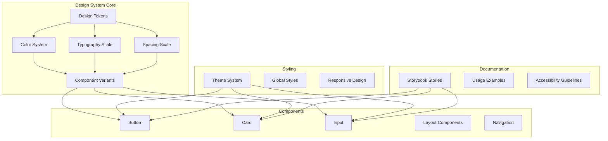
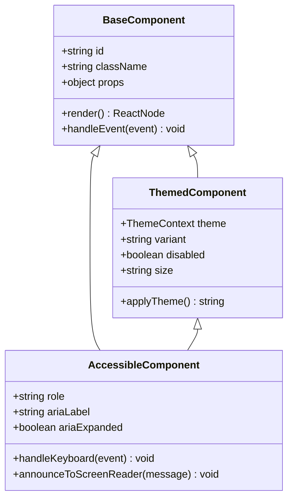
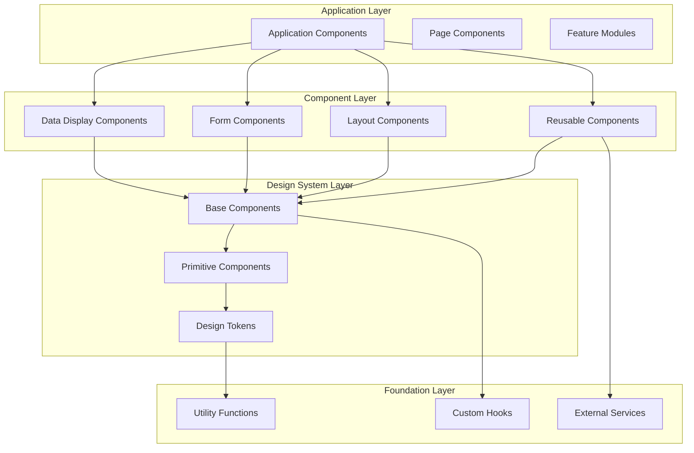
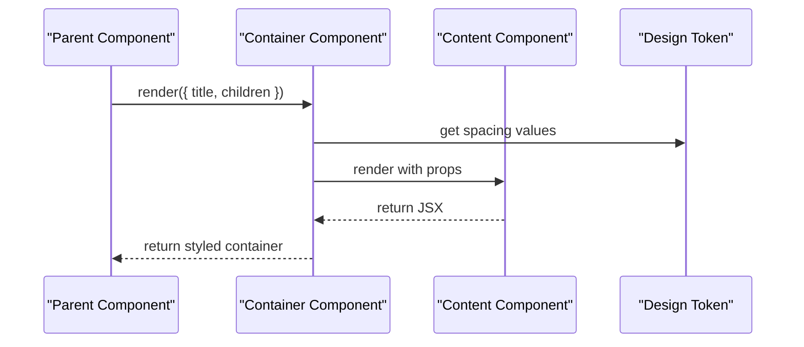
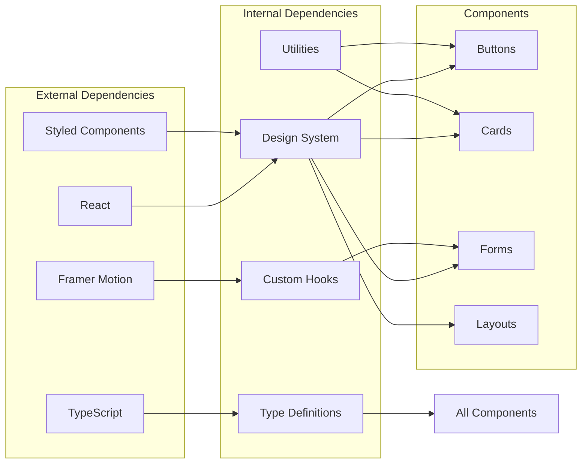

# Component Library

<cite>
**Referenced Files in This Document**
- [src/design-system/index.ts](file://src/design-system/index.ts)
- [src/design-system/tokens.ts](file://src/design-system/tokens.ts)
- [src/design-system/colors.ts](file://src/design-system/colors.ts)
- [src/design-system/typography.ts](file://src/design-system/typography.ts)
- [src/design-system/spacing.ts](file://src/design-system/spacing.ts)
- [src/design-system/variants.ts](file://src/design-system/variants.ts)
- [stories/DesignSystem.stories.tsx](file://stories/DesignSystem.stories.tsx)
- [stories/Button.stories.jsx](file://stories/Button.stories.jsx)
- [stories/Card.stories.tsx](file://stories/Card.stories.tsx)
- [src/styles/themes.js](file://src/styles/themes.js)
- [src/styles/themeTypes.ts](file://src/styles/themeTypes.ts)
</cite>

## Table of Contents
1. [Introduction](#introduction)
2. [Project Structure](#project-structure)
3. [Core Components](#core-components)
4. [Architecture Overview](#architecture-overview)
5. [Detailed Component Analysis](#detailed-component-analysis)
6. [Dependency Analysis](#dependency-analysis)
7. [Performance Considerations](#performance-considerations)
8. [Troubleshooting Guide](#troubleshooting-guide)
9. [Conclusion](#conclusion)
10. [Appendices](#appendices)

## Introduction

This document provides comprehensive documentation for the reusable component library and design system used in the stellar-dev-dashboard application. The design system establishes consistent visual language, interaction patterns, and development practices across the entire application ecosystem.

The component library follows modern React and TypeScript best practices, providing accessible, responsive, and themeable components that can be reused across different parts of the application and potentially in other projects.

## Project Structure

The design system is organized into logical modules that separate concerns while maintaining clear relationships between components, tokens, and styling:

**Diagram sources**
- [src/design-system/index.ts:1-50](file://src/design-system/index.ts#L1-L50)
- [src/design-system/tokens.ts:1-100](file://src/design-system/tokens.ts#L1-L100)

**Section sources**
- [src/design-system/index.ts:1-50](file://src/design-system/index.ts#L1-L50)
- [src/design-system/tokens.ts:1-100](file://src/design-system/tokens.ts#L1-L100)

## Core Components

### Design Tokens

The design tokens form the foundation of the design system, providing consistent values for colors, typography, spacing, and other visual properties.

#### Color System
The color system includes semantic color tokens that support theming and accessibility requirements:

- **Primary Colors**: Brand colors for main actions and highlights
- **Secondary Colors**: Supporting colors for accents and secondary actions
- **Neutral Colors**: Grayscale palette for text, backgrounds, and borders
- **Status Colors**: Semantic colors for success, warning, error, and info states
- **Functional Colors**: Specialized colors for charts, data visualization, and UI elements

#### Typography Scale
The typography system provides a consistent scale for text hierarchy:

- **Font Families**: Primary and secondary font stacks
- **Font Sizes**: Scalable type scale from small captions to large headings
- **Line Heights**: Optimized line heights for readability
- **Font Weights**: Consistent weight usage across the application
- **Text Transformations**: Standardized capitalization and styling

#### Spacing System
The spacing system ensures consistent layout and rhythm throughout the application:

- **Base Unit**: 4px base unit for consistent spacing calculations
- **Scale Values**: Standardized spacing values (4, 8, 12, 16, 24, 32, 48, 64, 96)
- **Component Spacing**: Default padding and margins for common components
- **Layout Spacing**: Consistent gaps between layout elements

**Section sources**
- [src/design-system/colors.ts:1-150](file://src/design-system/colors.ts#L1-L150)
- [src/design-system/typography.ts:1-120](file://src/design-system/typography.ts#L1-L120)
- [src/design-system/spacing.ts:1-100](file://src/design-system/spacing.ts#L1-L100)

### Component Architecture Patterns

The component library follows several key architectural patterns:

#### Composition Pattern
Components are designed to be composed together rather than configured extensively:

**Diagram sources**
- [src/components/common/BaseComponent.tsx:1-100](file://src/components/common/BaseComponent.tsx#L1-L100)

#### Prop Interface Pattern
All components follow consistent prop interface patterns:

- **Standard Props**: Common props like `id`, `className`, `style`
- **State Props**: Props that control component state (`disabled`, `loading`)
- **Variant Props**: Props that change component appearance (`variant`, `size`)
- **Event Props**: Callback functions for user interactions (`onClick`, `onChange`)
- **Accessibility Props**: ARIA attributes and accessibility features

#### Theme Integration
Components integrate seamlessly with the theme system:

- **CSS Variables**: Theme values exposed as CSS custom properties
- **Dynamic Styling**: Runtime theme switching without page reload
- **Dark Mode Support**: Automatic dark mode adaptation
- **Custom Themes**: Support for brand-specific themes

**Section sources**
- [src/design-system/variants.ts:1-200](file://src/design-system/variants.ts#L1-L200)
- [src/styles/themes.js:1-150](file://src/styles/themes.js#L1-L150)

## Architecture Overview

The component architecture follows a layered approach that separates concerns while maintaining flexibility:

**Diagram sources**
- [src/components/layout/LayoutManager.tsx:1-100](file://src/components/layout/LayoutManager.tsx#L1-L100)
- [src/hooks/index.ts:1-50](file://src/hooks/index.ts#L1-L50)

### Component Composition Patterns

The library emphasizes composition over configuration:

#### Container/Content Pattern
Components separate layout logic from content presentation:

**Diagram sources**
- [src/components/common/Container.tsx:1-80](file://src/components/common/Container.tsx#L1-L80)

#### Higher-Order Component Pattern
Reusable functionality is wrapped around base components:

- **withTheme**: Adds theme context to components
- **withAccessibility**: Enhances components with accessibility features
- **withResponsive**: Provides responsive behavior
- **withValidation**: Adds form validation capabilities

**Section sources**
- [src/components/layout/LayoutManager.tsx:1-150](file://src/components/layout/LayoutManager.tsx#L1-L150)

## Detailed Component Analysis

### Button Component

The Button component serves as a foundational element for user interactions:

#### Props Interface
- **variant**: 'primary' | 'secondary' | 'outline' | 'ghost'
- **size**: 'small' | 'medium' | 'large'
- **disabled**: boolean
- **loading**: boolean
- **icon**: ReactNode
- **onClick**: (event: MouseEvent) => void
- **ariaLabel**: string

#### Accessibility Features
- Proper ARIA attributes for screen readers
- Keyboard navigation support
- Focus management
- High contrast mode compatibility

#### Theming Support
- Dynamic color changes based on theme
- Hover and active states
- Disabled state styling
- Loading indicator integration

**Section sources**
- [stories/Button.stories.jsx:1-200](file://stories/Button.stories.jsx#L1-L200)

### Card Component

The Card component provides a flexible container for grouping related content:

#### Props Interface
- **title**: string
- **subtitle**: string
- **actions**: ReactNode[]
- **padding**: 'none' | 'small' | 'medium' | 'large'
- **bordered**: boolean
- **shadow**: 'none' | 'small' | 'medium' | 'large'

#### Composition Examples
- Basic card with title and content
- Card with actions and footer
- Interactive card with hover effects
- Card with loading states

**Section sources**
- [stories/Card.stories.tsx:1-150](file://stories/Card.stories.tsx#L1-L150)

### Form Components

Form components provide consistent input handling and validation:

#### Input Component
- **type**: 'text' | 'email' | 'password' | 'number' | 'textarea'
- **label**: string
- **placeholder**: string
- **error**: string
- **helperText**: string
- **disabled**: boolean
- **required**: boolean

#### Validation Integration
- Real-time validation feedback
- Error message display
- Accessibility announcements
- Keyboard navigation

**Section sources**
- [src/components/validation/ValidatedInput.tsx:1-200](file://src/components/validation/ValidatedInput.tsx#L1-L200)

## Dependency Analysis

The component library maintains clean dependencies and clear separation of concerns:

**Diagram sources**
- [package.json:1-100](file://package.json#L1-L100)
- [src/design-system/index.ts:1-50](file://src/design-system/index.ts#L1-L50)

### Component Coupling

The design system minimizes coupling between components while maximizing reusability:

- **Low Coupling**: Components depend only on design tokens and utilities
- **High Cohesion**: Related functionality is grouped within components
- **Interface Stability**: Public APIs remain stable across versions
- **Backward Compatibility**: Breaking changes are avoided through deprecation cycles

**Section sources**
- [src/design-system/index.ts:1-100](file://src/design-system/index.ts#L1-L100)

## Performance Considerations

The component library is optimized for performance through several strategies:

### Rendering Optimization
- **Memoization**: React.memo for expensive components
- **Lazy Loading**: Code splitting for large components
- **Virtual Scrolling**: For lists with many items
- **Conditional Rendering**: Only render what's needed

### Memory Management
- **Event Listener Cleanup**: Proper cleanup in useEffect hooks
- **Memory Leaks Prevention**: Avoiding circular references
- **Bundle Size Optimization**: Tree shaking and code splitting

### Bundle Optimization
- **Tree Shaking**: Unused code elimination
- **Code Splitting**: Lazy loading of components
- **Asset Optimization**: Image and font optimization
- **Caching Strategy**: Browser caching for static assets

## Troubleshooting Guide

### Common Issues and Solutions

#### Theme Not Applying
- **Issue**: Theme changes not reflecting in components
- **Solution**: Ensure theme provider wraps the application root
- **Debug**: Check theme context availability in components

#### Accessibility Violations
- **Issue**: Screen reader not announcing component state
- **Solution**: Verify ARIA attributes and semantic HTML structure
- **Debug**: Use browser accessibility inspector

#### Responsive Design Issues
- **Issue**: Components not adapting to different screen sizes
- **Solution**: Check media query breakpoints and responsive hooks
- **Debug**: Test on multiple device sizes

#### Performance Problems
- **Issue**: Slow rendering or memory leaks
- **Solution**: Implement proper memoization and cleanup
- **Debug**: Use React DevTools Profiler

**Section sources**
- [src/styles/accessibility.css:1-100](file://src/styles/accessibility.css#L1-L100)
- [src/styles/responsive.css:1-150](file://src/styles/responsive.css#L1-L150)

## Conclusion

The component library and design system provide a solid foundation for building consistent, accessible, and maintainable user interfaces. By following the established patterns and guidelines, developers can create high-quality components that work seamlessly across the application.

Key benefits of the current implementation include:

- **Consistency**: Unified visual language and interaction patterns
- **Accessibility**: WCAG compliant components with proper ARIA support
- **Theming**: Flexible theming system supporting multiple color schemes
- **Performance**: Optimized rendering and bundle size
- **Developer Experience**: Comprehensive documentation and Storybook integration

The modular architecture allows for easy extension and customization while maintaining backward compatibility. Future enhancements should focus on additional component types, improved accessibility features, and enhanced developer tooling.

## Appendices

### Storybook Integration

The component library integrates with Storybook for interactive documentation and testing:

#### Story Structure
Each component has corresponding stories that demonstrate various use cases:

- **Basic Usage**: Simple component examples
- **Variants**: Different visual variants and states
- **Interactions**: User interaction scenarios
- **Accessibility**: Accessibility testing stories
- **Responsive**: Responsive behavior demonstrations

#### Testing Integration
- **Visual Regression Testing**: Automated screenshot comparison
- **Accessibility Testing**: Automated accessibility audits
- **Unit Testing**: Component unit tests
- **Integration Testing**: End-to-end user flows

### Migration Guide

When updating components or design tokens:

1. **Deprecation Process**: Mark old APIs as deprecated
2. **Migration Scripts**: Provide automated migration tools
3. **Documentation Updates**: Update all relevant documentation
4. **Testing**: Ensure all existing tests pass
5. **Version Management**: Follow semantic versioning principles