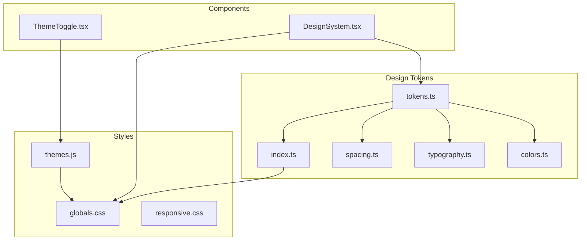
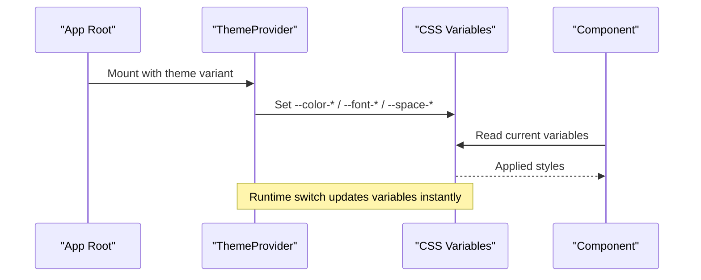
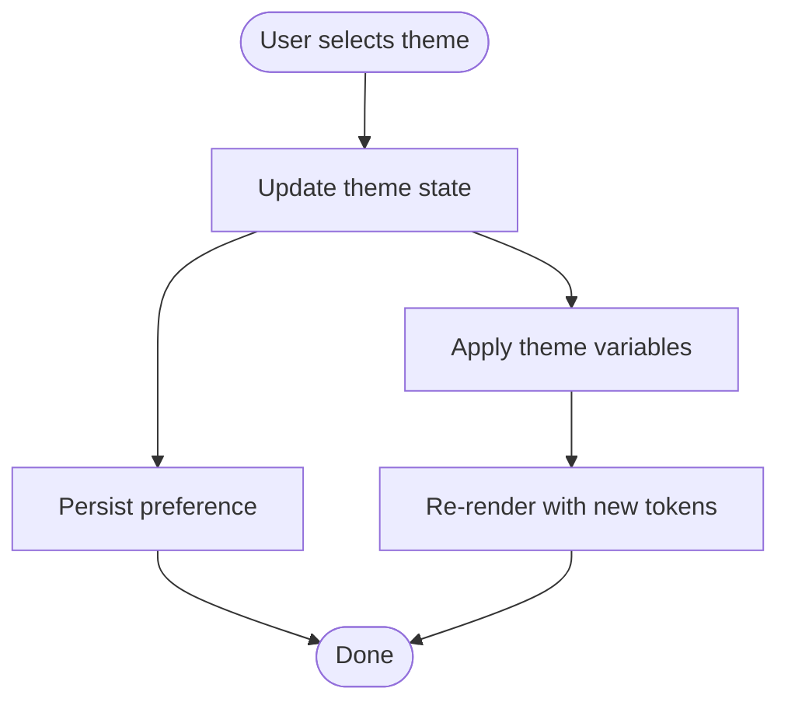
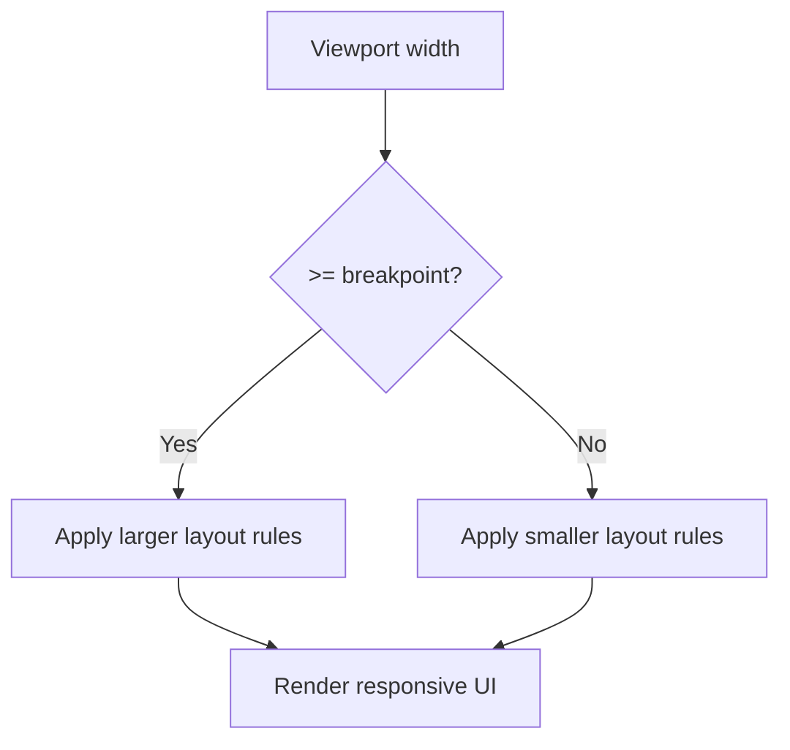
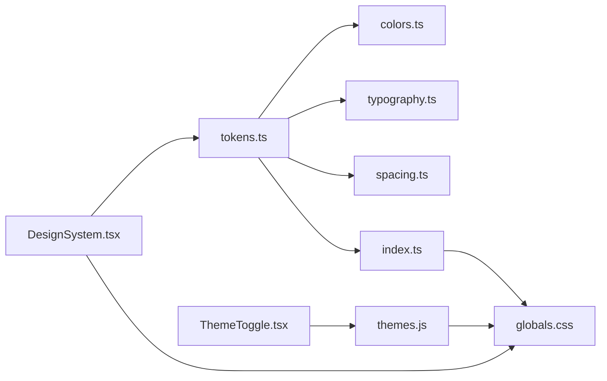

# Design System Fundamentals

<cite>
**Referenced Files in This Document**
- [tokens.ts](file://src/design-system/tokens.ts)
- [colors.ts](file://src/design-system/colors.ts)
- [typography.ts](file://src/design-system/typography.ts)
- [spacing.ts](file://src/design-system/spacing.ts)
- [index.ts](file://src/design-system/index.ts)
- [themes.js](file://src/styles/themes.js)
- [globals.css](file://src/styles/globals.css)
- [responsive.css](file://src/styles/responsive.css)
- [ThemeToggle.tsx](file://src/components/layout/ThemeToggle.tsx)
- [DesignSystem.tsx](file://src/components/dashboard/DesignSystem.tsx)
</cite>

## Table of Contents
1. [Introduction](#introduction)
2. [Project Structure](#project-structure)
3. [Core Components](#core-components)
4. [Architecture Overview](#architecture-overview)
5. [Detailed Component Analysis](#detailed-component-analysis)
6. [Dependency Analysis](#dependency-analysis)
7. [Performance Considerations](#performance-considerations)
8. [Troubleshooting Guide](#troubleshooting-guide)
9. [Conclusion](#conclusion)
10. [Appendices](#appendices)

## Introduction

This document explains the design system fundamentals: tokens, color palette, typography, spacing, and theming architecture. It covers token structure, CSS custom properties implementation, how to extend or customize the system, examples of using tokens in components, responsive breakpoints, accessibility considerations, theme switching mechanisms, and best practices for maintaining consistency across the application.

## Project Structure

The design system is organized into dedicated modules for tokens (colors, typography, spacing), global styles, and theme management. Components consume tokens via CSS custom properties and React context where appropriate.

**Diagram sources**
- [tokens.ts](file://src/design-system/tokens.ts)
- [colors.ts](file://src/design-system/colors.ts)
- [typography.ts](file://src/design-system/typography.ts)
- [spacing.ts](file://src/design-system/spacing.ts)
- [index.ts](file://src/design-system/index.ts)
- [themes.js](file://src/styles/themes.js)
- [globals.css](file://src/styles/globals.css)
- [responsive.css](file://src/styles/responsive.css)
- [ThemeToggle.tsx](file://src/components/layout/ThemeToggle.tsx)
- [DesignSystem.tsx](file://src/components/dashboard/DesignSystem.tsx)

**Section sources**
- [tokens.ts](file://src/design-system/tokens.ts)
- [colors.ts](file://src/design-system/colors.ts)
- [typography.ts](file://src/design-system/typography.ts)
- [spacing.ts](file://src/design-system/spacing.ts)
- [index.ts](file://src/design-system/index.ts)
- [themes.js](file://src/styles/themes.js)
- [globals.css](file://src/styles/globals.css)
- [responsive.css](file://src/styles/responsive.css)
- [ThemeToggle.tsx](file://src/components/layout/ThemeToggle.tsx)
- [DesignSystem.tsx](file://src/components/dashboard/DesignSystem.tsx)

## Core Components

- Token registry: Centralized definitions for colors, typography, spacing, and semantic tokens.
- CSS custom properties: Tokens are exposed as CSS variables for runtime theming and component consumption.
- Theme provider: Applies theme variants by setting CSS variables at the root or component scope.
- Responsive utilities: Breakpoints and utility classes/hooks for adaptive layouts.
- Accessibility layer: Contrast checks, focus states, and reduced motion preferences.

Key responsibilities:
- Provide a single source of truth for visual primitives.
- Enable consistent styling across components.
- Support dynamic theme switching without rebuilds.
- Ensure accessible defaults and predictable behavior.

**Section sources**
- [tokens.ts](file://src/design-system/tokens.ts)
- [colors.ts](file://src/design-system/colors.ts)
- [typography.ts](file://src/design-system/typography.ts)
- [spacing.ts](file://src/design-system/spacing.ts)
- [index.ts](file://src/design-system/index.ts)
- [themes.js](file://src/styles/themes.js)
- [globals.css](file://src/styles/globals.css)
- [responsive.css](file://src/styles/responsive.css)

## Architecture Overview

The design system follows a layered approach:
- Token layer: Source-of-truth values (semantic and primitive).
- Style layer: CSS custom properties mapped from tokens.
- Theme layer: Variants (light/dark/custom) that override CSS variables.
- Component layer: UI elements consuming tokens via CSS variables and optional React context.

**Diagram sources**
- [themes.js](file://src/styles/themes.js)
- [globals.css](file://src/styles/globals.css)
- [ThemeToggle.tsx](file://src/components/layout/ThemeToggle.tsx)
- [DesignSystem.tsx](file://src/components/dashboard/DesignSystem.tsx)

## Detailed Component Analysis

### Token Registry and Index

- Purpose: Aggregate and export tokens for consistent consumption.
- Typical structure:
  - Primitive tokens: base colors, font families, sizes, spacings.
  - Semantic tokens: brand, status, surface, text roles.
  - Composition: maps primitives to semantic names.
- Export strategy: index re-exports grouped tokens for easy imports.

Best practices:
- Keep primitives immutable; derive semantics from primitives.
- Use descriptive semantic names (e.g., text-primary, bg-surface).
- Avoid hardcoding values in components.

**Section sources**
- [tokens.ts](file://src/design-system/tokens.ts)
- [index.ts](file://src/design-system/index.ts)

### Color Palette

- Organization:
  - Base palette: neutrals, brand hues, semantic colors (success, warning, error).
  - Semantic mapping: light/dark variants per role.
  - Accessibility: ensure contrast ratios meet WCAG guidelines.
- Implementation:
  - Map tokens to CSS variables (--color-brand, --color-text-primary, etc.).
  - Provide fallbacks for unsupported themes.

Usage example pattern:
- In components, reference semantic tokens rather than raw hex values.
- For charts/graphs, use accessible palettes and avoid relying solely on color.

**Section sources**
- [colors.ts](file://src/design-system/colors.ts)
- [globals.css](file://src/styles/globals.css)

### Typography System

- Scale: modular type scale (e.g., xs, sm, base, lg, xl, xxl).
- Font stack: define primary and fallback families.
- Line height and letter spacing: tuned for readability.
- Roles: headings, body, caption, code, link.

Implementation:
- Map tokens to CSS variables (--font-size-base, --line-height-body, etc.).
- Provide utility classes or style presets for common combinations.

Accessibility:
- Maintain minimum font sizes for body text.
- Ensure sufficient line height and contrast.

**Section sources**
- [typography.ts](file://src/design-system/typography.ts)
- [globals.css](file://src/styles/globals.css)

### Spacing Guidelines

- Scale: consistent spacing units (e.g., 4px base).
- Usage: margins, paddings, gaps, layout grids.
- Semantics: space-xs through space-xl for consistent rhythm.

Implementation:
- Map to CSS variables (--space-sm, --space-md, etc.).
- Encourage usage via utility classes or token-based props.

**Section sources**
- [spacing.ts](file://src/design-system/spacing.ts)
- [globals.css](file://src/styles/globals.css)

### Theming Architecture

- Theme variants: light, dark, high-contrast, custom.
- Provider: sets CSS variables at :root or scoped container.
- Switching mechanism: toggles active theme and persists preference.

**Diagram sources**
- [ThemeToggle.tsx](file://src/components/layout/ThemeToggle.tsx)
- [themes.js](file://src/styles/themes.js)
- [globals.css](file://src/styles/globals.css)

**Section sources**
- [themes.js](file://src/styles/themes.js)
- [ThemeToggle.tsx](file://src/components/layout/ThemeToggle.tsx)
- [globals.css](file://src/styles/globals.css)

### Responsive Breakpoints

- Strategy: mobile-first media queries with consistent breakpoints.
- Utilities: classes or hooks for responsive behavior.
- Layout: fluid grids and flexible components.

**Diagram sources**
- [responsive.css](file://src/styles/responsive.css)

**Section sources**
- [responsive.css](file://src/styles/responsive.css)

### Accessibility Considerations

- Contrast: verify token pairs meet WCAG AA/AAA thresholds.
- Focus states: visible outlines and keyboard navigation.
- Reduced motion: respect prefers-reduced-motion.
- Screen readers: semantic HTML and ARIA attributes.

Integration points:
- Global focus styles in CSS.
- Theme-aware contrast checks.
- Motion-safe animations.

**Section sources**
- [globals.css](file://src/styles/globals.css)
- [responsive.css](file://src/styles/responsive.css)

### Using Tokens in Components

Patterns:
- CSS-only: rely on CSS variables set by theme provider.
- JS-driven: read tokens from context or config for dynamic logic.
- Storybook: showcase tokens and components together.

Guidelines:
- Prefer semantic tokens over primitives.
- Avoid inline hardcoded values.
- Test components under multiple themes.

**Section sources**
- [DesignSystem.tsx](file://src/components/dashboard/DesignSystem.tsx)
- [globals.css](file://src/styles/globals.css)

## Dependency Analysis

**Diagram sources**
- [tokens.ts](file://src/design-system/tokens.ts)
- [colors.ts](file://src/design-system/colors.ts)
- [typography.ts](file://src/design-system/typography.ts)
- [spacing.ts](file://src/design-system/spacing.ts)
- [index.ts](file://src/design-system/index.ts)
- [globals.css](file://src/styles/globals.css)
- [themes.js](file://src/styles/themes.js)
- [ThemeToggle.tsx](file://src/components/layout/ThemeToggle.tsx)
- [DesignSystem.tsx](file://src/components/dashboard/DesignSystem.tsx)

**Section sources**
- [tokens.ts](file://src/design-system/tokens.ts)
- [index.ts](file://src/design-system/index.ts)
- [themes.js](file://src/styles/themes.js)
- [globals.css](file://src/styles/globals.css)

## Performance Considerations

- Minimize variable recalculations: batch theme updates.
- Prefer CSS variables over JS-driven style changes for performance.
- Defer heavy computations until after initial render.
- Use memoization for computed token sets if needed.
- Keep token payloads small; split large themes into lazy-loaded chunks if necessary.

[No sources needed since this section provides general guidance]

## Troubleshooting Guide

Common issues and resolutions:
- Theme not applying: ensure provider wraps app and variables are set on :root or correct scope.
- Incorrect contrast: audit token pairs against WCAG thresholds and adjust semantic mappings.
- Broken responsive layout: verify breakpoints and media query order.
- Focus loss: confirm global focus styles and tabindex usage.
- Animation jank: respect reduced motion and avoid expensive transitions.

Validation steps:
- Inspect computed CSS variables in DevTools.
- Run automated contrast checks in CI.
- Visual regression tests across themes and viewports.

**Section sources**
- [globals.css](file://src/styles/globals.css)
- [responsive.css](file://src/styles/responsive.css)
- [themes.js](file://src/styles/themes.js)

## Conclusion

A robust design system centers on clear tokens, consistent CSS custom properties, and a scalable theming architecture. By separating primitives from semantics, exposing tokens as CSS variables, and providing a theme provider, components remain simple, testable, and adaptable. Enforce accessibility and responsiveness early, and maintain consistency through strict token usage and automated checks.

[No sources needed since this section summarizes without analyzing specific files]

## Appendices

### Extending the Design System

- Add new tokens:
  - Define primitives and map to semantic names.
  - Update CSS variables and theme variants.
  - Document usage and add stories/examples.
- Create new themes:
  - Extend base theme with overrides.
  - Validate contrast and accessibility.
- Integrate with components:
  - Replace hardcoded values with tokens.
  - Ensure theme switching works end-to-end.

[No sources needed since this section provides general guidance]