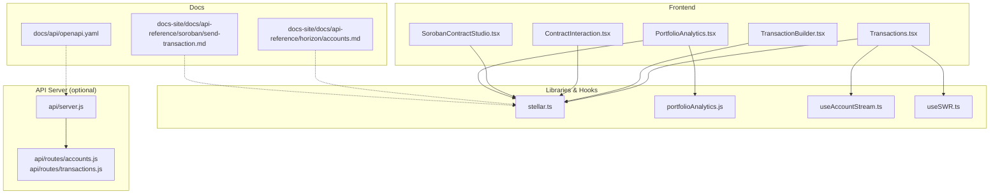
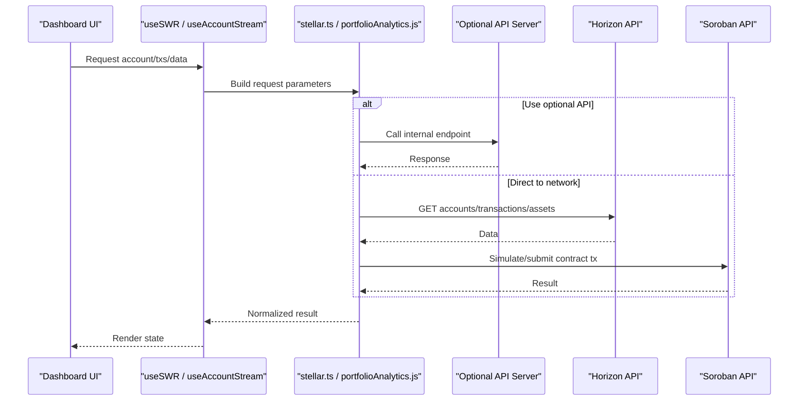
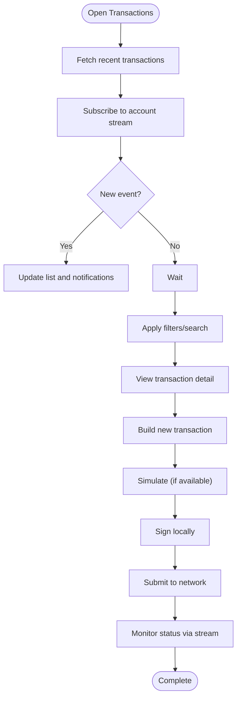
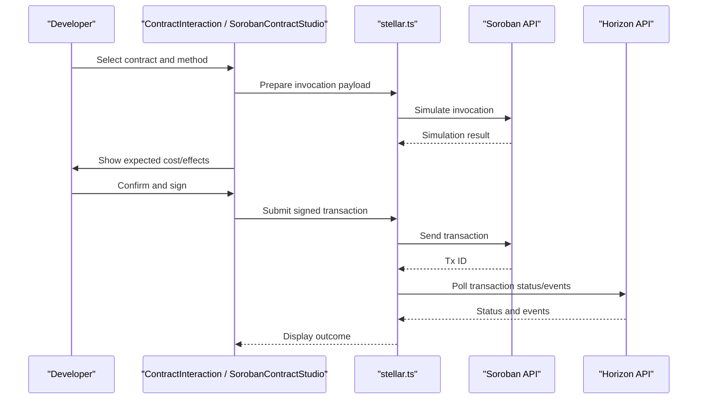
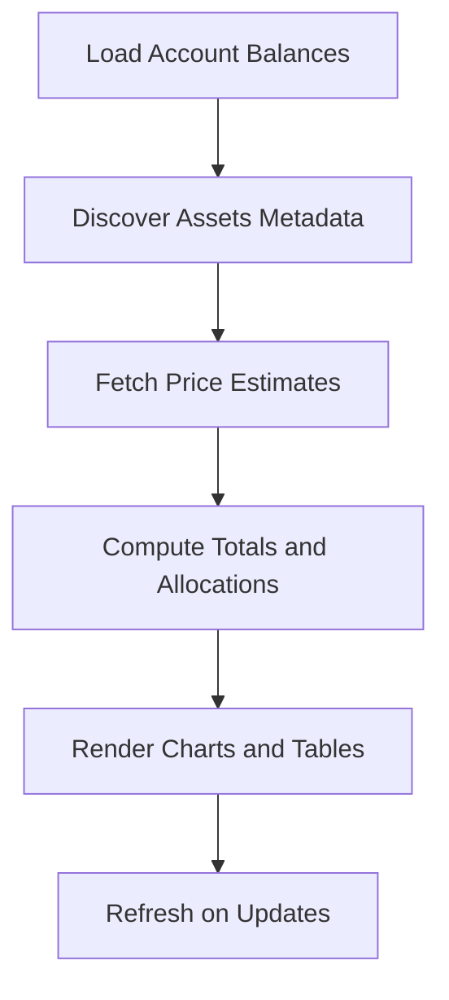
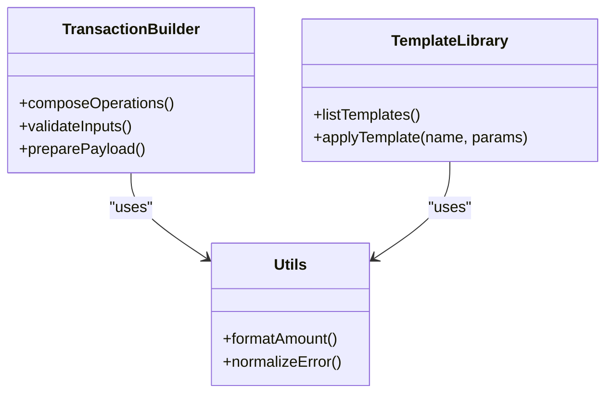
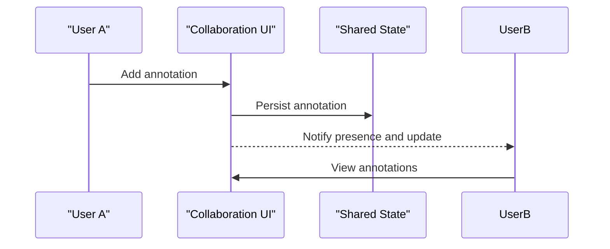
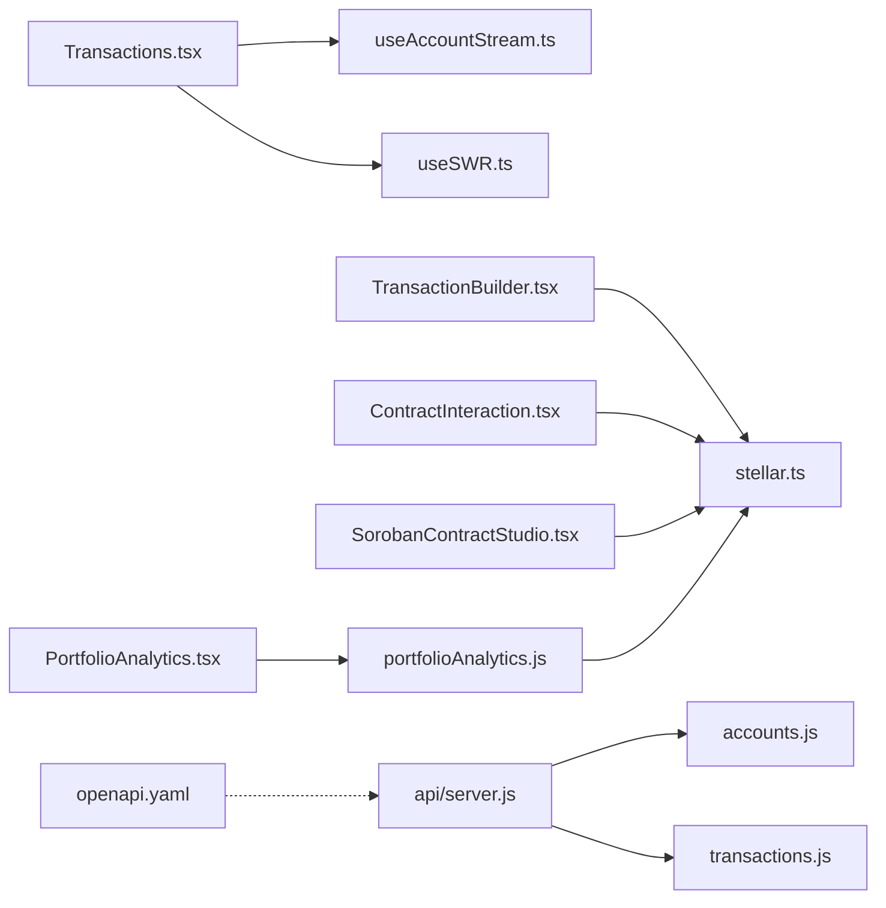

# Core Features

<cite>
**Referenced Files in This Document**
- [README.md](file://README.md)
- [FEATURE_OVERVIEW.md](file://FEATURE_OVERVIEW.md)
- [IMPLEMENTATION_SUMMARY.md](file://IMPLEMENTATION_SUMMARY.md)
- [DEVELOPER_TOOLS_GUIDE.md](file://DEVELOPER_TOOLS_GUIDE.md)
- [PORTFOLIO_ANALYTICS_GUIDE.md](file://PORTFOLIO_ANALYTICS_GUIDE.md)
- [COLLABORATION_FEATURES.md](file://COLLABORATION_FEATURES.md)
- [src/components/dashboard/Transactions.tsx](file://src/components/dashboard/Transactions.tsx)
- [src/components/dashboard/TransactionBuilder.tsx](file://src/components/dashboard/TransactionBuilder.tsx)
- [src/components/dashboard/ContractInteraction.tsx](file://src/components/dashboard/ContractInteraction.tsx)
- [src/components/dashboard/SorobanContractStudio.tsx](file://src/components/dashboard/SorobanContractStudio.tsx)
- [src/components/dashboard/PortfolioAnalytics.tsx](file://src/components/dashboard/PortfolioAnalytics.tsx)
- [src/lib/portfolioAnalytics.js](file://src/lib/portfolioAnalytics.js)
- [src/lib/stellar.ts](file://src/lib/stellar.ts)
- [src/hooks/useAccountStream.ts](file://src/hooks/useAccountStream.ts)
- [src/hooks/useSWR.ts](file://src/hooks/useSWR.ts)
- [api/server.js](file://api/server.js)
- [api/routes/accounts.js](file://api/routes/accounts.js)
- [api/routes/transactions.js](file://api/routes/transactions.js)
- [docs/api/openapi.yaml](file://docs/api/openapi.yaml)
- [docs-site/docs/api-reference/horizon/accounts.md](file://docs-site/docs/api-reference/horizon/accounts.md)
- [docs-site/docs/api-reference/soroban/send-transaction.md](file://docs-site/docs/api-reference/soroban/send-transaction.md)
</cite>

## Table of Contents
1. [Introduction](#introduction)
2. [Project Structure](#project-structure)
3. [Core Components](#core-components)
4. [Architecture Overview](#architecture-overview)
5. [Detailed Component Analysis](#detailed-component-analysis)
6. [Dependency Analysis](#dependency-analysis)
7. [Performance Considerations](#performance-considerations)
8. [Troubleshooting Guide](#troubleshooting-guide)
9. [Conclusion](#conclusion)
10. [Appendices](#appendices)

## Introduction
This document explains the core features of the Stellar Development Dashboard with a focus on transaction management, smart contract development, portfolio analytics, developer tools, and collaboration platforms. It provides conceptual overviews for beginners and implementation details for experienced developers, including how each feature integrates with Stellar blockchain services such as Horizon and Soroban. The content is grounded in the repository’s components, hooks, libraries, API routes, and documentation.

## Project Structure
The dashboard is organized into:
- Frontend React components under src/components/dashboard for UI features
- Shared logic and integrations under src/lib and src/hooks
- Optional Node.js API server under api for convenience endpoints
- Documentation under docs and docs-site for API references and examples

**Diagram sources**
- [src/components/dashboard/Transactions.tsx](file://src/components/dashboard/Transactions.tsx)
- [src/components/dashboard/TransactionBuilder.tsx](file://src/components/dashboard/TransactionBuilder.tsx)
- [src/components/dashboard/ContractInteraction.tsx](file://src/components/dashboard/ContractInteraction.tsx)
- [src/components/dashboard/SorobanContractStudio.tsx](file://src/components/dashboard/SorobanContractStudio.tsx)
- [src/components/dashboard/PortfolioAnalytics.tsx](file://src/components/dashboard/PortfolioAnalytics.tsx)
- [src/lib/stellar.ts](file://src/lib/stellar.ts)
- [src/lib/portfolioAnalytics.js](file://src/lib/portfolioAnalytics.js)
- [src/hooks/useAccountStream.ts](file://src/hooks/useAccountStream.ts)
- [src/hooks/useSWR.ts](file://src/hooks/useSWR.ts)
- [api/server.js](file://api/server.js)
- [api/routes/accounts.js](file://api/routes/accounts.js)
- [api/routes/transactions.js](file://api/routes/transactions.js)
- [docs/api/openapi.yaml](file://docs/api/openapi.yaml)
- [docs-site/docs/api-reference/horizon/accounts.md](file://docs-site/docs/api-reference/horizon/accounts.md)
- [docs-site/docs/api-reference/soroban/send-transaction.md](file://docs-site/docs/api-reference/soroban/send-transaction.md)

**Section sources**
- [README.md](file://README.md)
- [FEATURE_OVERVIEW.md](file://FEATURE_OVERVIEW.md)
- [IMPLEMENTATION_SUMMARY.md](file://IMPLEMENTATION_SUMMARY.md)

## Core Components
- Transaction Management: Browse, filter, simulate, build, sign, and submit transactions; stream account activity.
- Smart Contract Development: Interact with deployed contracts, use Soroban Studio-like workflows, and send Soroban transactions.
- Portfolio Analytics: Aggregate balances across assets, compute USD estimates, and visualize performance.
- Developer Tools: Builders, simulators, templates, and utilities to accelerate development.
- Collaboration Platforms: Presence indicators, annotations, and shared views for team workflows.

These components integrate with Stellar via:
- Horizon APIs for accounts, transactions, assets, and events
- Soroban APIs for contract data, simulation, and submission
- Optional local API server for convenience or proxying

**Section sources**
- [FEATURE_OVERVIEW.md](file://FEATURE_OVERVIEW.md)
- [IMPLEMENTATION_SUMMARY.md](file://IMPLEMENTATION_SUMMARY.md)
- [DEVELOPER_TOOLS_GUIDE.md](file://DEVELOPER_TOOLS_GUIDE.md)
- [PORTFOLIO_ANALYTICS_GUIDE.md](file://PORTFOLIO_ANALYTICS_GUIDE.md)

## Architecture Overview
High-level flow from UI to blockchain:
- UI components call shared hooks and libraries
- Libraries wrap Horizon/Soroban calls and handle retries, caching, and errors
- Optional API server exposes convenience endpoints and can enforce rate limits or auth
- Docs define contracts and examples used by both frontend and backend

**Diagram sources**
- [src/hooks/useSWR.ts](file://src/hooks/useSWR.ts)
- [src/hooks/useAccountStream.ts](file://src/hooks/useAccountStream.ts)
- [src/lib/stellar.ts](file://src/lib/stellar.ts)
- [src/lib/portfolioAnalytics.js](file://src/lib/portfolioAnalytics.js)
- [api/server.js](file://api/server.js)
- [docs-site/docs/api-reference/horizon/accounts.md](file://docs-site/docs/api-reference/horizon/accounts.md)
- [docs-site/docs/api-reference/soroban/send-transaction.md](file://docs-site/docs/api-reference/soroban/send-transaction.md)

## Detailed Component Analysis

### Transaction Management
Conceptual overview:
- Transactions are operations that change ledger state (payments, trustlines, contract invocations).
- Typical workflow: discover account, build operation(s), set fee and memo, simulate if supported, sign locally, submit to network, then monitor results.

Implementation approach:
- Transactions view lists and filters recent transactions using SWR-based fetching and streams live updates via account stream hook.
- Transaction builder composes operations, validates inputs, and prepares payloads for signing and submission.
- Integration points:
  - Horizon endpoints for listing transactions and account info
  - Soroban endpoints for simulation and submission when building contract transactions
  - Optional API server for centralized logging or policy enforcement

**Diagram sources**
- [src/components/dashboard/Transactions.tsx](file://src/components/dashboard/Transactions.tsx)
- [src/components/dashboard/TransactionBuilder.tsx](file://src/components/dashboard/TransactionBuilder.tsx)
- [src/hooks/useAccountStream.ts](file://src/hooks/useAccountStream.ts)
- [src/hooks/useSWR.ts](file://src/hooks/useSWR.ts)
- [src/lib/stellar.ts](file://src/lib/stellar.ts)
- [docs-site/docs/api-reference/horizon/accounts.md](file://docs-site/docs/api-reference/horizon/accounts.md)
- [docs-site/docs/api-reference/soroban/send-transaction.md](file://docs-site/docs/api-reference/soroban/send-transaction.md)

**Section sources**
- [src/components/dashboard/Transactions.tsx](file://src/components/dashboard/Transactions.tsx)
- [src/components/dashboard/TransactionBuilder.tsx](file://src/components/dashboard/TransactionBuilder.tsx)
- [src/hooks/useAccountStream.ts](file://src/hooks/useAccountStream.ts)
- [src/hooks/useSWR.ts](file://src/hooks/useSWR.ts)
- [src/lib/stellar.ts](file://src/lib/stellar.ts)
- [api/routes/transactions.js](file://api/routes/transactions.js)

### Smart Contract Development
Conceptual overview:
- Smart contracts on Stellar run via Soroban. Developers write contracts, compile to WASM, deploy, and invoke methods.
- Common tasks: get contract data, simulate invocation, submit signed transaction, and observe events.

Implementation approach:
- Contract interaction component provides forms and controls to call contract methods and display results.
- Soroban studio-like interface offers guided flows for deployment and invocation.
- Integrates with Soroban APIs for simulation and submission, and Horizon for transaction history.

**Diagram sources**
- [src/components/dashboard/ContractInteraction.tsx](file://src/components/dashboard/ContractInteraction.tsx)
- [src/components/dashboard/SorobanContractStudio.tsx](file://src/components/dashboard/SorobanContractStudio.tsx)
- [src/lib/stellar.ts](file://src/lib/stellar.ts)
- [docs-site/docs/api-reference/soroban/send-transaction.md](file://docs-site/docs/api-reference/soroban/send-transaction.md)

**Section sources**
- [src/components/dashboard/ContractInteraction.tsx](file://src/components/dashboard/ContractInteraction.tsx)
- [src/components/dashboard/SorobanContractStudio.tsx](file://src/components/dashboard/SorobanContractStudio.tsx)
- [src/lib/stellar.ts](file://src/lib/stellar.ts)
- [docs-site/docs/api-reference/soroban/send-transaction.md](file://docs-site/docs/api-reference/soroban/send-transaction.md)

### Portfolio Analytics
Conceptual overview:
- Portfolio analytics aggregates balances across native XLM and issued assets, converts to USD where possible, and visualizes trends.
- Useful for understanding exposure, performance, and asset composition.

Implementation approach:
- Portfolio analytics component orchestrates balance retrieval, asset discovery, and price estimation.
- Library functions compute totals, allocations, and historical metrics.
- Integrates with Horizon for balances and assets, and external price feeds where applicable.

**Diagram sources**
- [src/components/dashboard/PortfolioAnalytics.tsx](file://src/components/dashboard/PortfolioAnalytics.tsx)
- [src/lib/portfolioAnalytics.js](file://src/lib/portfolioAnalytics.js)
- [src/lib/stellar.ts](file://src/lib/stellar.ts)
- [docs-site/docs/api-reference/horizon/accounts.md](file://docs-site/docs/api-reference/horizon/accounts.md)

**Section sources**
- [src/components/dashboard/PortfolioAnalytics.tsx](file://src/components/dashboard/PortfolioAnalytics.tsx)
- [src/lib/portfolioAnalytics.js](file://src/lib/portfolioAnalytics.js)
- [PORTFOLIO_ANALYTICS_GUIDE.md](file://PORTFOLIO_ANALYTICS_GUIDE.md)

### Developer Tools
Conceptual overview:
- Developer tools include builders, simulators, templates, and utilities to streamline common tasks like payments, trustlines, and contract interactions.

Implementation approach:
- Builder components provide structured forms and validation for constructing transactions.
- Templates and reusable patterns reduce boilerplate and improve consistency.
- Utilities encapsulate Stellar SDK usage and error handling.

**Diagram sources**
- [src/components/dashboard/TransactionBuilder.tsx](file://src/components/dashboard/TransactionBuilder.tsx)
- [DEVELOPER_TOOLS_GUIDE.md](file://DEVELOPER_TOOLS_GUIDE.md)

**Section sources**
- [DEVELOPER_TOOLS_GUIDE.md](file://DEVELOPER_TOOLS_GUIDE.md)
- [src/components/dashboard/TransactionBuilder.tsx](file://src/components/dashboard/TransactionBuilder.tsx)

### Collaboration Platforms
Conceptual overview:
- Collaboration features enable multiple users to annotate, share views, and coordinate around transactions and contracts.

Implementation approach:
- Presence indicators and annotation panels support real-time awareness and contextual notes.
- Shared dashboards allow teams to align on monitoring and debugging efforts.

**Diagram sources**
- [COLLABORATION_FEATURES.md](file://COLLABORATION_FEATURES.md)

**Section sources**
- [COLLABORATION_FEATURES.md](file://COLLABORATION_FEATURES.md)

## Dependency Analysis
Key dependencies and relationships:
- UI components depend on hooks for data fetching and streaming
- Hooks depend on libraries that wrap Horizon/Soroban clients
- Optional API server depends on route handlers and may expose OpenAPI specs
- Documentation defines contracts consumed by both client and server

**Diagram sources**
- [src/components/dashboard/Transactions.tsx](file://src/components/dashboard/Transactions.tsx)
- [src/components/dashboard/TransactionBuilder.tsx](file://src/components/dashboard/TransactionBuilder.tsx)
- [src/components/dashboard/ContractInteraction.tsx](file://src/components/dashboard/ContractInteraction.tsx)
- [src/components/dashboard/SorobanContractStudio.tsx](file://src/components/dashboard/SorobanContractStudio.tsx)
- [src/components/dashboard/PortfolioAnalytics.tsx](file://src/components/dashboard/PortfolioAnalytics.tsx)
- [src/hooks/useAccountStream.ts](file://src/hooks/useAccountStream.ts)
- [src/hooks/useSWR.ts](file://src/hooks/useSWR.ts)
- [src/lib/stellar.ts](file://src/lib/stellar.ts)
- [src/lib/portfolioAnalytics.js](file://src/lib/portfolioAnalytics.js)
- [api/server.js](file://api/server.js)
- [api/routes/accounts.js](file://api/routes/accounts.js)
- [api/routes/transactions.js](file://api/routes/transactions.js)
- [docs/api/openapi.yaml](file://docs/api/openapi.yaml)

**Section sources**
- [docs/api/openapi.yaml](file://docs/api/openapi.yaml)
- [api/server.js](file://api/server.js)
- [api/routes/accounts.js](file://api/routes/accounts.js)
- [api/routes/transactions.js](file://api/routes/transactions.js)

## Performance Considerations
- Prefer SWR-based caching for read-heavy queries to reduce redundant requests.
- Use account streaming for low-latency updates instead of polling.
- Debounce heavy computations in portfolio analytics and paginate large datasets.
- Offload expensive operations to background workers or the optional API server when appropriate.
- Implement retry and backoff strategies for transient network failures.

[No sources needed since this section provides general guidance]

## Troubleshooting Guide
Common issues and resolutions:
- Network timeouts or rate limits: implement exponential backoff and respect server headers; consult rate limiting docs.
- Invalid transaction payloads: validate inputs before building; use builders and templates to reduce errors.
- Contract simulation failures: review simulation response and adjust fees or parameters accordingly.
- Missing asset metadata or prices: fall back gracefully and prompt user to refresh or configure price feeds.

Operational tips:
- Use the optional API server to centralize logs and enforce policies.
- Reference OpenAPI spec and Horizon/Soroban docs for correct request/response formats.

**Section sources**
- [docs/api/openapi.yaml](file://docs/api/openapi.yaml)
- [docs-site/docs/api-reference/horizon/accounts.md](file://docs-site/docs/api-reference/horizon/accounts.md)
- [docs-site/docs/api-reference/soroban/send-transaction.md](file://docs-site/docs/api-reference/soroban/send-transaction.md)
- [api/server.js](file://api/server.js)

## Conclusion
The Stellar Development Dashboard unifies transaction management, smart contract development, portfolio analytics, developer tools, and collaboration into a cohesive experience. By leveraging SWR-based data fetching, account streaming, and robust library abstractions over Horizon and Soroban, it delivers responsive and reliable workflows for both beginners and advanced developers. The optional API server and comprehensive documentation further enhance integration and operational clarity.

[No sources needed since this section summarizes without analyzing specific files]

## Appendices
- Quick-start references:
  - Getting started and installation guides
  - Examples for sending payments, invoking contracts, and creating trustlines
  - Error handling and troubleshooting guides

**Section sources**
- [README.md](file://README.md)
- [FEATURE_OVERVIEW.md](file://FEATURE_OVERVIEW.md)
- [IMPLEMENTATION_SUMMARY.md](file://IMPLEMENTATION_SUMMARY.md)
- [DEVELOPER_TOOLS_GUIDE.md](file://DEVELOPER_TOOLS_GUIDE.md)
- [PORTFOLIO_ANALYTICS_GUIDE.md](file://PORTFOLIO_ANALYTICS_GUIDE.md)
- [COLLABORATION_FEATURES.md](file://COLLABORATION_FEATURES.md)