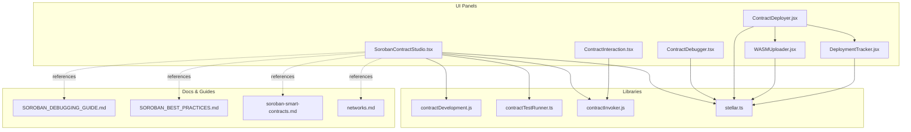
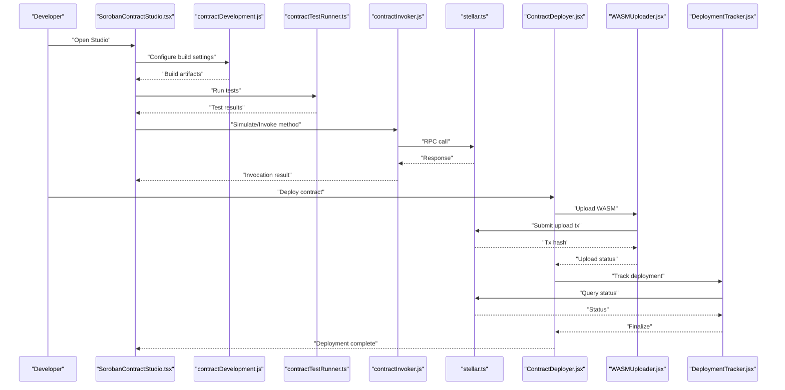
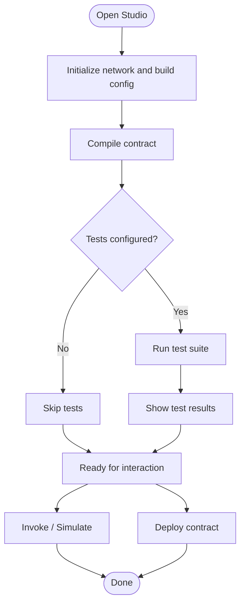
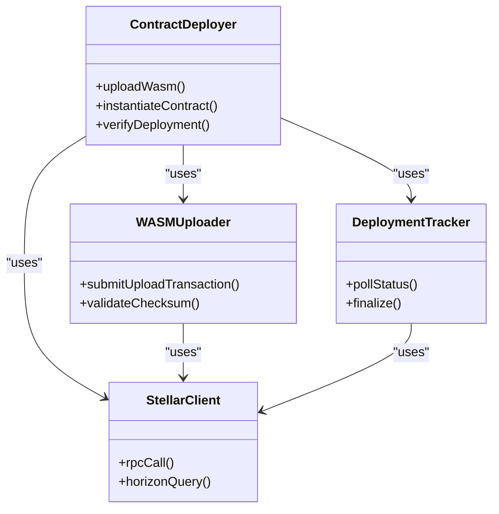
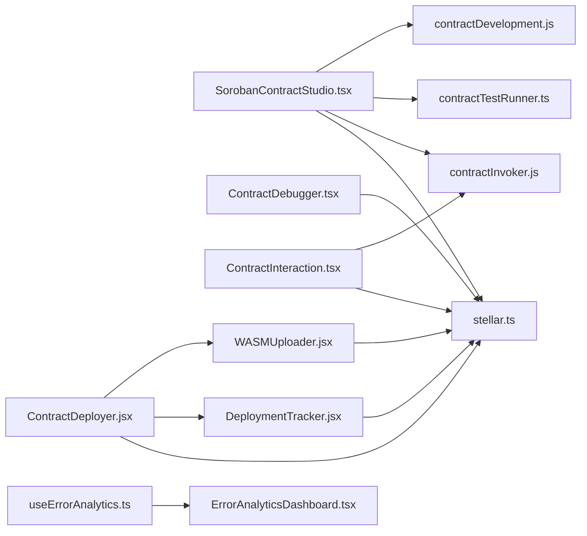

# Smart Contract Development (Soroban)

<cite>
**Referenced Files in This Document**
- [SorobanContractStudio.tsx](file://src/components/dashboard/SorobanContractStudio.tsx)
- [ContractDebugger.tsx](file://src/components/dashboard/ContractDebugger.tsx)
- [ContractInteraction.tsx](file://src/components/dashboard/ContractInteraction.tsx)
- [ContractDeployer.jsx](file://src/components/deployment/ContractDeployer.jsx)
- [WASMUploader.jsx](file://src/components/deployment/WASMUploader.jsx)
- [DeploymentTracker.jsx](file://src/components/deployment/DeploymentTracker.jsx)
- [contractDevelopment.js](file://src/lib/contractDevelopment.js)
- [contractTestRunner.ts](file://src/lib/contractTestRunner.ts)
- [contractInvoker.js](file://src/lib/contractInvoker.js)
- [stellar.ts](file://src/lib/stellar.ts)
- [useErrorAnalytics.ts](file://src/hooks/useErrorAnalytics.ts)
- [ErrorAnalyticsDashboard.tsx](file://src/components/errors/ErrorAnalyticsDashboard.tsx)
- [SOROBAN_DEBUGGING_GUIDE.md](file://docs/SOROBAN_DEBUGGING_GUIDE.md)
- [SOROBAN_BEST_PRACTICES.md](file://docs/SOROBAN_BEST_PRACTICES.md)
- [soroban-smart-contracts.md](file://docs-site/docs/guides/soroban-smart-contracts.md)
- [networks.md](file://docs-site/docs/getting-started/networks.md)
</cite>

## Table of Contents
1. [Introduction](#introduction)
2. [Project Structure](#project-structure)
3. [Core Components](#core-components)
4. [Architecture Overview](#architecture-overview)
5. [Detailed Component Analysis](#detailed-component-analysis)
6. [Dependency Analysis](#dependency-analysis)
7. [Performance Considerations](#performance-considerations)
8. [Troubleshooting Guide](#troubleshooting-guide)
9. [Conclusion](#conclusion)
10. [Appendices](#appendices)

## Introduction
This document explains the Soroban Smart Contract Development Studio integrated into the dashboard. It covers the Rust development environment, compilation pipeline, deployment automation, and debugging tools. It also documents the contract lifecycle from development to deployment, including testing framework integration and error analysis utilities. Configuration options for different network environments, compilation settings, and deployment strategies are provided, along with practical examples, common patterns, and troubleshooting techniques.

## Project Structure
The studio is implemented as a set of React components and library modules:
- UI panels for development, debugging, interaction, and deployment
- Library modules for contract orchestration, testing, invocation, and Stellar networking
- Documentation and guides for best practices and debugging workflows

**Diagram sources**
- [SorobanContractStudio.tsx](file://src/components/dashboard/SorobanContractStudio.tsx)
- [ContractDebugger.tsx](file://src/components/dashboard/ContractDebugger.tsx)
- [ContractInteraction.tsx](file://src/components/dashboard/ContractInteraction.tsx)
- [ContractDeployer.jsx](file://src/components/deployment/ContractDeployer.jsx)
- [WASMUploader.jsx](file://src/components/deployment/WASMUploader.jsx)
- [DeploymentTracker.jsx](file://src/components/deployment/DeploymentTracker.jsx)
- [contractDevelopment.js](file://src/lib/contractDevelopment.js)
- [contractTestRunner.ts](file://src/lib/contractTestRunner.ts)
- [contractInvoker.js](file://src/lib/contractInvoker.js)
- [stellar.ts](file://src/lib/stellar.ts)
- [SOROBAN_DEBUGGING_GUIDE.md](file://docs/SOROBAN_DEBUGGING_GUIDE.md)
- [SOROBAN_BEST_PRACTICES.md](file://docs/SOROBAN_BEST_PRACTICES.md)
- [soroban-smart-contracts.md](file://docs-site/docs/guides/soroban-smart-contracts.md)
- [networks.md](file://docs-site/docs/getting-started/networks.md)

**Section sources**
- [SorobanContractStudio.tsx](file://src/components/dashboard/SorobanContractStudio.tsx)
- [contractDevelopment.js](file://src/lib/contractDevelopment.js)
- [contractTestRunner.ts](file://src/lib/contractTestRunner.ts)
- [contractInvoker.js](file://src/lib/contractInvoker.js)
- [stellar.ts](file://src/lib/stellar.ts)
- [SOROBAN_DEBUGGING_GUIDE.md](file://docs/SOROBAN_DEBUGGING_GUIDE.md)
- [SOROBAN_BEST_PRACTICES.md](file://docs/SOROBAN_BEST_PRACTICES.md)
- [soroban-smart-contracts.md](file://docs-site/docs/guides/soroban-smart-contracts.md)
- [networks.md](file://docs-site/docs/getting-started/networks.md)

## Core Components
- SorobanContractStudio: Orchestrates the development workflow, integrates compilation, testing, and deployment flows, and exposes configuration for networks and build settings.
- ContractDebugger: Provides debugging capabilities such as simulation results, event inspection, and transaction tracing.
- ContractInteraction: Enables invoking contract methods, reading state, and simulating transactions before submission.
- ContractDeployer: Automates WASM upload, contract instantiation, and post-deployment verification.
- WASMUploader: Handles artifact upload and checksum validation.
- DeploymentTracker: Monitors deployment status and logs outcomes.
- Libraries:
  - contractDevelopment.js: Manages compilation steps, toolchain selection, and build artifacts.
  - contractTestRunner.ts: Executes unit/integration tests against local or remote networks.
  - contractInvoker.js: Builds and signs transactions, invokes contracts, and handles responses.
  - stellar.ts: Network configuration, RPC calls, and Horizon interactions.

**Section sources**
- [SorobanContractStudio.tsx](file://src/components/dashboard/SorobanContractStudio.tsx)
- [ContractDebugger.tsx](file://src/components/dashboard/ContractDebugger.tsx)
- [ContractInteraction.tsx](file://src/components/dashboard/ContractInteraction.tsx)
- [ContractDeployer.jsx](file://src/components/deployment/ContractDeployer.jsx)
- [WASMUploader.jsx](file://src/components/deployment/WASMUploader.jsx)
- [DeploymentTracker.jsx](file://src/components/deployment/DeploymentTracker.jsx)
- [contractDevelopment.js](file://src/lib/contractDevelopment.js)
- [contractTestRunner.ts](file://src/lib/contractTestRunner.ts)
- [contractInvoker.js](file://src/lib/contractInvoker.js)
- [stellar.ts](file://src/lib/stellar.ts)

## Architecture Overview
The studio follows a layered architecture:
- UI Layer: Panels for development, debugging, interaction, and deployment.
- Orchestration Layer: Library modules coordinating compilation, testing, invocation, and deployment.
- Network Layer: Stellar client abstraction for RPC/Horizon operations and network configuration.

**Diagram sources**
- [SorobanContractStudio.tsx](file://src/components/dashboard/SorobanContractStudio.tsx)
- [contractDevelopment.js](file://src/lib/contractDevelopment.js)
- [contractTestRunner.ts](file://src/lib/contractTestRunner.ts)
- [contractInvoker.js](file://src/lib/contractInvoker.js)
- [stellar.ts](file://src/lib/stellar.ts)
- [ContractDeployer.jsx](file://src/components/deployment/ContractDeployer.jsx)
- [WASMUploader.jsx](file://src/components/deployment/WASMUploader.jsx)
- [DeploymentTracker.jsx](file://src/components/deployment/DeploymentTracker.jsx)

## Detailed Component Analysis

### SorobanContractStudio
Responsibilities:
- Integrates compilation, testing, and deployment flows
- Exposes configuration for networks and build settings
- Coordinates user actions across panels

Key behaviors:
- Initializes network context and toolchain settings
- Triggers test runs and displays results
- Delegates deployment to ContractDeployer
- Aggregates errors and surfaces diagnostics

**Diagram sources**
- [SorobanContractStudio.tsx](file://src/components/dashboard/SorobanContractStudio.tsx)
- [contractDevelopment.js](file://src/lib/contractDevelopment.js)
- [contractTestRunner.ts](file://src/lib/contractTestRunner.ts)
- [contractInvoker.js](file://src/lib/contractInvoker.js)

**Section sources**
- [SorobanContractStudio.tsx](file://src/components/dashboard/SorobanContractStudio.tsx)
- [contractDevelopment.js](file://src/lib/contractDevelopment.js)
- [contractTestRunner.ts](file://src/lib/contractTestRunner.ts)
- [contractInvoker.js](file://src/lib/contractInvoker.js)

### ContractDebugger
Responsibilities:
- Displays simulation outputs, events, and transaction traces
- Helps analyze failures and performance metrics

Integration points:
- Reads data from invocation and deployment flows
- Uses network layer to fetch additional context when needed

**Section sources**
- [ContractDebugger.tsx](file://src/components/dashboard/ContractDebugger.tsx)
- [stellar.ts](file://src/lib/stellar.ts)

### ContractInteraction
Responsibilities:
- Builds and submits transactions to invoke contract methods
- Supports simulation before submission
- Presents readable results and errors

Integration points:
- Uses contractInvoker.js for transaction construction and signing
- Uses stellar.ts for RPC calls and response parsing

**Section sources**
- [ContractInteraction.tsx](file://src/components/dashboard/ContractInteraction.tsx)
- [contractInvoker.js](file://src/lib/contractInvoker.js)
- [stellar.ts](file://src/lib/stellar.ts)

### ContractDeployer
Responsibilities:
- Orchestrates WASM upload, contract creation, and verification
- Tracks deployment progress and finalization

Integration points:
- Calls WASMUploader for artifact upload
- Uses DeploymentTracker for status monitoring
- Communicates with stellar.ts for network operations

**Diagram sources**
- [ContractDeployer.jsx](file://src/components/deployment/ContractDeployer.jsx)
- [WASMUploader.jsx](file://src/components/deployment/WASMUploader.jsx)
- [DeploymentTracker.jsx](file://src/components/deployment/DeploymentTracker.jsx)
- [stellar.ts](file://src/lib/stellar.ts)

**Section sources**
- [ContractDeployer.jsx](file://src/components/deployment/ContractDeployer.jsx)
- [WASMUploader.jsx](file://src/components/deployment/WASMUploader.jsx)
- [DeploymentTracker.jsx](file://src/components/deployment/DeploymentTracker.jsx)
- [stellar.ts](file://src/lib/stellar.ts)

### Testing Framework Integration
Responsibilities:
- Executes unit and integration tests locally or against remote networks
- Reports pass/fail status and detailed diagnostics

Integration points:
- Uses contractTestRunner.ts for execution
- Leverages stellar.ts for network-specific test scenarios

**Section sources**
- [contractTestRunner.ts](file://src/lib/contractTestRunner.ts)
- [stellar.ts](file://src/lib/stellar.ts)

### Error Analysis Utilities
Responsibilities:
- Collects and analyzes errors from invocations and deployments
- Provides dashboards and recovery guidance

Integration points:
- useErrorAnalytics.ts aggregates error telemetry
- ErrorAnalyticsDashboard.tsx visualizes error trends and categories

**Section sources**
- [useErrorAnalytics.ts](file://src/hooks/useErrorAnalytics.ts)
- [ErrorAnalyticsDashboard.tsx](file://src/components/errors/ErrorAnalyticsDashboard.tsx)

## Dependency Analysis
High-level dependencies between components and libraries:

**Diagram sources**
- [SorobanContractStudio.tsx](file://src/components/dashboard/SorobanContractStudio.tsx)
- [contractDevelopment.js](file://src/lib/contractDevelopment.js)
- [contractTestRunner.ts](file://src/lib/contractTestRunner.ts)
- [contractInvoker.js](file://src/lib/contractInvoker.js)
- [stellar.ts](file://src/lib/stellar.ts)
- [ContractDebugger.tsx](file://src/components/dashboard/ContractDebugger.tsx)
- [ContractInteraction.tsx](file://src/components/dashboard/ContractInteraction.tsx)
- [ContractDeployer.jsx](file://src/components/deployment/ContractDeployer.jsx)
- [WASMUploader.jsx](file://src/components/deployment/WASMUploader.jsx)
- [DeploymentTracker.jsx](file://src/components/deployment/DeploymentTracker.jsx)
- [useErrorAnalytics.ts](file://src/hooks/useErrorAnalytics.ts)
- [ErrorAnalyticsDashboard.tsx](file://src/components/errors/ErrorAnalyticsDashboard.tsx)

**Section sources**
- [SorobanContractStudio.tsx](file://src/components/dashboard/SorobanContractStudio.tsx)
- [contractDevelopment.js](file://src/lib/contractDevelopment.js)
- [contractTestRunner.ts](file://src/lib/contractTestRunner.ts)
- [contractInvoker.js](file://src/lib/contractInvoker.js)
- [stellar.ts](file://src/lib/stellar.ts)
- [ContractDebugger.tsx](file://src/components/dashboard/ContractDebugger.tsx)
- [ContractInteraction.tsx](file://src/components/dashboard/ContractInteraction.tsx)
- [ContractDeployer.jsx](file://src/components/deployment/ContractDeployer.jsx)
- [WASMUploader.jsx](file://src/components/deployment/WASMUploader.jsx)
- [DeploymentTracker.jsx](file://src/components/deployment/DeploymentTracker.jsx)
- [useErrorAnalytics.ts](file://src/hooks/useErrorAnalytics.ts)
- [ErrorAnalyticsDashboard.tsx](file://src/components/errors/ErrorAnalyticsDashboard.tsx)

## Performance Considerations
- Prefer simulation over live invocation during development to reduce network latency and fees.
- Cache frequently accessed contract state and metadata to minimize repeated RPC calls.
- Use incremental builds and selective test runs to speed up iteration cycles.
- Monitor transaction size and compute limits; optimize contract logic accordingly.
- Batch related operations where possible to reduce round trips.

[No sources needed since this section provides general guidance]

## Troubleshooting Guide
Common issues and resolutions:
- Compilation failures: Verify toolchain versions and project configuration; consult best practices.
- Test flakiness: Ensure deterministic fixtures and stable network endpoints; isolate failing cases.
- Invocation errors: Review simulation output and error analytics; check authorization and account balances.
- Deployment stalls: Track deployment status and retry with backoff; validate WASM integrity.

References:
- Debugging guide and best practices provide step-by-step procedures and patterns.
- Network documentation clarifies environment differences and endpoint behavior.

**Section sources**
- [SOROBAN_DEBUGGING_GUIDE.md](file://docs/SOROBAN_DEBUGGING_GUIDE.md)
- [SOROBAN_BEST_PRACTICES.md](file://docs/SOROBAN_BEST_PRACTICES.md)
- [networks.md](file://docs-site/docs/getting-started/networks.md)

## Conclusion
The Soroban Smart Contract Development Studio integrates a cohesive development experience: building Rust contracts, running tests, simulating and invoking methods, deploying artifacts, and analyzing errors. The modular architecture separates UI concerns from orchestration and networking layers, enabling clear workflows and extensibility. By following the documented patterns and leveraging the provided tools, developers can efficiently iterate on contracts and deploy them reliably across networks.

[No sources needed since this section summarizes without analyzing specific files]

## Appendices

### Configuration Options
- Network environments: Configure endpoints, chain IDs, and fee settings per environment.
- Compilation settings: Select toolchain versions, optimization flags, and artifact paths.
- Deployment strategies: Choose upload-first then instantiate, or combined workflows; enable verification and post-deployment checks.

**Section sources**
- [soroban-smart-contracts.md](file://docs-site/docs/guides/soroban-smart-contracts.md)
- [networks.md](file://docs-site/docs/getting-started/networks.md)

### Practical Workflows
- Local development: Compile, run tests, simulate invocations, and debug using the debugger panel.
- Staging deployment: Upload WASM, instantiate contract, verify state, and monitor events.
- Production rollout: Use deployment tracker for status, validate checksums, and review error analytics.

**Section sources**
- [contractDevelopment.js](file://src/lib/contractDevelopment.js)
- [contractTestRunner.ts](file://src/lib/contractTestRunner.ts)
- [contractInvoker.js](file://src/lib/contractInvoker.js)
- [ContractDeployer.jsx](file://src/components/deployment/ContractDeployer.jsx)
- [WASMUploader.jsx](file://src/components/deployment/WASMUploader.jsx)
- [DeploymentTracker.jsx](file://src/components/deployment/DeploymentTracker.jsx)

### Common Patterns
- Simulation-first approach to validate logic and gas usage.
- Centralized error handling and analytics for consistent diagnostics.
- Modular test suites with environment-aware configurations.

**Section sources**
- [contractInvoker.js](file://src/lib/contractInvoker.js)
- [useErrorAnalytics.ts](file://src/hooks/useErrorAnalytics.ts)
- [contractTestRunner.ts](file://src/lib/contractTestRunner.ts)