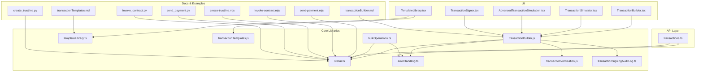
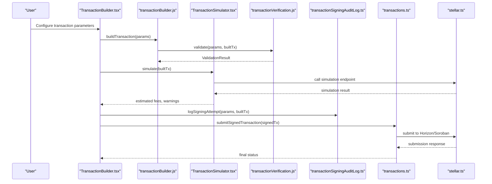
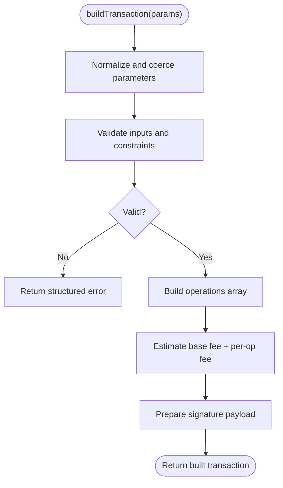
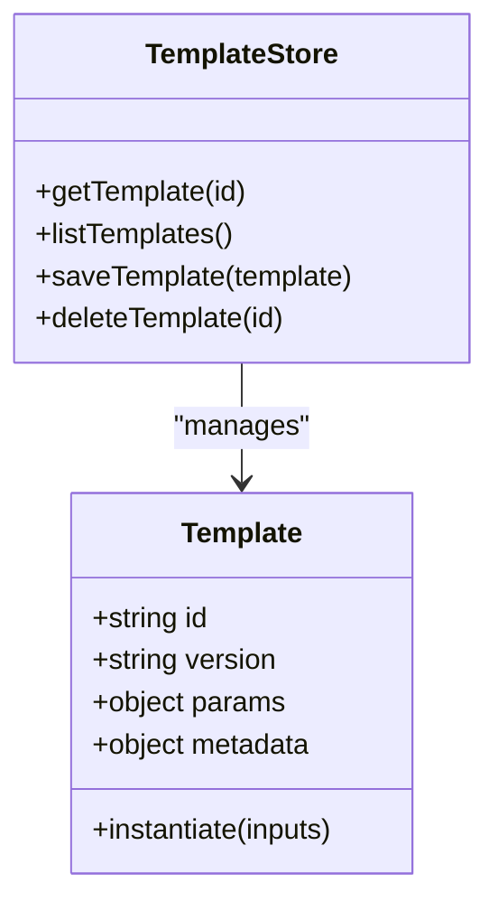
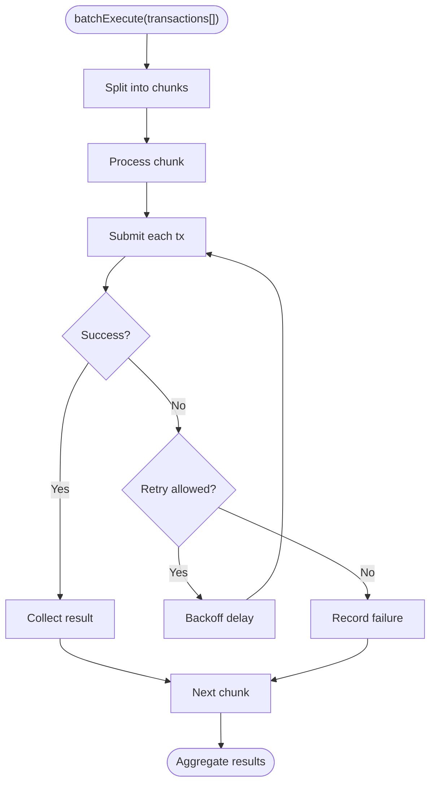
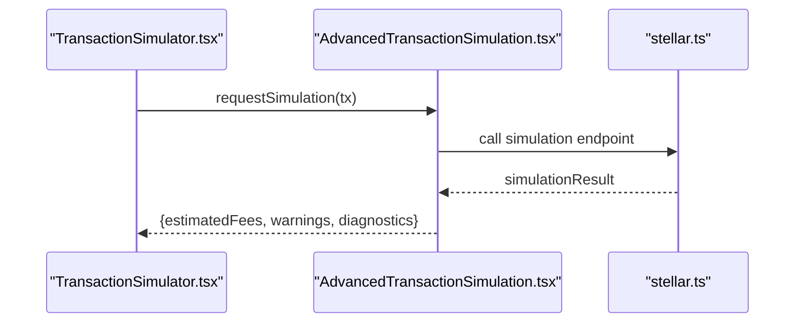
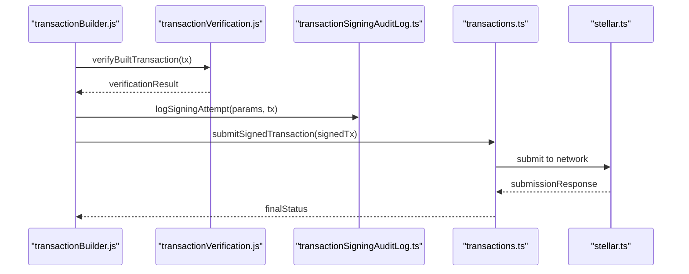
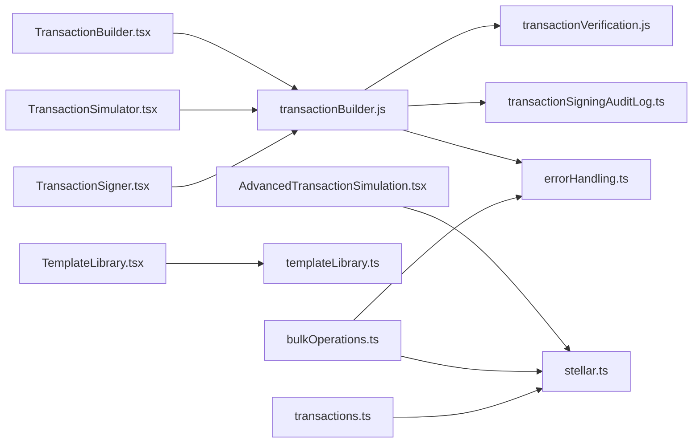

# Transaction Management

<cite>
**Referenced Files in This Document**
- [transactionBuilder.js](file://src/lib/transactionBuilder.js)
- [templateLibrary.ts](file://src/lib/templateLibrary.ts)
- [transactionTemplates.js](file://src/lib/transactionTemplates.js)
- [bulkOperations.ts](file://src/lib/bulkOperations.ts)
- [stellar.ts](file://src/lib/stellar.ts)
- [errorHandling.ts](file://src/lib/errorHandling.ts)
- [transactionVerification.js](file://src/lib/transactionVerification.js)
- [transactionSigningAuditLog.ts](file://src/lib/transactionSigningAuditLog.ts)
- [useTransactionSigningAudit.ts](file://src/hooks/useTransactionSigningAudit.ts)
- [AdvancedTransactionSimulation.tsx](file://src/components/dashboard/AdvancedTransactionSimulation.tsx)
- [TransactionSimulator.tsx](file://src/components/dashboard/TransactionSimulator.tsx)
- [TransactionSigner.tsx](file://src/components/dashboard/TransactionSigner.tsx)
- [TemplateLibrary.tsx](file://src/components/dashboard/TemplateLibrary.tsx)
- [TransactionBuilder.tsx](file://src/components/dashboard/TransactionBuilder.tsx)
- [transactions.ts](file://src/api/transactions.ts)
- [send-payment.mjs](file://docs/api/examples/js/send-payment.mjs)
- [invoke-contract.mjs](file://docs/api/examples/js/invoke-contract.mjs)
- [create-trustline.mjs](file://docs/api/examples/js/create-trustline.mjs)
- [send-payment.py](file://docs/api/examples/python/send_payment.py)
- [invoke_contract.py](file://docs/api/examples/python/invoke_contract.py)
- [create_trustline.py](file://docs/api/examples/python/create_trustline.py)
- [transactionBuilder.md](file://docs/transactionBuilder.md)
- [transactionTemplates.md](file://docs/transactionTemplates.md)
</cite>

## Table of Contents
1. [Introduction](#introduction)
2. [Project Structure](#project-structure)
3. [Core Components](#core-components)
4. [Architecture Overview](#architecture-overview)
5. [Detailed Component Analysis](#detailed-component-analysis)
6. [Dependency Analysis](#dependency-analysis)
7. [Performance Considerations](#performance-considerations)
8. [Troubleshooting Guide](#troubleshooting-guide)
9. [Conclusion](#conclusion)
10. [Appendices](#appendices)

## Introduction
This document explains the Transaction Management system with a focus on:
- Transaction builder interface and configuration options
- Template library for reusable transaction patterns
- Batch processing capabilities for high-throughput operations
- Simulation features to validate transactions before submission
- Implementation details for construction, validation, signing, and submission workflows
- Error handling strategies and security considerations
- Practical examples for payments, asset transfers, and contract interactions
- Audit logging and recovery mechanisms

The goal is to provide both conceptual clarity and code-level traceability for developers integrating or extending transaction flows.

## Project Structure
Transaction management spans UI components, core libraries, API integration, documentation, and examples:
- Core libraries implement transaction building, templates, simulation, verification, auditing, and error handling
- UI components expose interactive builders, simulators, signers, and template browsing
- API layer integrates with Stellar services (Horizon/Soroban) for submission and simulation
- Documentation and examples demonstrate common patterns across JavaScript and Python

**Diagram sources**
- [TransactionBuilder.tsx](file://src/components/dashboard/TransactionBuilder.tsx)
- [TransactionSimulator.tsx](file://src/components/dashboard/TransactionSimulator.tsx)
- [AdvancedTransactionSimulation.tsx](file://src/components/dashboard/AdvancedTransactionSimulation.tsx)
- [TransactionSigner.tsx](file://src/components/dashboard/TransactionSigner.tsx)
- [TemplateLibrary.tsx](file://src/components/dashboard/TemplateLibrary.tsx)
- [transactionBuilder.js](file://src/lib/transactionBuilder.js)
- [templateLibrary.ts](file://src/lib/templateLibrary.ts)
- [transactionTemplates.js](file://src/lib/transactionTemplates.js)
- [bulkOperations.ts](file://src/lib/bulkOperations.ts)
- [stellar.ts](file://src/lib/stellar.ts)
- [errorHandling.ts](file://src/lib/errorHandling.ts)
- [transactionVerification.js](file://src/lib/transactionVerification.js)
- [transactionSigningAuditLog.ts](file://src/lib/transactionSigningAuditLog.ts)
- [transactions.ts](file://src/api/transactions.ts)
- [transactionBuilder.md](file://docs/transactionBuilder.md)
- [transactionTemplates.md](file://docs/transactionTemplates.md)
- [send-payment.mjs](file://docs/api/examples/js/send-payment.mjs)
- [invoke-contract.mjs](file://docs/api/examples/js/invoke-contract.mjs)
- [create-trustline.mjs](file://docs/api/examples/js/create-trustline.mjs)
- [send_payment.py](file://docs/api/examples/python/send_payment.py)
- [invoke_contract.py](file://docs/api/examples/python/invoke_contract.py)
- [create_trustline.py](file://docs/api/examples/python/create_trustline.py)

**Section sources**
- [transactionBuilder.js](file://src/lib/transactionBuilder.js)
- [templateLibrary.ts](file://src/lib/templateLibrary.ts)
- [transactionTemplates.js](file://src/lib/transactionTemplates.js)
- [bulkOperations.ts](file://src/lib/bulkOperations.ts)
- [stellar.ts](file://src/lib/stellar.ts)
- [errorHandling.ts](file://src/lib/errorHandling.ts)
- [transactionVerification.js](file://src/lib/transactionVerification.js)
- [transactionSigningAuditLog.ts](file://src/lib/transactionSigningAuditLog.ts)
- [AdvancedTransactionSimulation.tsx](file://src/components/dashboard/AdvancedTransactionSimulation.tsx)
- [TransactionSimulator.tsx](file://src/components/dashboard/TransactionSimulator.tsx)
- [TransactionSigner.tsx](file://src/components/dashboard/TransactionSigner.tsx)
- [TemplateLibrary.tsx](file://src/components/dashboard/TemplateLibrary.tsx)
- [TransactionBuilder.tsx](file://src/components/dashboard/TransactionBuilder.tsx)
- [transactions.ts](file://src/api/transactions.ts)
- [transactionBuilder.md](file://docs/transactionBuilder.md)
- [transactionTemplates.md](file://docs/transactionTemplates.md)
- [send-payment.mjs](file://docs/api/examples/js/send-payment.mjs)
- [invoke-contract.mjs](file://docs/api/examples/js/invoke-contract.mjs)
- [create-trustline.mjs](file://docs/api/examples/js/create-trustline.mjs)
- [send-payment.py](file://docs/api/examples/python/send_payment.py)
- [invoke-contract.py](file://docs/api/examples/python/invoke_contract.py)
- [create-trustline.py](file://docs/api/examples/python/create_trustline.py)

## Core Components
- Transaction Builder: Provides a fluent interface to construct Stellar transactions, including payments, trustlines, Soroban invocations, fee bumps, and multi-operation batches. It enforces validation rules, computes fees, and prepares signed payloads.
- Template Library: Stores and retrieves reusable transaction templates, parameterized by user inputs. Supports versioning, metadata, and environment-specific overrides.
- Batch Processing: Executes multiple transactions efficiently with retry/backoff, concurrency control, and partial failure reporting.
- Simulation: Pre-validates transactions against network state using Horizon/Soroban simulation endpoints to estimate fees, resource usage, and potential failures.
- Verification: Performs client-side checks (signatures, operation validity, account constraints) prior to submission.
- Signing and Submission: Integrates with secure signing contexts and submits via the API layer to Horizon/Soroban.
- Audit Logging: Records signing events, parameters, and outcomes for compliance and debugging.
- Error Handling: Centralizes error classification, user-friendly messages, and recovery suggestions.

**Section sources**
- [transactionBuilder.js](file://src/lib/transactionBuilder.js)
- [templateLibrary.ts](file://src/lib/templateLibrary.ts)
- [transactionTemplates.js](file://src/lib/transactionTemplates.js)
- [bulkOperations.ts](file://src/lib/bulkOperations.ts)
- [stellar.ts](file://src/lib/stellar.ts)
- [errorHandling.ts](file://src/lib/errorHandling.ts)
- [transactionVerification.js](file://src/lib/transactionVerification.js)
- [transactionSigningAuditLog.ts](file://src/lib/transactionSigningAuditLog.ts)

## Architecture Overview
The system follows a layered architecture:
- UI Layer: Interactive components for building, simulating, signing, and managing templates
- Core Layer: Transaction construction, validation, simulation, batching, and audit
- Integration Layer: Network calls to Horizon/Soroban via stellar.ts and transactions.ts
- Documentation and Examples: Guides and sample scripts for common patterns

**Diagram sources**
- [TransactionBuilder.tsx](file://src/components/dashboard/TransactionBuilder.tsx)
- [transactionBuilder.js](file://src/lib/transactionBuilder.js)
- [TransactionSimulator.tsx](file://src/components/dashboard/TransactionSimulator.tsx)
- [AdvancedTransactionSimulation.tsx](file://src/components/dashboard/AdvancedTransactionSimulation.tsx)
- [transactionVerification.js](file://src/lib/transactionVerification.js)
- [transactionSigningAuditLog.ts](file://src/lib/transactionSigningAuditLog.ts)
- [transactions.ts](file://src/api/transactions.ts)
- [stellar.ts](file://src/lib/stellar.ts)

## Detailed Component Analysis

### Transaction Builder Interface
Responsibilities:
- Construct operations (payments, trustlines, Soroban invokes)
- Enforce validation rules and compute fees
- Prepare signed payloads for submission
- Support fee bump transactions and multi-operation batches

Key behaviors:
- Parameter normalization and type coercion
- Fee estimation based on operation count and complexity
- Signature preparation with signer context
- Error propagation with structured messages

**Diagram sources**
- [transactionBuilder.js](file://src/lib/transactionBuilder.js)
- [transactionVerification.js](file://src/lib/transactionVerification.js)

**Section sources**
- [transactionBuilder.js](file://src/lib/transactionBuilder.js)
- [transactionVerification.js](file://src/lib/transactionVerification.js)

### Template Library
Responsibilities:
- Store and retrieve transaction templates
- Apply environment-specific overrides
- Version templates and track metadata
- Provide parameterized instantiation for reuse

Common use cases:
- Payment templates with default memo formats
- Trustline setup templates with asset identifiers
- Contract invocation templates with ABI references

**Diagram sources**
- [templateLibrary.ts](file://src/lib/templateLibrary.ts)
- [transactionTemplates.js](file://src/lib/transactionTemplates.js)

**Section sources**
- [templateLibrary.ts](file://src/lib/templateLibrary.ts)
- [transactionTemplates.js](file://src/lib/transactionTemplates.js)
- [TemplateLibrary.tsx](file://src/components/dashboard/TemplateLibrary.tsx)

### Batch Processing Capabilities
Responsibilities:
- Execute multiple transactions concurrently with controlled throughput
- Implement retry/backoff policies for transient errors
- Aggregate results and report partial failures
- Maintain ordering when required by business logic

**Diagram sources**
- [bulkOperations.ts](file://src/lib/bulkOperations.ts)
- [errorHandling.ts](file://src/lib/errorHandling.ts)

**Section sources**
- [bulkOperations.ts](file://src/lib/bulkOperations.ts)
- [errorHandling.ts](file://src/lib/errorHandling.ts)

### Simulation Features
Responsibilities:
- Pre-validate transactions against network state
- Estimate fees, resource usage, and potential failures
- Provide detailed diagnostics for Soroban contracts

Integration points:
- Uses simulation endpoints from Horizon/Soroban
- Returns warnings and suggested adjustments

**Diagram sources**
- [TransactionSimulator.tsx](file://src/components/dashboard/TransactionSimulator.tsx)
- [AdvancedTransactionSimulation.tsx](file://src/components/dashboard/AdvancedTransactionSimulation.tsx)
- [stellar.ts](file://src/lib/stellar.ts)

**Section sources**
- [TransactionSimulator.tsx](file://src/components/dashboard/TransactionSimulator.tsx)
- [AdvancedTransactionSimulation.tsx](file://src/components/dashboard/AdvancedTransactionSimulation.tsx)
- [stellar.ts](file://src/lib/stellar.ts)

### Validation, Signing, and Submission Workflows
Validation:
- Client-side checks ensure signatures are valid and operations comply with account constraints
- Structural validation prevents malformed transactions

Signing:
- Securely prepares payloads for signing within trusted contexts
- Logs signing attempts for auditability

Submission:
- Submits signed transactions via API layer to Horizon/Soroban
- Handles responses and propagates errors

**Diagram sources**
- [transactionBuilder.js](file://src/lib/transactionBuilder.js)
- [transactionVerification.js](file://src/lib/transactionVerification.js)
- [transactionSigningAuditLog.ts](file://src/lib/transactionSigningAuditLog.ts)
- [transactions.ts](file://src/api/transactions.ts)
- [stellar.ts](file://src/lib/stellar.ts)

**Section sources**
- [transactionBuilder.js](file://src/lib/transactionBuilder.js)
- [transactionVerification.js](file://src/lib/transactionVerification.js)
- [transactionSigningAuditLog.ts](file://src/lib/transactionSigningAuditLog.ts)
- [transactions.ts](file://src/api/transactions.ts)
- [stellar.ts](file://src/lib/stellar.ts)

### Configuration Options for Different Transaction Types
- Payments: recipient address, amount, asset identifier, memo fields
- Asset Transfers: source/destination accounts, asset details, trustline flags
- Contract Interactions: contract ID, function name, arguments, resource limits
- Fee Bumps: original transaction hash, max fee multiplier
- Multi-Operation Batches: ordered list of operations with shared envelope settings

Configuration is validated and normalized by the builder and templates.

**Section sources**
- [transactionBuilder.js](file://src/lib/transactionBuilder.js)
- [templateLibrary.ts](file://src/lib/templateLibrary.ts)
- [transactionTemplates.js](file://src/lib/transactionTemplates.js)

### Error Handling Strategies
- Classification: network errors, validation errors, simulation failures, submission rejections
- User Feedback: actionable messages and suggested next steps
- Recovery: retries with backoff, fallbacks to alternative networks or endpoints
- Diagnostics: structured logs and error context preservation

**Section sources**
- [errorHandling.ts](file://src/lib/errorHandling.ts)
- [stellar.ts](file://src/lib/stellar.ts)

### Security Considerations
- Private keys never leave secure signing contexts
- Input sanitization and strict schema validation
- Rate limiting and throttling for submission endpoints
- Audit trails for all signing and submission actions
- Least privilege access for template editing and deployment

**Section sources**
- [transactionSigningAuditLog.ts](file://src/lib/transactionSigningAuditLog.ts)
- [useTransactionSigningAudit.ts](file://src/hooks/useTransactionSigningAudit.ts)
- [errorHandling.ts](file://src/lib/errorHandling.ts)

### Practical Examples
Common transaction patterns:
- Payments: send native or issued assets with optional memos
- Asset Transfers: create trustlines and transfer issued assets
- Contract Interactions: invoke Soroban functions with typed arguments

Reference example files:
- JavaScript examples: [send-payment.mjs](file://docs/api/examples/js/send-payment.mjs), [invoke-contract.mjs](file://docs/api/examples/js/invoke-contract.mjs), [create-trustline.mjs](file://docs/api/examples/js/create-trustline.mjs)
- Python examples: [send_payment.py](file://docs/api/examples/python/send_payment.py), [invoke_contract.py](file://docs/api/examples/python/invoke_contract.py), [create_trustline.py](file://docs/api/examples/python/create_trustline.py)

**Section sources**
- [send-payment.mjs](file://docs/api/examples/js/send-payment.mjs)
- [invoke-contract.mjs](file://docs/api/examples/js/invoke-contract.mjs)
- [create-trustline.mjs](file://docs/api/examples/js/create-trustline.mjs)
- [send-payment.py](file://docs/api/examples/python/send_payment.py)
- [invoke-contract.py](file://docs/api/examples/python/invoke_contract.py)
- [create-trustline.py](file://docs/api/examples/python/create_trustline.py)

### Transaction Templates
- Reusable definitions for frequent operations
- Parameterized instantiation reduces manual configuration
- Environment-aware overrides for testnet/mainnet differences
- Versioned storage supports rollback and migration

**Section sources**
- [templateLibrary.ts](file://src/lib/templateLibrary.ts)
- [transactionTemplates.js](file://src/lib/transactionTemplates.js)
- [TemplateLibrary.tsx](file://src/components/dashboard/TemplateLibrary.tsx)
- [transactionTemplates.md](file://docs/transactionTemplates.md)

### Audit Logging
- Captures signing attempts, parameters, and outcomes
- Provides hooks for UI integration and analytics
- Ensures tamper-evident records for compliance

**Section sources**
- [transactionSigningAuditLog.ts](file://src/lib/transactionSigningAuditLog.ts)
- [useTransactionSigningAudit.ts](file://src/hooks/useTransactionSigningAudit.ts)

### Recovery Mechanisms
- Retry with exponential backoff for transient failures
- Fallback endpoints and network selection
- Partial success aggregation for batch operations
- Guidance for users to adjust fees or parameters based on simulation results

**Section sources**
- [bulkOperations.ts](file://src/lib/bulkOperations.ts)
- [errorHandling.ts](file://src/lib/errorHandling.ts)
- [AdvancedTransactionSimulation.tsx](file://src/components/dashboard/AdvancedTransactionSimulation.tsx)

## Dependency Analysis
Core dependencies and relationships:
- UI components depend on builder, simulator, signer, and template library
- Builder depends on verification, error handling, and audit logging
- Batch processing depends on error handling and network integration
- API layer depends on stellar.ts for network communication

**Diagram sources**
- [TransactionBuilder.tsx](file://src/components/dashboard/TransactionBuilder.tsx)
- [TransactionSimulator.tsx](file://src/components/dashboard/TransactionSimulator.tsx)
- [AdvancedTransactionSimulation.tsx](file://src/components/dashboard/AdvancedTransactionSimulation.tsx)
- [TransactionSigner.tsx](file://src/components/dashboard/TransactionSigner.tsx)
- [TemplateLibrary.tsx](file://src/components/dashboard/TemplateLibrary.tsx)
- [transactionBuilder.js](file://src/lib/transactionBuilder.js)
- [templateLibrary.ts](file://src/lib/templateLibrary.ts)
- [transactionVerification.js](file://src/lib/transactionVerification.js)
- [transactionSigningAuditLog.ts](file://src/lib/transactionSigningAuditLog.ts)
- [bulkOperations.ts](file://src/lib/bulkOperations.ts)
- [transactions.ts](file://src/api/transactions.ts)
- [stellar.ts](file://src/lib/stellar.ts)
- [errorHandling.ts](file://src/lib/errorHandling.ts)

**Section sources**
- [transactionBuilder.js](file://src/lib/transactionBuilder.js)
- [templateLibrary.ts](file://src/lib/templateLibrary.ts)
- [transactionTemplates.js](file://src/lib/transactionTemplates.js)
- [bulkOperations.ts](file://src/lib/bulkOperations.ts)
- [stellar.ts](file://src/lib/stellar.ts)
- [errorHandling.ts](file://src/lib/errorHandling.ts)
- [transactionVerification.js](file://src/lib/transactionVerification.js)
- [transactionSigningAuditLog.ts](file://src/lib/transactionSigningAuditLog.ts)
- [AdvancedTransactionSimulation.tsx](file://src/components/dashboard/AdvancedTransactionSimulation.tsx)
- [TransactionSimulator.tsx](file://src/components/dashboard/TransactionSimulator.tsx)
- [TransactionSigner.tsx](file://src/components/dashboard/TransactionSigner.tsx)
- [TemplateLibrary.tsx](file://src/components/dashboard/TemplateLibrary.tsx)
- [TransactionBuilder.tsx](file://src/components/dashboard/TransactionBuilder.tsx)
- [transactions.ts](file://src/api/transactions.ts)

## Performance Considerations
- Minimize network round trips by batching where possible
- Use simulation to avoid costly failed submissions
- Cache template definitions and frequently used parameters
- Limit concurrency in batch operations to respect rate limits
- Optimize fee estimation to reduce unnecessary retries

[No sources needed since this section provides general guidance]

## Troubleshooting Guide
Common issues and resolutions:
- Insufficient funds: adjust amount or source account; check balance via simulation
- Rate limit exceeded: back off and retry; throttle batch size
- Invalid signature: verify signer context and key permissions
- Contract invocation failure: review Soroban diagnostics and resource limits
- Network connectivity: switch endpoints or networks; verify Horizon/Soroban availability

Diagnostic aids:
- Review audit logs for signing attempts and outcomes
- Inspect simulation warnings and suggested adjustments
- Use structured error messages to pinpoint root causes

**Section sources**
- [errorHandling.ts](file://src/lib/errorHandling.ts)
- [transactionSigningAuditLog.ts](file://src/lib/transactionSigningAuditLog.ts)
- [AdvancedTransactionSimulation.tsx](file://src/components/dashboard/AdvancedTransactionSimulation.tsx)

## Conclusion
The Transaction Management system provides a robust foundation for constructing, validating, simulating, signing, and submitting Stellar transactions. Its modular design separates concerns across UI, core libraries, and integration layers, enabling extensibility and maintainability. With comprehensive templates, batch processing, simulation, audit logging, and strong error handling, it supports reliable and secure transaction workflows for payments, asset transfers, and smart contract interactions.

[No sources needed since this section summarizes without analyzing specific files]

## Appendices
- Reference documentation:
  - [transactionBuilder.md](file://docs/transactionBuilder.md)
  - [transactionTemplates.md](file://docs/transactionTemplates.md)
- Example scripts:
  - JavaScript: [send-payment.mjs](file://docs/api/examples/js/send-payment.mjs), [invoke-contract.mjs](file://docs/api/examples/js/invoke-contract.mjs), [create-trustline.mjs](file://docs/api/examples/js/create-trustline.mjs)
  - Python: [send_payment.py](file://docs/api/examples/python/send_payment.py), [invoke_contract.py](file://docs/api/examples/python/invoke_contract.py), [create_trustline.py](file://docs/api/examples/python/create_trustline.py)

**Section sources**
- [transactionBuilder.md](file://docs/transactionBuilder.md)
- [transactionTemplates.md](file://docs/transactionTemplates.md)
- [send-payment.mjs](file://docs/api/examples/js/send-payment.mjs)
- [invoke-contract.mjs](file://docs/api/examples/js/invoke-contract.mjs)
- [create-trustline.mjs](file://docs/api/examples/js/create-trustline.mjs)
- [send-payment.py](file://docs/api/examples/python/send_payment.py)
- [invoke-contract.py](file://docs/api/examples/python/invoke_contract.py)
- [create-trustline.py](file://docs/api/examples/python/create_trustline.py)