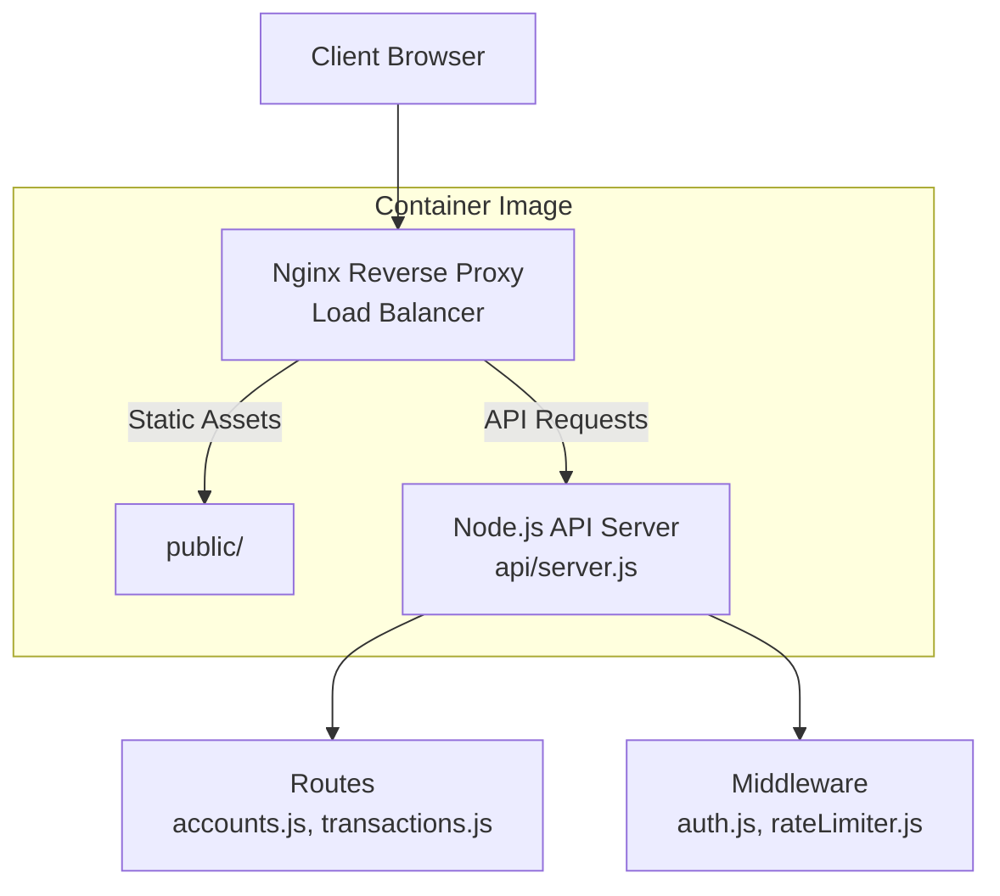
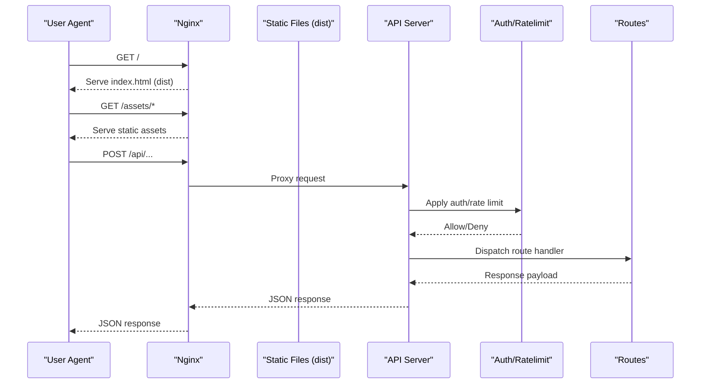
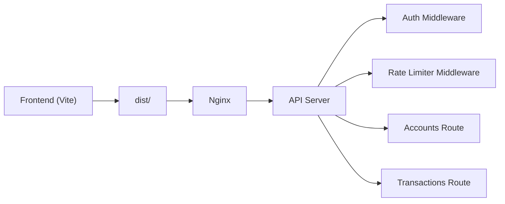

# Deployment & DevOps

<cite>
**Referenced Files in This Document**
- [Dockerfile](file://Dockerfile)
- [docker-compose.yml](file://docker-compose.yml)
- [nginx.conf](file://nginx.conf)
- [package.json](file://package.json)
- [vite.config.js](file://vite.config.js)
- [api/server.js](file://api/server.js)
- [api/middleware/auth.js](file://api/middleware/auth.js)
- [api/middleware/rateLimiter.js](file://api/middleware/rateLimiter.js)
- [api/routes/accounts.js](file://api/routes/accounts.js)
- [api/routes/transactions.js](file://api/routes/transactions.js)
- [.github/workflows/validate-workflows.sh](file://scripts/validate-workflows.sh)
- [lighthouserc.cjs](file://lighthouserc.cjs)
- [playwright.config.ts](file://playwright.config.ts)
- [jest.config.js](file://jest.config.js)
- [vitest.config.js](file://vitest.config.js)
- [stryker.conf.json](file://stryker.conf.json)
- [src/lib/config.js](file://src/lib/config.js)
- [src/lib/performanceMonitoring.js](file://src/lib/performanceMonitoring.js)
- [src/utils/logger.ts](file://src/utils/logger.ts)
- [src/utils/monitoring.ts](file://src/utils/monitoring.ts)
- [src/hooks/useRateLimiter.ts](file://src/hooks/useRateLimiter.ts)
- [src/lib/cacheManager.ts](file://src/lib/cacheManager.ts)
- [src/lib/healthCheck.ts](file://src/lib/healthCheck.ts)
</cite>

## Table of Contents
1. [Introduction](#introduction)
2. [Project Structure](#project-structure)
3. [Core Components](#core-components)
4. [Architecture Overview](#architecture-overview)
5. [Detailed Component Analysis](#detailed-component-analysis)
6. [Dependency Analysis](#dependency-analysis)
7. [Performance Considerations](#performance-considerations)
8. [Troubleshooting Guide](#troubleshooting-guide)
9. [Conclusion](#conclusion)
10. [Appendices](#appendices)

## Introduction
This document provides comprehensive deployment and DevOps guidance for the project, covering development environment setup, build and packaging, Docker containerization, CI/CD configuration, production deployment strategies, environment configuration management, monitoring, scaling with Nginx load balancing, performance optimization, backup and disaster recovery, logging and observability, maintenance procedures, and troubleshooting.

The application is a modern web dashboard with:
- A Node.js API server under api/
- A Vite-based frontend under src/
- Containerization via Docker and docker-compose
- Nginx as reverse proxy/load balancer
- Testing and quality tooling (Jest, Vitest, Playwright, Lighthouse, Stryker)

## Project Structure
Key directories and files relevant to DevOps:
- api/: Node.js API server and middleware
- src/: Frontend source code built by Vite
- public/: Static assets served by Nginx
- scripts/: Utility scripts including workflow validation
- .github/workflows/: CI pipeline definitions
- Dockerfile: Container image definition
- docker-compose.yml: Local and staging orchestration
- nginx.conf: Reverse proxy and load balancing configuration
- package.json: Build and script commands
- vite.config.js: Frontend build configuration
- lighthouserc.cjs: Performance audit configuration
- playwright.config.ts: E2E test configuration
- jest.config.js / vitest.config.js: Unit/integration test configuration
- stryker.conf.json: Mutation testing configuration

**Diagram sources**
- [nginx.conf](file://nginx.conf)
- [api/server.js](file://api/server.js)
- [api/middleware/auth.js](file://api/middleware/auth.js)
- [api/middleware/rateLimiter.js](file://api/middleware/rateLimiter.js)
- [api/routes/accounts.js](file://api/routes/accounts.js)
- [api/routes/transactions.js](file://api/routes/transactions.js)
- [Dockerfile](file://Dockerfile)

**Section sources**
- [Dockerfile](file://Dockerfile)
- [docker-compose.yml](file://docker-compose.yml)
- [nginx.conf](file://nginx.conf)
- [package.json](file://package.json)
- [vite.config.js](file://vite.config.js)
- [api/server.js](file://api/server.js)

## Core Components
- API Server: Express-like Node.js server handling routes and middleware.
- Middleware: Authentication and rate limiting.
- Routes: Account and transaction endpoints.
- Frontend: Vite-built SPA served statically by Nginx.
- Containerization: Multi-stage Docker build producing a minimal runtime image.
- Orchestration: docker-compose for local/staging environments.
- Reverse Proxy: Nginx for TLS termination, static asset serving, and API routing.

**Section sources**
- [api/server.js](file://api/server.js)
- [api/middleware/auth.js](file://api/middleware/auth.js)
- [api/middleware/rateLimiter.js](file://api/middleware/rateLimiter.js)
- [api/routes/accounts.js](file://api/routes/accounts.js)
- [api/routes/transactions.js](file://api/routes/transactions.js)
- [Dockerfile](file://Dockerfile)
- [docker-compose.yml](file://docker-compose.yml)
- [nginx.conf](file://nginx.conf)

## Architecture Overview
The production architecture uses Nginx as the entry point, serving static assets from the dist directory and proxying API requests to the Node.js backend. The entire stack runs inside containers orchestrated by docker-compose.

**Diagram sources**
- [nginx.conf](file://nginx.conf)
- [api/server.js](file://api/server.js)
- [api/middleware/auth.js](file://api/middleware/auth.js)
- [api/middleware/rateLimiter.js](file://api/middleware/rateLimiter.js)
- [api/routes/accounts.js](file://api/routes/accounts.js)
- [api/routes/transactions.js](file://api/routes/transactions.js)

## Detailed Component Analysis

### Development Environment Setup
- Install dependencies using the project’s package manager.
- Run the API server locally and start the Vite dev server for hot reloading.
- Use environment variables for network endpoints and feature flags.

Recommended steps:
- Install dependencies: use the install command defined in package.json.
- Start API server: run the API server script defined in package.json.
- Start frontend dev server: run the dev script defined in package.json.
- Configure environment variables for API base URL and other settings.

**Section sources**
- [package.json](file://package.json)
- [vite.config.js](file://vite.config.js)
- [src/lib/config.js](file://src/lib/config.js)

### Build and Packaging
- Frontend build: Vite produces optimized static assets into dist/.
- Backend packaging: Node.js dependencies are installed and bundled into the container image.
- Asset serving: Nginx serves the dist/ directory directly for performance.

Build process highlights:
- Frontend build step configured in vite.config.js.
- Production build script in package.json.
- Static assets placed under dist/ and served by Nginx.

**Section sources**
- [vite.config.js](file://vite.config.js)
- [package.json](file://package.json)
- [nginx.conf](file://nginx.conf)

### Docker Containerization
- Multi-stage build:
  - Stage 1: Install dependencies and build the frontend.
  - Stage 2: Minimal runtime image with Node.js and Nginx.
- Copy built artifacts into the final image.
- Expose ports for HTTP/HTTPS and configure health checks.

Containerization best practices:
- Use non-root user in the runtime stage.
- Pin base images and dependency versions.
- Minimize image size by copying only necessary artifacts.

**Section sources**
- [Dockerfile](file://Dockerfile)

### Docker Compose Orchestration
- Define services for API server and Nginx.
- Map environment variables for each service.
- Configure volumes for logs and persistent data if needed.
- Set restart policies and resource limits.

Compose usage:
- Start all services: docker compose up.
- Stop services: docker compose down.
- View logs: docker compose logs -f <service>.

**Section sources**
- [docker-compose.yml](file://docker-compose.yml)

### CI/CD Pipeline Configuration
- Workflow validation script ensures GitHub Actions workflows are valid.
- Lighthouse CI config defines performance budgets and audits.
- Playwright config sets up E2E tests across browsers.
- Jest/Vitest configs define unit/integration test suites.
- Stryker config enables mutation testing for robustness.

CI tasks typically include:
- Dependency installation and cache warming.
- Linting and type checks.
- Unit and integration tests (Jest/Vitest).
- E2E tests (Playwright).
- Lighthouse performance audits.
- Build verification.
- Artifact upload (optional).

**Section sources**
- [scripts/validate-workflows.sh](file://scripts/validate-workflows.sh)
- [lighthouserc.cjs](file://lighthouserc.cjs)
- [playwright.config.ts](file://playwright.config.ts)
- [jest.config.js](file://jest.config.js)
- [vitest.config.js](file://vitest.config.js)
- [stryker.conf.json](file://stryker.conf.json)

### Production Deployment Strategies
- Blue/Green deployments:
  - Maintain two identical production environments.
  - Switch traffic between them using Nginx upstreams or DNS.
- Rolling updates:
  - Update one container at a time while maintaining availability.
- Health checks:
  - Implement an endpoint to verify readiness and liveness.
- Zero-downtime releases:
  - Pre-warm caches and perform canary releases before full rollout.

Health check implementation:
- Add a lightweight endpoint returning status and dependencies’ health.
- Integrate with orchestrator health probes.

**Section sources**
- [src/lib/healthCheck.ts](file://src/lib/healthCheck.ts)
- [nginx.conf](file://nginx.conf)

### Environment Configuration Management
- Centralize configuration via environment variables.
- Separate secrets from non-secrets.
- Use per-environment profiles (dev, staging, prod).
- Validate configuration at startup and fail fast on missing keys.

Configuration sources:
- Process environment variables.
- Optional config files loaded based on NODE_ENV.
- Runtime overrides for dynamic features.

**Section sources**
- [src/lib/config.js](file://src/lib/config.js)

### Monitoring and Observability
- Application metrics collection:
  - Collect CPU, memory, request rates, error rates, latency percentiles.
- Logging strategy:
  - Structured JSON logs with correlation IDs.
  - Log levels configurable per environment.
- Distributed tracing:
  - Inject trace context headers for cross-service correlation.
- Alerting:
  - Threshold-based alerts for errors, latency, and resource saturation.

Implementation references:
- Metrics collector utilities.
- Logger utility for structured output.
- Rate limiter hooks for client-side throttling.

**Section sources**
- [src/utils/metricsCollector.ts](file://src/utils/metricsCollector.ts)
- [src/utils/logger.ts](file://src/utils/logger.ts)
- [src/utils/monitoring.ts](file://src/utils/monitoring.ts)
- [src/hooks/useRateLimiter.ts](file://src/hooks/useRateLimiter.ts)

### Scaling and Load Balancing with Nginx
- Horizontal scaling:
  - Run multiple API instances behind Nginx.
  - Use sticky sessions if stateful; otherwise, prefer stateless design.
- Upstream configuration:
  - Define upstream groups for API servers.
  - Configure least_conn or round-robin strategies.
- Caching and compression:
  - Enable gzip/brotli for static assets.
  - Cache immutable assets with long-lived cache headers.
- Connection tuning:
  - Adjust worker_processes, worker_connections, keepalive_timeout.

Nginx roles:
- Terminate TLS.
- Serve static assets from dist/.
- Reverse proxy API requests to upstreams.
- Enforce security headers and CORS.

**Section sources**
- [nginx.conf](file://nginx.conf)

### Security Hardening
- HTTPS termination at Nginx.
- Security headers (HSTS, CSP, X-Frame-Options).
- Rate limiting at both Nginx and API layers.
- Input validation and sanitization.
- Secrets management via environment variables or secret managers.

**Section sources**
- [api/middleware/rateLimiter.js](file://api/middleware/rateLimiter.js)
- [nginx.conf](file://nginx.conf)

### Backup and Disaster Recovery
- Database backups:
  - Automated snapshots and offsite replication.
  - Retention policies aligned with compliance requirements.
- File storage:
  - Versioned object storage with lifecycle rules.
- Configuration backups:
  - Store environment configurations and secrets securely.
- Recovery procedures:
  - Document RTO/RPO targets.
  - Test restore processes regularly.

[No sources needed since this section provides general guidance]

### Maintenance Procedures
- Dependency updates:
  - Regularly update packages and base images.
  - Monitor CVE advisories and apply patches.
- Log rotation:
  - Configure log rotation and retention.
- Capacity planning:
  - Monitor resource utilization and scale proactively.
- Certificate renewal:
  - Automate TLS certificate renewal.

[No sources needed since this section provides general guidance]

## Dependency Analysis
High-level dependencies among core components:

**Diagram sources**
- [nginx.conf](file://nginx.conf)
- [api/server.js](file://api/server.js)
- [api/middleware/auth.js](file://api/middleware/auth.js)
- [api/middleware/rateLimiter.js](file://api/middleware/rateLimiter.js)
- [api/routes/accounts.js](file://api/routes/accounts.js)
- [api/routes/transactions.js](file://api/routes/transactions.js)

**Section sources**
- [api/server.js](file://api/server.js)
- [api/middleware/auth.js](file://api/middleware/auth.js)
- [api/middleware/rateLimiter.js](file://api/middleware/rateLimiter.js)
- [api/routes/accounts.js](file://api/routes/accounts.js)
- [api/routes/transactions.js](file://api/routes/transactions.js)
- [nginx.conf](file://nginx.conf)

## Performance Considerations
- Frontend optimizations:
  - Code splitting and lazy loading.
  - Asset minification and tree-shaking via Vite.
  - Long-lived caching for immutable assets.
- Backend optimizations:
  - Connection pooling and efficient query patterns.
  - Request/response compression.
  - Rate limiting to protect resources.
- Caching strategies:
  - In-memory cache for frequently accessed data.
  - CDN for static assets.
- Monitoring:
  - Track p95/p99 latencies and error budgets.
  - Use Lighthouse CI to enforce performance budgets.

**Section sources**
- [vite.config.js](file://vite.config.js)
- [lighthouserc.cjs](file://lighthouserc.cjs)
- [api/middleware/rateLimiter.js](file://api/middleware/rateLimiter.js)
- [src/lib/cacheManager.ts](file://src/lib/cacheManager.ts)
- [src/lib/performanceMonitoring.js](file://src/lib/performanceMonitoring.js)

## Troubleshooting Guide
Common issues and resolutions:
- Build failures:
  - Verify Node.js version compatibility.
  - Clear caches and reinstall dependencies.
- API connectivity:
  - Check environment variables for API base URLs.
  - Inspect Nginx proxy logs for upstream errors.
- Rate limiting:
  - Review client-side rate limiter hooks and server-side thresholds.
- Performance regressions:
  - Run Lighthouse CI locally and compare results.
  - Analyze metrics and traces to identify bottlenecks.
- Container issues:
  - Validate Dockerfile stages and artifact paths.
  - Ensure correct port mappings and volume mounts.

Operational checks:
- Health endpoint returns OK when dependencies are healthy.
- Logs contain structured entries with correlation IDs.
- Metrics show expected request rates and error counts.

**Section sources**
- [src/lib/healthCheck.ts](file://src/lib/healthCheck.ts)
- [src/utils/logger.ts](file://src/utils/logger.ts)
- [src/utils/monitoring.ts](file://src/utils/monitoring.ts)
- [src/hooks/useRateLimiter.ts](file://src/hooks/useRateLimiter.ts)
- [Dockerfile](file://Dockerfile)
- [nginx.conf](file://nginx.conf)

## Conclusion
This guide outlines a robust deployment and DevOps strategy for the project, leveraging Docker, Nginx, and modern CI/CD practices. By following the recommended configurations and procedures, teams can achieve reliable, scalable, and observable deployments with clear maintenance and troubleshooting pathways.

## Appendices

### Quick Commands
- Install dependencies: see package.json scripts.
- Build frontend: see package.json scripts.
- Start API server: see package.json scripts.
- Run tests: see jest.config.js, vitest.config.js, playwright.config.ts.
- Lighthouse audit: see lighthouserc.cjs.
- Validate workflows: see scripts/validate-workflows.sh.

**Section sources**
- [package.json](file://package.json)
- [jest.config.js](file://jest.config.js)
- [vitest.config.js](file://vitest.config.js)
- [playwright.config.ts](file://playwright.config.ts)
- [lighthouserc.cjs](file://lighthouserc.cjs)
- [scripts/validate-workflows.sh](file://scripts/validate-workflows.sh)