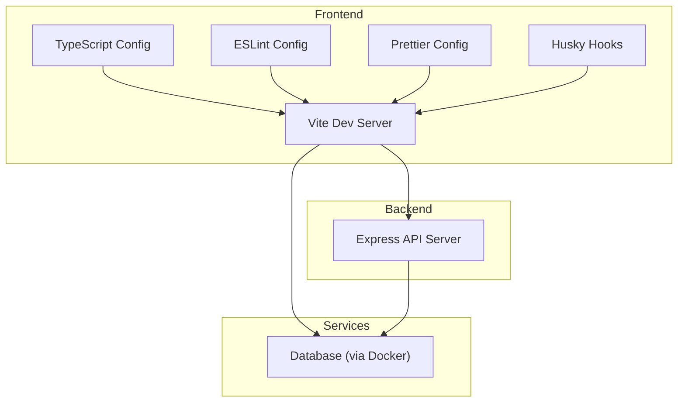
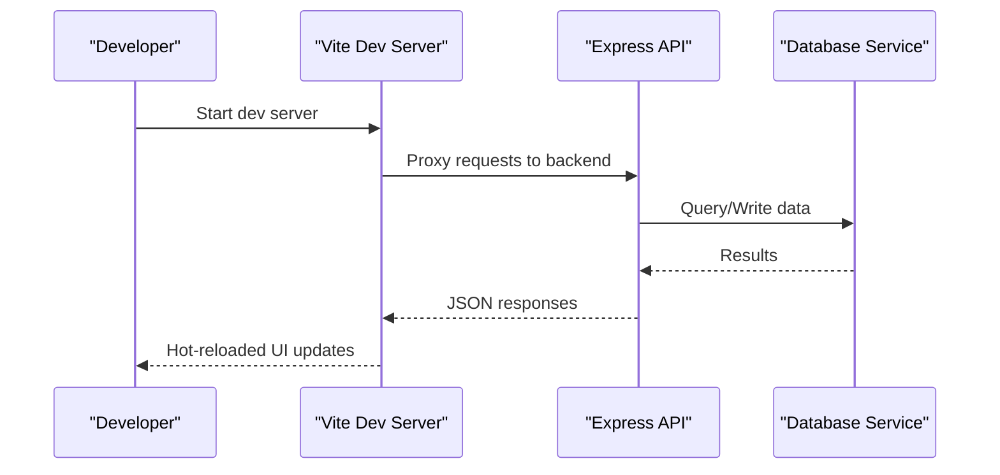
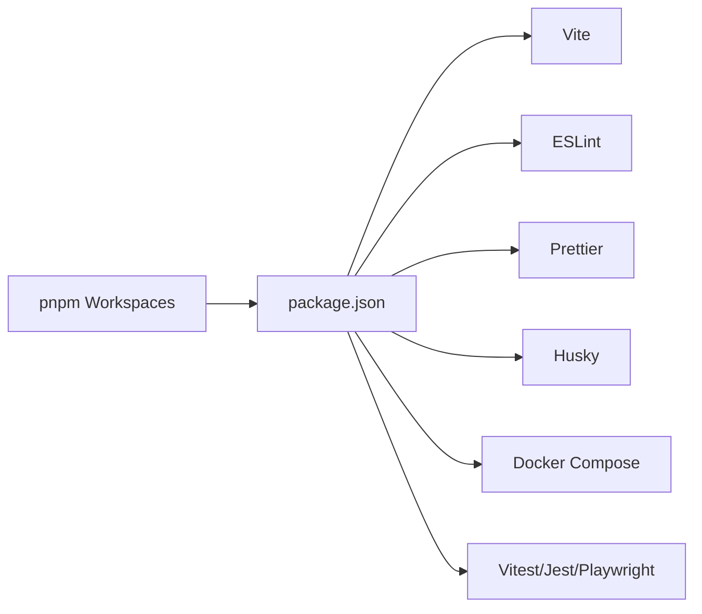

# Development Environment Setup

<cite>
**Referenced Files in This Document**
- [package.json](file://package.json)
- [tsconfig.json](file://tsconfig.json)
- [vite.config.js](file://vite.config.js)
- [eslint.config.js](file://eslint.config.js)
- [.prettierrc.json](file://.prettierrc.json)
- [.husky/commit-msg](file://.husky/commit-msg)
- [docker-compose.yml](file://docker-compose.yml)
- [Dockerfile](file://Dockerfile)
- [index.html](file://index.html)
- [src/main.jsx](file://src/main.jsx)
- [api/server.js](file://api/server.js)
- [playwright.config.ts](file://playwright.config.ts)
- [vitest.config.js](file://vitest.config.js)
- [jest.config.js](file://jest.config.js)
- [pnpm-workspace.yaml](file://pnpm-workspace.yaml)
</cite>

## Table of Contents
1. [Introduction](#introduction)
2. [Project Structure](#project-structure)
3. [Core Components](#core-components)
4. [Architecture Overview](#architecture-overview)
5. [Detailed Component Analysis](#detailed-component-analysis)
6. [Dependency Analysis](#dependency-analysis)
7. [Performance Considerations](#performance-considerations)
8. [Troubleshooting Guide](#troubleshooting-guide)
9. [Conclusion](#conclusion)
10. [Appendices](#appendices)

## Introduction
This document provides a complete guide to setting up the local development environment for the project. It covers Node.js and package manager installation, TypeScript configuration, IDE recommendations, code quality tools (ESLint, Prettier, Husky), database setup via Docker, environment variables, development server startup, debugging, hot reload, and troubleshooting common issues including dependency conflicts and platform-specific problems.

## Project Structure
The repository is a modern web application with:
- A Vite-based frontend using React and TypeScript
- An Express API under api/
- Docker Compose for local services
- Code quality tooling (ESLint, Prettier, Husky)
- Testing suites (Vitest, Jest, Playwright)
- Storybook for component documentation

[No sources needed since this diagram shows conceptual workflow, not actual code structure]

## Core Components
- Package Manager and Scripts: The project uses pnpm and defines scripts for development, building, testing, linting, formatting, and running the API server.
- TypeScript: Centralized configuration for module resolution, JSX support, and output settings.
- Vite: Development server, build pipeline, and plugin ecosystem.
- ESLint and Prettier: Static analysis and code formatting rules.
- Husky: Git hooks to enforce pre-commit checks.
- Docker Compose: Local service orchestration for databases and other dependencies.
- Testing: Vitest and Jest configurations; Playwright for E2E.

Key files:
- [package.json](file://package.json)
- [tsconfig.json](file://tsconfig.json)
- [vite.config.js](file://vite.config.js)
- [eslint.config.js](file://eslint.config.js)
- [.prettierrc.json](file://.prettierrc.json)
- [.husky/commit-msg](file://.husky/commit-msg)
- [docker-compose.yml](file://docker-compose.yml)
- [Dockerfile](file://Dockerfile)
- [index.html](file://index.html)
- [src/main.jsx](file://src/main.jsx)
- [api/server.js](file://api/server.js)
- [playwright.config.ts](file://playwright.config.ts)
- [vitest.config.js](file://vitest.config.js)
- [jest.config.js](file://jest.config.js)
- [pnpm-workspace.yaml](file://pnpm-workspace.yaml)

**Section sources**
- [package.json](file://package.json)
- [tsconfig.json](file://tsconfig.json)
- [vite.config.js](file://vite.config.js)
- [eslint.config.js](file://eslint.config.js)
- [.prettierrc.json](file://.prettierrc.json)
- [.husky/commit-msg](file://.husky/commit-msg)
- [docker-compose.yml](file://docker-compose.yml)
- [Dockerfile](file://Dockerfile)
- [index.html](file://index.html)
- [src/main.jsx](file://src/main.jsx)
- [api/server.js](file://api/server.js)
- [playwright.config.ts](file://playwright.config.ts)
- [vitest.config.js](file://vitest.config.js)
- [jest.config.js](file://jest.config.js)
- [pnpm-workspace.yaml](file://pnpm-workspace.yaml)

## Architecture Overview
The development architecture includes:
- Frontend dev server (Vite) serving React components and TypeScript
- Backend API server (Express) handling business logic and data access
- Database services managed by Docker Compose
- Pre-commit hooks enforcing code quality before changes are committed

**Diagram sources**
- [vite.config.js](file://vite.config.js)
- [api/server.js](file://api/server.js)
- [docker-compose.yml](file://docker-compose.yml)

**Section sources**
- [vite.config.js](file://vite.config.js)
- [api/server.js](file://api/server.js)
- [docker-compose.yml](file://docker-compose.yml)

## Detailed Component Analysis

### Local Installation Requirements
- Install Node.js LTS recommended by the project’s package manager requirements.
- Use pnpm as the primary package manager. If you prefer npm or yarn, ensure compatibility with the lockfiles present.
- Verify installations:
  - node --version
  - pnpm --version

**Section sources**
- [package.json](file://package.json)
- [pnpm-workspace.yaml](file://pnpm-workspace.yaml)

### Node.js and pnpm Configuration
- Configure your shell to use pnpm globally if needed.
- Ensure the correct Node.js version is active in your terminal and IDE.
- Workspace configuration is defined for multi-package setups.

**Section sources**
- [package.json](file://package.json)
- [pnpm-workspace.yaml](file://pnpm-workspace.yaml)

### TypeScript Setup
- TypeScript is configured centrally for modules, JSX, and paths.
- The frontend entry point initializes the app within the HTML root.

Recommended steps:
- Confirm tsconfig options align with your editor’s TypeScript language service.
- Enable strict mode in your IDE if desired.

**Section sources**
- [tsconfig.json](file://tsconfig.json)
- [index.html](file://index.html)
- [src/main.jsx](file://src/main.jsx)

### IDE Recommendations
- VS Code is recommended. Install extensions for:
  - ESLint
  - Prettier
  - TypeScript and JavaScript Language Features
  - Docker (for container management)
- Configure VS Code to:
  - Format on save using Prettier
  - Run ESLint on save or on demand
  - Use the workspace’s TypeScript version

[No sources needed since this section provides general guidance]

### Code Quality Tools

#### ESLint
- Linting rules are centralized in the ESLint config file.
- Run linting locally and fix reported issues before committing.

**Section sources**
- [eslint.config.js](file://eslint.config.js)

#### Prettier
- Formatting rules are defined in the Prettier config.
- Integrate with your editor to format files automatically.

**Section sources**
- [.prettierrc.json](file://.prettierrc.json)

#### Husky Pre-commit Hooks
- Husky enforces checks before commits.
- The commit-msg hook validates messages and can trigger additional checks.

Setup steps:
- Initialize Husky once after install.
- Ensure hooks are enabled in your Git repository.

**Section sources**
- [.husky/commit-msg](file://.husky/commit-msg)

### Database Setup
- Use Docker Compose to start required services (e.g., database).
- Build images and run containers as defined in the compose file.
- Connect your API server to the database using environment variables.

Steps:
- Start services: docker compose up
- Stop services: docker compose down
- Rebuild images when necessary: docker compose build

**Section sources**
- [docker-compose.yml](file://docker-compose.yml)
- [Dockerfile](file://Dockerfile)

### Environment Variables Configuration
- Define environment variables for local development (e.g., API endpoints, feature flags).
- Store secrets securely and avoid committing sensitive values.
- Reference variables in your frontend and backend code according to their runtime environments.

Best practices:
- Keep .env files out of version control.
- Provide example templates for required variables.

[No sources needed since this section provides general guidance]

### Development Server Startup Procedures
- Start the frontend dev server with hot reload enabled.
- Start the API server separately or via a script that runs both.
- Ensure proxy settings route API calls correctly from the frontend to the backend.

Typical commands:
- Frontend: use the dev script defined in package.json
- API: use the API server script defined in package.json

**Section sources**
- [package.json](file://package.json)
- [vite.config.js](file://vite.config.js)
- [api/server.js](file://api/server.js)

### Debugging Setup
- For the frontend:
  - Use browser developer tools with source maps enabled.
  - Configure VS Code launch tasks for attaching to the Vite dev server.
- For the backend:
  - Use Node.js debugger or VS Code launch configuration to debug the Express server.
- For tests:
  - Configure breakpoints in unit and integration tests.

[No sources needed since this section provides general guidance]

### Hot Reload Configuration
- Vite provides fast hot module replacement by default.
- Ensure your components and styles follow patterns compatible with HMR.
- If custom plugins are used, verify they support HMR.

**Section sources**
- [vite.config.js](file://vite.config.js)

### Testing Setup
- Unit and component tests:
  - Vitest configuration for fast test execution.
  - Jest configuration for legacy or specific test suites.
- End-to-end tests:
  - Playwright configuration for cross-browser E2E scenarios.

Commands:
- Run Vitest tests
- Run Jest tests
- Run Playwright tests

**Section sources**
- [vitest.config.js](file://vitest.config.js)
- [jest.config.js](file://jest.config.js)
- [playwright.config.ts](file://playwright.config.ts)

## Dependency Analysis
The project relies on:
- pnpm for dependency management and workspaces
- Vite for the build and dev server
- ESLint and Prettier for code quality
- Husky for Git hooks
- Docker Compose for local services
- Testing frameworks (Vitest, Jest, Playwright)

**Diagram sources**
- [pnpm-workspace.yaml](file://pnpm-workspace.yaml)
- [package.json](file://package.json)

**Section sources**
- [pnpm-workspace.yaml](file://pnpm-workspace.yaml)
- [package.json](file://package.json)

## Performance Considerations
- Use pnpm for faster installs and disk space efficiency.
- Leverage Vite’s HMR for rapid feedback during development.
- Avoid heavy synchronous operations in the main thread.
- Profile frontend performance using browser tools and consider lazy loading large components.

[No sources needed since this section provides general guidance]

## Troubleshooting Guide

### Common Issues
- Node.js version mismatch:
  - Ensure your Node.js version matches the project’s requirement.
  - Use a version manager to switch versions easily.
- pnpm vs npm/yarn conflicts:
  - Prefer pnpm to match the lockfile and workspace configuration.
  - If using npm/yarn, be aware of potential differences in hoisting and resolutions.
- Port conflicts:
  - Change ports in configuration files if the default port is in use.
- Docker permissions:
  - On some platforms, grant Docker permission to access shared folders.
- ESLint/Prettier inconsistencies:
  - Align editor settings with project configs.
  - Run formatters and linters consistently across the team.

### Platform-Specific Setup
- Windows:
  - Use WSL2 for a Linux-like environment.
  - Ensure Docker Desktop is installed and running.
- macOS:
  - Install Docker Desktop and enable virtualization.
- Linux:
  - Install Docker Engine and add your user to the docker group.

### Dependency Conflicts Resolution
- Clear caches and reinstall:
  - Remove lockfiles and node_modules, then reinstall with pnpm.
- Pin versions:
  - Lock critical dependencies to known working versions.
- Audit and update:
  - Use package manager audit tools to identify vulnerabilities and outdated packages.

### Debugging Tips
- Frontend:
  - Check network tab for failed API calls.
  - Inspect console errors and source maps.
- Backend:
  - Log request/response payloads and error stacks.
  - Use debugger breakpoints in Express routes.

**Section sources**
- [package.json](file://package.json)
- [vite.config.js](file://vite.config.js)
- [api/server.js](file://api/server.js)
- [docker-compose.yml](file://docker-compose.yml)

## Conclusion
By following this guide, you should have a fully functional local development environment with hot reload, code quality enforcement, and reliable debugging capabilities. Use the provided scripts and configurations to maintain consistency across the team and streamline your workflow.

[No sources needed since this section summarizes without analyzing specific files]

## Appendices

### Quick Commands Reference
- Install dependencies: pnpm install
- Start frontend dev server: see scripts in package.json
- Start API server: see scripts in package.json
- Run tests: see scripts in package.json
- Lint and format: see scripts in package.json
- Start services: docker compose up

**Section sources**
- [package.json](file://package.json)