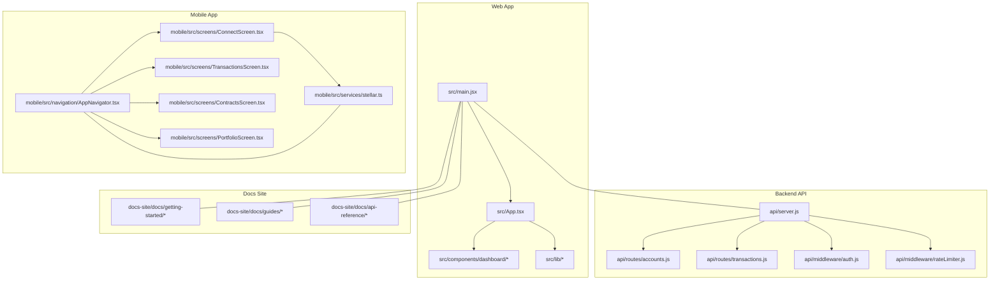
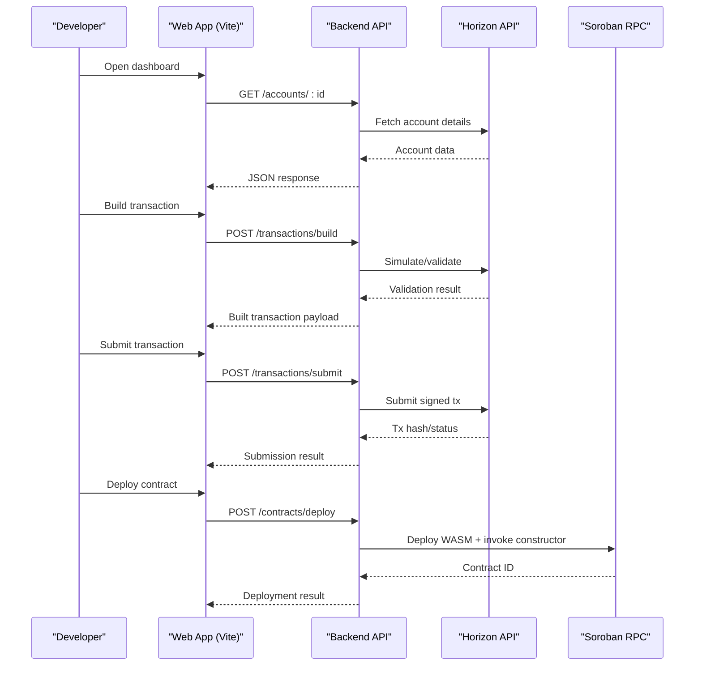
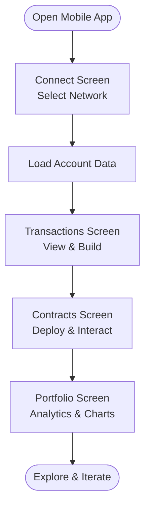
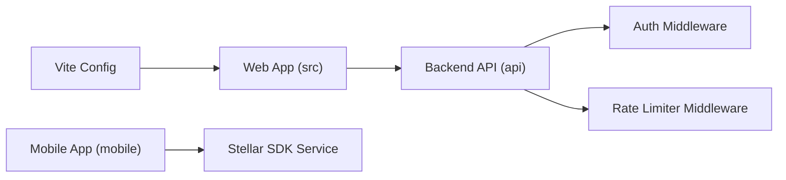

# Getting Started

<cite>
**Referenced Files in This Document**
- [README.md](file://README.md)
- [package.json](file://package.json)
- [vite.config.js](file://vite.config.js)
- [src/main.jsx](file://src/main.jsx)
- [src/App.tsx](file://src/App.tsx)
- [api/server.js](file://api/server.js)
- [api/routes/accounts.js](file://api/routes/accounts.js)
- [api/routes/transactions.js](file://api/routes/transactions.js)
- [api/middleware/auth.js](file://api/middleware/auth.js)
- [api/middleware/rateLimiter.js](file://api/middleware/rateLimiter.js)
- [docs-site/docs/getting-started/installation.md](file://docs-site/docs/getting-started/installation.md)
- [docs-site/docs/getting-started/quick-start.md](file://docs-site/docs/getting-started/quick-start.md)
- [docs-site/docs/getting-started/networks.md](file://docs-site/docs/getting-started/networks.md)
- [docs-site/docs/getting-started/authentication.md](file://docs-site/docs/getting-started/authentication.md)
- [docs/api/examples/js/send-payment.mjs](file://docs/api/examples/js/send-payment.mjs)
- [docs/api/examples/js/invoke-contract.mjs](file://docs/api/examples/js/invoke-contract.mjs)
- [docs/api/examples/python/send_payment.py](file://docs/api/examples/python/send_payment.py)
- [docs/api/examples/python/invoke_contract.py](file://docs/api/examples/python/invoke_contract.py)
- [docs-site/docs/guides/soroban-smart-contracts.md](file://docs-site/docs/guides/soroban-smart-contracts.md)
- [docs-site/docs/api-reference/horizon/accounts.md](file://docs-site/docs/api-reference/horizon/accounts.md)
- [docs-site/docs/api-reference/horizon/submit-transaction.md](file://docs-site/docs/api-reference/horizon/submit-transaction.md)
- [docs-site/docs/api-reference/soroban/overview.md](file://docs-site/docs/api-reference/soroban/overview.md)
- [docs-site/docs/api-reference/soroban/send-transaction.md](file://docs-site/docs/api-reference/soroban/send-transaction.md)
- [docs-site/docs/api-reference/soroban/simulate-transaction.md](file://docs-site/docs/api-reference/soroban/simulate-transaction.md)
- [docs-site/docs/api-reference/error-reference.md](file://docs-site/docs/api-reference/error-reference.md)
- [docs-site/docs/examples/js/fetch-account.md](file://docs-site/docs/examples/js/fetch-account.md)
- [docs-site/docs/examples/js/send-payment.md](file://docs-site/docs/examples/js/send-payment.md)
- [docs-site/docs/examples/js/invoke-contract.md](file://docs-site/docs/examples/js/invoke-contract.md)
- [docs-site/docs/examples/errors/insufficient-funds.md](file://docs-site/docs/examples/errors/insufficient-funds.md)
- [docs-site/docs/examples/errors/rate-limit.md](file://docs-site/docs/examples/errors/rate-limit.md)
- [docs-site/docs/examples/errors/transaction-failed.md](file://docs-site/docs/examples/errors/transaction-failed.md)
- [docs-site/docs/guides/troubleshooting.md](file://docs-site/docs/guides/troubleshooting.md)
- [docs-site/docs/guides/rate-limiting.md](file://docs-site/docs/guides/rate-limiting.md)
- [docs-site/docs/guides/offline-support.md](file://docs-site/docs/guides/offline-support.md)
- [docs-site/docs/guides/dex-trading.md](file://docs-site/docs/guides/dex-trading.md)
- [docs-site/docs/guides/working-with-assets.md](file://docs-site/docs/guides/working-with-assets.md)
- [docs-site/docs/guides/advanced-tutorials.md](file://docs-site/docs/guides/advanced-tutorials.md)
- [docs-site/docs/api-explorer.md](file://docs-site/docs/api-explorer.md)
- [mobile/src/services/stellar.ts](file://mobile/src/services/stellar.ts)
- [mobile/src/screens/ConnectScreen.tsx](file://mobile/src/screens/ConnectScreen.tsx)
- [mobile/src/screens/TransactionsScreen.tsx](file://mobile/src/screens/TransactionsScreen.tsx)
- [mobile/src/screens/ContractsScreen.tsx](file://mobile/src/screens/ContractsScreen.tsx)
- [mobile/src/screens/PortfolioScreen.tsx](file://mobile/src/screens/PortfolioScreen.tsx)
- [mobile/src/navigation/AppNavigator.tsx](file://mobile/src/navigation/AppNavigator.tsx)
</cite>

## Table of Contents
1. [Introduction](#introduction)
2. [Project Structure](#project-structure)
3. [Core Components](#core-components)
4. [Architecture Overview](#architecture-overview)
5. [Detailed Component Analysis](#detailed-component-analysis)
6. [Dependency Analysis](#dependency-analysis)
7. [Performance Considerations](#performance-considerations)
8. [Troubleshooting Guide](#troubleshooting-guide)
9. [Conclusion](#conclusion)
10. [Appendices](#appendices)

## Introduction
The Stellar Development Dashboard is a full-stack blockchain development platform for building, testing, and operating applications on the Stellar network. It provides an integrated environment for transaction management, Soroban smart contract development, portfolio analytics, and collaboration tools. The dashboard includes a web application, a mobile app, and a backend API to streamline workflows from prototyping to production.

Key features:
- Transaction management: build, simulate, sign, and submit transactions with templates and advanced tooling.
- Smart contract development: Soroban studio, deployment helpers, simulation, and debugging aids.
- Portfolio analytics: asset discovery, balance history, performance charts, and insights.
- Collaboration tools: annotations, presence indicators, shared views, and audit logs.

This guide helps you install dependencies, configure environments, run the project locally, connect to Stellar networks, build transactions, and deploy contracts.

## Project Structure
At a high level, the repository contains:
- Web application (React + Vite) under src
- Backend API (Node.js/Express) under api
- Mobile app (React Native) under mobile
- Documentation site (Docusaurus) under docs-site
- Examples and guides under docs and docs-site

**Diagram sources**
- [src/main.jsx](file://src/main.jsx)
- [src/App.tsx](file://src/App.tsx)
- [api/server.js](file://api/server.js)
- [api/routes/accounts.js](file://api/routes/accounts.js)
- [api/routes/transactions.js](file://api/routes/transactions.js)
- [api/middleware/auth.js](file://api/middleware/auth.js)
- [api/middleware/rateLimiter.js](file://api/middleware/rateLimiter.js)
- [mobile/src/navigation/AppNavigator.tsx](file://mobile/src/navigation/AppNavigator.tsx)
- [mobile/src/screens/ConnectScreen.tsx](file://mobile/src/screens/ConnectScreen.tsx)
- [mobile/src/screens/TransactionsScreen.tsx](file://mobile/src/screens/TransactionsScreen.tsx)
- [mobile/src/screens/ContractsScreen.tsx](file://mobile/src/screens/ContractsScreen.tsx)
- [mobile/src/screens/PortfolioScreen.tsx](file://mobile/src/screens/PortfolioScreen.tsx)
- [mobile/src/services/stellar.ts](file://mobile/src/services/stellar.ts)

**Section sources**
- [README.md](file://README.md)
- [package.json](file://package.json)
- [vite.config.js](file://vite.config.js)
- [src/main.jsx](file://src/main.jsx)
- [src/App.tsx](file://src/App.tsx)
- [api/server.js](file://api/server.js)
- [api/routes/accounts.js](file://api/routes/accounts.js)
- [api/routes/transactions.js](file://api/routes/transactions.js)
- [api/middleware/auth.js](file://api/middleware/auth.js)
- [api/middleware/rateLimiter.js](file://api/middleware/rateLimiter.js)
- [mobile/src/navigation/AppNavigator.tsx](file://mobile/src/navigation/AppNavigator.tsx)
- [mobile/src/screens/ConnectScreen.tsx](file://mobile/src/screens/ConnectScreen.tsx)
- [mobile/src/screens/TransactionsScreen.tsx](file://mobile/src/screens/TransactionsScreen.tsx)
- [mobile/src/screens/ContractsScreen.tsx](file://mobile/src/screens/ContractsScreen.tsx)
- [mobile/src/screens/PortfolioScreen.tsx](file://mobile/src/screens/PortfolioScreen.tsx)
- [mobile/src/services/stellar.ts](file://mobile/src/services/stellar.ts)

## Core Components
- Web Application
  - Entry point initializes the React app and mounts the root component.
  - Root component wires up routes, layout, and feature modules including dashboard, transactions, contracts, and analytics.
- Backend API
  - Express server exposes endpoints for accounts and transactions.
  - Middleware handles authentication and rate limiting.
- Mobile App
  - Navigation orchestrates screens for connecting, transactions, contracts, and portfolio.
  - Services encapsulate Stellar SDK interactions.

**Section sources**
- [src/main.jsx](file://src/main.jsx)
- [src/App.tsx](file://src/App.tsx)
- [api/server.js](file://api/server.js)
- [api/routes/accounts.js](file://api/routes/accounts.js)
- [api/routes/transactions.js](file://api/routes/transactions.js)
- [api/middleware/auth.js](file://api/middleware/auth.js)
- [api/middleware/rateLimiter.js](file://api/middleware/rateLimiter.js)
- [mobile/src/navigation/AppNavigator.tsx](file://mobile/src/navigation/AppNavigator.tsx)
- [mobile/src/services/stellar.ts](file://mobile/src/services/stellar.ts)

## Architecture Overview
The system comprises three main layers:
- Frontend (Web): React + Vite application providing dashboards, builders, and analytics.
- Backend (API): Node.js/Express service that proxies or augments Horizon/Soroban operations and enforces auth and rate limits.
- Mobile: React Native app mirroring core capabilities for on-the-go development.

**Diagram sources**
- [src/main.jsx](file://src/main.jsx)
- [src/App.tsx](file://src/App.tsx)
- [api/server.js](file://api/server.js)
- [api/routes/accounts.js](file://api/routes/accounts.js)
- [api/routes/transactions.js](file://api/routes/transactions.js)
- [api/middleware/auth.js](file://api/middleware/auth.js)
- [api/middleware/rateLimiter.js](file://api/middleware/rateLimiter.js)

## Detailed Component Analysis

### Installation and Environment Setup
- Prerequisites
  - Node.js LTS recommended
  - Package manager: npm or pnpm
- Install dependencies
  - Use your preferred package manager to install workspace dependencies.
- Configure environment variables
  - Create a local environment file and set required keys for Horizon, Soroban, and any internal services.
- Start services
  - Run the web app using the development server.
  - Optionally start the backend API if needed for local integration.

For detailed steps and options, see:
- [Installation](file://docs-site/docs/getting-started/installation.md)
- [Quick Start](file://docs-site/docs/getting-started/quick-start.md)
- [Networks](file://docs-site/docs/getting-started/networks.md)
- [Authentication](file://docs-site/docs/getting-started/authentication.md)

**Section sources**
- [docs-site/docs/getting-started/installation.md](file://docs-site/docs/getting-started/installation.md)
- [docs-site/docs/getting-started/quick-start.md](file://docs-site/docs/getting-started/quick-start.md)
- [docs-site/docs/getting-started/networks.md](file://docs-site/docs/getting-started/networks.md)
- [docs-site/docs/getting-started/authentication.md](file://docs-site/docs/getting-started/authentication.md)

### Quick Start Tutorial
- Launch the web app and navigate to the dashboard.
- Connect to a Stellar network (testnet or futurenet).
- Load an account and view balances and recent transactions.
- Build a payment transaction using the builder or template.
- Simulate and submit the transaction via the API or directly through Horizon.
- For smart contracts, open the Soroban studio, compile, deploy, and call functions.

References:
- [Quick Start](file://docs-site/docs/getting-started/quick-start.md)
- [Accounts Reference](file://docs-site/docs/api-reference/horizon/accounts.md)
- [Submit Transaction Reference](file://docs-site/docs/api-reference/horizon/submit-transaction.md)
- [Soroban Overview](file://docs-site/docs/api-reference/soroban/overview.md)

**Section sources**
- [docs-site/docs/getting-started/quick-start.md](file://docs-site/docs/getting-started/quick-start.md)
- [docs-site/docs/api-reference/horizon/accounts.md](file://docs-site/docs/api-reference/horizon/accounts.md)
- [docs-site/docs/api-reference/horizon/submit-transaction.md](file://docs-site/docs/api-reference/horizon/submit-transaction.md)
- [docs-site/docs/api-reference/soroban/overview.md](file://docs-site/docs/api-reference/soroban/overview.md)

### Connecting to Stellar Networks
- Choose a network (testnet or futurenet) and configure endpoints.
- Ensure correct base URL and network passphrase are set.
- Verify connectivity by fetching account info or ledger status.

References:
- [Networks](file://docs-site/docs/getting-started/networks.md)
- [Fetch Account Example](file://docs-site/docs/examples/js/fetch-account.md)

**Section sources**
- [docs-site/docs/getting-started/networks.md](file://docs-site/docs/getting-started/networks.md)
- [docs-site/docs/examples/js/fetch-account.md](file://docs-site/docs/examples/js/fetch-account.md)

### Building Transactions
- Use the transaction builder UI or programmatic examples.
- Construct operations (payments, trustlines, contract invocations).
- Set fees, timebounds, and memo fields as needed.
- Simulate before submission to validate behavior and costs.

References:
- [Send Payment Example (JS)](file://docs/api/examples/js/send-payment.mjs)
- [Send Payment Example (Python)](file://docs/api/examples/python/send_payment.py)
- [Submit Transaction Reference](file://docs-site/docs/api-reference/horizon/submit-transaction.md)

**Section sources**
- [docs/api/examples/js/send-payment.mjs](file://docs/api/examples/js/send-payment.mjs)
- [docs/api/examples/python/send_payment.py](file://docs/api/examples/python/send_payment.py)
- [docs-site/docs/api-reference/horizon/submit-transaction.md](file://docs-site/docs/api-reference/horizon/submit-transaction.md)

### Deploying Smart Contracts (Soroban)
- Compile your Soroban contract to WASM.
- Use the studio to upload and deploy the contract.
- Invoke contract methods via simulated transactions.
- Monitor events and transaction results.

References:
- [Invoke Contract Example (JS)](file://docs/api/examples/js/invoke-contract.mjs)
- [Invoke Contract Example (Python)](file://docs/api/examples/python/invoke_contract.py)
- [Soroban Best Practices](file://docs-site/docs/guides/soroban-smart-contracts.md)
- [Soroban Send Transaction](file://docs-site/docs/api-reference/soroban/send-transaction.md)
- [Soroban Simulate Transaction](file://docs-site/docs/api-reference/soroban/simulate-transaction.md)

**Section sources**
- [docs/api/examples/js/invoke-contract.mjs](file://docs/api/examples/js/invoke-contract.mjs)
- [docs/api/examples/python/invoke_contract.py](file://docs/api/examples/python/invoke_contract.py)
- [docs-site/docs/guides/soroban-smart-contracts.md](file://docs-site/docs/guides/soroban-smart-contracts.md)
- [docs-site/docs/api-reference/soroban/send-transaction.md](file://docs-site/docs/api-reference/soroban/send-transaction.md)
- [docs-site/docs/api-reference/soroban/simulate-transaction.md](file://docs-site/docs/api-reference/soroban/simulate-transaction.md)

### Portfolio Analytics
- View balances, asset composition, and USD estimates.
- Explore historical charts and performance metrics.
- Filter assets and track activity over time.

References:
- [Portfolio Analytics Guide](file://PORTFOLIO_ANALYTICS_GUIDE.md)
- [Portfolio Analytics Implementation](file://PORTFOLIO_ANALYTICS_IMPLEMENTATION.md)
- [Portfolio Analytics Example](file://PORTFOLIO_ANALYTICS_EXAMPLE.md)

**Section sources**
- [PORTFOLIO_ANALYTICS_GUIDE.md](file://PORTFOLIO_ANALYTICS_GUIDE.md)
- [PORTFOLIO_ANALYTICS_IMPLEMENTATION.md](file://PORTFOLIO_ANALYTICS_IMPLEMENTATION.md)
- [PORTFOLIO_ANALYTICS_EXAMPLE.md](file://PORTFOLIO_ANALYTICS_EXAMPLE.md)

### Collaboration Tools
- Annotations panel for notes and context.
- Presence indicators and collaborative cursors.
- Shared views and audit logs for team workflows.

References:
- [Collaboration Features](file://COLLABORATION_FEATURES.md)

**Section sources**
- [COLLABORATION_FEATURES.md](file://COLLABORATION_FEATURES.md)

### Mobile App Usage
- Navigate between screens: Connect, Transactions, Contracts, Portfolio.
- Use the Stellar service layer to interact with networks.
- Manage connections and perform basic operations on mobile.

**Diagram sources**
- [mobile/src/navigation/AppNavigator.tsx](file://mobile/src/navigation/AppNavigator.tsx)
- [mobile/src/screens/ConnectScreen.tsx](file://mobile/src/screens/ConnectScreen.tsx)
- [mobile/src/screens/TransactionsScreen.tsx](file://mobile/src/screens/TransactionsScreen.tsx)
- [mobile/src/screens/ContractsScreen.tsx](file://mobile/src/screens/ContractsScreen.tsx)
- [mobile/src/screens/PortfolioScreen.tsx](file://mobile/src/screens/PortfolioScreen.tsx)
- [mobile/src/services/stellar.ts](file://mobile/src/services/stellar.ts)

**Section sources**
- [mobile/src/navigation/AppNavigator.tsx](file://mobile/src/navigation/AppNavigator.tsx)
- [mobile/src/screens/ConnectScreen.tsx](file://mobile/src/screens/ConnectScreen.tsx)
- [mobile/src/screens/TransactionsScreen.tsx](file://mobile/src/screens/TransactionsScreen.tsx)
- [mobile/src/screens/ContractsScreen.tsx](file://mobile/src/screens/ContractsScreen.tsx)
- [mobile/src/screens/PortfolioScreen.tsx](file://mobile/src/screens/PortfolioScreen.tsx)
- [mobile/src/services/stellar.ts](file://mobile/src/services/stellar.ts)

## Dependency Analysis
The frontend depends on Vite for fast builds and hot reload. The backend uses Express with middleware for auth and rate limiting. The mobile app integrates with the Stellar SDK for network operations.

**Diagram sources**
- [vite.config.js](file://vite.config.js)
- [src/main.jsx](file://src/main.jsx)
- [api/server.js](file://api/server.js)
- [api/middleware/auth.js](file://api/middleware/auth.js)
- [api/middleware/rateLimiter.js](file://api/middleware/rateLimiter.js)
- [mobile/src/services/stellar.ts](file://mobile/src/services/stellar.ts)

**Section sources**
- [vite.config.js](file://vite.config.js)
- [src/main.jsx](file://src/main.jsx)
- [api/server.js](file://api/server.js)
- [api/middleware/auth.js](file://api/middleware/auth.js)
- [api/middleware/rateLimiter.js](file://api/middleware/rateLimiter.js)
- [mobile/src/services/stellar.ts](file://mobile/src/services/stellar.ts)

## Performance Considerations
- Use caching and pagination for large datasets.
- Prefer simulation before submission to reduce failed transactions.
- Enable offline support where applicable and handle reconnection gracefully.
- Monitor performance metrics and optimize heavy components.

[No sources needed since this section provides general guidance]

## Troubleshooting Guide
Common setup issues and resolutions:
- Authentication failures: verify credentials and token scopes.
- Rate limiting errors: back off and retry; consult rate limit policies.
- Insufficient funds: ensure account has enough XLM and asset balances.
- Transaction failures: review error references and adjust parameters.
- Offline mode: confirm network availability and fallback strategies.

References:
- [Error Reference](file://docs-site/docs/api-reference/error-reference.md)
- [Insufficient Funds Example](file://docs-site/docs/examples/errors/insufficient-funds.md)
- [Rate Limit Example](file://docs-site/docs/examples/errors/rate-limit.md)
- [Transaction Failed Example](file://docs-site/docs/examples/errors/transaction-failed.md)
- [Troubleshooting Guide](file://docs-site/docs/guides/troubleshooting.md)
- [Rate Limiting Guide](file://docs-site/docs/guides/rate-limiting.md)
- [Offline Support Guide](file://docs-site/docs/guides/offline-support.md)

**Section sources**
- [docs-site/docs/api-reference/error-reference.md](file://docs-site/docs/api-reference/error-reference.md)
- [docs-site/docs/examples/errors/insufficient-funds.md](file://docs-site/docs/examples/errors/insufficient-funds.md)
- [docs-site/docs/examples/errors/rate-limit.md](file://docs-site/docs/examples/errors/rate-limit.md)
- [docs-site/docs/examples/errors/transaction-failed.md](file://docs-site/docs/examples/errors/transaction-failed.md)
- [docs-site/docs/guides/troubleshooting.md](file://docs-site/docs/guides/troubleshooting.md)
- [docs-site/docs/guides/rate-limiting.md](file://docs-site/docs/guides/rate-limiting.md)
- [docs-site/docs/guides/offline-support.md](file://docs-site/docs/guides/offline-support.md)

## Conclusion
You now have the essentials to install, configure, and use the Stellar Development Dashboard for building and deploying on Stellar. Explore the guides and examples to deepen your workflow, from transaction building to Soroban contracts and portfolio analytics.

[No sources needed since this section summarizes without analyzing specific files]

## Appendices

### Additional Resources
- [Advanced Tutorials](file://docs-site/docs/guides/advanced-tutorials.md)
- [DEX Trading Guide](file://docs-site/docs/guides/dex-trading.md)
- [Working with Assets](file://docs-site/docs/guides/working-with-assets.md)
- [API Explorer](file://docs-site/docs/api-explorer.md)

**Section sources**
- [docs-site/docs/guides/advanced-tutorials.md](file://docs-site/docs/guides/advanced-tutorials.md)
- [docs-site/docs/guides/dex-trading.md](file://docs-site/docs/guides/dex-trading.md)
- [docs-site/docs/guides/working-with-assets.md](file://docs-site/docs/guides/working-with-assets.md)
- [docs-site/docs/api-explorer.md](file://docs-site/docs/api-explorer.md)