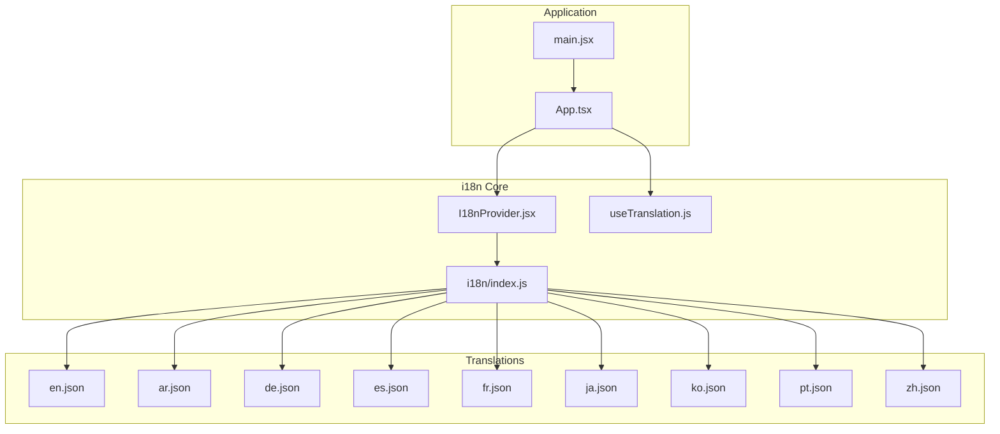
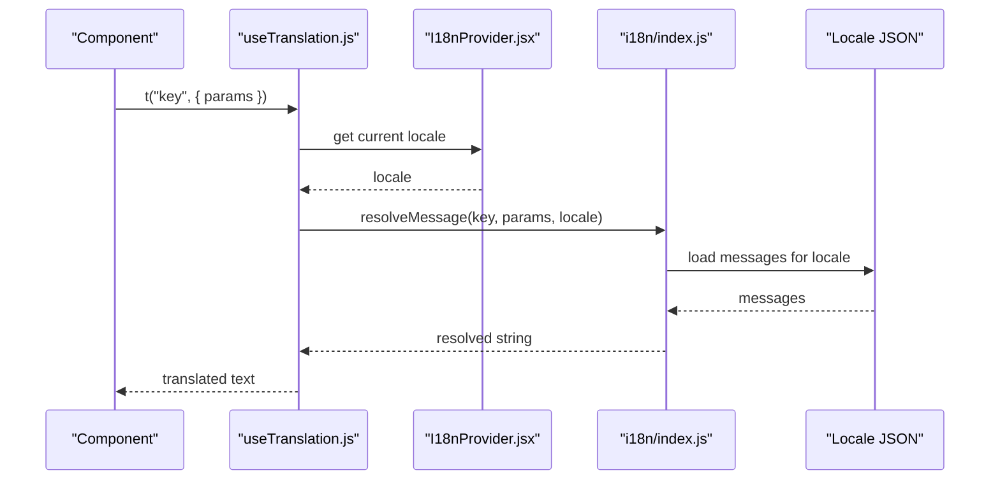
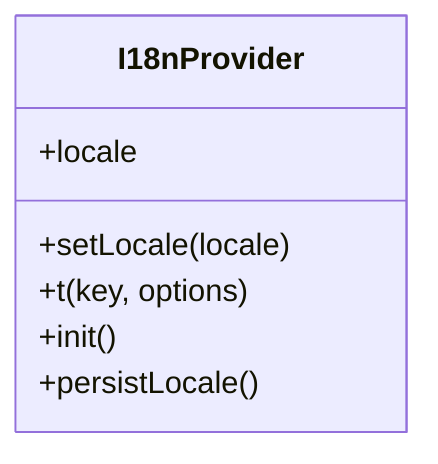
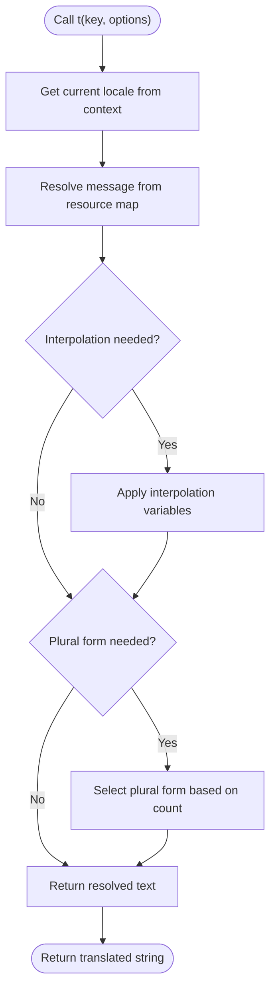
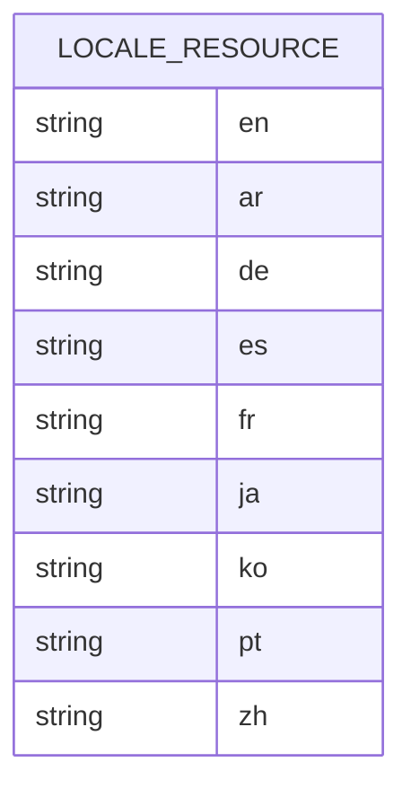
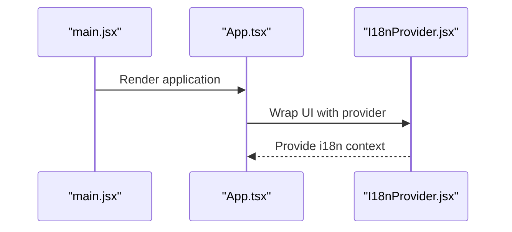
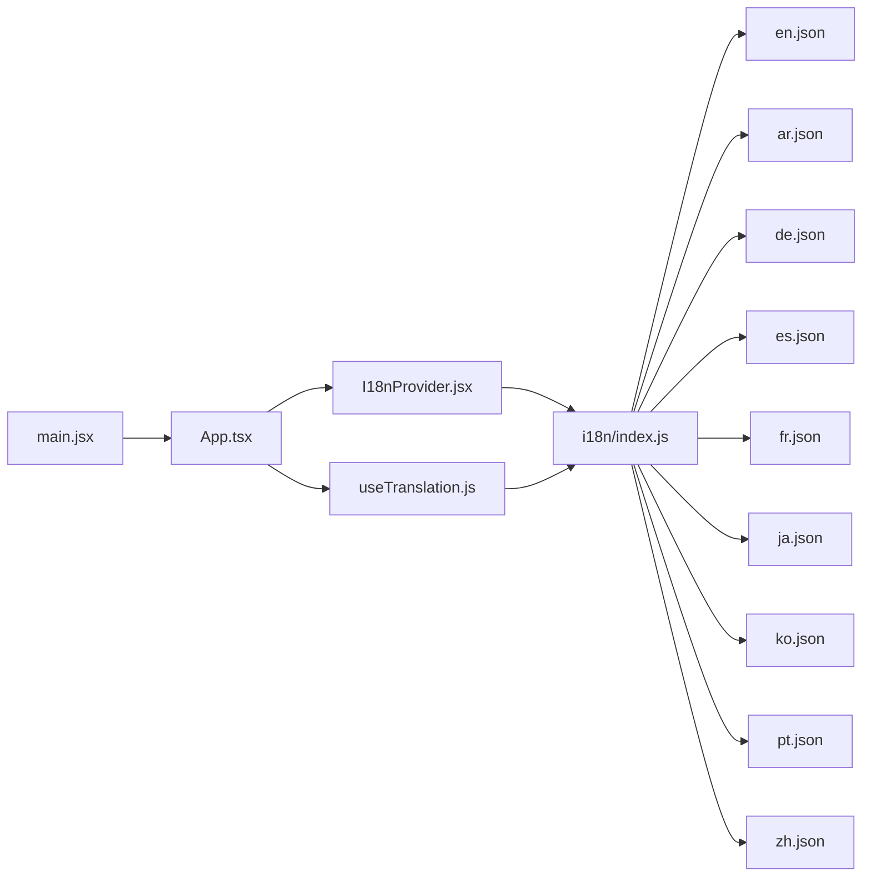

# Internationalization & Localization

<cite>
**Referenced Files in This Document**
- [I18nProvider.jsx](file://src/components/I18nProvider.jsx)
- [useTranslation.js](file://src/hooks/useTranslation.js)
- [index.js](file://src/i18n/index.js)
- [en.json](file://src/i18n/en.json)
- [ar.json](file://src/i18n/ar.json)
- [de.json](file://src/i18n/de.json)
- [es.json](file://src/i18n/es.json)
- [fr.json](file://src/i18n/fr.json)
- [ja.json](file://src/i18n/ja.json)
- [ko.json](file://src/i18n/ko.json)
- [pt.json](file://src/i18n/pt.json)
- [zh.json](file://src/i18n/zh.json)
- [App.tsx](file://src/App.tsx)
- [main.jsx](file://src/main.jsx)
</cite>

## Table of Contents
1. [Introduction](#introduction)
2. [Project Structure](#project-structure)
3. [Core Components](#core-components)
4. [Architecture Overview](#architecture-overview)
5. [Detailed Component Analysis](#detailed-component-analysis)
6. [Dependency Analysis](#dependency-analysis)
7. [Performance Considerations](#performance-considerations)
8. [Troubleshooting Guide](#troubleshooting-guide)
9. [Conclusion](#conclusion)
10. [Appendices](#appendices)

## Introduction
This document explains the internationalization (i18n) and localization (l10n) architecture for the application, including how translations are structured, loaded, and consumed at runtime. It covers supported languages, translation file organization, interpolation patterns, pluralization rules, dynamic language switching, locale detection, fallback strategies, RTL support, context-aware translations, extraction workflows, automated translation processes, and quality assurance practices.

## Project Structure
The i18n implementation is centered around a provider component, a custom hook for consuming translations, and a collection of JSON files per locale. The provider initializes the i18n runtime and exposes it via React context; components consume translations through the hook.

**Diagram sources**
- [main.jsx:1-200](file://src/main.jsx#L1-L200)
- [App.tsx:1-200](file://src/App.tsx#L1-L200)
- [I18nProvider.jsx:1-200](file://src/components/I18nProvider.jsx#L1-L200)
- [useTranslation.js:1-200](file://src/hooks/useTranslation.js#L1-L200)
- [index.js:1-200](file://src/i18n/index.js#L1-L200)
- [en.json:1-200](file://src/i18n/en.json#L1-L200)
- [ar.json:1-200](file://src/i18n/ar.json#L1-L200)
- [de.json:1-200](file://src/i18n/de.json#L1-L200)
- [es.json:1-200](file://src/i18n/es.json#L1-L200)
- [fr.json:1-200](file://src/i18n/fr.json#L1-L200)
- [ja.json:1-200](file://src/i18n/ja.json#L1-L200)
- [ko.json:1-200](file://src/i18n/ko.json#L1-L200)
- [pt.json:1-200](file://src/i18n/pt.json#L1-L200)
- [zh.json:1-200](file://src/i18n/zh.json#L1-L200)

**Section sources**
- [main.jsx:1-200](file://src/main.jsx#L1-L200)
- [App.tsx:1-200](file://src/App.tsx#L1-L200)
- [I18nProvider.jsx:1-200](file://src/components/I18nProvider.jsx#L1-L200)
- [useTranslation.js:1-200](file://src/hooks/useTranslation.js#L1-L200)
- [index.js:1-200](file://src/i18n/index.js#L1-L200)

## Core Components
- I18nProvider: Initializes and provides the i18n instance to the React tree, manages current locale, and handles updates when the locale changes.
- useTranslation: A React hook that returns a function to resolve messages by key with optional interpolation parameters and context.
- i18n index: Central registry that loads and exports locale resources and configuration.

Responsibilities:
- Locale initialization and persistence
- Message resolution with interpolation and pluralization
- Fallback behavior when keys or locales are missing
- Context-aware message selection

**Section sources**
- [I18nProvider.jsx:1-200](file://src/components/I18nProvider.jsx#L1-L200)
- [useTranslation.js:1-200](file://src/hooks/useTranslation.js#L1-L200)
- [index.js:1-200](file://src/i18n/index.js#L1-L200)

## Architecture Overview
The i18n system follows a provider-consumer pattern:
- The provider bootstraps the i18n runtime and exposes it via context.
- Components call the hook to retrieve the t function.
- The t function resolves strings from the active locale’s JSON resource, applying interpolation and pluralization rules.
- When a key is missing, the system falls back to a default locale (English).

**Diagram sources**
- [useTranslation.js:1-200](file://src/hooks/useTranslation.js#L1-L200)
- [I18nProvider.jsx:1-200](file://src/components/I18nProvider.jsx#L1-L200)
- [index.js:1-200](file://src/i18n/index.js#L1-L200)
- [en.json:1-200](file://src/i18n/en.json#L1-L200)

## Detailed Component Analysis

### I18nProvider
- Responsibilities:
  - Initialize i18n instance with default locale and available resources
  - Provide locale state and setter via React context
  - Persist selected locale across sessions
  - Update document directionality for RTL locales
- Key behaviors:
  - On mount, detect initial locale (from storage or browser settings)
  - Expose setLocale to update active language at runtime
  - Ensure all child components receive the same i18n instance

**Diagram sources**
- [I18nProvider.jsx:1-200](file://src/components/I18nProvider.jsx#L1-L200)

**Section sources**
- [I18nProvider.jsx:1-200](file://src/components/I18nProvider.jsx#L1-L200)

### useTranslation Hook
- Responsibilities:
  - Consume i18n context and return a typed t function
  - Support interpolation variables and plural forms
  - Handle missing keys gracefully using fallbacks
- Usage pattern:
  - Call t("key", { param }) within components
  - Optionally pass context for disambiguation

**Diagram sources**
- [useTranslation.js:1-200](file://src/hooks/useTranslation.js#L1-L200)

**Section sources**
- [useTranslation.js:1-200](file://src/hooks/useTranslation.js#L1-L200)

### Translation Resources (JSON)
- File structure:
  - One JSON file per supported language under src/i18n
  - Keys organized by feature/module for maintainability
  - Nested objects recommended for large sets of keys
- Supported languages:
  - English (en), Arabic (ar), German (de), Spanish (es), French (fr), Japanese (ja), Korean (ko), Portuguese (pt), Chinese (zh)
- Interpolation:
  - Use placeholders consistent with the chosen i18n library (e.g., variable names inside braces)
- Pluralization:
  - Define singular/plural variants keyed appropriately (e.g., one/other)
- Context-aware translations:
  - Provide separate keys or nested contexts for ambiguous terms

**Diagram sources**
- [en.json:1-200](file://src/i18n/en.json#L1-L200)
- [ar.json:1-200](file://src/i18n/ar.json#L1-L200)
- [de.json:1-200](file://src/i18n/de.json#L1-L200)
- [es.json:1-200](file://src/i18n/es.json#L1-L200)
- [fr.json:1-200](file://src/i18n/fr.json#L1-L200)
- [ja.json:1-200](file://src/i18n/ja.json#L1-L200)
- [ko.json:1-200](file://src/i18n/ko.json#L1-L200)
- [pt.json:1-200](file://src/i18n/pt.json#L1-L200)
- [zh.json:1-200](file://src/i18n/zh.json#L1-L200)

**Section sources**
- [index.js:1-200](file://src/i18n/index.js#L1-L200)
- [en.json:1-200](file://src/i18n/en.json#L1-L200)
- [ar.json:1-200](file://src/i18n/ar.json#L1-L200)
- [de.json:1-200](file://src/i18n/de.json#L1-L200)
- [es.json:1-200](file://src/i18n/es.json#L1-L200)
- [fr.json:1-200](file://src/i18n/fr.json#L1-L200)
- [ja.json:1-200](file://src/i18n/ja.json#L1-L200)
- [ko.json:1-200](file://src/i18n/ko.json#L1-L200)
- [pt.json:1-200](file://src/i18n/pt.json#L1-L200)
- [zh.json:1-200](file://src/i18n/zh.json#L1-L200)

### Application Integration
- The app bootstrap wires the provider into the React tree so all components can access translations.
- The root component may initialize locale preferences and ensure the provider wraps the entire UI.

**Diagram sources**
- [main.jsx:1-200](file://src/main.jsx#L1-L200)
- [App.tsx:1-200](file://src/App.tsx#L1-L200)
- [I18nProvider.jsx:1-200](file://src/components/I18nProvider.jsx#L1-L200)

**Section sources**
- [main.jsx:1-200](file://src/main.jsx#L1-L200)
- [App.tsx:1-200](file://src/App.tsx#L1-L200)

## Dependency Analysis
- Provider depends on:
  - i18n index for resource loading and configuration
  - Storage utilities for persisting locale preference
  - DOM APIs for setting document directionality (RTL)
- Hook depends on:
  - Provider context for current locale and t function
  - Resource map for message resolution
- Components depend on:
  - Hook for accessing translations

**Diagram sources**
- [main.jsx:1-200](file://src/main.jsx#L1-L200)
- [App.tsx:1-200](file://src/App.tsx#L1-L200)
- [I18nProvider.jsx:1-200](file://src/components/I18nProvider.jsx#L1-L200)
- [useTranslation.js:1-200](file://src/hooks/useTranslation.js#L1-L200)
- [index.js:1-200](file://src/i18n/index.js#L1-L200)
- [en.json:1-200](file://src/i18n/en.json#L1-L200)
- [ar.json:1-200](file://src/i18n/ar.json#L1-L200)
- [de.json:1-200](file://src/i18n/de.json#L1-L200)
- [es.json:1-200](file://src/i18n/es.json#L1-L200)
- [fr.json:1-200](file://src/i18n/fr.json#L1-L200)
- [ja.json:1-200](file://src/i18n/ja.json#L1-L200)
- [ko.json:1-200](file://src/i18n/ko.json#L1-L200)
- [pt.json:1-200](file://src/i18n/pt.json#L1-L200)
- [zh.json:1-200](file://src/i18n/zh.json#L1-L200)

**Section sources**
- [I18nProvider.jsx:1-200](file://src/components/I18nProvider.jsx#L1-L200)
- [useTranslation.js:1-200](file://src/hooks/useTranslation.js#L1-L200)
- [index.js:1-200](file://src/i18n/index.js#L1-L200)

## Performance Considerations
- Lazy loading:
  - Load only the active locale’s JSON at startup; defer others until needed.
- Caching:
  - Cache resolved messages to avoid repeated lookups during rapid re-renders.
- Bundle size:
  - Split translation bundles by feature to reduce initial payload.
- Rendering:
  - Memoize translation results where appropriate to prevent unnecessary re-renders.

[No sources needed since this section provides general guidance]

## Troubleshooting Guide
Common issues and resolutions:
- Missing keys:
  - Verify the key exists in the active locale; ensure fallback to default locale is configured.
- Interpolation errors:
  - Confirm placeholder names match those used in the message template.
- Pluralization mismatches:
  - Ensure plural forms are defined for all required categories (e.g., one/other).
- RTL layout problems:
  - Check that document direction is updated when switching to RTL locales like Arabic.
- Locale not persisted:
  - Validate storage read/write operations and ensure the provider initializes from stored values.

**Section sources**
- [I18nProvider.jsx:1-200](file://src/components/I18nProvider.jsx#L1-L200)
- [useTranslation.js:1-200](file://src/hooks/useTranslation.js#L1-L200)
- [index.js:1-200](file://src/i18n/index.js#L1-L200)

## Conclusion
The i18n architecture leverages a provider-based setup with a simple hook interface, enabling consistent translation usage across the application. With well-structured JSON resources, interpolation and pluralization support, and robust fallbacks, the system scales to multiple languages and supports advanced features such as context-aware messages and RTL layouts. Following the guidelines in this document will help maintain high-quality multilingual content and streamline localization workflows.

[No sources needed since this section summarizes without analyzing specific files]

## Appendices

### Supported Languages
- English (en)
- Arabic (ar)
- German (de)
- Spanish (es)
- French (fr)
- Japanese (ja)
- Korean (ko)
- Portuguese (pt)
- Chinese (zh)

**Section sources**
- [index.js:1-200](file://src/i18n/index.js#L1-L200)
- [en.json:1-200](file://src/i18n/en.json#L1-L200)
- [ar.json:1-200](file://src/i18n/ar.json#L1-L200)
- [de.json:1-200](file://src/i18n/de.json#L1-L200)
- [es.json:1-200](file://src/i18n/es.json#L1-L200)
- [fr.json:1-200](file://src/i18n/fr.json#L1-L200)
- [ja.json:1-200](file://src/i18n/ja.json#L1-L200)
- [ko.json:1-200](file://src/i18n/ko.json#L1-L200)
- [pt.json:1-200](file://src/i18n/pt.json#L1-L200)
- [zh.json:1-200](file://src/i18n/zh.json#L1-L200)

### Adding a New Language
Steps:
- Create a new JSON file under src/i18n with the target locale code (e.g., it.json).
- Populate keys following the existing structure and conventions.
- Register the new locale in the i18n index if necessary.
- Test dynamic switching and verify fallback behavior.

**Section sources**
- [index.js:1-200](file://src/i18n/index.js#L1-L200)

### Interpolation Patterns
- Use named placeholders consistently across all locales.
- Avoid embedding formatting logic in messages; prefer passing formatted values as parameters.
- Validate parameter presence before rendering to prevent empty outputs.

**Section sources**
- [useTranslation.js:1-200](file://src/hooks/useTranslation.js#L1-L200)

### Pluralization Rules
- Define plural forms for each key requiring them (e.g., one/other).
- Ensure counts are passed correctly to select the appropriate plural variant.
- Review plural rules for languages with complex plural categories.

**Section sources**
- [useTranslation.js:1-200](file://src/hooks/useTranslation.js#L1-L200)

### RTL Language Support
- Detect RTL locales (e.g., Arabic) and set document direction accordingly.
- Adjust UI styles and layouts to accommodate right-to-left reading order.
- Test components for alignment and icon mirroring.

**Section sources**
- [I18nProvider.jsx:1-200](file://src/components/I18nProvider.jsx#L1-L200)

### Context-Aware Translations
- Use distinct keys or nested contexts for words with multiple meanings.
- Pass contextual parameters to guide message selection.
- Maintain consistency in context naming across locales.

**Section sources**
- [useTranslation.js:1-200](file://src/hooks/useTranslation.js#L1-L200)

### Dynamic Language Switching
- Provide a UI control to change the active locale.
- Persist the user’s choice in local storage.
- Re-render affected components after locale updates.

**Section sources**
- [I18nProvider.jsx:1-200](file://src/components/I18nProvider.jsx#L1-L200)

### Locale Detection and Fallback Strategy
- Initial detection:
  - Prefer stored locale; otherwise, infer from browser settings.
- Fallback:
  - If a key is missing in the active locale, fall back to English.
  - Log warnings for missing keys to aid maintenance.

**Section sources**
- [I18nProvider.jsx:1-200](file://src/components/I18nProvider.jsx#L1-L200)
- [useTranslation.js:1-200](file://src/hooks/useTranslation.js#L1-L200)

### Translation Extraction Tools
- Recommended approach:
  - Scan source files for t("...") calls to extract keys.
  - Generate templates for new locales based on the master resource (English).
  - Integrate extraction into build scripts to keep resources synchronized.

[No sources needed since this section provides general guidance]

### Automated Translation Workflows
- Suggested pipeline:
  - Extract keys -> generate templates -> send to translation service -> import translations -> validate completeness -> commit changes.
- Quality gates:
  - Enforce presence of all keys in every locale.
  - Run linting checks for interpolation placeholders and plural forms.

[No sources needed since this section provides general guidance]

### Quality Assurance Processes
- Manual review:
  - Native speakers should review critical flows and error messages.
- Automated checks:
  - Verify no missing keys and consistent interpolation syntax.
  - Snapshot tests for UI rendering in different locales.
- Regression testing:
  - Include multi-language scenarios in integration tests.

[No sources needed since this section provides general guidance]