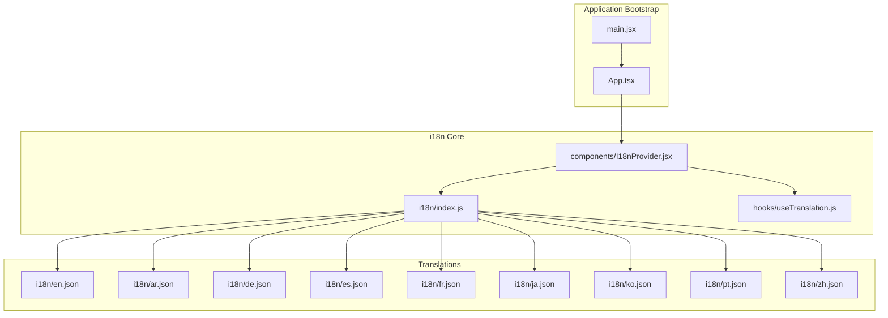
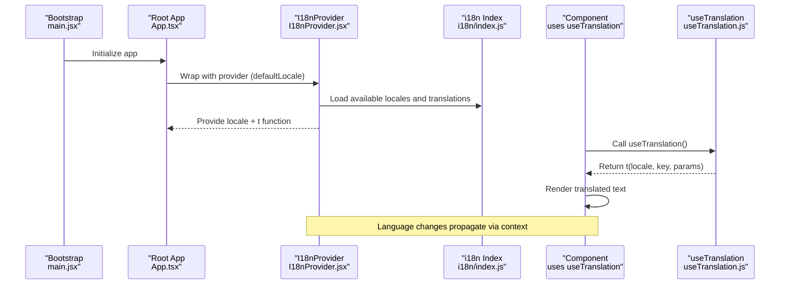
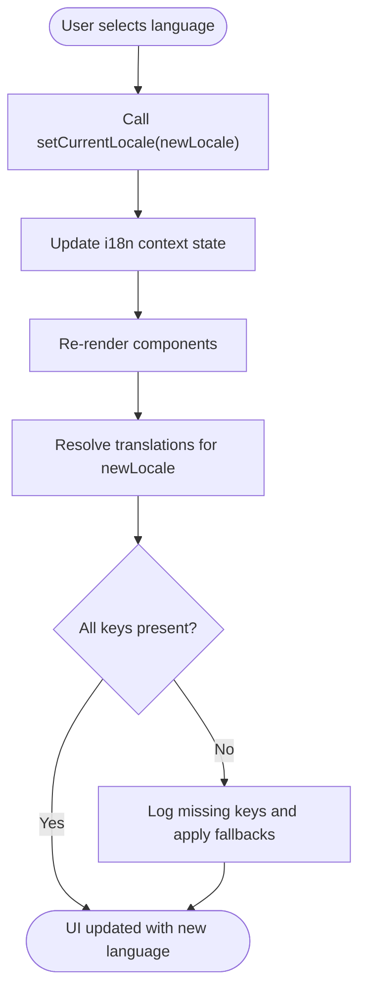
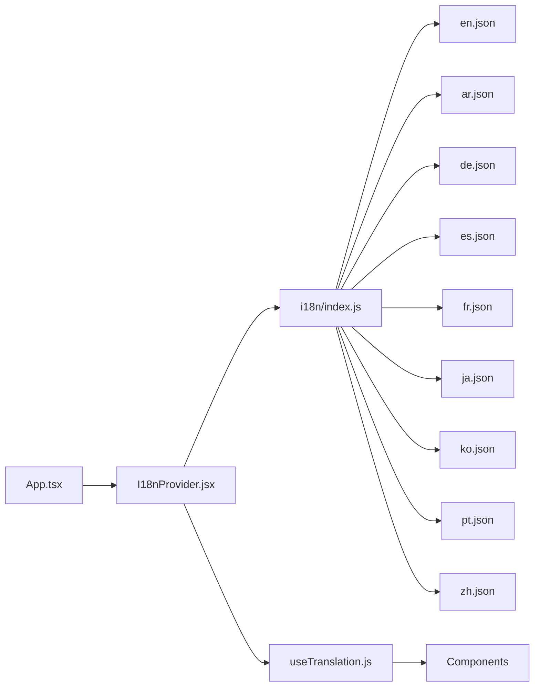

# i18n Architecture & Setup

<cite>
**Referenced Files in This Document**
- [I18nProvider.jsx](file://src/components/I18nProvider.jsx)
- [useTranslation.js](file://src/hooks/useTranslation.js)
- [i18n/index.js](file://src/i18n/index.js)
- [i18n/en.json](file://src/i18n/en.json)
- [i18n/ar.json](file://src/i18n/ar.json)
- [i18n/de.json](file://src/i18n/de.json)
- [i18n/es.json](file://src/i18n/es.json)
- [i18n/fr.json](file://src/i18n/fr.json)
- [i18n/ja.json](file://src/i18n/ja.json)
- [i18n/ko.json](file://src/i18n/ko.json)
- [i18n/pt.json](file://src/i18n/pt.json)
- [i18n/zh.json](file://src/i18n/zh.json)
- [App.tsx](file://src/App.tsx)
- [main.jsx](file://src/main.jsx)
</cite>

## Table of Contents
1. [Introduction](#introduction)
2. [Project Structure](#project-structure)
3. [Core Components](#core-components)
4. [Architecture Overview](#architecture-overview)
5. [Detailed Component Analysis](#detailed-component-analysis)
6. [Dependency Analysis](#dependency-analysis)
7. [Performance Considerations](#performance-considerations)
8. [Troubleshooting Guide](#troubleshooting-guide)
9. [Conclusion](#conclusion)

## Introduction
This document explains the internationalization (i18n) architecture and setup used across the application. It covers how translations are provided via a context provider, how components consume translations through a hook, how language switching works at runtime, and how translation files are organized. It also includes guidance on initialization, default language configuration, dynamic content handling, and error handling for missing keys.

## Project Structure
The i18n implementation is centered around three main areas:
- Provider and hook:
  - A React context provider that supplies the active locale and translation functions to the component tree.
  - A custom hook that components use to access translated strings and utilities like pluralization or interpolation.
- Translation resources:
  - JSON files per supported language located under src/i18n.
  - An index module that aggregates available locales and exports the i18n API.
- Application bootstrap:
  - The root app initializes the i18n provider with the default language and persists user preferences.

**Diagram sources**
- [main.jsx](file://src/main.jsx)
- [App.tsx](file://src/App.tsx)
- [I18nProvider.jsx](file://src/components/I18nProvider.jsx)
- [useTranslation.js](file://src/hooks/useTranslation.js)
- [i18n/index.js](file://src/i18n/index.js)
- [i18n/en.json](file://src/i18n/en.json)
- [i18n/ar.json](file://src/i18n/ar.json)
- [i18n/de.json](file://src/i18n/de.json)
- [i18n/es.json](file://src/i18n/es.json)
- [i18n/fr.json](file://src/i18n/fr.json)
- [i18n/ja.json](file://src/i18n/ja.json)
- [i18n/ko.json](file://src/i18n/ko.json)
- [i18n/pt.json](file://src/i18n/pt.json)
- [i18n/zh.json](file://src/i18n/zh.json)

**Section sources**
- [main.jsx](file://src/main.jsx)
- [App.tsx](file://src/App.tsx)
- [I18nProvider.jsx](file://src/components/I18nProvider.jsx)
- [useTranslation.js](file://src/hooks/useTranslation.js)
- [i18n/index.js](file://src/i18n/index.js)

## Core Components
- I18nProvider:
  - Wraps the application to expose the current locale and translation function via React Context.
  - Manages language persistence and provides a setter to switch languages at runtime.
- useTranslation hook:
  - Consumes the i18n context to return a t function and related utilities.
  - Encapsulates fallback behavior when keys are missing.
- i18n index:
  - Aggregates all translation JSON files and exposes available locales.
  - Provides helpers for loading and validating translations.

Key responsibilities:
- Initialization: Determine default language from configuration or persisted preference.
- Runtime switching: Update the active locale and re-render dependent components.
- Fallbacks: Return safe placeholders or English defaults when keys are missing.

**Section sources**
- [I18nProvider.jsx](file://src/components/I18nProvider.jsx)
- [useTranslation.js](file://src/hooks/useTranslation.js)
- [i18n/index.js](file://src/i18n/index.js)

## Architecture Overview
The i18n system follows a provider-hook pattern:
- The provider sets up the global state for the active locale and translation lookup.
- Components call the hook to retrieve the t function and optionally other utilities.
- Translation resources are loaded once and cached; switching languages updates the context without reloading the entire app.

**Diagram sources**
- [main.jsx](file://src/main.jsx)
- [App.tsx](file://src/App.tsx)
- [I18nProvider.jsx](file://src/components/I18nProvider.jsx)
- [useTranslation.js](file://src/hooks/useTranslation.js)
- [i18n/index.js](file://src/i18n/index.js)

## Detailed Component Analysis

### I18nProvider
Responsibilities:
- Accepts an initial/default locale and optional persisted locale.
- Loads translation bundles from the i18n index.
- Exposes setCurrentLocale to update the active language.
- Ensures components re-render when the locale changes.

Common patterns:
- Default language resolution: check persisted preference first, then fall back to configured default.
- Error handling: log warnings for missing keys and return a safe placeholder.
- Performance: memoize translation functions where appropriate to avoid unnecessary recalculations.

Integration points:
- Wrapped around the root component in App.tsx to make translations globally available.
- Uses i18n/index.js to enumerate and load translation files.

**Section sources**
- [I18nProvider.jsx](file://src/components/I18nProvider.jsx)
- [i18n/index.js](file://src/i18n/index.js)
- [App.tsx](file://src/App.tsx)

### useTranslation Hook
Responsibilities:
- Returns a t function for translating keys with optional parameters.
- Supports pluralization and interpolation if implemented in the translation data.
- Provides fallback behavior for missing keys (e.g., returning the key itself or a default string).

Usage patterns:
- In functional components: const { t } = useTranslation();
- For dynamic content: t("key", { variable: value })
- For conditional rendering: t("key") inside JSX expressions

Error handling:
- Logs missing keys during development.
- Returns consistent fallback values to prevent UI breakage.

**Section sources**
- [useTranslation.js](file://src/hooks/useTranslation.js)

### i18n Index and Translation Files
Organization:
- One JSON file per language under src/i18n.
- Keys should be namespaced by feature or screen for clarity (e.g., dashboard.overview.title).
- Consistent structure across all language files ensures reliable lookups.

Conventions:
- Use dot notation for hierarchical keys.
- Keep values simple strings; use variables for dynamic content.
- Maintain parity across locales to avoid missing key errors.

Available locales:
- en, ar, de, es, fr, ja, ko, pt, zh

Initialization:
- The index aggregates all translation modules and exposes helpers to get available locales and load translations.

**Section sources**
- [i18n/index.js](file://src/i18n/index.js)
- [i18n/en.json](file://src/i18n/en.json)
- [i18n/ar.json](file://src/i18n/ar.json)
- [i18n/de.json](file://src/i18n/de.json)
- [i18n/es.json](file://src/i18n/es.json)
- [i18n/fr.json](file://src/i18n/fr.json)
- [i18n/ja.json](file://src/i18n/ja.json)
- [i18n/ko.json](file://src/i18n/ko.json)
- [i18n/pt.json](file://src/i18n/pt.json)
- [i18n/zh.json](file://src/i18n/zh.json)

### Integration into Components
Recommended approach:
- Import the hook in any component that needs translations.
- Use the returned t function to render localized strings.
- For dynamic content, pass variables via the second parameter of t.

Example usage patterns:
- Static text: t("common.button.save")
- Dynamic text: t("dashboard.welcome.message", { name: userName })
- Conditional text: t("transaction.status." + status)

Best practices:
- Avoid concatenating strings outside of t; prefer interpolation.
- Keep keys stable and descriptive to simplify maintenance.
- Test components with multiple locales to ensure correct rendering.

**Section sources**
- [useTranslation.js](file://src/hooks/useTranslation.js)

### Language Switching Flow
Runtime switching:
- Call setCurrentLocale from the provider context (or via a settings UI).
- The provider updates the active locale and triggers re-renders.
- Components using useTranslation automatically reflect the new language.

Persistence:
- Persist the selected locale in local storage or user preferences.
- On app start, read the persisted locale and initialize the provider accordingly.

**Diagram sources**
- [I18nProvider.jsx](file://src/components/I18nProvider.jsx)
- [useTranslation.js](file://src/hooks/useTranslation.js)

## Dependency Analysis
The i18n system has clear boundaries:
- Provider depends on i18n index for resource management.
- Hook depends on provider context for accessing locale and t function.
- Components depend only on the hook, not directly on providers or resources.

**Diagram sources**
- [App.tsx](file://src/App.tsx)
- [I18nProvider.jsx](file://src/components/I18nProvider.jsx)
- [useTranslation.js](file://src/hooks/useTranslation.js)
- [i18n/index.js](file://src/i18n/index.js)
- [i18n/en.json](file://src/i18n/en.json)
- [i18n/ar.json](file://src/i18n/ar.json)
- [i18n/de.json](file://src/i18n/de.json)
- [i18n/es.json](file://src/i18n/es.json)
- [i18n/fr.json](file://src/i18n/fr.json)
- [i18n/ja.json](file://src/i18n/ja.json)
- [i18n/ko.json](file://src/i18n/ko.json)
- [i18n/pt.json](file://src/i18n/pt.json)
- [i18n/zh.json](file://src/i18n/zh.json)

**Section sources**
- [I18nProvider.jsx](file://src/components/I18nProvider.jsx)
- [useTranslation.js](file://src/hooks/useTranslation.js)
- [i18n/index.js](file://src/i18n/index.js)

## Performance Considerations
- Memoization: Ensure translation functions are memoized to avoid unnecessary recalculations.
- Lazy loading: Consider lazy-loading translation bundles for large applications.
- Key validation: Validate keys during development to catch missing translations early.
- Minimal re-renders: Scope locale changes to components that need them.

[No sources needed since this section provides general guidance]

## Troubleshooting Guide
Common issues and resolutions:
- Missing translation keys:
  - Check that the key exists in all language files.
  - Verify the key path matches the expected hierarchy.
  - Review logs for missing key warnings.
- Incorrect locale:
  - Confirm the persisted locale is valid and supported.
  - Ensure the provider initializes with a valid default locale.
- Dynamic content not updating:
  - Ensure variables passed to t are correctly referenced in the translation string.
  - Verify that state changes trigger re-renders.

Debugging tips:
- Enable verbose logging in development to track key lookups.
- Add unit tests for critical translation paths.
- Use browser dev tools to inspect context state.

**Section sources**
- [useTranslation.js](file://src/hooks/useTranslation.js)
- [I18nProvider.jsx](file://src/components/I18nProvider.jsx)

## Conclusion
The i18n architecture uses a clean provider-hook pattern that makes translations accessible throughout the application. By organizing translation files consistently, implementing robust fallbacks, and providing a straightforward API for components, the system supports scalable internationalization. Following the guidelines in this document will help maintain consistency and reliability across all supported languages.

[No sources needed since this section summarizes without analyzing specific files]