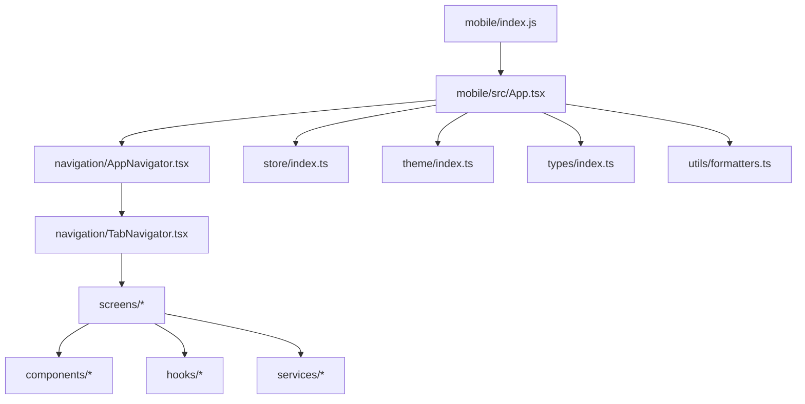
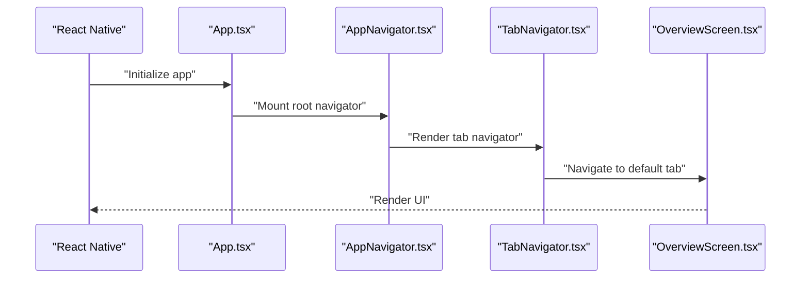
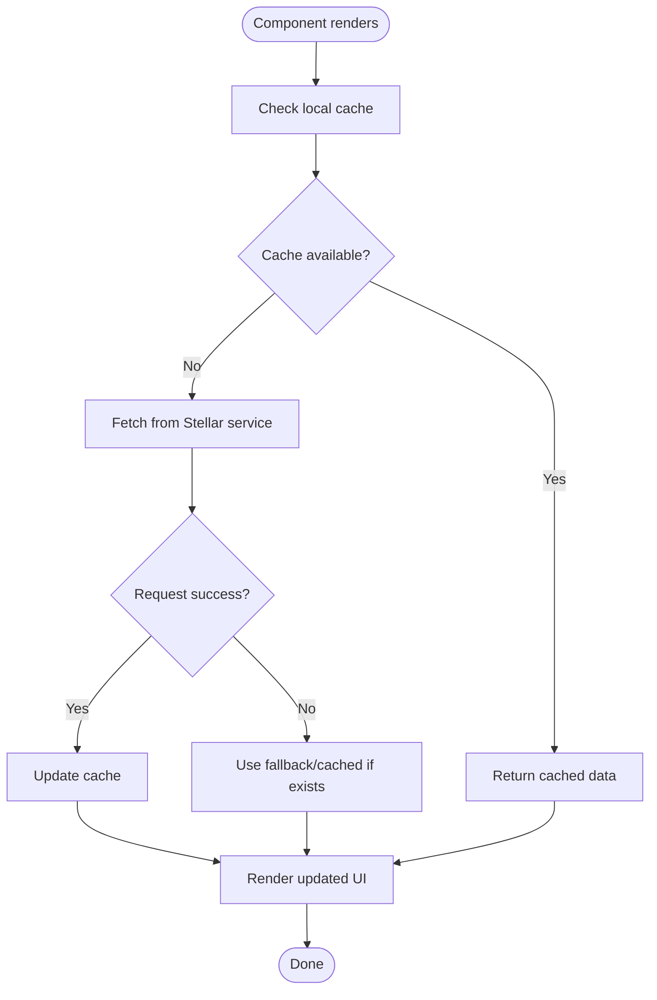
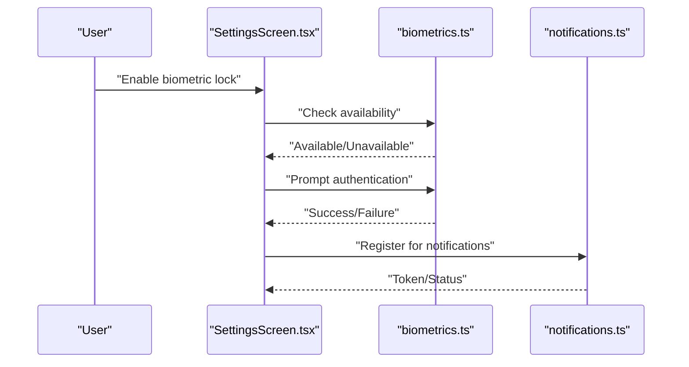
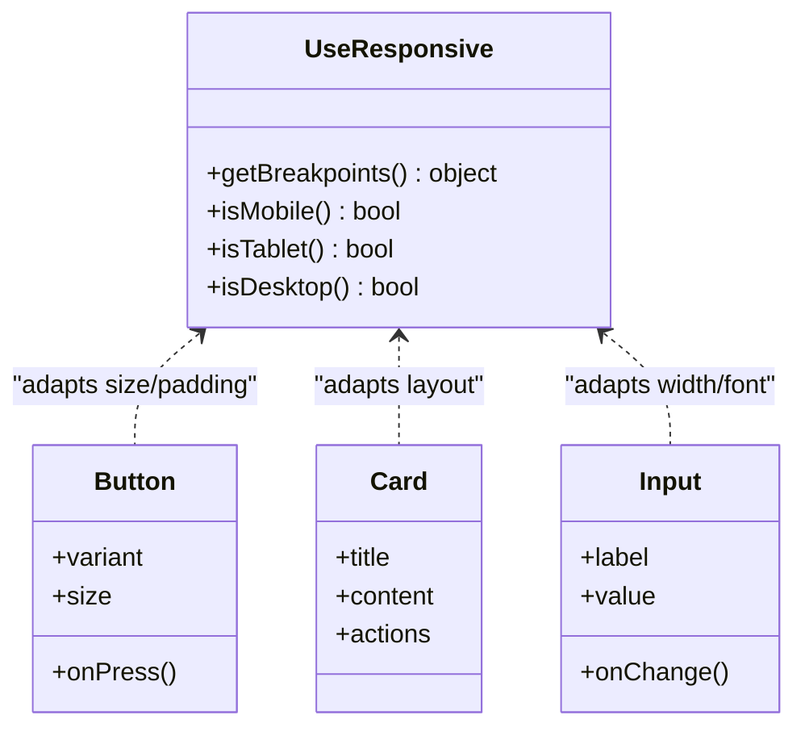
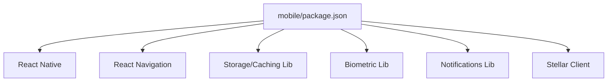

# Mobile Application

<cite>
**Referenced Files in This Document**
- [App.tsx](file://mobile/src/App.tsx)
- [AppNavigator.tsx](file://mobile/src/navigation/AppNavigator.tsx)
- [TabNavigator.tsx](file://mobile/src/navigation/TabNavigator.tsx)
- [types.ts](file://mobile/src/navigation/types.ts)
- [OverviewScreen.tsx](file://mobile/src/screens/OverviewScreen.tsx)
- [AccountScreen.tsx](file://mobile/src/screens/AccountScreen.tsx)
- [TransactionsScreen.tsx](file://mobile/src/screens/TransactionsScreen.tsx)
- [AssetsScreen.tsx](file://mobile/src/screens/AssetsScreen.tsx)
- [DEXScreen.tsx](file://mobile/src/screens/DEXScreen.tsx)
- [ContractsScreen.tsx](file://mobile/src/screens/ContractsScreen.tsx)
- [MultisigScreen.tsx](file://mobile/src/screens/MultisigScreen.tsx)
- [FaucetScreen.tsx](file://mobile/src/screens/FaucetScreen.tsx)
- [NetworkScreen.tsx](file://mobile/src/screens/NetworkScreen.tsx)
- [SettingsScreen.tsx](file://mobile/src/screens/SettingsScreen.tsx)
- [ConnectScreen.tsx](file://mobile/src/screens/ConnectScreen.tsx)
- [PortfolioScreen.tsx](file://mobile/src/screens/PortfolioScreen.tsx)
- [CustomDrawerContent.tsx](file://mobile/src/components/CustomDrawerContent.tsx)
- [OfflineBanner.tsx](file://mobile/src/components/OfflineBanner.tsx)
- [Button.tsx](file://mobile/src/components/Button.tsx)
- [Card.tsx](file://mobile/src/components/Card.tsx)
- [Input.tsx](file://mobile/src/components/Input.tsx)
- [Loading.tsx](file://mobile/src/components/Loading.tsx)
- [ErrorBoundary.tsx](file://mobile/src/components/ErrorBoundary.tsx)
- [useResponsive.ts](file://mobile/src/hooks/useResponsive.ts)
- [useStellarSWR.ts](file://mobile/src/hooks/useStellarSWR.ts)
- [biometrics.ts](file://mobile/src/services/biometrics.ts)
- [notifications.ts](file://mobile/src/services/notifications.ts)
- [offline.ts](file://mobile/src/services/offline.ts)
- [stellar.ts](file://mobile/src/services/stellar.ts)
- [index.ts](file://mobile/src/store/index.ts)
- [index.ts](file://mobile/src/theme/index.ts)
- [index.ts](file://mobile/src/types/index.ts)
- [formatters.ts](file://mobile/src/utils/formatters.ts)
- [package.json](file://mobile/package.json)
- [app.json](file://mobile/app.json)
- [babel.config.js](file://mobile/babel.config.js)
- [metro.config.js](file://mobile/metro.config.js)
- [tsconfig.json](file://mobile/tsconfig.json)
- [index.js](file://mobile/index.js)
</cite>

## Table of Contents
1. [Introduction](#introduction)
2. [Project Structure](#project-structure)
3. [Core Components](#core-components)
4. [Architecture Overview](#architecture-overview)
5. [Detailed Component Analysis](#detailed-component-analysis)
6. [Dependency Analysis](#dependency-analysis)
7. [Performance Considerations](#performance-considerations)
8. [Troubleshooting Guide](#troubleshooting-guide)
9. [Conclusion](#conclusion)
10. [Appendices](#appendices)

## Introduction
This document provides comprehensive documentation for the React Native mobile application included in the repository. It explains the mobile architecture, screen organization, navigation patterns, and native device integrations. It also documents feature parity with the web application, offline support implementation using local storage and caching strategies, performance optimization techniques, setup instructions for iOS and Android development, building steps, testing strategies, and mobile-specific considerations such as biometric authentication, push notifications, and responsive design patterns.

## Project Structure
The mobile app is organized under the mobile directory with a clear separation of concerns:
- App entry point and configuration files at the root of the mobile folder
- Navigation layer defining top-level routes and tab-based navigation
- Screens implementing feature-focused views (overview, accounts, transactions, assets, DEX, contracts, multisig, faucet, network, settings, connect, portfolio)
- Shared components for UI primitives and common UX elements
- Hooks for responsiveness and data fetching tailored to Stellar
- Services encapsulating native integrations (biometrics, notifications), offline capabilities, and Stellar API interactions
- Store for global state management
- Theme definitions and shared types
- Utilities for formatting and presentation

**Diagram sources**
- [index.js:1-200](file://mobile/index.js#L1-L200)
- [App.tsx:1-200](file://mobile/src/App.tsx#L1-L200)
- [AppNavigator.tsx:1-200](file://mobile/src/navigation/AppNavigator.tsx#L1-L200)
- [TabNavigator.tsx:1-200](file://mobile/src/navigation/TabNavigator.tsx#L1-L200)

**Section sources**
- [index.js:1-200](file://mobile/index.js#L1-L200)
- [App.tsx:1-200](file://mobile/src/App.tsx#L1-L200)
- [AppNavigator.tsx:1-200](file://mobile/src/navigation/AppNavigator.tsx#L1-L200)
- [TabNavigator.tsx:1-200](file://mobile/src/navigation/TabNavigator.tsx#L1-L200)

## Core Components
- Entry point and app bootstrap:
  - The app initializes React Native, configures providers, and mounts the root navigator.
- Navigation:
  - Top-level navigator sets up stack/tab structure and guards.
  - Tab navigator organizes primary features into tabs.
- Screens:
  - Feature-oriented screens implement core user flows like overview, account details, transactions, assets, DEX, contracts, multisig, faucet, network selection, settings, connection flow, and portfolio view.
- Shared UI components:
  - Reusable primitives (button, card, input, loading indicator) and UX helpers (offline banner, error boundary).
- Hooks:
  - Responsive hook adapts layouts across devices.
  - Data-fetching hook integrates SWR-like patterns for Stellar data.
- Services:
  - Biometrics service wraps platform-native biometric prompts.
  - Notifications service manages push notification registration and handling.
  - Offline service coordinates local storage and cache synchronization.
  - Stellar service abstracts Horizon/Soroban calls and transaction workflows.
- State and theme:
  - Global store holds app-wide state.
  - Theme defines colors, typography, and spacing tokens.
- Types and utilities:
  - Shared TypeScript types ensure consistency.
  - Formatting utilities standardize number, date, and asset display.

**Section sources**
- [App.tsx:1-200](file://mobile/src/App.tsx#L1-L200)
- [AppNavigator.tsx:1-200](file://mobile/src/navigation/AppNavigator.tsx#L1-L200)
- [TabNavigator.tsx:1-200](file://mobile/src/navigation/TabNavigator.tsx#L1-L200)
- [OverviewScreen.tsx:1-200](file://mobile/src/screens/OverviewScreen.tsx#L1-L200)
- [AccountScreen.tsx:1-200](file://mobile/src/screens/AccountScreen.tsx#L1-L200)
- [TransactionsScreen.tsx:1-200](file://mobile/src/screens/TransactionsScreen.tsx#L1-L200)
- [AssetsScreen.tsx:1-200](file://mobile/src/screens/AssetsScreen.tsx#L1-L200)
- [DEXScreen.tsx:1-200](file://mobile/src/screens/DEXScreen.tsx#L1-L200)
- [ContractsScreen.tsx:1-200](file://mobile/src/screens/ContractsScreen.tsx#L1-L200)
- [MultisigScreen.tsx:1-200](file://mobile/src/screens/MultisigScreen.tsx#L1-L200)
- [FaucetScreen.tsx:1-200](file://mobile/src/screens/FaucetScreen.tsx#L1-L200)
- [NetworkScreen.tsx:1-200](file://mobile/src/screens/NetworkScreen.tsx#L1-L200)
- [SettingsScreen.tsx:1-200](file://mobile/src/screens/SettingsScreen.tsx#L1-L200)
- [ConnectScreen.tsx:1-200](file://mobile/src/screens/ConnectScreen.tsx#L1-L200)
- [PortfolioScreen.tsx:1-200](file://mobile/src/screens/PortfolioScreen.tsx#L1-L200)
- [CustomDrawerContent.tsx:1-200](file://mobile/src/components/CustomDrawerContent.tsx#L1-L200)
- [OfflineBanner.tsx:1-200](file://mobile/src/components/OfflineBanner.tsx#L1-L200)
- [Button.tsx:1-200](file://mobile/src/components/Button.tsx#L1-L200)
- [Card.tsx:1-200](file://mobile/src/components/Card.tsx#L1-L200)
- [Input.tsx:1-200](file://mobile/src/components/Input.tsx#L1-L200)
- [Loading.tsx:1-200](file://mobile/src/components/Loading.tsx#L1-L200)
- [ErrorBoundary.tsx:1-200](file://mobile/src/components/ErrorBoundary.tsx#L1-L200)
- [useResponsive.ts:1-200](file://mobile/src/hooks/useResponsive.ts#L1-L200)
- [useStellarSWR.ts:1-200](file://mobile/src/hooks/useStellarSWR.ts#L1-L200)
- [biometrics.ts:1-200](file://mobile/src/services/biometrics.ts#L1-L200)
- [notifications.ts:1-200](file://mobile/src/services/notifications.ts#L1-L200)
- [offline.ts:1-200](file://mobile/src/services/offline.ts#L1-L200)
- [stellar.ts:1-200](file://mobile/src/services/stellar.ts#L1-L200)
- [index.ts:1-200](file://mobile/src/store/index.ts#L1-L200)
- [index.ts:1-200](file://mobile/src/theme/index.ts#L1-L200)
- [index.ts:1-200](file://mobile/src/types/index.ts#L1-L200)
- [formatters.ts:1-200](file://mobile/src/utils/formatters.ts#L1-L200)

## Architecture Overview
The mobile app follows a layered architecture:
- Presentation Layer: Screens and shared components render UI and handle user interactions.
- Navigation Layer: Centralized routing via React Navigation with tab and stack navigators.
- Business Logic Layer: Hooks encapsulate data fetching and reactive updates; services orchestrate native integrations and external APIs.
- Data Layer: Local storage and caching provide offline support; Stellar service communicates with Horizon/Soroban endpoints.
- Cross-Cutting Concerns: Error boundary, offline banner, theme, and global store.

```mermaid
graph TB
subgraph "Presentation"
S1["OverviewScreen"]
S2["AccountScreen"]
S3["TransactionsScreen"]
S4["AssetsScreen"]
S5["DEXScreen"]
S6["ContractsScreen"]
S7["MultisigScreen"]
S8["FaucetScreen"]
S9["NetworkScreen"]
S10["SettingsScreen"]
S11["ConnectScreen"]
S12["PortfolioScreen"]
C1["Button"]
C2["Card"]
C3["Input"]
C4["Loading"]
C5["OfflineBanner"]
C6["ErrorBoundary"]
end
subgraph "Navigation"
N1["AppNavigator"]
N2["TabNavigator"]
end
subgraph "Hooks"
H1["useResponsive"]
H2["useStellarSWR"]
end
subgraph "Services"
SV1["biometrics"]
SV2["notifications"]
SV3["offline"]
SV4["stellar"]
end
subgraph "State & Theme"
ST1["Store"]
TH1["Theme"]
end
S1 --> N1
S2 --> N1
S3 --> N1
S4 --> N1
S5 --> N1
S6 --> N1
S7 --> N1
S8 --> N1
S9 --> N1
S10 --> N1
S11 --> N1
S12 --> N1
N1 --> N2
S1 --> H1
S1 --> H2
S1 --> SV4
S1 --> SV3
S1 --> ST1
S1 --> TH1
S1 --> C1
S1 --> C2
S1 --> C3
S1 --> C4
S1 --> C5
S1 --> C6
```

**Diagram sources**
- [AppNavigator.tsx:1-200](file://mobile/src/navigation/AppNavigator.tsx#L1-L200)
- [TabNavigator.tsx:1-200](file://mobile/src/navigation/TabNavigator.tsx#L1-L200)
- [OverviewScreen.tsx:1-200](file://mobile/src/screens/OverviewScreen.tsx#L1-L200)
- [AccountScreen.tsx:1-200](file://mobile/src/screens/AccountScreen.tsx#L1-L200)
- [TransactionsScreen.tsx:1-200](file://mobile/src/screens/TransactionsScreen.tsx#L1-L200)
- [AssetsScreen.tsx:1-200](file://mobile/src/screens/AssetsScreen.tsx#L1-L200)
- [DEXScreen.tsx:1-200](file://mobile/src/screens/DEXScreen.tsx#L1-L200)
- [ContractsScreen.tsx:1-200](file://mobile/src/screens/ContractsScreen.tsx#L1-L200)
- [MultisigScreen.tsx:1-200](file://mobile/src/screens/MultisigScreen.tsx#L1-L200)
- [FaucetScreen.tsx:1-200](file://mobile/src/screens/FaucetScreen.tsx#L1-L200)
- [NetworkScreen.tsx:1-200](file://mobile/src/screens/NetworkScreen.tsx#L1-L200)
- [SettingsScreen.tsx:1-200](file://mobile/src/screens/SettingsScreen.tsx#L1-L200)
- [ConnectScreen.tsx:1-200](file://mobile/src/screens/ConnectScreen.tsx#L1-L200)
- [PortfolioScreen.tsx:1-200](file://mobile/src/screens/PortfolioScreen.tsx#L1-L200)
- [useResponsive.ts:1-200](file://mobile/src/hooks/useResponsive.ts#L1-L200)
- [useStellarSWR.ts:1-200](file://mobile/src/hooks/useStellarSWR.ts#L1-L200)
- [biometrics.ts:1-200](file://mobile/src/services/biometrics.ts#L1-L200)
- [notifications.ts:1-200](file://mobile/src/services/notifications.ts#L1-L200)
- [offline.ts:1-200](file://mobile/src/services/offline.ts#L1-L200)
- [stellar.ts:1-200](file://mobile/src/services/stellar.ts#L1-L200)
- [index.ts:1-200](file://mobile/src/store/index.ts#L1-L200)
- [index.ts:1-200](file://mobile/src/theme/index.ts#L1-L200)
- [Button.tsx:1-200](file://mobile/src/components/Button.tsx#L1-L200)
- [Card.tsx:1-200](file://mobile/src/components/Card.tsx#L1-L200)
- [Input.tsx:1-200](file://mobile/src/components/Input.tsx#L1-L200)
- [Loading.tsx:1-200](file://mobile/src/components/Loading.tsx#L1-L200)
- [OfflineBanner.tsx:1-200](file://mobile/src/components/OfflineBanner.tsx#L1-L200)
- [ErrorBoundary.tsx:1-200](file://mobile/src/components/ErrorBoundary.tsx#L1-L200)

## Detailed Component Analysis

### Navigation Layer
- App Navigator:
  - Configures the root navigator and initial route.
  - Integrates tab navigation and optional drawer or modal stacks.
- Tab Navigator:
  - Defines primary tabs for key features (e.g., Overview, Accounts, Transactions, Assets, DEX, Contracts, Multisig, Faucet, Network, Settings, Connect, Portfolio).
  - Ensures consistent header behavior and safe area handling.

**Diagram sources**
- [App.tsx:1-200](file://mobile/src/App.tsx#L1-L200)
- [AppNavigator.tsx:1-200](file://mobile/src/navigation/AppNavigator.tsx#L1-L200)
- [TabNavigator.tsx:1-200](file://mobile/src/navigation/TabNavigator.tsx#L1-L200)
- [OverviewScreen.tsx:1-200](file://mobile/src/screens/OverviewScreen.tsx#L1-L200)

**Section sources**
- [AppNavigator.tsx:1-200](file://mobile/src/navigation/AppNavigator.tsx#L1-L200)
- [TabNavigator.tsx:1-200](file://mobile/src/navigation/TabNavigator.tsx#L1-L200)
- [types.ts:1-200](file://mobile/src/navigation/types.ts#L1-L200)

### Data Fetching and Caching
- useStellarSWR Hook:
  - Provides declarative data fetching with caching and revalidation for Stellar resources.
  - Integrates with the offline service to serve cached data when network is unavailable.
- Offline Service:
  - Manages local storage persistence and cache invalidation policies.
  - Coordinates background sync when connectivity is restored.

**Diagram sources**
- [useStellarSWR.ts:1-200](file://mobile/src/hooks/useStellarSWR.ts#L1-L200)
- [offline.ts:1-200](file://mobile/src/services/offline.ts#L1-L200)
- [stellar.ts:1-200](file://mobile/src/services/stellar.ts#L1-L200)

**Section sources**
- [useStellarSWR.ts:1-200](file://mobile/src/hooks/useStellarSWR.ts#L1-L200)
- [offline.ts:1-200](file://mobile/src/services/offline.ts#L1-L200)
- [stellar.ts:1-200](file://mobile/src/services/stellar.ts#L1-L200)

### Native Device Integrations
- Biometrics:
  - Prompts users for fingerprint or face unlock to secure sensitive actions.
  - Handles platform differences and permission states gracefully.
- Notifications:
  - Registers for push notifications and handles incoming events.
  - Supports deep linking to relevant screens based on payload.

**Diagram sources**
- [biometrics.ts:1-200](file://mobile/src/services/biometrics.ts#L1-L200)
- [notifications.ts:1-200](file://mobile/src/services/notifications.ts#L1-L200)
- [SettingsScreen.tsx:1-200](file://mobile/src/screens/SettingsScreen.tsx#L1-L200)

**Section sources**
- [biometrics.ts:1-200](file://mobile/src/services/biometrics.ts#L1-L200)
- [notifications.ts:1-200](file://mobile/src/services/notifications.ts#L1-L200)
- [SettingsScreen.tsx:1-200](file://mobile/src/screens/SettingsScreen.tsx#L1-L200)

### Responsive Design Patterns
- useResponsive Hook:
  - Detects device type and viewport characteristics.
  - Exposes breakpoints and layout hints to adapt UI accordingly.
- Shared Components:
  - Buttons, cards, inputs, and banners adjust padding, font sizes, and layout direction based on responsive context.

**Diagram sources**
- [useResponsive.ts:1-200](file://mobile/src/hooks/useResponsive.ts#L1-L200)
- [Button.tsx:1-200](file://mobile/src/components/Button.tsx#L1-L200)
- [Card.tsx:1-200](file://mobile/src/components/Card.tsx#L1-L200)
- [Input.tsx:1-200](file://mobile/src/components/Input.tsx#L1-L200)

**Section sources**
- [useResponsive.ts:1-200](file://mobile/src/hooks/useResponsive.ts#L1-L200)
- [Button.tsx:1-200](file://mobile/src/components/Button.tsx#L1-L200)
- [Card.tsx:1-200](file://mobile/src/components/Card.tsx#L1-L200)
- [Input.tsx:1-200](file://mobile/src/components/Input.tsx#L1-L200)

### Feature Parity with Web Application
- Core Features:
  - Account overview, transaction history, asset management, DEX operations, contract interaction, multisig workflows, faucet usage, network selection, settings, connection flow, and portfolio analytics are implemented as dedicated screens.
- Shared Utilities:
  - Formatting utilities and theme tokens align visual consistency between web and mobile.
- Differences:
  - Mobile emphasizes touch-friendly interactions, bottom navigation/tabs, and native integrations (biometrics, notifications).
  - Web may include advanced dashboards and complex charts not fully ported to mobile yet.

**Section sources**
- [OverviewScreen.tsx:1-200](file://mobile/src/screens/OverviewScreen.tsx#L1-L200)
- [AccountScreen.tsx:1-200](file://mobile/src/screens/AccountScreen.tsx#L1-L200)
- [TransactionsScreen.tsx:1-200](file://mobile/src/screens/TransactionsScreen.tsx#L1-L200)
- [AssetsScreen.tsx:1-200](file://mobile/src/screens/AssetsScreen.tsx#L1-L200)
- [DEXScreen.tsx:1-200](file://mobile/src/screens/DEXScreen.tsx#L1-L200)
- [ContractsScreen.tsx:1-200](file://mobile/src/screens/ContractsScreen.tsx#L1-L200)
- [MultisigScreen.tsx:1-200](file://mobile/src/screens/MultisigScreen.tsx#L1-L200)
- [FaucetScreen.tsx:1-200](file://mobile/src/screens/FaucetScreen.tsx#L1-L200)
- [NetworkScreen.tsx:1-200](file://mobile/src/screens/NetworkScreen.tsx#L1-L200)
- [SettingsScreen.tsx:1-200](file://mobile/src/screens/SettingsScreen.tsx#L1-L200)
- [ConnectScreen.tsx:1-200](file://mobile/src/screens/ConnectScreen.tsx#L1-L200)
- [PortfolioScreen.tsx:1-200](file://mobile/src/screens/PortfolioScreen.tsx#L1-L200)
- [formatters.ts:1-200](file://mobile/src/utils/formatters.ts#L1-L200)
- [index.ts:1-200](file://mobile/src/theme/index.ts#L1-L200)

## Dependency Analysis
The mobile app depends on:
- React Native runtime and ecosystem packages defined in package.json.
- React Navigation for routing and navigation.
- Storage and caching libraries for offline support.
- Biometric and notification libraries for native integrations.
- Stellar SDK or HTTP client for Horizon/Soroban communication.

**Diagram sources**
- [package.json:1-200](file://mobile/package.json#L1-L200)

**Section sources**
- [package.json:1-200](file://mobile/package.json#L1-L200)

## Performance Considerations
- Rendering Optimization:
  - Use memoization for expensive computations and derived values.
  - Avoid unnecessary re-renders by splitting components and leveraging hooks effectively.
- Data Fetching:
  - Prefer pagination and infinite scrolling for large lists.
  - Implement optimistic updates where appropriate to improve perceived performance.
- Caching Strategy:
  - Cache frequently accessed data locally with TTL and invalidation rules.
  - Serve stale-while-revalidate patterns to keep UI responsive.
- Memory Management:
  - Unsubscribe listeners and cancel requests on unmount.
  - Limit image sizes and use lazy loading for media.
- Native Bridges:
  - Minimize bridge calls; batch operations where possible.
  - Profile native modules to identify bottlenecks.

[No sources needed since this section provides general guidance]

## Troubleshooting Guide
Common issues and resolutions:
- Navigation Errors:
  - Ensure all routes are registered and parameters match expected types.
  - Validate tab configurations and avoid circular dependencies.
- Offline Mode:
  - Verify local storage permissions and capacity.
  - Confirm cache keys and invalidation logic align with backend changes.
- Biometric Authentication:
  - Handle unsupported devices and permission denials gracefully.
  - Provide fallback PIN or password options.
- Push Notifications:
  - Check platform-specific configurations (APNs for iOS, Firebase for Android).
  - Validate token registration and message routing.
- Stellar API Failures:
  - Implement retries with exponential backoff.
  - Surface meaningful errors to users and log diagnostics.

**Section sources**
- [ErrorBoundary.tsx:1-200](file://mobile/src/components/ErrorBoundary.tsx#L1-L200)
- [OfflineBanner.tsx:1-200](file://mobile/src/components/OfflineBanner.tsx#L1-L200)
- [biometrics.ts:1-200](file://mobile/src/services/biometrics.ts#L1-L200)
- [notifications.ts:1-200](file://mobile/src/services/notifications.ts#L1-L200)
- [offline.ts:1-200](file://mobile/src/services/offline.ts#L1-L200)
- [stellar.ts:1-200](file://mobile/src/services/stellar.ts#L1-L200)

## Conclusion
The mobile application provides a robust, modular architecture that mirrors core web features while embracing mobile-specific patterns. With well-defined navigation, reusable components, and integrated native services, it delivers a responsive and performant experience. Offline support ensures continuity, and thoughtful performance optimizations maintain smooth interactions. Future enhancements can focus on expanding charting capabilities, deep-linking, and advanced analytics tailored to mobile contexts.

[No sources needed since this section summarizes without analyzing specific files]

## Appendices

### Setup Instructions for Mobile Development Environment
- Prerequisites:
  - Node.js and pnpm installed.
  - Xcode and CocoaPods for iOS development.
  - Android Studio and Android SDK for Android development.
- Installation:
  - Install dependencies within the mobile directory.
  - Configure environment variables for networks and API endpoints.
- Running Locally:
  - Launch Metro bundler and run on connected devices or emulators.
- Building:
  - Generate signed APK/AAB for Android.
  - Build IPA for iOS distribution.

**Section sources**
- [package.json:1-200](file://mobile/package.json#L1-L200)
- [app.json:1-200](file://mobile/app.json#L1-L200)
- [babel.config.js:1-200](file://mobile/babel.config.js#L1-L200)
- [metro.config.js:1-200](file://mobile/metro.config.js#L1-L200)
- [tsconfig.json:1-200](file://mobile/tsconfig.json#L1-L200)
- [index.js:1-200](file://mobile/index.js#L1-L200)

### Testing Strategies
- Unit Tests:
  - Test hooks and utility functions for correctness and edge cases.
- Integration Tests:
  - Validate navigation flows and service interactions.
- Visual Regression:
  - Capture screenshots across devices and compare against baselines.
- E2E Tests:
  - Automate critical user journeys using device simulators.

[No sources needed since this section provides general guidance]