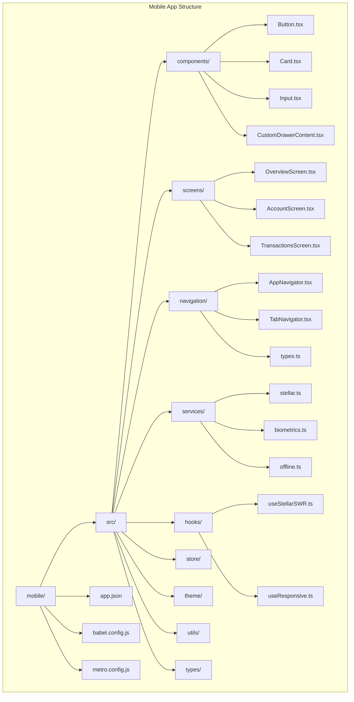
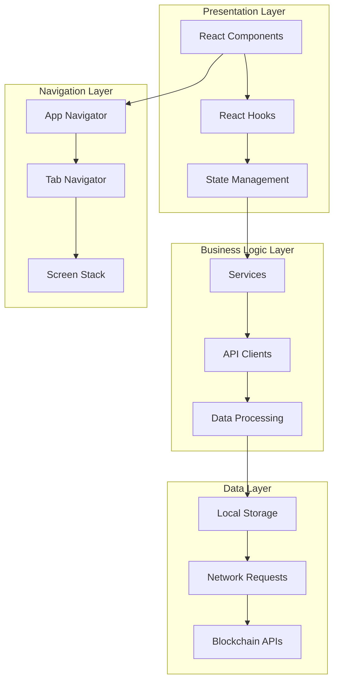
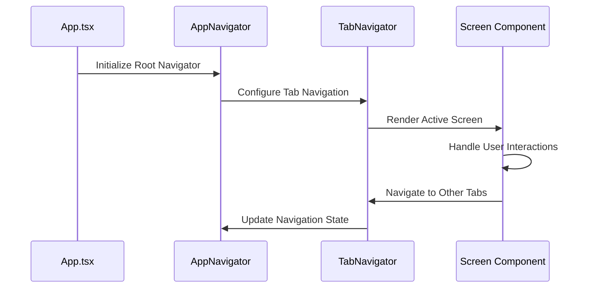
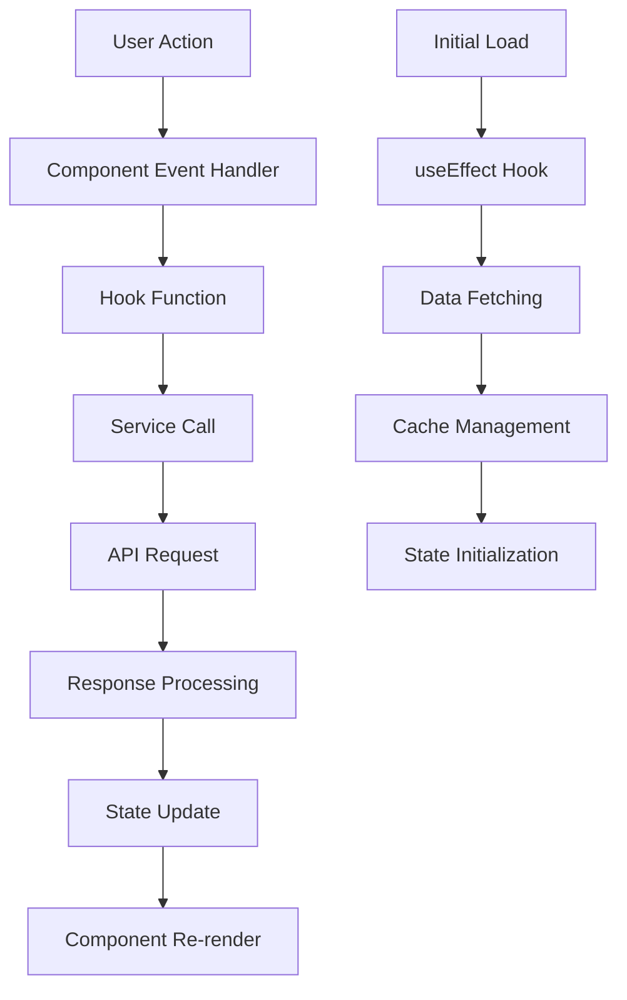
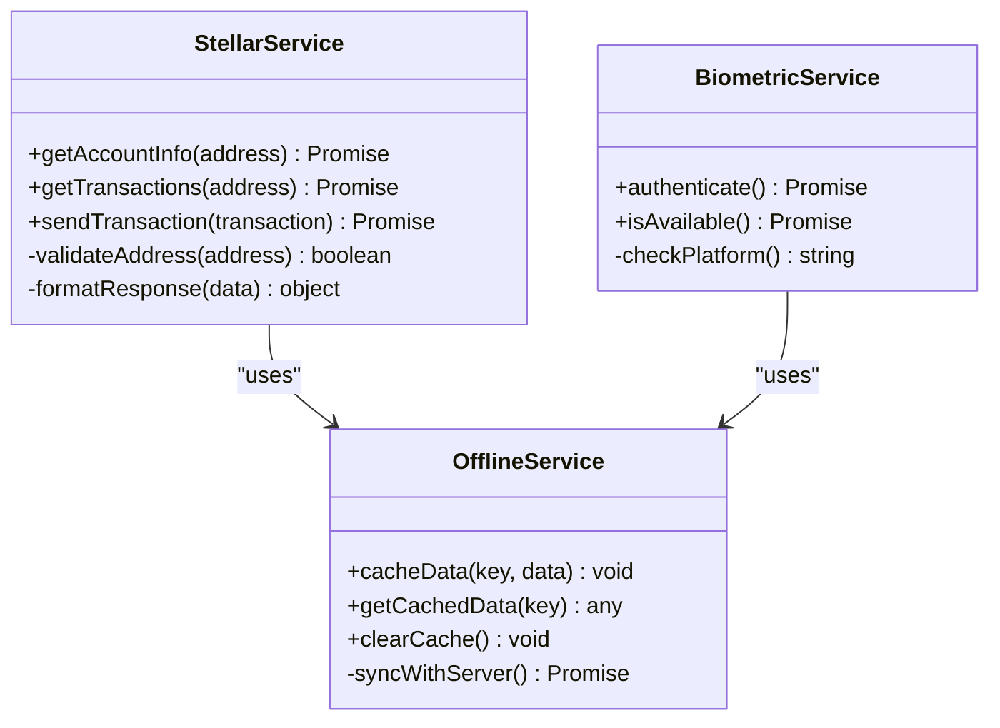
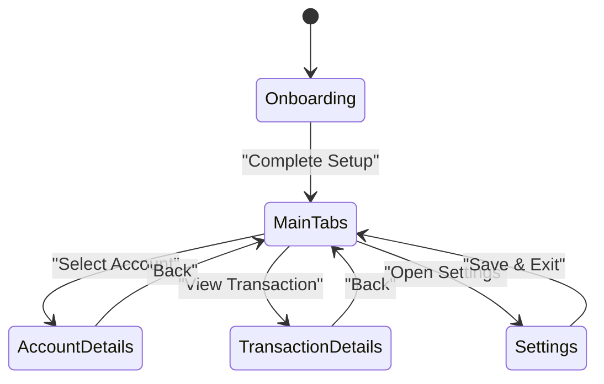
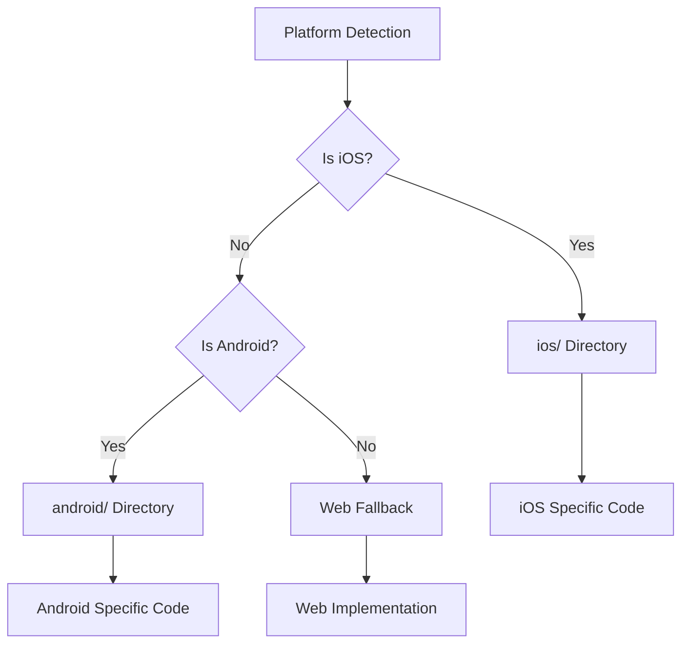

# Mobile Architecture & Setup

<cite>
**Referenced Files in This Document**
- [mobile/App.tsx](file://mobile/src/App.tsx)
- [mobile/index.js](file://mobile/index.js)
- [mobile/app.json](file://mobile/app.json)
- [mobile/babel.config.js](file://mobile/babel.config.js)
- [mobile/metro.config.js](file://mobile/metro.config.js)
- [mobile/tsconfig.json](file://mobile/tsconfig.json)
- [mobile/package.json](file://mobile/package.json)
- [mobile/src/navigation/AppNavigator.tsx](file://mobile/src/navigation/AppNavigator.tsx)
- [mobile/src/navigation/TabNavigator.tsx](file://mobile/src/navigation/TabNavigator.tsx)
- [mobile/src/navigation/types.ts](file://mobile/src/navigation/types.ts)
- [mobile/src/screens/OverviewScreen.tsx](file://mobile/src/screens/OverviewScreen.tsx)
- [mobile/src/screens/AccountScreen.tsx](file://mobile/src/screens/AccountScreen.tsx)
- [mobile/src/screens/TransactionsScreen.tsx](file://mobile/src/screens/TransactionsScreen.tsx)
- [mobile/src/components/Button.tsx](file://mobile/src/components/Button.tsx)
- [mobile/src/components/Card.tsx](file://mobile/src/components/Card.tsx)
- [mobile/src/components/Input.tsx](file://mobile/src/components/Input.tsx)
- [mobile/src/hooks/useStellarSWR.ts](file://mobile/src/hooks/useStellarSWR.ts)
- [mobile/src/services/stellar.ts](file://mobile/src/services/stellar.ts)
- [mobile/src/theme/index.ts](file://mobile/src/theme/index.ts)
- [mobile/src/store/index.ts](file://mobile/src/store/index.ts)
</cite>

## Table of Contents
1. [Introduction](#introduction)
2. [Project Structure](#project-structure)
3. [Core Components](#core-components)
4. [Architecture Overview](#architecture-overview)
5. [Detailed Component Analysis](#detailed-component-analysis)
6. [Development Environment Setup](#development-environment-setup)
7. [Navigation Patterns](#navigation-patterns)
8. [Configuration Files](#configuration-files)
9. [Dependency Management](#dependency-management)
10. [Build Processes](#build-processes)
11. [Cross-Platform Compatibility](#cross-platform-compatibility)
12. [Code Sharing Strategies](#code-sharing-strategies)
13. [Debugging Techniques](#debugging-techniques)
14. [Performance Considerations](#performance-considerations)
15. [Troubleshooting Guide](#troubleshooting-guide)
16. [Conclusion](#conclusion)

## Introduction

This document provides comprehensive documentation for the React Native mobile application architecture within the stellar-dev-dashboard project. The mobile application is built using Expo CLI and follows modern React Native development practices with TypeScript support. The app implements a modular architecture with clear separation of concerns, featuring React Navigation for screen management, custom components, hooks for data fetching, and services for blockchain interactions.

The mobile application serves as a companion interface to the main web dashboard, providing essential Stellar blockchain functionality including account management, transaction viewing, asset tracking, and portfolio analytics optimized for mobile devices.

## Project Structure

The mobile application follows a feature-based organization pattern with clear separation between UI components, business logic, and platform-specific code:



**Diagram sources**
- [mobile/src/App.tsx](file://mobile/src/App.tsx)
- [mobile/src/navigation/AppNavigator.tsx](file://mobile/src/navigation/AppNavigator.tsx)
- [mobile/src/navigation/TabNavigator.tsx](file://mobile/src/navigation/TabNavigator.tsx)

**Section sources**
- [mobile/src/App.tsx](file://mobile/src/App.tsx)
- [mobile/src/navigation/AppNavigator.tsx](file://mobile/src/navigation/AppNavigator.tsx)

## Core Components

The mobile application implements a component-driven architecture with reusable UI elements and specialized screens:

### Component Organization

| Category | Purpose | Examples |
|----------|---------|----------|
| **UI Components** | Reusable interface elements | Button, Card, Input, Loading |
| **Screen Components** | Full-page views | OverviewScreen, AccountScreen, TransactionsScreen |
| **Layout Components** | Structural containers | CustomDrawerContent, ErrorBoundary |
| **Utility Components** | Helper functions | formatters, validators |

### Key UI Components

The component library focuses on consistency and reusability across the application:

- **Button**: Primary action component with loading states and accessibility support
- **Card**: Container component for grouping related information
- **Input**: Form input component with validation and error handling
- **Loading**: Universal loading indicator with customizable content
- **ErrorBoundary**: Global error handling wrapper for graceful degradation

**Section sources**
- [mobile/src/components/Button.tsx](file://mobile/src/components/Button.tsx)
- [mobile/src/components/Card.tsx](file://mobile/src/components/Card.tsx)
- [mobile/src/components/Input.tsx](file://mobile/src/components/Input.tsx)

## Architecture Overview

The mobile application follows a layered architecture pattern with clear separation between presentation, business logic, and data layers:



**Diagram sources**
- [mobile/src/App.tsx](file://mobile/src/App.tsx)
- [mobile/src/navigation/AppNavigator.tsx](file://mobile/src/navigation/AppNavigator.tsx)
- [mobile/src/services/stellar.ts](file://mobile/src/services/stellar.ts)

## Detailed Component Analysis

### Navigation System

The navigation system uses React Navigation v6 with a hierarchical structure:



**Diagram sources**
- [mobile/src/navigation/AppNavigator.tsx](file://mobile/src/navigation/AppNavigator.tsx)
- [mobile/src/navigation/TabNavigator.tsx](file://mobile/src/navigation/TabNavigator.tsx)

### Data Flow Architecture

The application implements a unidirectional data flow pattern:



**Diagram sources**
- [mobile/src/hooks/useStellarSWR.ts](file://mobile/src/hooks/useStellarSWR.ts)
- [mobile/src/services/stellar.ts](file://mobile/src/services/stellar.ts)

### Service Layer Architecture

The service layer provides abstraction over external dependencies:



**Diagram sources**
- [mobile/src/services/stellar.ts](file://mobile/src/services/stellar.ts)
- [mobile/src/services/biometrics.ts](file://mobile/src/services/biometrics.ts)
- [mobile/src/services/offline.ts](file://mobile/src/services/offline.ts)

**Section sources**
- [mobile/src/navigation/AppNavigator.tsx](file://mobile/src/navigation/AppNavigator.tsx)
- [mobile/src/navigation/TabNavigator.tsx](file://mobile/src/navigation/TabNavigator.tsx)
- [mobile/src/hooks/useStellarSWR.ts](file://mobile/src/hooks/useStellarSWR.ts)
- [mobile/src/services/stellar.ts](file://mobile/src/services/stellar.ts)

## Development Environment Setup

### Prerequisites

Before setting up the mobile development environment, ensure you have the following installed:

#### Node.js Requirements
- **Minimum Version**: Node.js 18.x or higher
- **Recommended Version**: Node.js 20.x LTS
- **Package Manager**: npm 9.x or pnpm 8.x

#### Expo CLI Installation
```bash
# Install Expo CLI globally
npm install -g expo-cli

# Alternative using npx (recommended)
npx expo --version
```

#### Platform-Specific Requirements

##### iOS Development
- **macOS Required**: Xcode 14.x or higher
- **iOS Simulator**: Included with Xcode
- **CocoaPods**: `sudo gem install cocoapods`
- **Ruby**: 2.6+ (included with macOS)

##### Android Development
- **Android Studio**: Latest stable version
- **Android SDK**: API level 33+
- **Java Development Kit**: JDK 17
- **Android Emulator**: Included with Android Studio

#### Environment Variables
Create a `.env` file in the mobile directory:
```env
EXPO_PUBLIC_STELLAR_NETWORK=mainnet
EXPO_PUBLIC_API_URL=https://api.stellar.example.com
EXPO_PUBLIC_ANALYTICS_ENABLED=true
```

**Section sources**
- [mobile/app.json](file://mobile/app.json)
- [mobile/babel.config.js](file://mobile/babel.config.js)

## Navigation Patterns

### React Navigation Implementation

The application uses a combination of stack and tab navigation patterns:

#### Root Navigation Structure


**Diagram sources**
- [mobile/src/navigation/AppNavigator.tsx](file://mobile/src/navigation/AppNavigator.tsx)
- [mobile/src/navigation/TabNavigator.tsx](file://mobile/src/navigation/TabNavigator.tsx)

#### Tab Navigation Configuration
The tab navigator provides primary navigation between major features:

| Tab | Screen | Icon | Badge Support |
|-----|--------|------|---------------|
| Overview | OverviewScreen | Home Icon | ✅ |
| Accounts | AccountScreen | Wallet Icon | ❌ |
| Transactions | TransactionsScreen | List Icon | ✅ |
| Portfolio | PortfolioScreen | Chart Icon | ❌ |
| Settings | SettingsScreen | Gear Icon | ❌ |

#### Deep Linking Support
The navigation system supports deep linking for external integrations:
- Direct navigation to specific accounts
- Transaction detail links
- Asset-specific views
- Network configuration pages

**Section sources**
- [mobile/src/navigation/AppNavigator.tsx](file://mobile/src/navigation/AppNavigator.tsx)
- [mobile/src/navigation/TabNavigator.tsx](file://mobile/src/navigation/TabNavigator.tsx)
- [mobile/src/navigation/types.ts](file://mobile/src/navigation/types.ts)

## Configuration Files

### App Configuration (app.json)
The app.json file contains Expo-specific configuration:

| Property | Purpose | Example Value |
|----------|---------|---------------|
| `expo.name` | Display name of the app | "Stellar Dashboard" |
| `expo.slug` | Unique identifier | "stellar-dashboard-mobile" |
| `expo.version` | App version | "1.0.0" |
| `expo.platforms` | Supported platforms | ["ios", "android"] |
| `expo.icon` | App icon path | "./assets/icon.png" |
| `expo.splashScreen` | Splash screen config | Object with colors and image |

### Babel Configuration (babel.config.js)
Babel configuration for TypeScript and JSX transformation:

```javascript
module.exports = function(api) {
  api.cache(true);
  return {
    presets: ['babel-preset-expo'],
    plugins: [
      'react-native-reanimated/plugin',
      ['module-resolver', {
        root: ['./src'],
        alias: {
          '@components': './src/components',
          '@screens': './src/screens',
          '@services': './src/services'
        }
      }]
    ]
  };
};
```

### Metro Configuration (metro.config.js)
Metro bundler configuration for optimized builds:

| Setting | Purpose | Impact |
|---------|---------|--------|
| `resolver.sourceExts` | File extensions to bundle | Supports .tsx, .jsx, .json |
| `transformer.babelTransformerPath` | Custom transformer | Enables advanced features |
| `resolver.assetExts` | Asset file extensions | Images, fonts, etc. |
| `watchFolders` | Additional watch directories | Faster development |

**Section sources**
- [mobile/app.json](file://mobile/app.json)
- [mobile/babel.config.js](file://mobile/babel.config.js)
- [mobile/metro.config.js](file://mobile/metro.config.js)

## Dependency Management

### Core Dependencies

| Category | Package | Version | Purpose |
|----------|---------|---------|---------|
| **Framework** | react-native | 0.72.x | Core React Native framework |
| **Navigation** | @react-navigation/native | 6.x | Navigation solution |
| **Stack** | @react-navigation/stack | 6.x | Stack navigation |
| **Tabs** | @react-navigation/bottom-tabs | 6.x | Bottom tab navigation |
| **State** | zustand | 4.x | Lightweight state management |
| **HTTP Client** | axios | 1.x | HTTP requests |
| **Storage** | @react-native-async-storage/async-storage | 1.x | Local storage |
| **Biometrics** | react-native-biometrics | 2.x | Biometric authentication |
| **Animations** | react-native-reanimated | 3.x | Smooth animations |

### Development Dependencies

| Package | Purpose |
|---------|---------|
| typescript | Type checking and compilation |
| @types/react | React type definitions |
| @types/react-native | React Native type definitions |
| eslint | Code linting |
| prettier | Code formatting |
| jest | Unit testing framework |
| @testing-library/react-native | Testing utilities |

### Dependency Updates Strategy
- Use semantic versioning for all dependencies
- Regular security audits with `npm audit`
- Automated dependency updates via Dependabot
- Manual review of breaking changes

**Section sources**
- [mobile/package.json](file://mobile/package.json)

## Build Processes

### Development Build
```bash
# Start development server
npx expo start

# Run on iOS simulator
npx expo run:ios

# Run on Android emulator
npx expo run:android

# Run on connected device
npx expo run --device
```

### Production Build
```bash
# Build for iOS
eas build --platform ios

# Build for Android
eas build --platform android

# Preview builds
eas build --profile preview --platform ios
```

### Build Optimization
- **Tree Shaking**: Remove unused code automatically
- **Code Splitting**: Lazy load heavy components
- **Asset Optimization**: Compress images and assets
- **Minification**: Minify JavaScript and CSS
- **Source Maps**: Generate source maps for debugging

### Environment-Specific Builds
| Environment | Configuration | Features |
|-------------|---------------|----------|
| Development | Debug mode, hot reload | Full logging, dev tools |
| Staging | Limited logging | Feature flags enabled |
| Production | Optimized build | Analytics, crash reporting |

**Section sources**
- [mobile/metro.config.js](file://mobile/metro.config.js)

## Cross-Platform Compatibility

### Platform Detection
The application uses conditional imports and platform-specific implementations:



**Diagram sources**
- [mobile/src/services/biometrics.ts](file://mobile/src/services/biometrics.ts)

### Platform-Specific Considerations

#### iOS Specific Features
- Biometric authentication (Face ID/Touch ID)
- Push notifications setup
- App Store deployment requirements
- Memory management optimizations

#### Android Specific Features
- Biometric authentication (Fingerprint/Face Unlock)
- Google Play Services integration
- Permission handling
- Background task limitations

#### Shared Code Strategy
- Abstract platform-specific functionality behind interfaces
- Use conditional imports for platform-specific code
- Implement fallbacks for unsupported features
- Test on both platforms regularly

**Section sources**
- [mobile/src/services/biometrics.ts](file://mobile/src/services/biometrics.ts)

## Code Sharing Strategies

### Shared Business Logic
The application maximizes code sharing between mobile and web versions:

| Layer | Sharing Strategy | Examples |
|-------|------------------|----------|
| **Types** | Shared TypeScript definitions | Account types, Transaction models |
| **Utilities** | Common utility functions | Formatters, validators, helpers |
| **API Clients** | Shared API client configuration | Request/response handling |
| **State Models** | Shared state structures | Store schemas, data models |

### Platform-Specific Adaptations
- **UI Components**: Platform-specific styling and behavior
- **Native Modules**: Platform-specific native functionality
- **Storage**: Platform-specific storage implementations
- **Networking**: Platform-specific networking libraries

### Module Resolution
Configure module resolution for shared code:
```javascript
// babel.config.js
plugins: [
  ['module-resolver', {
    root: ['./src'],
    alias: {
      '@shared': '../src/shared',
      '@lib': '../src/lib'
    }
  }]
]
```

**Section sources**
- [mobile/babel.config.js](file://mobile/babel.config.js)

## Debugging Techniques

### Development Tools

#### React Native Debugger
- **Chrome DevTools**: Inspect JavaScript code and network requests
- **React Developer Tools**: Component tree inspection
- **Flipper**: Advanced debugging with network, storage, and performance insights

#### Expo Tools
- **Expo DevTools**: Built-in debugging interface
- **QR Code Scanning**: Quick device connection
- **Log Viewing**: Real-time console output

#### Platform-Specific Debugging

##### iOS Debugging
- **Xcode Instruments**: Performance profiling
- **Memory Graph**: Memory leak detection
- **Console Logs**: Native log output

##### Android Debugging
- **Android Studio Profiler**: CPU, memory, and network analysis
- **Logcat**: Native log output
- **ADB Commands**: Device interaction and debugging

### Common Debugging Scenarios

#### Navigation Issues
- Verify route configurations
- Check navigation parameters
- Test deep linking scenarios

#### Performance Problems
- Use React Native Performance Monitor
- Profile component rendering
- Analyze bundle size

#### Network Issues
- Inspect API requests/responses
- Check network connectivity
- Validate SSL certificates

**Section sources**
- [mobile/src/App.tsx](file://mobile/src/App.tsx)

## Performance Considerations

### Bundle Size Optimization
- **Lazy Loading**: Load components on demand
- **Code Splitting**: Separate large modules
- **Image Optimization**: Use appropriate formats and sizes
- **Tree Shaking**: Remove unused code

### Runtime Performance
- **Memoization**: Prevent unnecessary re-renders
- **Virtual Lists**: Optimize long lists
- **Background Tasks**: Offload heavy operations
- **Memory Management**: Proper cleanup of resources

### Network Optimization
- **Request Caching**: Cache API responses
- **Batch Operations**: Combine multiple requests
- **Compression**: Enable response compression
- **Connection Pooling**: Reuse connections

### Monitoring and Analytics
- **Crash Reporting**: Track application crashes
- **Performance Metrics**: Monitor key performance indicators
- **User Analytics**: Track user interactions
- **Error Tracking**: Log and analyze errors

## Troubleshooting Guide

### Common Setup Issues

#### Expo CLI Problems
- **Command not found**: Ensure global installation
- **Port conflicts**: Change default port
- **Permission errors**: Check file permissions

#### Build Failures
- **iOS build issues**: Clean derived data, reinstall pods
- **Android build failures**: Update SDK, check Java version
- **Metro bundler errors**: Clear cache, restart server

#### Runtime Errors
- **Module not found**: Check import paths
- **Navigation errors**: Verify route configurations
- **Permission denied**: Check platform permissions

### Performance Issues
- **Slow startup**: Analyze bundle size, optimize imports
- **Memory leaks**: Use memory profiler, check event listeners
- **Jank/Frame drops**: Profile rendering, optimize animations

### Network Issues
- **API connection failed**: Check network configuration
- **SSL certificate errors**: Verify certificate chain
- **Timeout errors**: Adjust timeout settings

**Section sources**
- [mobile/src/components/ErrorBoundary.tsx](file://mobile/src/components/ErrorBoundary.tsx)

## Conclusion

The React Native mobile application architecture demonstrates a well-structured approach to cross-platform mobile development. The implementation leverages modern React Native practices with Expo CLI, providing a solid foundation for scalable mobile applications.

Key architectural strengths include:
- **Modular Design**: Clear separation of concerns with feature-based organization
- **Type Safety**: Comprehensive TypeScript implementation
- **Navigation Excellence**: Robust React Navigation setup with deep linking
- **Performance Focus**: Optimized builds and runtime performance considerations
- **Cross-Platform Compatibility**: Strategic code sharing with platform-specific adaptations

The development environment setup ensures consistent builds across platforms while maintaining developer productivity through modern tooling and automation. The comprehensive debugging and troubleshooting capabilities facilitate efficient development and maintenance workflows.

Future enhancements could include advanced state management solutions, enhanced offline capabilities, and expanded platform-specific features while maintaining the current architectural principles of modularity and maintainability.