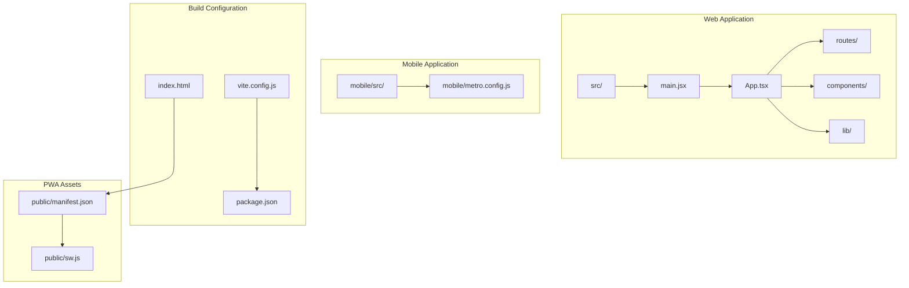
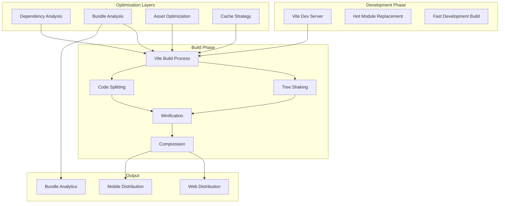
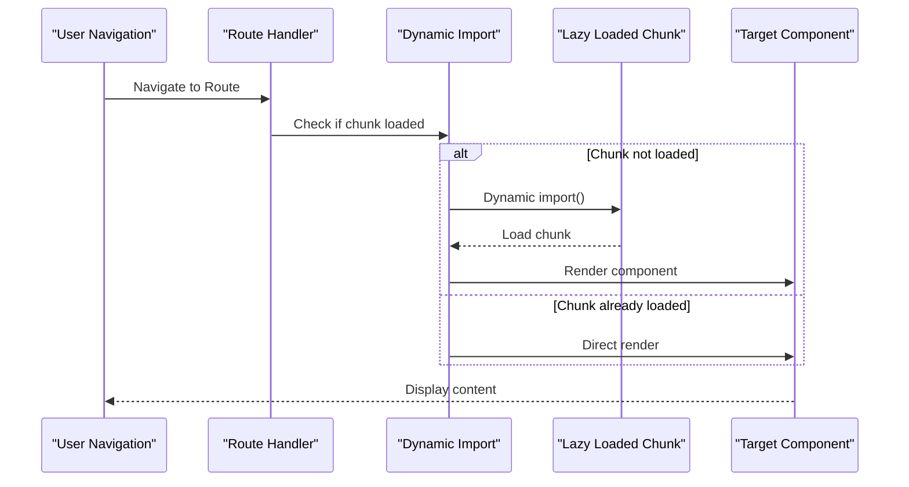
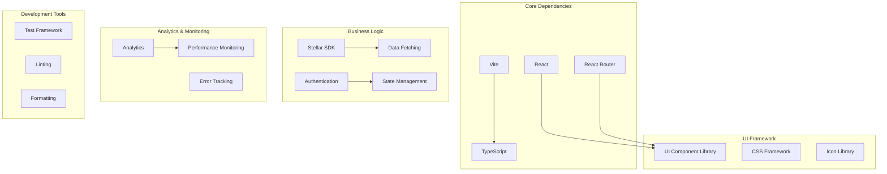

# Bundle & Code Optimization

<cite>
**Referenced Files in This Document**
- [vite.config.js](file://vite.config.js)
- [package.json](file://package.json)
- [index.html](file://index.html)
- [public/manifest.json](file://public/manifest.json)
- [public/sw.js](file://public/sw.js)
- [src/main.jsx](file://src/main.jsx)
- [src/App.tsx](file://src/App.tsx)
- [src/routes/DashboardLayout.tsx](file://src/routes/DashboardLayout.tsx)
- [mobile/metro.config.js](file://mobile/metro.config.js)
- [lighthouserc.cjs](file://lighthouserc.cjs)
</cite>

## Table of Contents
1. [Introduction](#introduction)
2. [Project Structure](#project-structure)
3. [Core Components](#core-components)
4. [Architecture Overview](#architecture-overview)
5. [Detailed Component Analysis](#detailed-component-analysis)
6. [Dependency Analysis](#dependency-analysis)
7. [Performance Considerations](#performance-considerations)
8. [Troubleshooting Guide](#troubleshooting-guide)
9. [Conclusion](#conclusion)
10. [Appendices](#appendices)

## Introduction
This document provides a comprehensive guide to bundle size optimization and code splitting strategies for the project. It covers Vite configuration for optimal build performance, lazy loading implementation patterns, dynamic imports usage, tree shaking techniques, dead code elimination, dependency analysis, bundle size monitoring setup, compression strategies, asset optimization, component-level code splitting, route-based lazy loading, third-party library optimization, mobile-specific bundle considerations, and progressive web app optimizations.

## Project Structure
The project follows a modular architecture with clear separation between web application code, mobile application code, and build configurations. Key directories include:

- `src/` - Main web application source code
- `mobile/` - React Native mobile application
- `public/` - Static assets and PWA configuration
- `scripts/` - Build and utility scripts
- `dist/` - Build output directory

**Diagram sources**
- [vite.config.js](file://vite.config.js)
- [package.json](file://package.json)
- [index.html](file://index.html)
- [public/manifest.json](file://public/manifest.json)
- [public/sw.js](file://public/sw.js)
- [mobile/metro.config.js](file://mobile/metro.config.js)

**Section sources**
- [vite.config.js](file://vite.config.js)
- [package.json](file://package.json)
- [index.html](file://index.html)

## Core Components

### Vite Build Configuration
The Vite configuration is central to bundle optimization, controlling build settings, plugin integration, and optimization strategies.

### Package Dependencies Management
Package.json defines dependencies, devDependencies, and build scripts that influence bundle composition and optimization.

### Entry Points and Routing
The main entry points (main.jsx, App.tsx) and routing configuration determine initial bundle loading and code splitting opportunities.

### Progressive Web App Setup
PWA configuration through manifest.json and service worker enables offline capabilities and improved performance.

**Section sources**
- [vite.config.js](file://vite.config.js)
- [package.json](file://package.json)
- [src/main.jsx](file://src/main.jsx)
- [src/App.tsx](file://src/App.tsx)
- [public/manifest.json](file://public/manifest.json)
- [public/sw.js](file://public/sw.js)

## Architecture Overview

The build and optimization architecture follows a layered approach with multiple optimization strategies working together:

**Diagram sources**
- [vite.config.js](file://vite.config.js)
- [package.json](file://package.json)
- [lighthouserc.cjs](file://lighthouserc.cjs)

## Detailed Component Analysis

### Vite Configuration for Optimal Build Performance

#### Build Settings and Plugins
Vite configuration controls the entire build pipeline, including plugin registration, build targets, and optimization flags.

#### Dependency Pre-bundling
Vite uses esbuild for dependency pre-bundling during development, significantly improving startup time.

#### Environment-Specific Builds
Configuration supports different build targets for development, staging, and production environments.

#### Custom Plugin Integration
Plugins extend Vite's functionality for specific optimization needs like image optimization, CSS processing, and custom transformations.

**Section sources**
- [vite.config.js](file://vite.config.js)

### Lazy Loading Implementation Patterns

#### Route-Based Code Splitting
Implementing lazy loading at the route level ensures only necessary components are loaded when users navigate to specific pages.

#### Component-Level Lazy Loading
Components can be dynamically imported to reduce initial bundle size and improve load times.

#### Feature-Based Code Splitting
Large features or optional functionalities can be split into separate chunks loaded on demand.

#### Third-Party Library Optimization
Heavy libraries like charting libraries, date formatters, or analytics tools should be lazy loaded when needed.

**Diagram sources**
- [src/routes/DashboardLayout.tsx](file://src/routes/DashboardLayout.tsx)
- [src/App.tsx](file://src/App.tsx)

**Section sources**
- [src/routes/DashboardLayout.tsx](file://src/routes/DashboardLayout.tsx)
- [src/App.tsx](file://src/App.tsx)

### Tree Shaking Techniques and Dead Code Elimination

#### ES Module Usage
Ensuring all modules use ES module syntax (import/export) enables effective tree shaking.

#### Side Effect Declaration
Marking packages with side effects allows Vite to safely remove unused code.

#### Conditional Imports
Using conditional imports and dynamic imports helps eliminate unused code paths.

#### Unused Export Removal
Vite automatically removes unused exports, reducing final bundle size.

### Dependency Analysis and Bundle Monitoring

#### Bundle Size Tracking
Monitoring bundle sizes across builds helps identify regressions and track optimization progress.

#### Dependency Visualization
Analyzing dependency graphs reveals large dependencies and potential optimization opportunities.

#### Performance Budgets
Setting performance budgets ensures bundle sizes stay within acceptable limits.

#### Automated Analysis
Integrating bundle analysis into CI/CD pipelines catches performance regressions early.

**Section sources**
- [package.json](file://package.json)
- [lighthouserc.cjs](file://lighthouserc.cjs)

### Compression Strategies and Asset Optimization

#### Gzip and Brotli Compression
Enabling server-side compression reduces transfer sizes for text-based assets.

#### Image Optimization
Automatic image format conversion, resizing, and lazy loading improves performance.

#### Font Optimization
Loading fonts efficiently with proper font-display properties and subset generation.

#### Cache Headers
Proper cache headers ensure optimal caching strategies for static assets.

**Section sources**
- [vite.config.js](file://vite.config.js)

### Mobile-Specific Bundle Considerations

#### React Native Metro Configuration
Mobile builds use Metro bundler with specific optimizations for mobile devices.

#### Platform-Specific Code
Conditional imports allow platform-specific code without affecting other platforms.

#### Memory Constraints
Mobile bundles must consider memory limitations and optimize accordingly.

#### Network Optimization
Mobile networks benefit from aggressive caching and minimal initial payload.

**Section sources**
- [mobile/metro.config.js](file://mobile/metro.config.js)

### Progressive Web App Optimizations

#### Service Worker Caching
Service workers enable offline access and intelligent caching strategies.

#### Manifest Configuration
PWA manifest defines app metadata, icons, and installation behavior.

#### Offline Support
Caching critical assets and API responses for offline functionality.

#### Install Prompts
Guided installation process improves user experience and app adoption.

**Section sources**
- [public/manifest.json](file://public/manifest.json)
- [public/sw.js](file://public/sw.js)

## Dependency Analysis

The project's dependency structure follows careful optimization principles:

**Diagram sources**
- [package.json](file://package.json)

**Section sources**
- [package.json](file://package.json)

## Performance Considerations

### Initial Load Time Optimization
- Minimize critical CSS and defer non-critical styles
- Use preload hints for essential resources
- Implement efficient caching strategies
- Optimize first contentful paint metrics

### Bundle Size Reduction
- Regularly audit and remove unused dependencies
- Use dynamic imports for large libraries
- Implement code splitting at feature boundaries
- Monitor bundle growth over time

### Runtime Performance
- Debounce expensive operations
- Use virtual scrolling for large lists
- Implement efficient state management
- Optimize re-renders with memoization

### Mobile Performance
- Reduce JavaScript execution time
- Minimize layout thrashing
- Optimize touch interactions
- Handle network interruptions gracefully

## Troubleshooting Guide

### Common Bundle Size Issues
- Large third-party dependencies causing bloated bundles
- Missing code splitting leading to large initial loads
- Inefficient imports pulling in unused code
- Missing compression or caching configuration

### Build Performance Problems
- Slow development builds due to missing optimizations
- Production builds taking too long
- Memory issues during large builds
- Cache invalidation problems

### Runtime Performance Issues
- Long blocking tasks on main thread
- Memory leaks in components
- Inefficient re-renders
- Poor network request handling

### Debugging Tools and Techniques
- Using browser developer tools for performance profiling
- Analyzing bundle contents with visualization tools
- Monitoring runtime performance metrics
- Testing on various devices and network conditions

**Section sources**
- [lighthouserc.cjs](file://lighthouserc.cjs)

## Conclusion

Effective bundle size optimization requires a multi-faceted approach combining build-time optimizations, runtime code splitting, dependency management, and continuous monitoring. The strategies outlined in this document provide a comprehensive framework for maintaining optimal performance across web and mobile platforms while ensuring maintainable and scalable code architecture.

Key takeaways include implementing systematic code splitting, leveraging modern build tools effectively, establishing performance budgets, and integrating monitoring into the development workflow. Regular audits and proactive optimization efforts will ensure the application maintains excellent performance characteristics as it grows.

## Appendices

### A. Recommended Tooling Stack
- **Bundle Analysis**: webpack-bundle-analyzer, rollup-plugin-visualizer
- **Performance Monitoring**: Lighthouse, WebPageTest, Google Analytics
- **Code Quality**: ESLint, Prettier, TypeScript strict mode
- **Testing**: Jest, React Testing Library, Playwright

### B. Performance Metrics to Track
- First Contentful Paint (FCP)
- Largest Contentful Paint (LCP)
- Cumulative Layout Shift (CLS)
- Total Blocking Time (TBT)
- Bundle size by category
- Time to Interactive (TTI)

### C. Best Practices Checklist
- [ ] Implement route-based code splitting
- [ ] Use dynamic imports for heavy dependencies
- [ ] Enable gzip/brotli compression
- [ ] Configure proper cache headers
- [ ] Set up bundle size monitoring
- [ ] Implement performance budgets
- [ ] Optimize images and assets
- [ ] Use efficient data fetching patterns
- [ ] Test on real devices and networks
- [ ] Monitor performance in production