# Performance Optimization

<cite>
**Referenced Files in This Document**
- [performance.ts](file://src/lib/performance.ts)
- [performanceMonitoring.js](file://src/lib/performanceMonitoring.js)
- [memoryProfiling.ts](file://src/lib/memoryProfiling.ts)
- [bundleAnalysis.ts](file://src/lib/bundleAnalysis.ts)
- [cacheManager.ts](file://src/lib/cacheManager.ts)
- [cache.js](file://src/lib/cache.js)
- [usePerformance.js](file://src/hooks/usePerformance.js)
- [useCache.ts](file://src/hooks/useCache.ts)
- [useSWR.ts](file://src/hooks/useSWR.ts)
- [PerformanceMonitor.tsx](file://src/components/dashboard/PerformanceMonitor.tsx)
- [PerformanceDashboard.tsx](file://src/components/performance/PerformanceDashboard.tsx)
- [lighthouserc.cjs](file://lighthouserc.cjs)
- [vite.config.js](file://vite.config.js)
- [package.json](file://package.json)
- [MOBILE_OPTIMIZATION_GUIDE.md](file://MOBILE_OPTIMIZATION_GUIDE.md)
- [PERFORMANCE.md](file://docs/PERFORMANCE.md)
- [mobile-performance.css](file://src/styles/mobile-performance.css)
- [OfflineBanner.tsx](file://src/components/layout/OfflineBanner.tsx)
- [VirtualizedLists.tsx](file://src/components/dashboard/VirtualizedLists.tsx)
- [MobileChartContainer.tsx](file://src/components/charts/MobileChartContainer.tsx)
</cite>

## Table of Contents
1. [Introduction](#introduction)
2. [Project Structure](#project-structure)
3. [Core Components](#core-components)
4. [Architecture Overview](#architecture-overview)
5. [Detailed Component Analysis](#detailed-component-analysis)
6. [Dependency Analysis](#dependency-analysis)
7. [Performance Considerations](#performance-considerations)
8. [Troubleshooting Guide](#troubleshooting-guide)
9. [Conclusion](#conclusion)
10. [Appendices](#appendices)

## Introduction
This document provides a comprehensive performance optimization guide for the project, covering bundle size optimization, lazy loading strategies, caching policies, memory management, monitoring setup, metrics collection, bottleneck identification, browser and database optimizations, API efficiency patterns, mobile considerations, network optimization, resource loading strategies, profiling tools, benchmarking approaches, and continuous performance monitoring. It synthesizes existing implementation details from the codebase and aligns them with best practices to help teams maintain high performance across web and mobile experiences.

## Project Structure
The repository includes dedicated modules and hooks for performance monitoring, caching, memory profiling, and bundle analysis. The frontend is built with Vite, and there are Lighthouse configuration files and documentation that inform performance strategy. Mobile-specific optimizations are documented and implemented via components and styles.

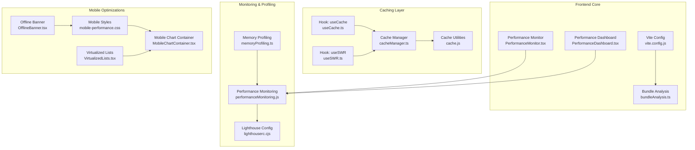

**Diagram sources**
- [vite.config.js](file://vite.config.js)
- [bundleAnalysis.ts](file://src/lib/bundleAnalysis.ts)
- [PerformanceMonitor.tsx](file://src/components/dashboard/PerformanceMonitor.tsx)
- [PerformanceDashboard.tsx](file://src/components/performance/PerformanceDashboard.tsx)
- [cacheManager.ts](file://src/lib/cacheManager.ts)
- [cache.js](file://src/lib/cache.js)
- [useCache.ts](file://src/hooks/useCache.ts)
- [useSWR.ts](file://src/hooks/useSWR.ts)
- [performanceMonitoring.js](file://src/lib/performanceMonitoring.js)
- [memoryProfiling.ts](file://src/lib/memoryProfiling.ts)
- [lighthouserc.cjs](file://lighthouserc.cjs)
- [mobile-performance.css](file://src/styles/mobile-performance.css)
- [OfflineBanner.tsx](file://src/components/layout/OfflineBanner.tsx)
- [VirtualizedLists.tsx](file://src/components/dashboard/VirtualizedLists.tsx)
- [MobileChartContainer.tsx](file://src/components/charts/MobileChartContainer.tsx)

**Section sources**
- [vite.config.js](file://vite.config.js)
- [lighthouserc.cjs](file://lighthouserc.cjs)
- [package.json](file://package.json)
- [PERFORMANCE.md](file://docs/PERFORMANCE.md)
- [MOBILE_OPTIMIZATION_GUIDE.md](file://MOBILE_OPTIMIZATION_GUIDE.md)

## Core Components
- Bundle Size Optimization:
  - Use Vite’s build configuration to enable code splitting and tree-shaking.
  - Integrate bundle analysis to identify large dependencies and optimize imports.
- Lazy Loading Strategies:
  - Implement dynamic imports for heavy components and routes.
  - Defer non-critical resources and charts until needed.
- Caching Policies:
  - Centralize cache management with a robust cache manager.
  - Provide hooks for declarative caching and data fetching.
- Memory Management:
  - Profile memory usage and detect leaks using memory profiling utilities.
  - Clean up event listeners, timers, and subscriptions on unmount.
- Performance Monitoring:
  - Collect runtime metrics and visualize them in dashboards.
  - Configure Lighthouse for automated performance audits.

**Section sources**
- [bundleAnalysis.ts](file://src/lib/bundleAnalysis.ts)
- [cacheManager.ts](file://src/lib/cacheManager.ts)
- [cache.js](file://src/lib/cache.js)
- [useCache.ts](file://src/hooks/useCache.ts)
- [useSWR.ts](file://src/hooks/useSWR.ts)
- [memoryProfiling.ts](file://src/lib/memoryProfiling.ts)
- [performanceMonitoring.js](file://src/lib/performanceMonitoring.js)
- [PerformanceMonitor.tsx](file://src/components/dashboard/PerformanceMonitor.tsx)
- [PerformanceDashboard.tsx](file://src/components/performance/PerformanceDashboard.tsx)
- [lighthouserc.cjs](file://lighthouserc.cjs)

## Architecture Overview
The performance architecture integrates build-time optimizations (Vite), runtime monitoring (hooks and libraries), caching layers, and mobile-specific enhancements. Metrics flow from instrumentation into dashboards and CI checks.

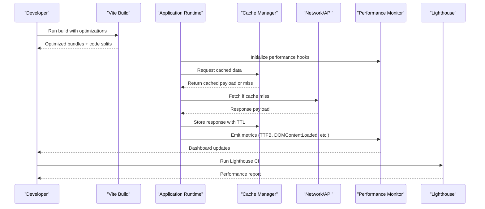

**Diagram sources**
- [vite.config.js](file://vite.config.js)
- [cacheManager.ts](file://src/lib/cacheManager.ts)
- [performanceMonitoring.js](file://src/lib/performanceMonitoring.js)
- [lighthouserc.cjs](file://lighthouserc.cjs)

## Detailed Component Analysis

### Bundle Size Optimization
- Vite Configuration:
  - Enable minification, code splitting, and dependency pre-bundling.
  - Configure plugins for asset optimization and environment-specific builds.
- Bundle Analysis:
  - Use bundle analysis utilities to track package sizes and identify heavy modules.
  - Set thresholds and alerts for regressions.

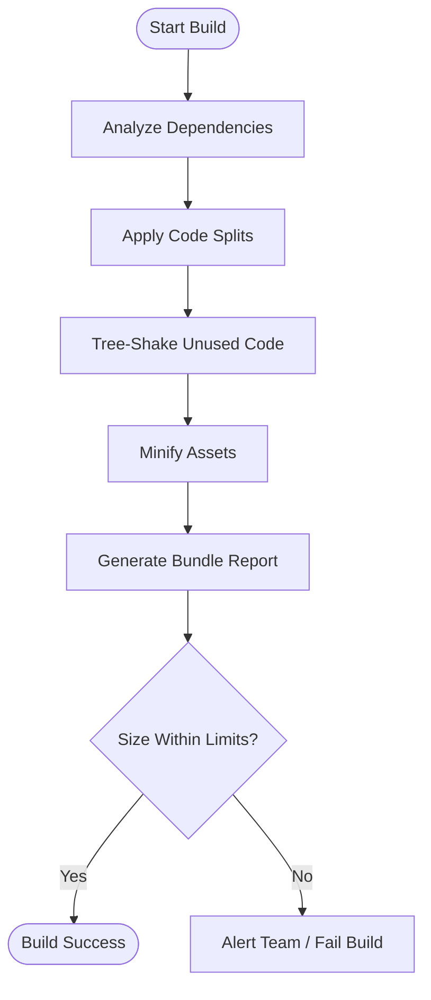

**Diagram sources**
- [vite.config.js](file://vite.config.js)
- [bundleAnalysis.ts](file://src/lib/bundleAnalysis.ts)

**Section sources**
- [vite.config.js](file://vite.config.js)
- [bundleAnalysis.ts](file://src/lib/bundleAnalysis.ts)
- [package.json](file://package.json)

### Lazy Loading Strategies
- Dynamic Imports:
  - Load heavy components and features on demand.
  - Preload critical assets; defer non-critical ones.
- Route-Level Splitting:
  - Split routes to reduce initial load.
- Resource Prioritization:
  - Use link rel="preload" for above-the-fold resources.
  - Defer third-party scripts and analytics.

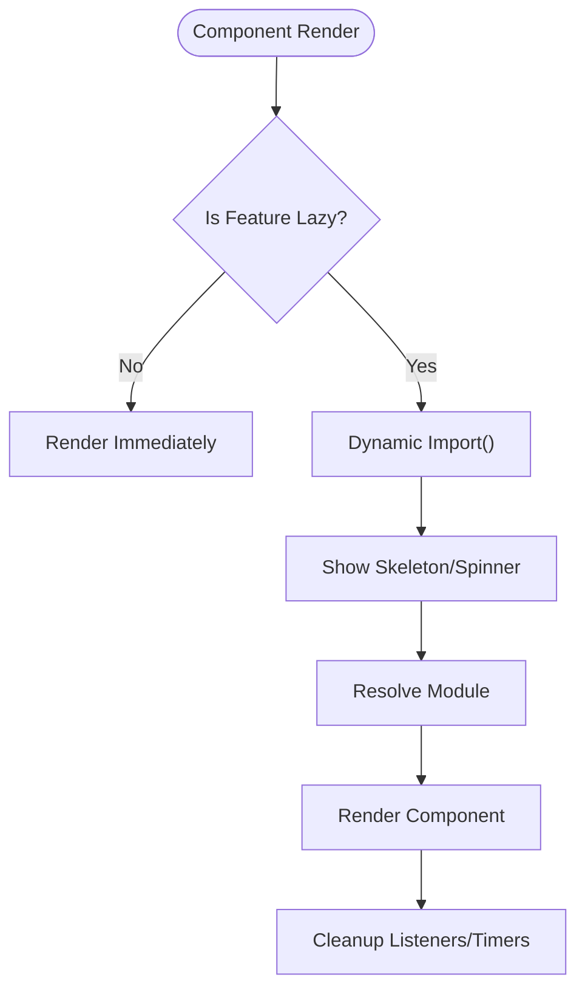

[No sources needed since this diagram shows conceptual workflow, not actual code structure]

### Caching Policies
- Cache Manager:
  - Centralized storage with TTL, invalidation, and deduplication.
  - Support for multiple storage backends (in-memory, localStorage).
- Hooks:
  - Declarative caching via useCache and useSWR integrations.
  - Automatic retries and background refetch strategies.

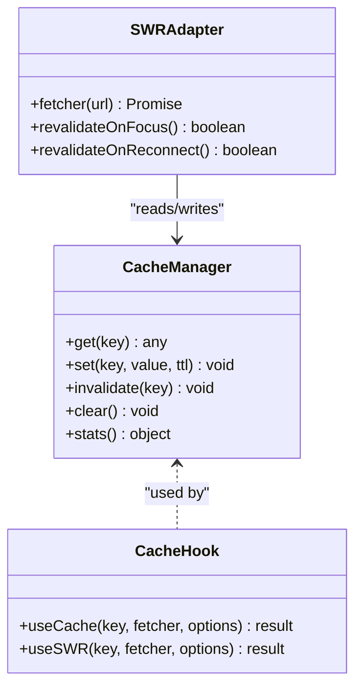

**Diagram sources**
- [cacheManager.ts](file://src/lib/cacheManager.ts)
- [cache.js](file://src/lib/cache.js)
- [useCache.ts](file://src/hooks/useCache.ts)
- [useSWR.ts](file://src/hooks/useSWR.ts)

**Section sources**
- [cacheManager.ts](file://src/lib/cacheManager.ts)
- [cache.js](file://src/lib/cache.js)
- [useCache.ts](file://src/hooks/useCache.ts)
- [useSWR.ts](file://src/hooks/useSWR.ts)

### Memory Management Techniques
- Memory Profiling:
  - Capture heap snapshots and analyze growth over time.
  - Detect leaks from closures, global references, and event listeners.
- Lifecycle Hygiene:
  - Remove event listeners and cancel timers on component unmount.
  - Avoid retaining large objects in long-lived scopes.

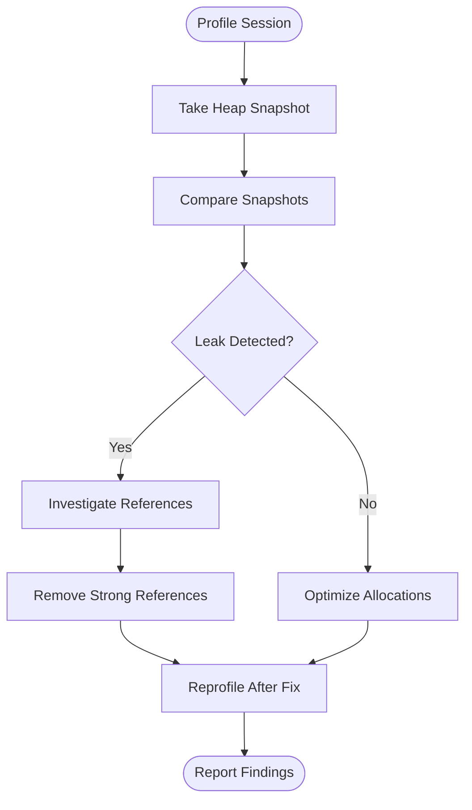

**Diagram sources**
- [memoryProfiling.ts](file://src/lib/memoryProfiling.ts)

**Section sources**
- [memoryProfiling.ts](file://src/lib/memoryProfiling.ts)

### Performance Monitoring Setup and Metrics Collection
- Instrumentation:
  - Use performance hooks to capture navigation timing, paint metrics, and interaction latency.
- Dashboards:
  - Visualize metrics in real-time dashboards for quick diagnosis.
- Lighthouse Integration:
  - Configure Lighthouse for automated audits in CI.

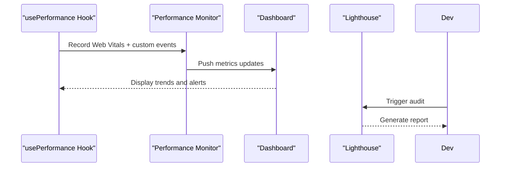

**Diagram sources**
- [usePerformance.js](file://src/hooks/usePerformance.js)
- [performanceMonitoring.js](file://src/lib/performanceMonitoring.js)
- [PerformanceMonitor.tsx](file://src/components/dashboard/PerformanceMonitor.tsx)
- [PerformanceDashboard.tsx](file://src/components/performance/PerformanceDashboard.tsx)
- [lighthouserc.cjs](file://lighthouserc.cjs)

**Section sources**
- [usePerformance.js](file://src/hooks/usePerformance.js)
- [performanceMonitoring.js](file://src/lib/performanceMonitoring.js)
- [PerformanceMonitor.tsx](file://src/components/dashboard/PerformanceMonitor.tsx)
- [PerformanceDashboard.tsx](file://src/components/performance/PerformanceDashboard.tsx)
- [lighthouserc.cjs](file://lighthouserc.cjs)

### Browser Optimization Techniques
- Asset Optimization:
  - Compress images, use modern formats (WebP/AVIF), and serve responsive variants.
  - Enable HTTP/2 and Brotli compression at the server level.
- Rendering Efficiency:
  - Minimize layout thrashing; batch DOM writes.
  - Use CSS containment and will-change judiciously.
- Network Efficiency:
  - Leverage CDN and edge caching.
  - Implement request deduplication and retry with exponential backoff.

[No sources needed since this section provides general guidance]

### Database Query Optimization
- Indexing:
  - Add indexes on frequently queried fields.
- Pagination and Filtering:
  - Use cursor-based pagination for large datasets.
  - Apply server-side filtering and projection to reduce payload size.
- Connection Pooling:
  - Tune pool size and idle timeouts based on workload.

[No sources needed since this section provides general guidance]

### API Call Efficiency Patterns
- Deduplication:
  - Prevent duplicate concurrent requests for the same key.
- Stale-While-Revalidate:
  - Serve cached data immediately while refreshing in the background.
- Error Handling and Retries:
  - Implement graceful fallbacks and retry logic with jitter.

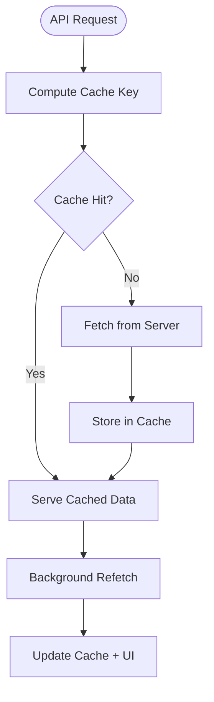

**Diagram sources**
- [cacheManager.ts](file://src/lib/cacheManager.ts)
- [useSWR.ts](file://src/hooks/useSWR.ts)

**Section sources**
- [cacheManager.ts](file://src/lib/cacheManager.ts)
- [useSWR.ts](file://src/hooks/useSWR.ts)

### Mobile Performance Considerations
- Virtualization:
  - Use virtualized lists for large datasets to reduce memory pressure.
- Chart Optimization:
  - Simplify chart rendering on mobile; use lightweight containers.
- Offline Support:
  - Show offline banners and cache critical data for offline access.
- Styling:
  - Apply mobile-specific CSS to minimize repaint/reflow costs.

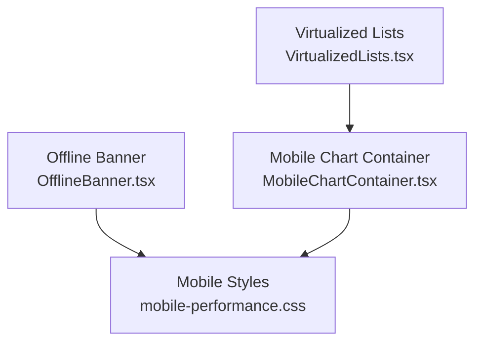

**Diagram sources**
- [VirtualizedLists.tsx](file://src/components/dashboard/VirtualizedLists.tsx)
- [MobileChartContainer.tsx](file://src/components/charts/MobileChartContainer.tsx)
- [OfflineBanner.tsx](file://src/components/layout/OfflineBanner.tsx)
- [mobile-performance.css](file://src/styles/mobile-performance.css)

**Section sources**
- [VirtualizedLists.tsx](file://src/components/dashboard/VirtualizedLists.tsx)
- [MobileChartContainer.tsx](file://src/components/charts/MobileChartContainer.tsx)
- [OfflineBanner.tsx](file://src/components/layout/OfflineBanner.tsx)
- [mobile-performance.css](file://src/styles/mobile-performance.css)
- [MOBILE_OPTIMIZATION_GUIDE.md](file://MOBILE_OPTIMIZATION_GUIDE.md)

### Network Optimization and Resource Loading Strategies
- Prefetching and Preloading:
  - Prefetch critical resources; preload fonts and hero images.
- Service Worker:
  - Cache static assets and API responses where appropriate.
- Bandwidth Awareness:
  - Reduce payload sizes and avoid unnecessary re-renders.

[No sources needed since this section provides general guidance]

### Performance Profiling Tools and Benchmarking Approaches
- Tools:
  - Use browser devtools for CPU, memory, and network profiling.
  - Integrate Lighthouse CI for regression detection.
- Benchmarks:
  - Establish baseline metrics for critical flows.
  - Track performance deltas across PRs.

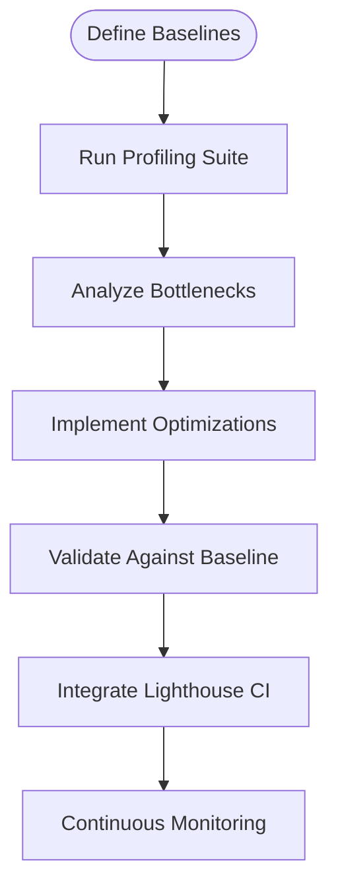

**Diagram sources**
- [lighthouserc.cjs](file://lighthouserc.cjs)
- [performanceMonitoring.js](file://src/lib/performanceMonitoring.js)

**Section sources**
- [lighthouserc.cjs](file://lighthouserc.cjs)
- [performanceMonitoring.js](file://src/lib/performanceMonitoring.js)

### Continuous Performance Monitoring Setup
- CI Integration:
  - Run Lighthouse audits on every commit.
  - Fail builds when performance budgets are exceeded.
- Runtime Alerts:
  - Monitor Web Vitals and alert on regressions.
- Reporting:
  - Aggregate metrics and share reports with stakeholders.

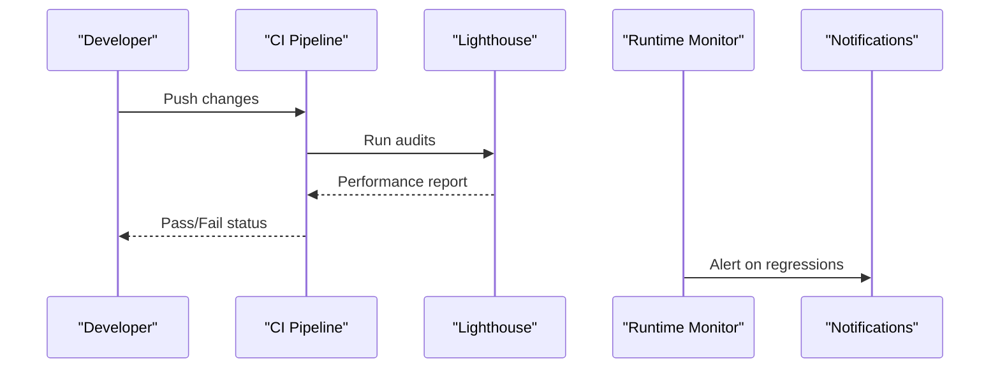

**Diagram sources**
- [lighthouserc.cjs](file://lighthouserc.cjs)
- [performanceMonitoring.js](file://src/lib/performanceMonitoring.js)

**Section sources**
- [lighthouserc.cjs](file://lighthouserc.cjs)
- [performanceMonitoring.js](file://src/lib/performanceMonitoring.js)

## Dependency Analysis
The performance system depends on Vite for build-time optimizations, caching utilities for runtime data management, and monitoring hooks for metrics collection. Mobile components rely on optimized styles and virtualization to reduce memory usage.

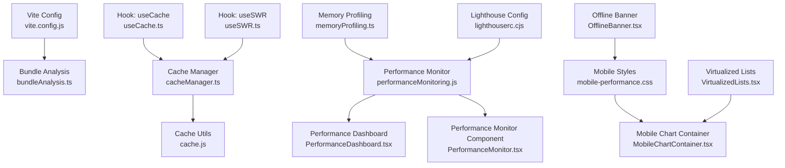

**Diagram sources**
- [vite.config.js](file://vite.config.js)
- [bundleAnalysis.ts](file://src/lib/bundleAnalysis.ts)
- [cacheManager.ts](file://src/lib/cacheManager.ts)
- [cache.js](file://src/lib/cache.js)
- [useCache.ts](file://src/hooks/useCache.ts)
- [useSWR.ts](file://src/hooks/useSWR.ts)
- [performanceMonitoring.js](file://src/lib/performanceMonitoring.js)
- [memoryProfiling.ts](file://src/lib/memoryProfiling.ts)
- [lighthouserc.cjs](file://lighthouserc.cjs)
- [PerformanceDashboard.tsx](file://src/components/performance/PerformanceDashboard.tsx)
- [PerformanceMonitor.tsx](file://src/components/dashboard/PerformanceMonitor.tsx)
- [mobile-performance.css](file://src/styles/mobile-performance.css)
- [OfflineBanner.tsx](file://src/components/layout/OfflineBanner.tsx)
- [VirtualizedLists.tsx](file://src/components/dashboard/VirtualizedLists.tsx)
- [MobileChartContainer.tsx](file://src/components/charts/MobileChartContainer.tsx)

**Section sources**
- [vite.config.js](file://vite.config.js)
- [bundleAnalysis.ts](file://src/lib/bundleAnalysis.ts)
- [cacheManager.ts](file://src/lib/cacheManager.ts)
- [cache.js](file://src/lib/cache.js)
- [useCache.ts](file://src/hooks/useCache.ts)
- [useSWR.ts](file://src/hooks/useSWR.ts)
- [performanceMonitoring.js](file://src/lib/performanceMonitoring.js)
- [memoryProfiling.ts](file://src/lib/memoryProfiling.ts)
- [lighthouserc.cjs](file://lighthouserc.cjs)
- [PerformanceDashboard.tsx](file://src/components/performance/PerformanceDashboard.tsx)
- [PerformanceMonitor.tsx](file://src/components/dashboard/PerformanceMonitor.tsx)
- [mobile-performance.css](file://src/styles/mobile-performance.css)
- [OfflineBanner.tsx](file://src/components/layout/OfflineBanner.tsx)
- [VirtualizedLists.tsx](file://src/components/dashboard/VirtualizedLists.tsx)
- [MobileChartContainer.tsx](file://src/components/charts/MobileChartContainer.tsx)

## Performance Considerations
- Establish performance budgets and enforce them in CI.
- Prefer incremental improvements backed by metrics.
- Focus on user-centric metrics (LCP, FID, CLS) and backend latency.
- Regularly review bundle composition and remove unused dependencies.
- Optimize images and fonts; leverage modern formats and CDNs.
- Use virtualization for large lists and complex views.
- Implement robust caching with clear invalidation strategies.
- Profile memory regularly to prevent leaks and excessive allocations.

[No sources needed since this section provides general guidance]

## Troubleshooting Guide
- High Initial Load Time:
  - Inspect bundle size and split points; defer non-critical code.
- Memory Leaks:
  - Take heap snapshots before and after interactions; look for retained nodes.
- Frequent Repaints:
  - Batch DOM updates; avoid layout thrashing; use CSS containment.
- API Latency Spikes:
  - Enable caching and retries; check server-side bottlenecks and DB indexes.
- Mobile Jank:
  - Use virtualized lists; simplify charts; offload heavy computations to workers.

**Section sources**
- [memoryProfiling.ts](file://src/lib/memoryProfiling.ts)
- [performanceMonitoring.js](file://src/lib/performanceMonitoring.js)
- [VirtualizedLists.tsx](file://src/components/dashboard/VirtualizedLists.tsx)
- [MobileChartContainer.tsx](file://src/components/charts/MobileChartContainer.tsx)

## Conclusion
By integrating build-time optimizations, runtime monitoring, effective caching, and mobile-focused techniques, the application can achieve consistent performance across devices and networks. Continuous auditing with Lighthouse and proactive memory profiling ensure long-term stability and user satisfaction.

[No sources needed since this section summarizes without analyzing specific files]

## Appendices
- Additional Documentation:
  - Review project-level performance notes and mobile optimization guides for deeper insights.

**Section sources**
- [PERFORMANCE.md](file://docs/PERFORMANCE.md)
- [MOBILE_OPTIMIZATION_GUIDE.md](file://MOBILE_OPTIMIZATION_GUIDE.md)