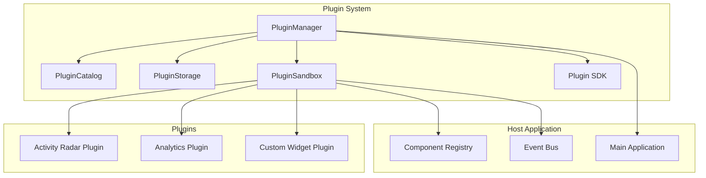
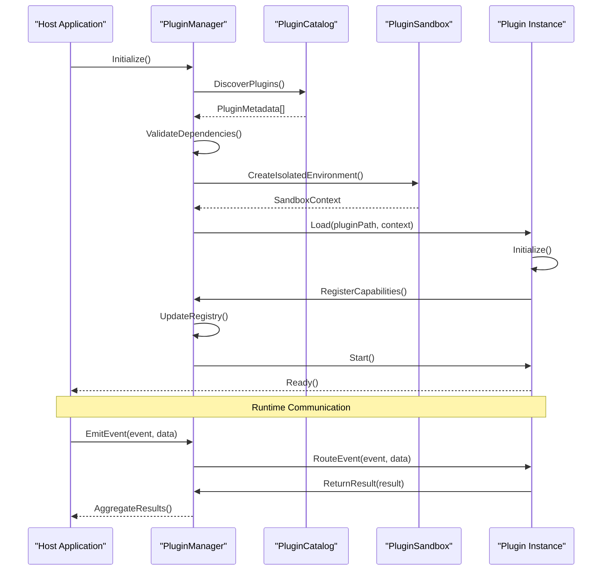
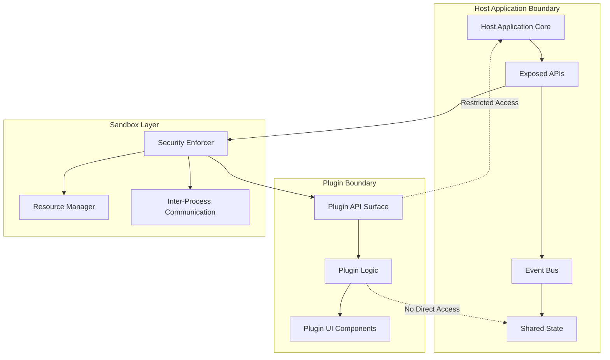
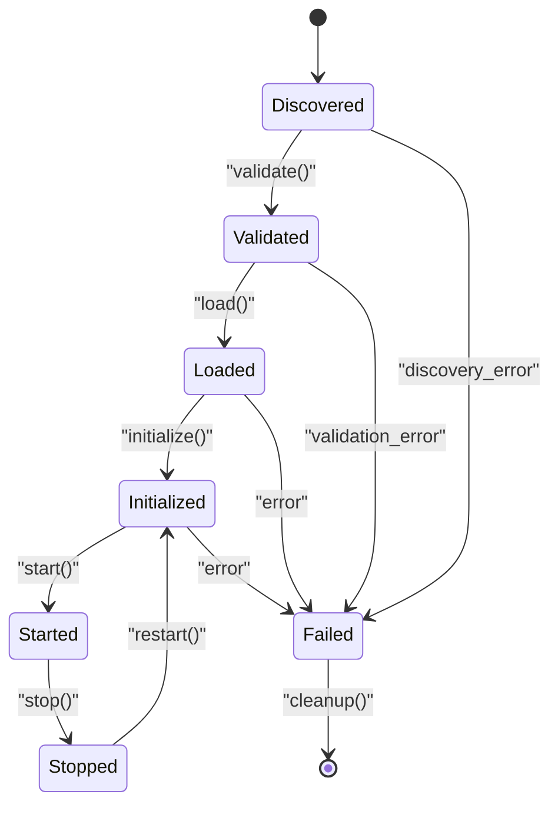
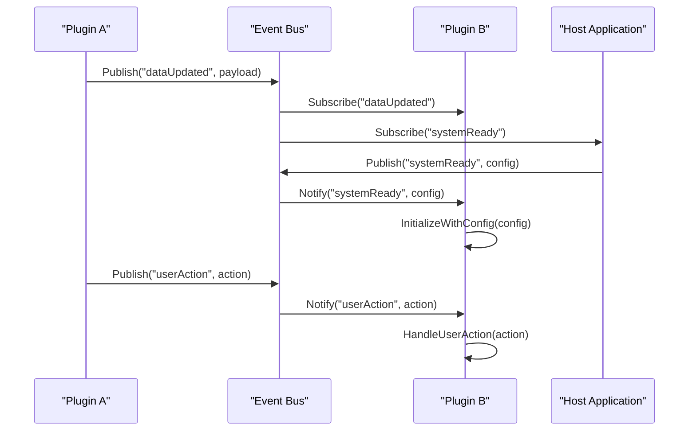
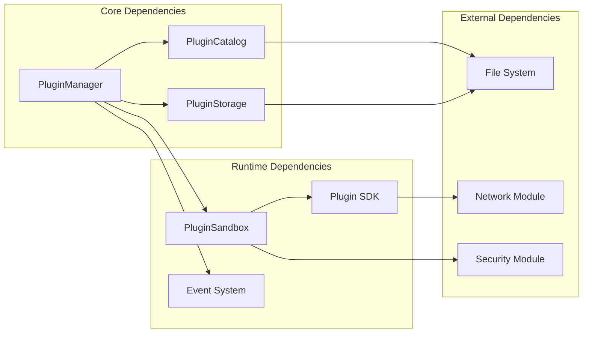

# Plugin Architecture & Core Concepts

<cite>
**Referenced Files in This Document**
- [PluginManager.js](file://src/plugins/PluginManager.js)
- [index.js](file://src/plugins/index.js)
- [pluginCatalog.js](file://src/plugins/pluginCatalog.js)
- [pluginSandbox.jsx](file://src/plugins/pluginSandbox.jsx)
- [pluginStorage.js](file://src/plugins/pluginStorage.js)
- [runtimeStatusPlugin.jsx](file://src/plugins/runtimeStatusPlugin.jsx)
- [sdk.ts](file://src/plugins/sdk.ts)
- [PluginManager.test.js](file://src/plugins/__tests__/PluginManager.test.js)
- [activity-radar.manifest.json](file://docs/plugins/examples/activity-radar.manifest.json)
</cite>

## Table of Contents
1. [Introduction](#introduction)
2. [Project Structure](#project-structure)
3. [Core Components](#core-components)
4. [Architecture Overview](#architecture-overview)
5. [Detailed Component Analysis](#detailed-component-analysis)
6. [Dependency Analysis](#dependency-analysis)
7. [Performance Considerations](#performance-considerations)
8. [Troubleshooting Guide](#troubleshooting-guide)
9. [Conclusion](#conclusion)
10. [Appendices](#appendices)

## Introduction

The stellar-dev-dashboard implements a sophisticated plugin architecture that enables extensibility through a modular system. The plugin framework provides a secure sandboxed environment for plugins to extend dashboard functionality while maintaining isolation from the core application. This architecture supports dynamic plugin loading, lifecycle management, event-driven communication, and resource management.

The plugin system is designed with security as a primary concern, implementing strict boundaries between host applications and plugins. It supports various plugin types including UI components, data processors, and utility extensions, all managed through a centralized PluginManager that handles discovery, registration, and runtime coordination.

## Project Structure

The plugin architecture is organized into several key modules within the `src/plugins/` directory:

**Diagram sources**
- [PluginManager.js](file://src/plugins/PluginManager.js)
- [pluginCatalog.js](file://src/plugins/pluginCatalog.js)
- [pluginStorage.js](file://src/plugins/pluginStorage.js)
- [pluginSandbox.jsx](file://src/plugins/pluginSandbox.jsx)

**Section sources**
- [PluginManager.js](file://src/plugins/PluginManager.js)
- [index.js](file://src/plugins/index.js)

## Core Components

### PluginManager Class

The PluginManager serves as the central orchestrator for the entire plugin ecosystem. It handles plugin discovery, validation, loading, lifecycle management, and inter-plugin communication. The manager maintains a registry of active plugins and coordinates their interactions with the host application.

Key responsibilities include:
- Plugin discovery and metadata extraction
- Dependency resolution and conflict detection
- Lifecycle state management (initialized, loaded, started, stopped)
- Event routing and message passing
- Resource allocation and cleanup coordination
- Error handling and recovery mechanisms

### Plugin Catalog System

The plugin catalog manages plugin metadata, versioning, and compatibility information. It maintains a searchable index of available plugins and their capabilities, enabling dynamic plugin discovery and filtering based on host application requirements.

### Plugin Sandbox Environment

The sandbox provides an isolated execution environment for plugins, enforcing security boundaries and resource limits. It controls plugin access to host application APIs and prevents direct manipulation of core application state.

### Plugin Storage Layer

The storage layer handles plugin persistence, configuration management, and state serialization. It ensures plugin data survives application restarts and provides backup/restore capabilities.

**Section sources**
- [PluginManager.js](file://src/plugins/PluginManager.js)
- [pluginCatalog.js](file://src/plugins/pluginCatalog.js)
- [pluginSandbox.jsx](file://src/plugins/pluginSandbox.jsx)
- [pluginStorage.js](file://src/plugins/pluginStorage.js)

## Architecture Overview

The plugin architecture follows a layered design pattern with clear separation of concerns:

**Diagram sources**
- [PluginManager.js](file://src/plugins/PluginManager.js)
- [pluginSandbox.jsx](file://src/plugins/pluginSandbox.jsx)

### Plugin Boundaries and Isolation

The architecture enforces strict boundaries between plugins and the host application:

**Diagram sources**
- [pluginSandbox.jsx](file://src/plugins/pluginSandbox.jsx)
- [sdk.ts](file://src/plugins/sdk.ts)

## Detailed Component Analysis

### PluginManager Implementation

The PluginManager class implements the core orchestration logic for plugin operations. It maintains internal state machines for each plugin's lifecycle and provides methods for programmatic control.

#### Key Methods and Responsibilities

- **Discovery Phase**: Scans configured directories for plugin manifests and validates their structure
- **Validation Phase**: Checks plugin dependencies, version compatibility, and security requirements  
- **Loading Phase**: Creates isolated execution contexts and loads plugin code
- **Registration Phase**: Registers plugin capabilities with the host application
- **Runtime Phase**: Manages event routing and inter-plugin communication
- **Cleanup Phase**: Handles graceful shutdown and resource deallocation

#### Lifecycle States

The manager tracks each plugin through distinct lifecycle states:

**Diagram sources**
- [PluginManager.js](file://src/plugins/PluginManager.js)

### Plugin Registration System

The registration system provides multiple mechanisms for plugins to expose functionality to the host application:

#### Capability-Based Registration

Plugins declare their capabilities during initialization:

- **UI Components**: React components that integrate with the dashboard layout
- **Data Processors**: Functions that transform or analyze application data
- **Event Handlers**: Listeners for specific application events
- **API Extensions**: Additional endpoints exposed through the host API
- **Configuration Options**: Custom settings that appear in the preferences panel

#### Event-Driven Communication

The plugin system uses an event bus for loose coupling between components:

**Diagram sources**
- [PluginManager.js](file://src/plugins/PluginManager.js)
- [sdk.ts](file://src/plugins/sdk.ts)

### Plugin Discovery Mechanisms

The discovery system supports multiple sources for plugin availability:

#### File System Discovery

Scans predefined directories for plugin packages containing manifest files:

- Automatic scanning of configured plugin directories
- Recursive directory traversal for nested plugin structures
- Manifest validation and dependency checking
- Version compatibility verification

#### Remote Repository Integration

Supports fetching plugin metadata from remote repositories:

- Secure HTTPS connections with certificate validation
- Plugin marketplace integration for community plugins
- Automatic updates and version management
- Digital signature verification for plugin authenticity

#### Dynamic Loading

Plugins can be loaded at runtime without application restart:

- Hot-reloading support for development environments
- Graceful upgrade paths for plugin updates
- Rollback mechanisms for failed updates
- Performance monitoring during dynamic loading

**Section sources**
- [pluginCatalog.js](file://src/plugins/pluginCatalog.js)
- [pluginStorage.js](file://src/plugins/pluginStorage.js)

### Dependency Resolution

The dependency resolution system ensures plugins load in the correct order and have access to required resources:

#### Static Dependency Analysis

During the discovery phase, the system analyzes plugin manifests to build a dependency graph:

- Topological sorting for correct load order
- Circular dependency detection and reporting
- Missing dependency identification
- Version constraint satisfaction

#### Runtime Dependency Management

At runtime, the system provides dependency injection and service location:

- Lazy loading of optional dependencies
- Fallback mechanisms for unavailable services
- Service version negotiation
- Health checks for dependent services

### Plugin Isolation and Security

The sandbox layer enforces strict isolation between plugins and the host application:

#### Memory Isolation

Each plugin runs in a separate execution context:

- Separate memory spaces prevent direct state access
- Garbage collection boundaries maintain isolation
- Memory leak detection and prevention
- Resource usage monitoring and limits

#### API Access Control

Plugins interact with the host through controlled interfaces:

- Whitelist-based API access model
- Permission-scoped method calls
- Input validation and sanitization
- Output transformation and filtering

#### Network and File System Restrictions

Plugins operate under strict security policies:

- Network access requires explicit permission
- File system access limited to plugin-specific directories
- Cross-origin request restrictions
- Data encryption for sensitive communications

**Section sources**
- [pluginSandbox.jsx](file://src/plugins/pluginSandbox.jsx)
- [sdk.ts](file://src/plugins/sdk.ts)

### Example Plugin Implementation

The activity-radar plugin demonstrates typical plugin structure and capabilities:

#### Plugin Manifest Structure

Plugins define their metadata and capabilities through manifest files:

- Basic plugin information (name, version, description)
- Dependency declarations and version constraints
- UI component registrations and layout specifications
- Event subscriptions and capability declarations
- Configuration schema definitions

#### Plugin Entry Point

Each plugin exports a standardized interface:

- Initialization function with host context
- Cleanup function for resource disposal
- Event handler registrations
- UI component factories
- Configuration validators

**Section sources**
- [activity-radar.manifest.json](file://docs/plugins/examples/activity-radar.manifest.json)
- [runtimeStatusPlugin.jsx](file://src/plugins/runtimeStatusPlugin.jsx)

## Dependency Analysis

The plugin system exhibits careful dependency management to maintain modularity and testability:

**Diagram sources**
- [PluginManager.js](file://src/plugins/PluginManager.js)
- [pluginCatalog.js](file://src/plugins/pluginCatalog.js)
- [pluginStorage.js](file://src/plugins/pluginStorage.js)
- [pluginSandbox.jsx](file://src/plugins/pluginSandbox.jsx)

### Coupling and Cohesion Analysis

The architecture demonstrates high cohesion within modules and low coupling between components:

- **High Cohesion**: Each module has a single, well-defined responsibility
- **Low Coupling**: Modules communicate through well-defined interfaces
- **Dependency Inversion**: Higher-level modules depend on abstractions rather than concrete implementations
- **Interface Segregation**: Small, focused interfaces reduce unnecessary dependencies

### External Integration Points

The plugin system integrates with external systems through adapter patterns:

- **File System Adapter**: Abstracts file operations for cross-platform compatibility
- **Network Adapter**: Provides consistent networking interface for plugin downloads
- **Security Adapter**: Implements platform-specific security policies
- **Storage Adapter**: Supports multiple backend storage solutions

**Section sources**
- [PluginManager.js](file://src/plugins/PluginManager.js)
- [pluginCatalog.js](file://src/plugins/pluginCatalog.js)

## Performance Considerations

The plugin architecture is designed with performance optimization in mind:

### Lazy Loading Strategy

Plugins are loaded on-demand to minimize startup time:

- Initial load includes only essential plugins
- Feature plugins load when first accessed
- Background loading for frequently used plugins
- Prefetching based on usage patterns

### Memory Management

Efficient memory usage through careful resource management:

- Reference counting for shared resources
- Automatic cleanup of unused plugin instances
- Memory pool reuse for frequently allocated objects
- Garbage collection hints for large plugin assets

### Caching Strategies

Multiple caching layers optimize plugin operations:

- Manifest caching to avoid repeated file system reads
- Compiled plugin code caching for faster reloads
- Event handler memoization to prevent duplicate registrations
- Configuration caching with invalidation strategies

### Monitoring and Profiling

Built-in performance monitoring helps identify bottlenecks:

- Plugin load time tracking
- Memory usage profiling per plugin
- Event processing latency measurement
- Resource utilization monitoring

## Troubleshooting Guide

Common issues and their resolutions in the plugin system:

### Plugin Loading Failures

**Symptoms**: Plugins fail to load during initialization
**Causes**: 
- Invalid manifest structure
- Missing dependencies
- Version incompatibilities
- Permission errors

**Resolution Steps**:
1. Check plugin manifest syntax and required fields
2. Verify dependency versions match host application requirements
3. Review plugin permissions and security policies
4. Examine error logs for specific failure reasons

### Runtime Errors

**Symptoms**: Plugins crash or behave unexpectedly during operation
**Causes**:
- Unhandled exceptions in plugin code
- Memory leaks or resource exhaustion
- Race conditions in asynchronous operations
- Invalid API usage

**Resolution Steps**:
1. Enable debug logging for detailed error traces
2. Monitor memory usage and resource consumption
3. Implement proper error boundaries in plugin code
4. Use sandbox debugging tools for isolated testing

### Performance Issues

**Symptoms**: Slow plugin loading or degraded application performance
**Causes**:
- Heavy synchronous operations in plugins
- Excessive memory allocation
- Inefficient event handling
- Poor resource management

**Resolution Steps**:
1. Profile plugin performance using built-in tools
2. Optimize critical path operations
3. Implement lazy loading for heavy features
4. Monitor and optimize event listener efficiency

### Inter-Plugin Communication Problems

**Symptoms**: Plugins fail to communicate or share data correctly
**Causes**:
- Event naming conflicts
- Data format mismatches
- Permission restrictions
- Timing issues in event delivery

**Resolution Steps**:
1. Establish clear event naming conventions
2. Define and validate data schemas
3. Check plugin permission configurations
4. Implement retry mechanisms for failed communications

**Section sources**
- [PluginManager.test.js](file://src/plugins/__tests__/PluginManager.test.js)

## Conclusion

The plugin architecture in stellar-dev-dashboard provides a robust, secure, and extensible foundation for extending dashboard functionality. The system successfully balances flexibility with security through careful isolation boundaries and controlled API access.

Key strengths of the implementation include:

- **Comprehensive Lifecycle Management**: Complete plugin lifecycle from discovery to cleanup
- **Strong Security Model**: Sandboxed execution with strict permission controls
- **Flexible Communication Patterns**: Event-driven architecture supporting loose coupling
- **Robust Error Handling**: Graceful degradation and recovery mechanisms
- **Performance Optimization**: Lazy loading and efficient resource management

The architecture supports both simple utility plugins and complex feature extensions while maintaining application stability and security. The modular design facilitates testing, maintenance, and future enhancements to the plugin ecosystem.

For plugin developers, the well-documented SDK and clear interfaces enable rapid development of high-quality extensions. The comprehensive testing infrastructure ensures plugin reliability and compatibility across different host application versions.

## Appendices

### Plugin Development Best Practices

#### Security Guidelines
- Always validate user input before processing
- Use sandboxed APIs exclusively for host interaction
- Implement proper error handling and logging
- Follow least privilege principle for permissions

#### Performance Optimization
- Avoid blocking operations in main thread
- Implement proper cleanup in dispose methods
- Use lazy loading for heavy resources
- Monitor memory usage and release references

#### Testing Strategies
- Unit test plugin logic in isolation
- Integration test with mock host environment
- Performance test under realistic load conditions
- Security audit for potential vulnerabilities

### Configuration Reference

#### Plugin Manifest Schema
Standard manifest fields include basic metadata, dependency declarations, capability definitions, and configuration schemas.

#### Host Application Configuration
Host configuration options control plugin behavior, security policies, and resource limits.

#### Event Schema Definitions
Standardized event formats ensure consistent communication between plugins and host application.