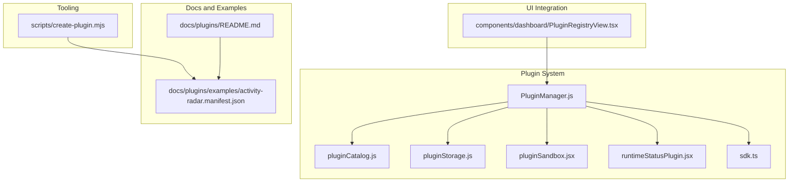
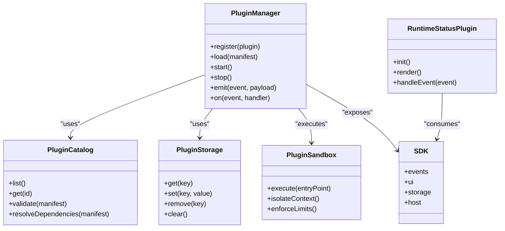
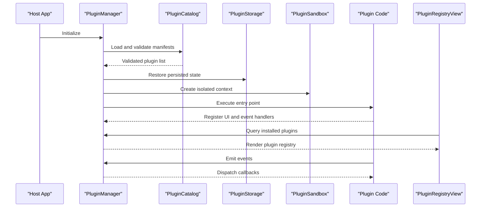
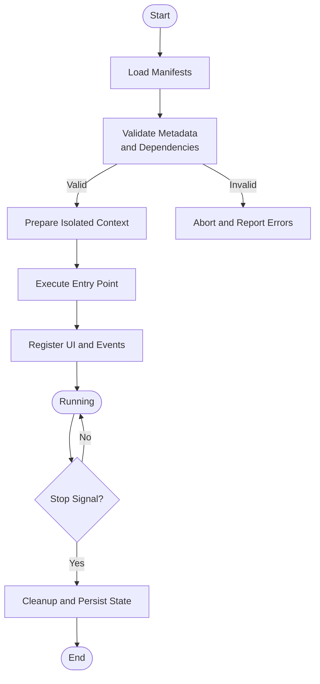
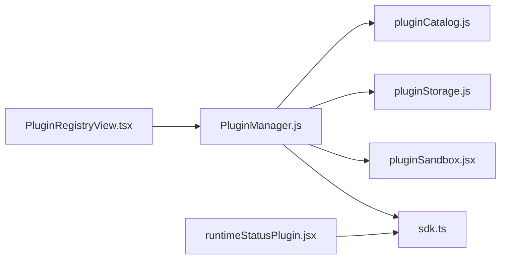

# Plugin Development

<cite>
**Referenced Files in This Document**
- [PluginManager.js](file://src/plugins/PluginManager.js)
- [index.js](file://src/plugins/index.js)
- [pluginCatalog.js](file://src/plugins/pluginCatalog.js)
- [pluginSandbox.jsx](file://src/plugins/pluginSandbox.jsx)
- [pluginStorage.js](file://src/plugins/pluginStorage.js)
- [runtimeStatusPlugin.jsx](file://src/plugins/runtimeStatusPlugin.jsx)
- [sdk.ts](file://src/plugins/sdk.ts)
- [README.md](file://docs/plugins/README.md)
- [activity-radar.manifest.json](file://docs/plugins/examples/activity-radar.manifest.json)
- [create-plugin.mjs](file://scripts/create-plugin.mjs)
- [PluginRegistryView.tsx](file://src/components/dashboard/PluginRegistryView.tsx)
</cite>

## Table of Contents
1. [Introduction](#introduction)
2. [Project Structure](#project-structure)
3. [Core Components](#core-components)
4. [Architecture Overview](#architecture-overview)
5. [Detailed Component Analysis](#detailed-component-analysis)
6. [Dependency Analysis](#dependency-analysis)
7. [Performance Considerations](#performance-considerations)
8. [Troubleshooting Guide](#troubleshooting-guide)
9. [Conclusion](#conclusion)
10. [Appendices](#appendices)

## Introduction
This document explains how to develop plugins for the application, including the plugin architecture, extension points, SDK APIs, lifecycle, security sandboxing, distribution via the marketplace, versioning and compatibility, testing and debugging strategies, and performance considerations. It is intended for both new and experienced plugin authors who want to extend the dashboard with custom features safely and reliably.

## Project Structure
The plugin system is implemented under src/plugins and supported by documentation and scaffolding scripts:
- Runtime and orchestration: PluginManager, catalog, storage, sandbox, and a sample runtime status plugin
- SDK: TypeScript definitions and helpers exposed to plugins
- Documentation: README and example manifest
- Scaffolding: CLI script to bootstrap a new plugin project
- UI integration: A registry view component that lists and manages installed plugins

**Diagram sources**
- [PluginManager.js](file://src/plugins/PluginManager.js)
- [pluginCatalog.js](file://src/plugins/pluginCatalog.js)
- [pluginStorage.js](file://src/plugins/pluginStorage.js)
- [pluginSandbox.jsx](file://src/plugins/pluginSandbox.jsx)
- [runtimeStatusPlugin.jsx](file://src/plugins/runtimeStatusPlugin.jsx)
- [sdk.ts](file://src/plugins/sdk.ts)
- [README.md](file://docs/plugins/README.md)
- [activity-radar.manifest.json](file://docs/plugins/examples/activity-radar.manifest.json)
- [create-plugin.mjs](file://scripts/create-plugin.mjs)
- [PluginRegistryView.tsx](file://src/components/dashboard/PluginRegistryView.tsx)

**Section sources**
- [PluginManager.js](file://src/plugins/PluginManager.js)
- [index.js](file://src/plugins/index.js)
- [pluginCatalog.js](file://src/plugins/pluginCatalog.js)
- [pluginSandbox.jsx](file://src/plugins/pluginSandbox.jsx)
- [pluginStorage.js](file://src/plugins/pluginStorage.js)
- [runtimeStatusPlugin.jsx](file://src/plugins/runtimeStatusPlugin.jsx)
- [sdk.ts](file://src/plugins/sdk.ts)
- [README.md](file://docs/plugins/README.md)
- [activity-radar.manifest.json](file://docs/plugins/examples/activity-radar.manifest.json)
- [create-plugin.mjs](file://scripts/create-plugin.mjs)
- [PluginRegistryView.tsx](file://src/components/dashboard/PluginRegistryView.tsx)

## Core Components
- Plugin Manager: Orchestrates discovery, loading, lifecycle, and unloading of plugins; coordinates with the catalog and storage; exposes hooks and events to plugins through the SDK.
- Catalog: Maintains metadata about available plugins, versions, and capabilities; validates manifests and resolves dependencies.
- Storage: Persists plugin state, configuration, and cache data; provides secure read/write operations scoped per plugin.
- Sandbox: Executes plugin code in an isolated environment, restricting access to sensitive host APIs and enforcing resource limits.
- SDK: Defines the public API surface for plugins, including event handlers, UI registration, and integration helpers.
- Sample Plugin: Demonstrates best practices and patterns for implementing a plugin.

Key responsibilities and interactions are illustrated below.

**Diagram sources**
- [PluginManager.js](file://src/plugins/PluginManager.js)
- [pluginCatalog.js](file://src/plugins/pluginCatalog.js)
- [pluginStorage.js](file://src/plugins/pluginStorage.js)
- [pluginSandbox.jsx](file://src/plugins/pluginSandbox.jsx)
- [sdk.ts](file://src/plugins/sdk.ts)
- [runtimeStatusPlugin.jsx](file://src/plugins/runtimeStatusPlugin.jsx)

**Section sources**
- [PluginManager.js](file://src/plugins/PluginManager.js)
- [pluginCatalog.js](file://src/plugins/pluginCatalog.js)
- [pluginStorage.js](file://src/plugins/pluginStorage.js)
- [pluginSandbox.jsx](file://src/plugins/pluginSandbox.jsx)
- [sdk.ts](file://src/plugins/sdk.ts)
- [runtimeStatusPlugin.jsx](file://src/plugins/runtimeStatusPlugin.jsx)

## Architecture Overview
The plugin architecture follows a modular design where the host application loads plugins declared via manifests, validates them against the catalog, executes them within a sandbox, and exposes a stable SDK for interaction. Plugins can register UI elements, subscribe to events, and persist data using the provided storage API. The registry view allows users to manage installed plugins from the dashboard.

**Diagram sources**
- [PluginManager.js](file://src/plugins/PluginManager.js)
- [pluginCatalog.js](file://src/plugins/pluginCatalog.js)
- [pluginStorage.js](file://src/plugins/pluginStorage.js)
- [pluginSandbox.jsx](file://src/plugins/pluginSandbox.jsx)
- [PluginRegistryView.tsx](file://src/components/dashboard/PluginRegistryView.tsx)

## Detailed Component Analysis

### Plugin Manager
Responsibilities:
- Discover and load plugins based on manifests
- Validate plugin metadata and dependencies
- Manage lifecycle (initialize, start, stop)
- Coordinate event dispatching between host and plugins
- Expose SDK methods to plugins

Lifecycle flow:
- Initialization: Load catalog, restore storage, prepare sandbox
- Loading: Parse and validate manifests, resolve dependencies
- Start: Instantiate plugins, execute entry points, register UI and handlers
- Stop: Unregister handlers, release resources, persist state

**Diagram sources**
- [PluginManager.js](file://src/plugins/PluginManager.js)
- [pluginCatalog.js](file://src/plugins/pluginCatalog.js)
- [pluginStorage.js](file://src/plugins/pluginStorage.js)
- [pluginSandbox.jsx](file://src/plugins/pluginSandbox.jsx)

**Section sources**
- [PluginManager.js](file://src/plugins/PluginManager.js)

### Plugin Catalog
Responsibilities:
- Maintain a registry of available plugins
- Validate manifests against schema rules
- Resolve dependency graphs and compatibility constraints
- Provide query interfaces for listing and retrieving plugin info

Key operations:
- List all plugins
- Get plugin by ID
- Validate manifest structure and required fields
- Resolve dependencies and detect conflicts

**Section sources**
- [pluginCatalog.js](file://src/plugins/pluginCatalog.js)

### Plugin Storage
Responsibilities:
- Provide per-plugin persistent storage
- Ensure isolation and security boundaries
- Support key-value operations and optional structured data

Operations:
- Get, set, remove keys
- Clear plugin-scoped data
- Optional encryption or integrity checks (as implemented)

**Section sources**
- [pluginStorage.js](file://src/plugins/pluginStorage.js)

### Plugin Sandbox
Responsibilities:
- Execute plugin code in an isolated context
- Restrict access to host-only APIs
- Enforce resource limits (memory, CPU, network)
- Capture and report errors without crashing the host

Security measures:
- Context isolation
- API whitelisting
- Error boundary and crash recovery

**Section sources**
- [pluginSandbox.jsx](file://src/plugins/pluginSandbox.jsx)

### SDK
Responsibilities:
- Define the public API surface for plugins
- Provide event bus for inter-process communication
- Offer UI registration helpers for extending the dashboard
- Expose storage and host integration utilities

Typical usage patterns:
- Subscribe to host events
- Register UI components or panels
- Persist plugin-specific settings
- Call host services securely via SDK methods

**Section sources**
- [sdk.ts](file://src/plugins/sdk.ts)

### Sample Plugin: Runtime Status
Purpose:
- Demonstrate plugin initialization, UI rendering, and event handling
- Show best practices for error handling and resource management

Highlights:
- Implements init and render lifecycle methods
- Subscribes to relevant events
- Uses SDK storage for preferences
- Integrates with the registry view

**Section sources**
- [runtimeStatusPlugin.jsx](file://src/plugins/runtimeStatusPlugin.jsx)

### Plugin Registry View
Purpose:
- Display installed plugins and their status
- Allow enabling/disabling and managing plugin configurations
- Surface errors and diagnostics for troubleshooting

Integration:
- Queries PluginManager for current state
- Renders plugin cards with actions
- Provides links to logs and details

**Section sources**
- [PluginRegistryView.tsx](file://src/components/dashboard/PluginRegistryView.tsx)

## Dependency Analysis
The plugin system has clear separation of concerns:
- PluginManager depends on Catalog, Storage, and Sandbox
- Plugins depend only on the SDK
- UI integrates with PluginManager via the registry view

**Diagram sources**
- [PluginManager.js](file://src/plugins/PluginManager.js)
- [pluginCatalog.js](file://src/plugins/pluginCatalog.js)
- [pluginStorage.js](file://src/plugins/pluginStorage.js)
- [pluginSandbox.jsx](file://src/plugins/pluginSandbox.jsx)
- [sdk.ts](file://src/plugins/sdk.ts)
- [PluginRegistryView.tsx](file://src/components/dashboard/PluginRegistryView.tsx)
- [runtimeStatusPlugin.jsx](file://src/plugins/runtimeStatusPlugin.jsx)

**Section sources**
- [PluginManager.js](file://src/plugins/PluginManager.js)
- [pluginCatalog.js](file://src/plugins/pluginCatalog.js)
- [pluginStorage.js](file://src/plugins/pluginStorage.js)
- [pluginSandbox.jsx](file://src/plugins/pluginSandbox.jsx)
- [sdk.ts](file://src/plugins/sdk.ts)
- [PluginRegistryView.tsx](file://src/components/dashboard/PluginRegistryView.tsx)
- [runtimeStatusPlugin.jsx](file://src/plugins/runtimeStatusPlugin.jsx)

## Performance Considerations
- Lazy loading: Defer plugin execution until needed to reduce startup time
- Resource limits: Enforce memory and CPU caps in the sandbox to prevent runaway plugins
- Event throttling: Debounce high-frequency events to avoid excessive re-renders
- Caching: Use storage judiciously and prefer in-memory caches for hot paths
- UI composition: Keep plugin UI lightweight; avoid heavy computations on the main thread
- Diagnostics: Monitor plugin performance metrics and expose them via the registry view

[No sources needed since this section provides general guidance]

## Troubleshooting Guide
Common issues and resolutions:
- Manifest validation failures: Check required fields and version constraints
- Dependency conflicts: Review resolved dependency graph and adjust versions
- Sandbox errors: Inspect isolated context logs and ensure API usage conforms to SDK
- Storage errors: Verify key scoping and permissions; clear corrupted entries if necessary
- UI not rendering: Confirm registration calls and check registry view for errors

Debugging techniques:
- Enable detailed logging in the registry view
- Use the sample plugin as a baseline for comparison
- Validate manifests with the catalog’s validation routines
- Test in development mode with hot reload enabled

**Section sources**
- [pluginCatalog.js](file://src/plugins/pluginCatalog.js)
- [pluginSandbox.jsx](file://src/plugins/pluginSandbox.jsx)
- [pluginStorage.js](file://src/plugins/pluginStorage.js)
- [PluginRegistryView.tsx](file://src/components/dashboard/PluginRegistryView.tsx)

## Conclusion
The plugin system provides a robust, secure, and extensible framework for adding features to the dashboard. By adhering to the SDK contracts, following lifecycle best practices, and leveraging the sandbox and storage abstractions, developers can create reliable plugins that integrate seamlessly with the host application.

[No sources needed since this section summarizes without analyzing specific files]

## Appendices

### Step-by-Step Tutorial: Creating Your First Plugin
1. Scaffold a new plugin using the CLI tool:
   - Run the create-plugin script to generate a starter project structure
2. Implement the plugin entry point:
   - Initialize the plugin and register UI components via the SDK
   - Subscribe to relevant host events
3. Add a manifest file:
   - Include metadata, version, dependencies, and capabilities
4. Test locally:
   - Load the plugin into the host app and verify behavior
5. Iterate and refine:
   - Use the registry view to monitor status and errors
6. Package and distribute:
   - Follow marketplace guidelines and publish your plugin

**Section sources**
- [create-plugin.mjs](file://scripts/create-plugin.mjs)
- [README.md](file://docs/plugins/README.md)
- [activity-radar.manifest.json](file://docs/plugins/examples/activity-radar.manifest.json)

### Plugin Manifest Structure
A typical manifest includes:
- Identifier and name
- Version and compatibility matrix
- Description and author information
- Capabilities and required host APIs
- Dependencies and constraints
- Entry point and UI registration hints

Use the example manifest as a reference for field names and conventions.

**Section sources**
- [activity-radar.manifest.json](file://docs/plugins/examples/activity-radar.manifest.json)

### Security Sandboxing
- Execution isolation: Plugins run in a sandboxed context
- API whitelisting: Only approved SDK methods are accessible
- Resource enforcement: Limits on memory, CPU, and I/O
- Error containment: Failures do not propagate to the host

Best practices:
- Avoid direct host access; use SDK methods
- Validate inputs and handle errors gracefully
- Minimize side effects and keep logic deterministic

**Section sources**
- [pluginSandbox.jsx](file://src/plugins/pluginSandbox.jsx)
- [sdk.ts](file://src/plugins/sdk.ts)

### Distribution Through the Marketplace
Guidelines:
- Publish a well-formed manifest
- Provide installation instructions and prerequisites
- Include tests and documentation
- Adhere to versioning and compatibility policies

Versioning strategies:
- Semantic versioning for plugin releases
- Compatibility ranges aligned with host versions
- Deprecation notices and migration guides

Compatibility matrices:
- Map plugin versions to supported host versions
- Document breaking changes and upgrade steps

**Section sources**
- [README.md](file://docs/plugins/README.md)
- [activity-radar.manifest.json](file://docs/plugins/examples/activity-radar.manifest.json)

### Testing Approaches
- Unit tests for plugin logic
- Integration tests with the SDK and mock host services
- UI tests for registered components
- Regression tests for manifest validation and dependency resolution

Tools and patterns:
- Use the catalog validator in test fixtures
- Mock storage and sandbox behaviors
- Simulate event flows and lifecycle transitions

**Section sources**
- [pluginCatalog.js](file://src/plugins/pluginCatalog.js)
- [pluginStorage.js](file://src/plugins/pluginStorage.js)
- [pluginSandbox.jsx](file://src/plugins/pluginSandbox.jsx)

### Debugging Techniques
- Enable verbose logs in the registry view
- Inspect sandbox error traces
- Validate manifests before deployment
- Use the sample plugin as a reference implementation

**Section sources**
- [PluginRegistryView.tsx](file://src/components/dashboard/PluginRegistryView.tsx)
- [pluginSandbox.jsx](file://src/plugins/pluginSandbox.jsx)

### Common Plugin Patterns and Integration Scenarios
- Dashboard widgets: Register UI panels and charts
- Event-driven analytics: Subscribe to transaction and account events
- Data export tools: Use storage and host APIs to generate reports
- Compliance dashboards: Integrate with audit and risk modules

Patterns:
- Observer pattern for event handling
- Factory pattern for dynamic UI creation
- Strategy pattern for pluggable algorithms

**Section sources**
- [sdk.ts](file://src/plugins/sdk.ts)
- [runtimeStatusPlugin.jsx](file://src/plugins/runtimeStatusPlugin.jsx)