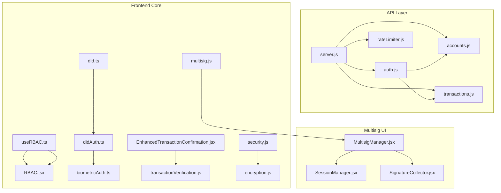
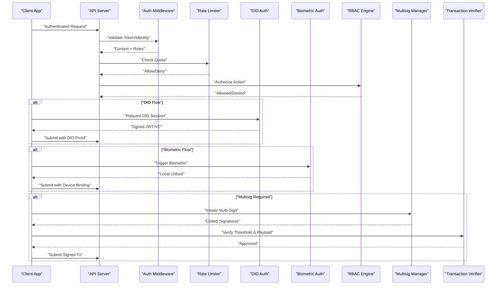
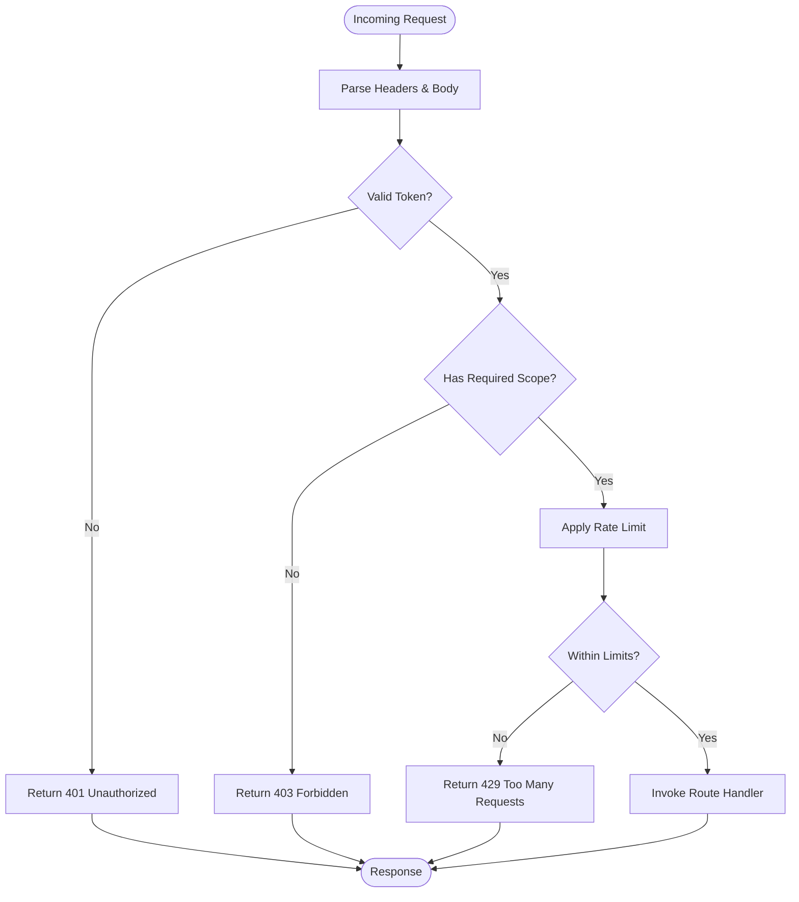
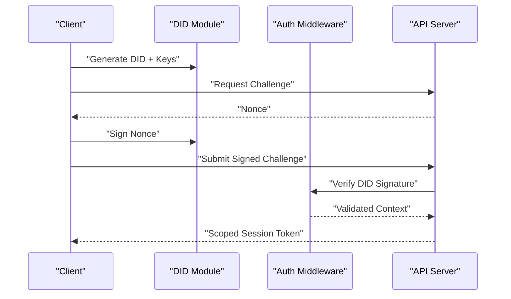
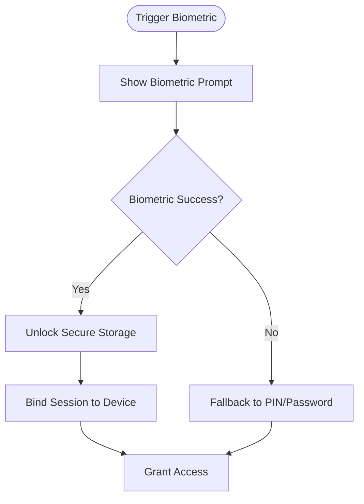
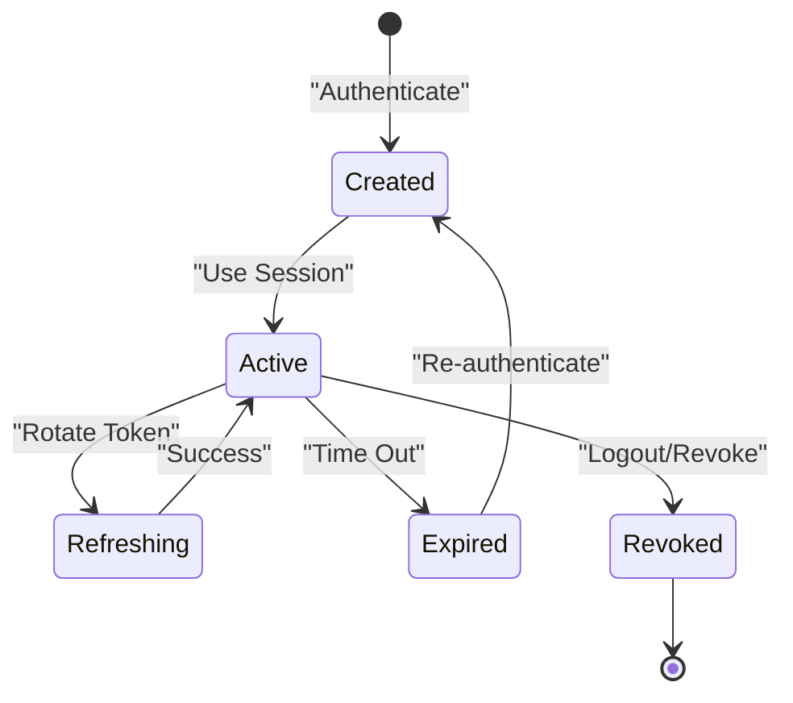
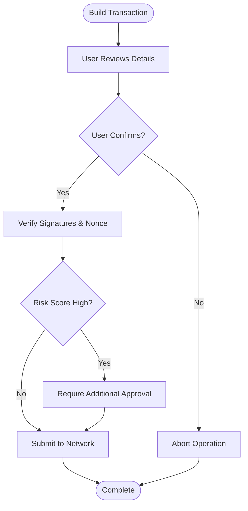
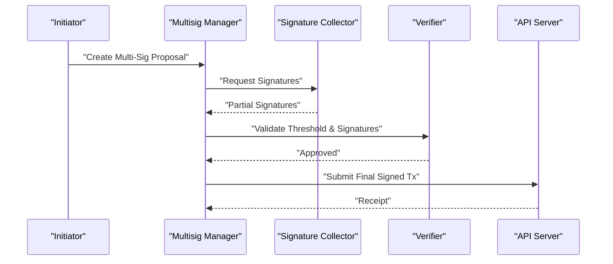
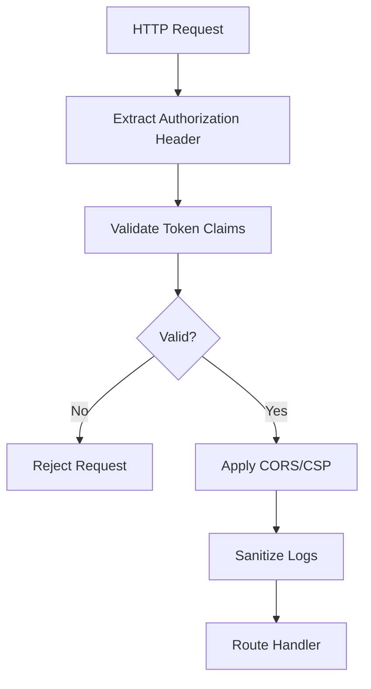
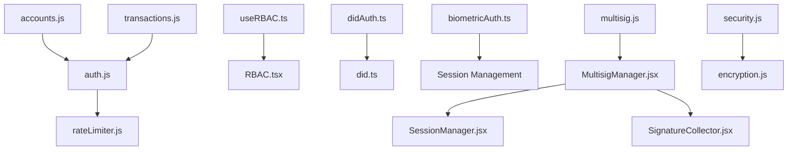

# Authentication & Authorization

<cite>
**Referenced Files in This Document**
- [auth.js](file://api/middleware/auth.js)
- [rateLimiter.js](file://api/middleware/rateLimiter.js)
- [server.js](file://api/server.js)
- [accounts.js](file://api/routes/accounts.js)
- [transactions.js](file://api/routes/transactions.js)
- [RBAC.tsx](file://src/components/dashboard/RBAC.tsx)
- [useRBAC.ts](file://src/hooks/useRBAC.ts)
- [did.ts](file://src/lib/did.ts)
- [didAuth.ts](file://src/lib/didAuth.ts)
- [biometricAuth.ts](file://src/lib/biometricAuth.ts)
- [multisig.js](file://src/lib/multisig.js)
- [MultisigManager.jsx](file://src/components/multisig/MultisigManager.jsx)
- [SessionManager.jsx](file://src/components/multisig/SessionManager.jsx)
- [SignatureCollector.jsx](file://src/components/multisig/SignatureCollector.jsx)
- [EnhancedTransactionConfirmation.jsx](file://src/components/security/EnhancedTransactionConfirmation.jsx)
- [transactionVerification.js](file://src/lib/transactionVerification.js)
- [security.js](file://src/utils/security.js)
- [encryption.js](file://src/lib/encryption.js)
- [authentication.md](file://docs-site/docs/getting-started/authentication.md)
- [SECURITY.md](file://SECURITY.md)
</cite>

## Table of Contents
1. [Introduction](#introduction)
2. [Project Structure](#project-structure)
3. [Core Components](#core-components)
4. [Architecture Overview](#architecture-overview)
5. [Detailed Component Analysis](#detailed-component-analysis)
6. [Dependency Analysis](#dependency-analysis)
7. [Performance Considerations](#performance-considerations)
8. [Troubleshooting Guide](#troubleshooting-guide)
9. [Conclusion](#conclusion)
10. [Appendices](#appendices)

## Introduction
This document explains the authentication and authorization mechanisms implemented across the application, focusing on:
- Role-based access control (RBAC): roles, permissions matrix, inheritance, and validation patterns
- Decentralized Identity (DID) authentication flow
- Biometric authentication integration for mobile and desktop contexts
- Session management and secure API authentication
- Transaction confirmation security measures
- Multi-signature workflows and approval thresholds
- Configuration examples for different authentication providers
- Security best practices for sensitive operations

The goal is to provide both technical depth and accessible guidance for developers integrating or extending these features.

## Project Structure
Authentication and authorization span multiple layers:
- API middleware enforces server-side authentication and rate limiting
- Frontend hooks and components implement RBAC and UI-level guards
- DID and biometric modules provide identity and device-bound authentication
- Multisig components orchestrate multi-party approvals
- Security utilities handle encryption, verification, and safe handling of secrets



**Diagram sources**
- [server.js](file://api/server.js)
- [auth.js](file://api/middleware/auth.js)
- [rateLimiter.js](file://api/middleware/rateLimiter.js)
- [accounts.js](file://api/routes/accounts.js)
- [transactions.js](file://api/routes/transactions.js)
- [useRBAC.ts](file://src/hooks/useRBAC.ts)
- [RBAC.tsx](file://src/components/dashboard/RBAC.tsx)
- [did.ts](file://src/lib/did.ts)
- [didAuth.ts](file://src/lib/didAuth.ts)
- [biometricAuth.ts](file://src/lib/biometricAuth.ts)
- [multisig.js](file://src/lib/multisig.js)
- [MultisigManager.jsx](file://src/components/multisig/MultisigManager.jsx)
- [SessionManager.jsx](file://src/components/multisig/SessionManager.jsx)
- [SignatureCollector.jsx](file://src/components/multisig/SignatureCollector.jsx)
- [EnhancedTransactionConfirmation.jsx](file://src/components/security/EnhancedTransactionConfirmation.jsx)
- [transactionVerification.js](file://src/lib/transactionVerification.js)
- [security.js](file://src/utils/security.js)
- [encryption.js](file://src/lib/encryption.js)

**Section sources**
- [server.js](file://api/server.js)
- [auth.js](file://api/middleware/auth.js)
- [rateLimiter.js](file://api/middleware/rateLimiter.js)
- [accounts.js](file://api/routes/accounts.js)
- [transactions.js](file://api/routes/transactions.js)
- [useRBAC.ts](file://src/hooks/useRBAC.ts)
- [RBAC.tsx](file://src/components/dashboard/RBAC.tsx)
- [did.ts](file://src/lib/did.ts)
- [didAuth.ts](file://src/lib/didAuth.ts)
- [biometricAuth.ts](file://src/lib/biometricAuth.ts)
- [multisig.js](file://src/lib/multisig.js)
- [MultisigManager.jsx](file://src/components/multisig/MultisigManager.jsx)
- [SessionManager.jsx](file://src/components/multisig/SessionManager.jsx)
- [SignatureCollector.jsx](file://src/components/multisig/SignatureCollector.jsx)
- [EnhancedTransactionConfirmation.jsx](file://src/components/security/EnhancedTransactionConfirmation.jsx)
- [transactionVerification.js](file://src/lib/transactionVerification.js)
- [security.js](file://src/utils/security.js)
- [encryption.js](file://src/lib/encryption.js)

## Core Components
- API Authentication Middleware: Validates tokens, enforces scopes, and integrates with rate limiting
- RBAC Engine: Centralized role and permission checks for frontend and backend
- DID Auth Module: Handles decentralized identity issuance, verification, and session binding
- Biometric Auth Module: Integrates platform biometrics for device-bound authentication
- Multisig Orchestration: Manages multi-party signing, thresholds, and state transitions
- Transaction Confirmation: Enforces user review, replay protection, and cryptographic verification
- Security Utilities: Encryption helpers, safe logging, and error sanitization

**Section sources**
- [auth.js](file://api/middleware/auth.js)
- [useRBAC.ts](file://src/hooks/useRBAC.ts)
- [RBAC.tsx](file://src/components/dashboard/RBAC.tsx)
- [didAuth.ts](file://src/lib/didAuth.ts)
- [biometricAuth.ts](file://src/lib/biometricAuth.ts)
- [multisig.js](file://src/lib/multisig.js)
- [MultisigManager.jsx](file://src/components/multisig/MultisigManager.jsx)
- [EnhancedTransactionConfirmation.jsx](file://src/components/security/EnhancedTransactionConfirmation.jsx)
- [transactionVerification.js](file://src/lib/transactionVerification.js)
- [security.js](file://src/utils/security.js)
- [encryption.js](file://src/lib/encryption.js)

## Architecture Overview
The system combines server-side token validation with client-side RBAC and advanced identity flows:
- API requests pass through auth middleware that validates credentials and applies rate limits
- Frontend uses RBAC hooks to gate UI actions and route access
- DID and biometric flows produce short-lived, scoped sessions bound to device and context
- Multisig workflows require multiple signers to meet threshold before submission
- Transaction confirmation ensures human-in-the-loop verification and cryptographic integrity



**Diagram sources**
- [auth.js](file://api/middleware/auth.js)
- [rateLimiter.js](file://api/middleware/rateLimiter.js)
- [didAuth.ts](file://src/lib/didAuth.ts)
- [biometricAuth.ts](file://src/lib/biometricAuth.ts)
- [useRBAC.ts](file://src/hooks/useRBAC.ts)
- [RBAC.tsx](file://src/components/dashboard/RBAC.tsx)
- [multisig.js](file://src/lib/multisig.js)
- [MultisigManager.jsx](file://src/components/multisig/MultisigManager.jsx)
- [EnhancedTransactionConfirmation.jsx](file://src/components/security/EnhancedTransactionConfirmation.jsx)
- [transactionVerification.js](file://src/lib/transactionVerification.js)

## Detailed Component Analysis

### API Authentication and Authorization
- Token validation: Parses and verifies bearer tokens, supports audience and issuer checks
- Scope enforcement: Maps claims to roles and permissions; denies insufficient scope
- Rate limiting: Applies per-client throttling to prevent abuse
- Route protection: Protects accounts and transactions endpoints with explicit guards



**Diagram sources**
- [auth.js](file://api/middleware/auth.js)
- [rateLimiter.js](file://api/middleware/rateLimiter.js)
- [accounts.js](file://api/routes/accounts.js)
- [transactions.js](file://api/routes/transactions.js)

**Section sources**
- [auth.js](file://api/middleware/auth.js)
- [rateLimiter.js](file://api/middleware/rateLimiter.js)
- [accounts.js](file://api/routes/accounts.js)
- [transactions.js](file://api/routes/transactions.js)

### Role-Based Access Control (RBAC)
- Roles and Permissions: Centralized definitions map roles to granular permissions
- Inheritance: Higher roles inherit lower-level permissions by design
- Validation Patterns: Consistent checks via hooks and component wrappers
- UI Guards: Conditional rendering and action gating based on current user’s roles

```mermaid
classDiagram
class RBAC {
+checkPermission(userRoles, requiredPermissions) bool
+hasRole(userRoles, role) bool
+getInheritedPermissions(role) Set~string~
}
class UseRBAC {
+useRBAC() { allowed, can, hasRole }
}
class RBACComponent {
+Protected({ children, required })
}
UseRBAC --> RBAC : "uses"
RBACComponent --> UseRBAC : "consumes"
```

**Diagram sources**
- [RBAC.tsx](file://src/components/dashboard/RBAC.tsx)
- [useRBAC.ts](file://src/hooks/useRBAC.ts)

**Section sources**
- [RBAC.tsx](file://src/components/dashboard/RBAC.tsx)
- [useRBAC.ts](file://src/hooks/useRBAC.ts)

### DID Authentication Flow
- Issuance: Client obtains a DID and associated keys
- Challenge: Server issues a nonce challenge
- Signing: Client signs challenge with DID key
- Verification: Server validates signature and binds DID to session
- Scoping: DID-derived tokens include scoped permissions



**Diagram sources**
- [did.ts](file://src/lib/did.ts)
- [didAuth.ts](file://src/lib/didAuth.ts)
- [auth.js](file://api/middleware/auth.js)

**Section sources**
- [did.ts](file://src/lib/did.ts)
- [didAuth.ts](file://src/lib/didAuth.ts)
- [authentication.md](file://docs-site/docs/getting-started/authentication.md)

### Biometric Authentication Integration
- Platform APIs: Uses native biometric prompts where available
- Local Unlock: Unlocks local secure storage after successful biometric check
- Session Binding: Ties session to device fingerprint and time-bound validity
- Fallback: Graceful fallback to password/PIN when biometrics unavailable



**Diagram sources**
- [biometricAuth.ts](file://src/lib/biometricAuth.ts)

**Section sources**
- [biometricAuth.ts](file://src/lib/biometricAuth.ts)

### Session Management
- Creation: Sessions created upon successful authentication (token or DID)
- Rotation: Periodic refresh and rotation of tokens to limit exposure
- Expiration: Time-bound sessions with sliding expiration
- Revocation: Central revocation list and logout propagation



**Diagram sources**
- [auth.js](file://api/middleware/auth.js)
- [didAuth.ts](file://src/lib/didAuth.ts)
- [biometricAuth.ts](file://src/lib/biometricAuth.ts)

**Section sources**
- [auth.js](file://api/middleware/auth.js)
- [didAuth.ts](file://src/lib/didAuth.ts)
- [biometricAuth.ts](file://src/lib/biometricAuth.ts)

### Transaction Confirmation Security
- Human-in-the-loop: Requires explicit user confirmation before submission
- Replay Protection: Unique nonces and sequence numbers
- Cryptographic Verification: Validates signatures and payload integrity
- Risk Scoring: Optional risk assessment for high-value operations



**Diagram sources**
- [EnhancedTransactionConfirmation.jsx](file://src/components/security/EnhancedTransactionConfirmation.jsx)
- [transactionVerification.js](file://src/lib/transactionVerification.js)

**Section sources**
- [EnhancedTransactionConfirmation.jsx](file://src/components/security/EnhancedTransactionConfirmation.jsx)
- [transactionVerification.js](file://src/lib/transactionVerification.js)

### Multi-Signature Workflows
- Setup: Define signers and threshold requirements
- Collection: Collect partial signatures from authorized parties
- Validation: Ensure threshold met and all signatures valid
- Submission: Assemble final signed transaction and submit



**Diagram sources**
- [multisig.js](file://src/lib/multisig.js)
- [MultisigManager.jsx](file://src/components/multisig/MultisigManager.jsx)
- [SessionManager.jsx](file://src/components/multisig/SessionManager.jsx)
- [SignatureCollector.jsx](file://src/components/multisig/SignatureCollector.jsx)

**Section sources**
- [multisig.js](file://src/lib/multisig.js)
- [MultisigManager.jsx](file://src/components/multisig/MultisigManager.jsx)
- [SessionManager.jsx](file://src/components/multisig/SessionManager.jsx)
- [SignatureCollector.jsx](file://src/components/multisig/SignatureCollector.jsx)

### Secure API Authentication
- Bearer Tokens: Standardized authorization header usage
- Audience/Issuer: Strict validation of token metadata
- CORS and CSP: Enforced headers to mitigate cross-origin risks
- Logging: Sanitized logs without secrets or sensitive payloads



**Diagram sources**
- [auth.js](file://api/middleware/auth.js)
- [security.js](file://src/utils/security.js)
- [encryption.js](file://src/lib/encryption.js)

**Section sources**
- [auth.js](file://api/middleware/auth.js)
- [security.js](file://src/utils/security.js)
- [encryption.js](file://src/lib/encryption.js)

## Dependency Analysis
Key dependencies and relationships:
- API routes depend on auth middleware and rate limiter
- Frontend RBAC depends on centralized role definitions and hooks
- DID and biometric modules feed into session creation and token scoping
- Multisig components rely on shared libraries for signature collection and validation
- Security utilities are reused across encryption, verification, and logging



**Diagram sources**
- [accounts.js](file://api/routes/accounts.js)
- [transactions.js](file://api/routes/transactions.js)
- [auth.js](file://api/middleware/auth.js)
- [rateLimiter.js](file://api/middleware/rateLimiter.js)
- [useRBAC.ts](file://src/hooks/useRBAC.ts)
- [RBAC.tsx](file://src/components/dashboard/RBAC.tsx)
- [didAuth.ts](file://src/lib/didAuth.ts)
- [did.ts](file://src/lib/did.ts)
- [biometricAuth.ts](file://src/lib/biometricAuth.ts)
- [multisig.js](file://src/lib/multisig.js)
- [MultisigManager.jsx](file://src/components/multisig/MultisigManager.jsx)
- [SessionManager.jsx](file://src/components/multisig/SessionManager.jsx)
- [SignatureCollector.jsx](file://src/components/multisig/SignatureCollector.jsx)
- [security.js](file://src/utils/security.js)
- [encryption.js](file://src/lib/encryption.js)

**Section sources**
- [accounts.js](file://api/routes/accounts.js)
- [transactions.js](file://api/routes/transactions.js)
- [auth.js](file://api/middleware/auth.js)
- [rateLimiter.js](file://api/middleware/rateLimiter.js)
- [useRBAC.ts](file://src/hooks/useRBAC.ts)
- [RBAC.tsx](file://src/components/dashboard/RBAC.tsx)
- [didAuth.ts](file://src/lib/didAuth.ts)
- [did.ts](file://src/lib/did.ts)
- [biometricAuth.ts](file://src/lib/biometricAuth.ts)
- [multisig.js](file://src/lib/multisig.js)
- [MultisigManager.jsx](file://src/components/multisig/MultisigManager.jsx)
- [SessionManager.jsx](file://src/components/multisig/SessionManager.jsx)
- [SignatureCollector.jsx](file://src/components/multisig/SignatureCollector.jsx)
- [security.js](file://src/utils/security.js)
- [encryption.js](file://src/lib/encryption.js)

## Performance Considerations
- Minimize token validation overhead by caching verified claims where appropriate
- Use efficient RBAC checks with precomputed permission sets
- Avoid blocking biometric prompts on critical paths; cache device-bound sessions
- Batch multisig signature collection to reduce network round-trips
- Implement request deduplication and idempotency for transaction submissions

[No sources needed since this section provides general guidance]

## Troubleshooting Guide
Common issues and resolutions:
- Invalid token errors: Check issuer, audience, and expiration; ensure correct environment configuration
- Permission denied: Verify role assignments and inherited permissions; audit RBAC mappings
- DID verification failures: Validate challenge-response flow and key derivation; confirm DID resolution
- Biometric prompt not showing: Ensure platform support and permissions; provide fallback authentication
- Multisig threshold not met: Review signer list and threshold settings; collect missing signatures
- Transaction rejection: Inspect nonce, fee, and signature validity; simulate before submission

**Section sources**
- [auth.js](file://api/middleware/auth.js)
- [useRBAC.ts](file://src/hooks/useRBAC.ts)
- [didAuth.ts](file://src/lib/didAuth.ts)
- [biometricAuth.ts](file://src/lib/biometricAuth.ts)
- [multisig.js](file://src/lib/multisig.js)
- [EnhancedTransactionConfirmation.jsx](file://src/components/security/EnhancedTransactionConfirmation.jsx)
- [transactionVerification.js](file://src/lib/transactionVerification.js)
- [SECURITY.md](file://SECURITY.md)

## Conclusion
The authentication and authorization system combines robust server-side validation with flexible client-side controls. RBAC provides fine-grained access, while DID and biometric flows enhance identity assurance. Multisig workflows and transaction confirmation safeguards protect high-risk operations. Adhering to the recommended configurations and best practices ensures secure, scalable, and user-friendly experiences.

[No sources needed since this section summarizes without analyzing specific files]

## Appendices

### RBAC Roles and Permissions Matrix
- Admin: Full access to all resources and administrative actions
- Operator: Can manage operational tasks and view sensitive data
- Analyst: Read-only access to analytics and reports
- User: Basic account and transaction capabilities

Permission inheritance:
- Admin inherits Operator, Analyst, and User permissions
- Operator inherits Analyst and User permissions
- Analyst inherits User permissions

Validation patterns:
- Backend: Middleware checks required scopes against token claims
- Frontend: Hooks and wrappers enforce UI-level restrictions

**Section sources**
- [RBAC.tsx](file://src/components/dashboard/RBAC.tsx)
- [useRBAC.ts](file://src/hooks/useRBAC.ts)

### DID Authentication Provider Configuration
- Supported providers: Self-hosted DID resolver, public DID registries
- Configuration keys: Resolver URL, supported algorithms, claim mappings
- Example setup: Configure resolver endpoint and algorithm whitelist; map DID claims to roles

**Section sources**
- [did.ts](file://src/lib/did.ts)
- [didAuth.ts](file://src/lib/didAuth.ts)
- [authentication.md](file://docs-site/docs/getting-started/authentication.md)

### Biometric Authentication Provider Configuration
- Platforms: iOS Face ID/Touch ID, Android BiometricPrompt
- Configuration keys: Prompt text, fallback options, timeout settings
- Example setup: Enable biometric unlock, define fallback to PIN, set session binding duration

**Section sources**
- [biometricAuth.ts](file://src/lib/biometricAuth.ts)

### Security Best Practices
- Rotate secrets regularly and store securely
- Enforce least privilege in RBAC mappings
- Validate and sanitize all inputs and outputs
- Use HTTPS and strong cipher suites
- Monitor and log security events without exposing sensitive data
- Implement rate limiting and circuit breakers

**Section sources**
- [security.js](file://src/utils/security.js)
- [encryption.js](file://src/lib/encryption.js)
- [SECURITY.md](file://SECURITY.md)