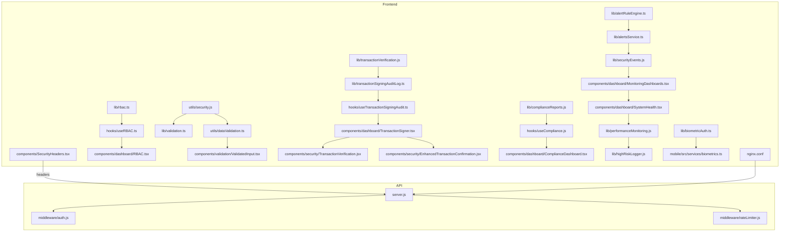
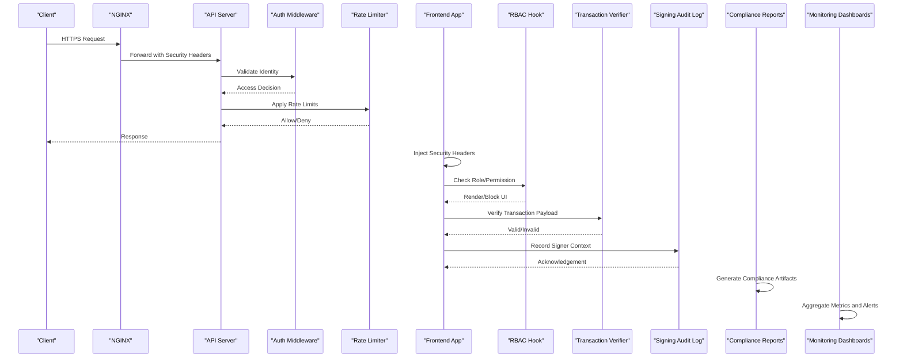
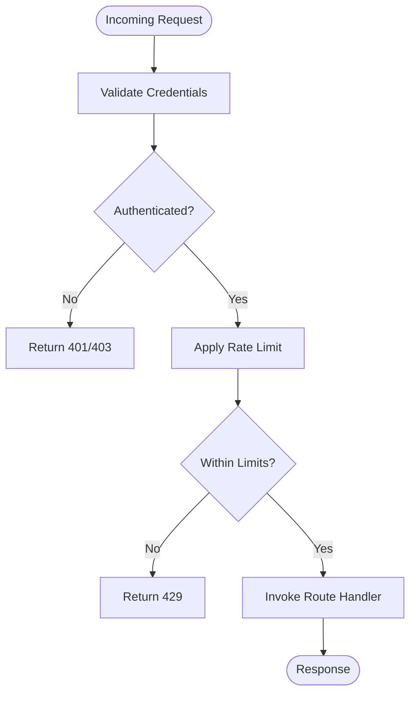
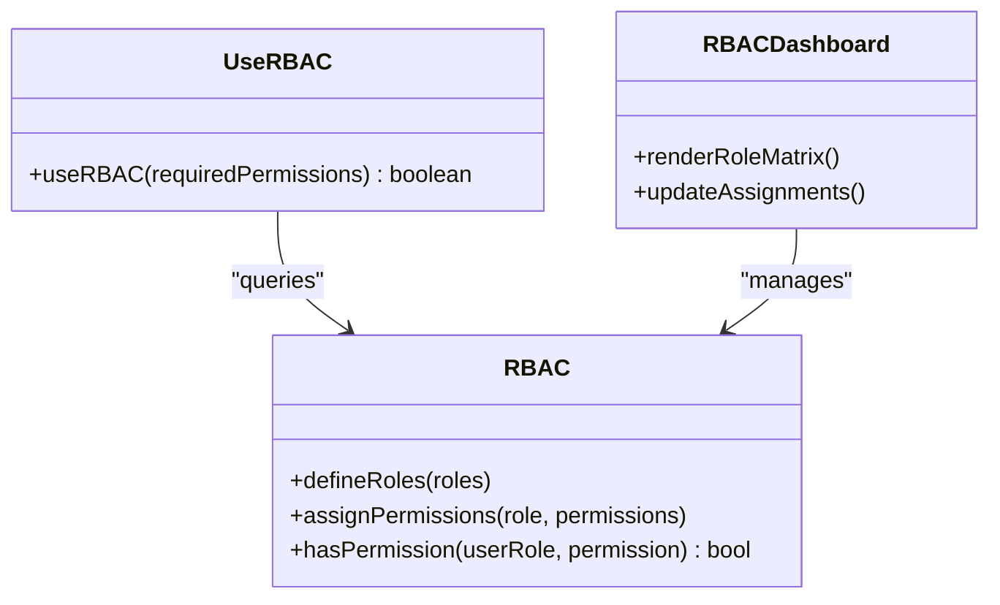
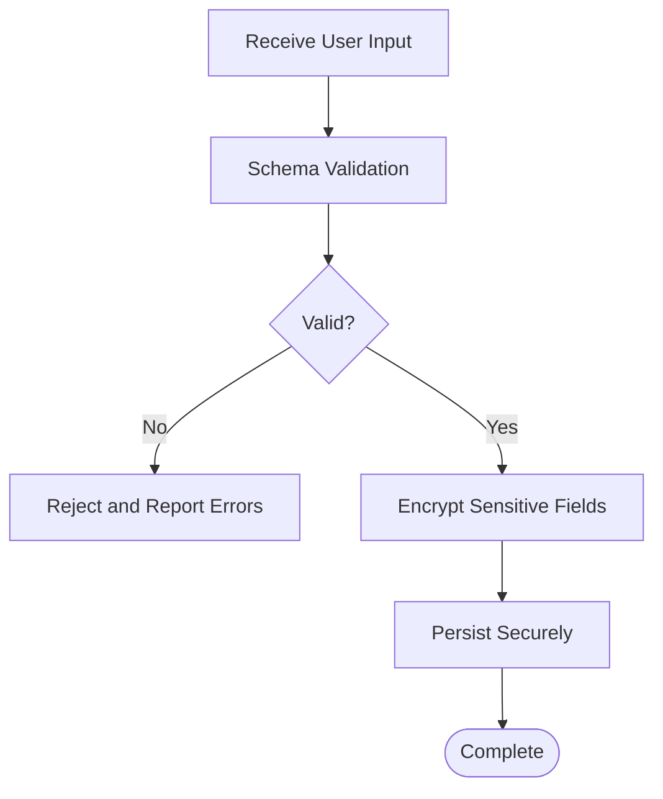
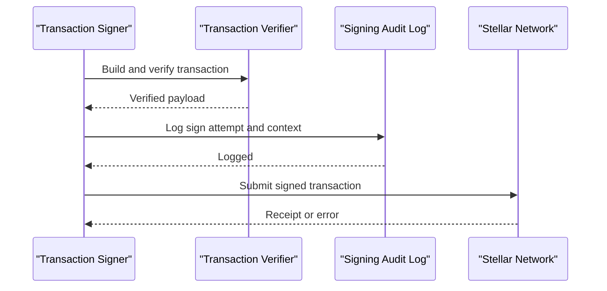
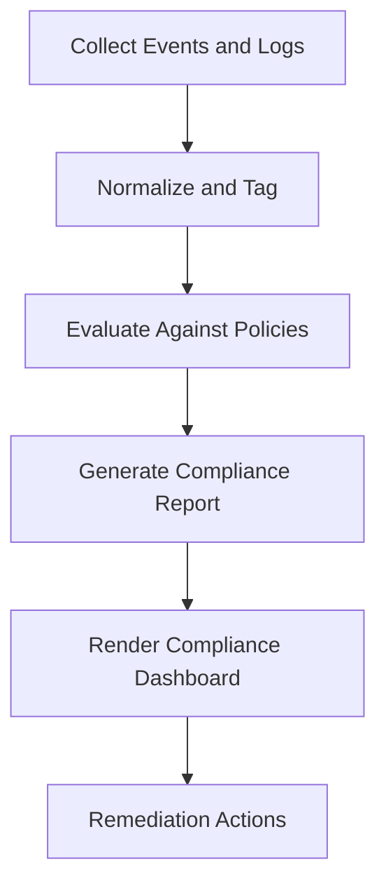
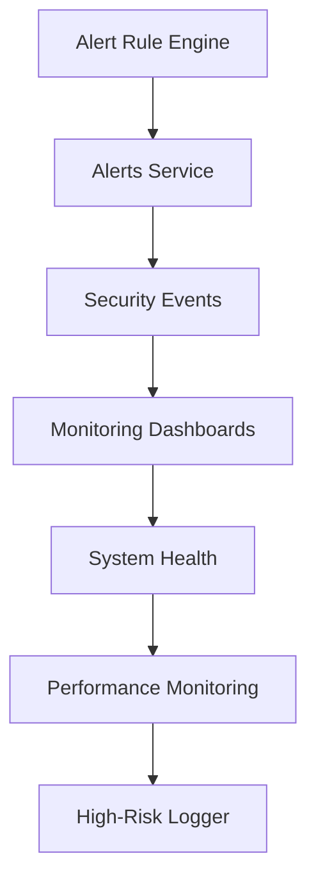
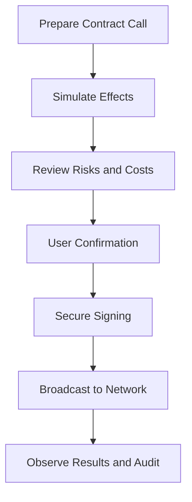
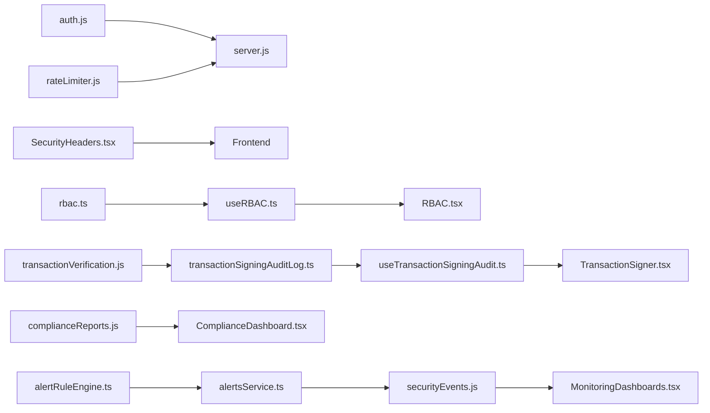

# Security & Compliance

<cite>
**Referenced Files in This Document**
- [SECURITY.md](file://SECURITY.md)
- [api/server.js](file://api/server.js)
- [api/middleware/auth.js](file://api/middleware/auth.js)
- [api/middleware/rateLimiter.js](file://api/middleware/rateLimiter.js)
- [src/components/SecurityHeaders.tsx](file://src/components/SecurityHeaders.tsx)
- [src/lib/rbac.ts](file://src/lib/rbac.ts)
- [src/hooks/useRBAC.ts](file://src/hooks/useRBAC.ts)
- [src/components/dashboard/RBAC.tsx](file://src/components/dashboard/RBAC.tsx)
- [src/lib/encryption.js](file://src/lib/encryption.js)
- [src/utils/security.js](file://src/utils/security.js)
- [src/lib/validation.ts](file://src/lib/validation.ts)
- [src/utils/dataValidation.ts](file://src/utils/dataValidation.ts)
- [src/components/validation/ValidatedInput.tsx](file://src/components/validation/ValidatedInput.tsx)
- [src/lib/transactionVerification.js](file://src/lib/transactionVerification.js)
- [src/lib/transactionSigningAuditLog.ts](file://src/lib/transactionSigningAuditLog.ts)
- [src/hooks/useTransactionSigningAudit.ts](file://src/hooks/useTransactionSigningAudit.ts)
- [src/components/dashboard/TransactionSigner.tsx](file://src/components/dashboard/TransactionSigner.tsx)
- [src/components/security/TransactionVerification.jsx](file://src/components/security/TransactionVerification.jsx)
- [src/components/security/EnhancedTransactionConfirmation.jsx](file://src/components/security/EnhancedTransactionConfirmation.jsx)
- [src/lib/complianceReports.js](file://src/lib/complianceReports.js)
- [src/hooks/useCompliance.js](file://src/hooks/useCompliance.js)
- [src/components/dashboard/ComplianceDashboard.tsx](file://src/components/dashboard/ComplianceDashboard.tsx)
- [src/lib/alertRuleEngine.ts](file://src/lib/alertRuleEngine.ts)
- [src/lib/alertsService.ts](file://src/lib/alertsService.ts)
- [src/lib/securityEvents.js](file://src/lib/securityEvents.js)
- [src/components/dashboard/MonitoringDashboards.tsx](file://src/components/dashboard/MonitoringDashboards.tsx)
- [src/components/dashboard/SystemHealth.tsx](file://src/components/dashboard/SystemHealth.tsx)
- [src/lib/performanceMonitoring.js](file://src/lib/performanceMonitoring.js)
- [src/lib/highRiskLogger.js](file://src/lib/highRiskLogger.js)
- [src/lib/biometricAuth.ts](file://src/lib/biometricAuth.ts)
- [mobile/src/services/biometrics.ts](file://mobile/src/services/biometrics.ts)
- [nginx.conf](file://nginx.conf)
- [docs-site/docs/getting-started/authentication.md](file://docs-site/docs/getting-started/authentication.md)
- [docs/api/encryption.md](file://docs/api/encryption.md)
</cite>

## Table of Contents
1. [Introduction](#introduction)
2. [Project Structure](#project-structure)
3. [Core Components](#core-components)
4. [Architecture Overview](#architecture-overview)
5. [Detailed Component Analysis](#detailed-component-analysis)
6. [Dependency Analysis](#dependency-analysis)
7. [Performance Considerations](#performance-considerations)
8. [Troubleshooting Guide](#troubleshooting-guide)
9. [Conclusion](#conclusion)
10. [Appendices](#appendices)

## Introduction
This document provides comprehensive security and compliance guidance for the project, covering best practices, authentication and authorization patterns, data encryption and privacy measures, RBAC implementation, secure transaction signing, audit logging, input validation, vulnerability assessment, blockchain-specific security considerations (private key management, transaction verification, smart contract interaction safety), monitoring, incident response, and compliance reporting. It maps these topics to concrete components and files within the repository to ensure traceability and actionable guidance.

## Project Structure
The codebase is organized into a Node.js API layer, a React-based dashboard frontend, mobile services, shared libraries, and documentation. Security-relevant areas include:
- API server and middleware for authentication and rate limiting
- Frontend security headers component
- RBAC library and hooks
- Encryption utilities and validation modules
- Transaction verification and signing audit logging
- Compliance reporting and dashboards
- Alerting and monitoring dashboards
- Biometric authentication for mobile

**Diagram sources**
- [api/server.js](file://api/server.js)
- [api/middleware/auth.js](file://api/middleware/auth.js)
- [api/middleware/rateLimiter.js](file://api/middleware/rateLimiter.js)
- [src/components/SecurityHeaders.tsx](file://src/components/SecurityHeaders.tsx)
- [src/lib/rbac.ts](file://src/lib/rbac.ts)
- [src/hooks/useRBAC.ts](file://src/hooks/useRBAC.ts)
- [src/components/dashboard/RBAC.tsx](file://src/components/dashboard/RBAC.tsx)
- [src/utils/security.js](file://src/utils/security.js)
- [src/lib/validation.ts](file://src/lib/validation.ts)
- [src/utils/dataValidation.ts](file://src/utils/dataValidation.ts)
- [src/components/validation/ValidatedInput.tsx](file://src/components/validation/ValidatedInput.tsx)
- [src/lib/transactionVerification.js](file://src/lib/transactionVerification.js)
- [src/lib/transactionSigningAuditLog.ts](file://src/lib/transactionSigningAuditLog.ts)
- [src/hooks/useTransactionSigningAudit.ts](file://src/hooks/useTransactionSigningAudit.ts)
- [src/components/dashboard/TransactionSigner.tsx](file://src/components/dashboard/TransactionSigner.tsx)
- [src/components/security/TransactionVerification.jsx](file://src/components/security/TransactionVerification.jsx)
- [src/components/security/EnhancedTransactionConfirmation.jsx](file://src/components/security/EnhancedTransactionConfirmation.jsx)
- [src/lib/complianceReports.js](file://src/lib/complianceReports.js)
- [src/hooks/useCompliance.js](file://src/hooks/useCompliance.js)
- [src/components/dashboard/ComplianceDashboard.tsx](file://src/components/dashboard/ComplianceDashboard.tsx)
- [src/lib/alertRuleEngine.ts](file://src/lib/alertRuleEngine.ts)
- [src/lib/alertsService.ts](file://src/lib/alertsService.ts)
- [src/lib/securityEvents.js](file://src/lib/securityEvents.js)
- [src/components/dashboard/MonitoringDashboards.tsx](file://src/components/dashboard/MonitoringDashboards.tsx)
- [src/components/dashboard/SystemHealth.tsx](file://src/components/dashboard/SystemHealth.tsx)
- [src/lib/performanceMonitoring.js](file://src/lib/performanceMonitoring.js)
- [src/lib/highRiskLogger.js](file://src/lib/highRiskLogger.js)
- [src/lib/biometricAuth.ts](file://src/lib/biometricAuth.ts)
- [mobile/src/services/biometrics.ts](file://mobile/src/services/biometrics.ts)
- [nginx.conf](file://nginx.conf)

**Section sources**
- [SECURITY.md](file://SECURITY.md)
- [api/server.js](file://api/server.js)
- [api/middleware/auth.js](file://api/middleware/auth.js)
- [api/middleware/rateLimiter.js](file://api/middleware/rateLimiter.js)
- [src/components/SecurityHeaders.tsx](file://src/components/SecurityHeaders.tsx)
- [src/lib/rbac.ts](file://src/lib/rbac.ts)
- [src/hooks/useRBAC.ts](file://src/hooks/useRBAC.ts)
- [src/components/dashboard/RBAC.tsx](file://src/components/dashboard/RBAC.tsx)
- [src/lib/encryption.js](file://src/lib/encryption.js)
- [src/utils/security.js](file://src/utils/security.js)
- [src/lib/validation.ts](file://src/lib/validation.ts)
- [src/utils/dataValidation.ts](file://src/utils/dataValidation.ts)
- [src/components/validation/ValidatedInput.tsx](file://src/components/validation/ValidatedInput.tsx)
- [src/lib/transactionVerification.js](file://src/lib/transactionVerification.js)
- [src/lib/transactionSigningAuditLog.ts](file://src/lib/transactionSigningAuditLog.ts)
- [src/hooks/useTransactionSigningAudit.ts](file://src/hooks/useTransactionSigningAudit.ts)
- [src/components/dashboard/TransactionSigner.tsx](file://src/components/dashboard/TransactionSigner.tsx)
- [src/components/security/TransactionVerification.jsx](file://src/components/security/TransactionVerification.jsx)
- [src/components/security/EnhancedTransactionConfirmation.jsx](file://src/components/security/EnhancedTransactionConfirmation.jsx)
- [src/lib/complianceReports.js](file://src/lib/complianceReports.js)
- [src/hooks/useCompliance.js](file://src/hooks/useCompliance.js)
- [src/components/dashboard/ComplianceDashboard.tsx](file://src/components/dashboard/ComplianceDashboard.tsx)
- [src/lib/alertRuleEngine.ts](file://src/lib/alertRuleEngine.ts)
- [src/lib/alertsService.ts](file://src/lib/alertsService.ts)
- [src/lib/securityEvents.js](file://src/lib/securityEvents.js)
- [src/components/dashboard/MonitoringDashboards.tsx](file://src/components/dashboard/MonitoringDashboards.tsx)
- [src/components/dashboard/SystemHealth.tsx](file://src/components/dashboard/SystemHealth.tsx)
- [src/lib/performanceMonitoring.js](file://src/lib/performanceMonitoring.js)
- [src/lib/highRiskLogger.js](file://src/lib/highRiskLogger.js)
- [src/lib/biometricAuth.ts](file://src/lib/biometricAuth.ts)
- [mobile/src/services/biometrics.ts](file://mobile/src/services/biometrics.ts)
- [nginx.conf](file://nginx.conf)

## Core Components
- Authentication and Authorization
  - API authentication middleware enforces identity checks before route handlers execute.
  - Rate limiting middleware protects endpoints from abuse and DoS.
  - Frontend security headers component configures browser-facing security policies.
- RBAC
  - Central RBAC library defines roles and permissions; hooks provide declarative access control in UI.
  - Dashboard RBAC component visualizes role assignments and permission matrices.
- Data Protection
  - Encryption utilities support sensitive data handling.
  - Validation modules enforce schema and type constraints on inputs.
- Blockchain Security
  - Transaction verification ensures integrity and network rules.
  - Signing audit log records signer context and outcomes.
  - Enhanced confirmation flow improves user awareness and reduces mis-signing risk.
- Compliance and Monitoring
  - Compliance reports and dashboards aggregate policy adherence metrics.
  - Alert rule engine and alerts service drive real-time notifications.
  - Monitoring dashboards and system health widgets track operational posture.
  - High-risk logging captures critical events for forensics.
- Mobile Security
  - Biometric authentication integration secures local device access.

**Section sources**
- [api/middleware/auth.js](file://api/middleware/auth.js)
- [api/middleware/rateLimiter.js](file://api/middleware/rateLimiter.js)
- [src/components/SecurityHeaders.tsx](file://src/components/SecurityHeaders.tsx)
- [src/lib/rbac.ts](file://src/lib/rbac.ts)
- [src/hooks/useRBAC.ts](file://src/hooks/useRBAC.ts)
- [src/components/dashboard/RBAC.tsx](file://src/components/dashboard/RBAC.tsx)
- [src/lib/encryption.js](file://src/lib/encryption.js)
- [src/lib/validation.ts](file://src/lib/validation.ts)
- [src/utils/dataValidation.ts](file://src/utils/dataValidation.ts)
- [src/components/validation/ValidatedInput.tsx](file://src/components/validation/ValidatedInput.tsx)
- [src/lib/transactionVerification.js](file://src/lib/transactionVerification.js)
- [src/lib/transactionSigningAuditLog.ts](file://src/lib/transactionSigningAuditLog.ts)
- [src/hooks/useTransactionSigningAudit.ts](file://src/hooks/useTransactionSigningAudit.ts)
- [src/components/dashboard/TransactionSigner.tsx](file://src/components/dashboard/TransactionSigner.tsx)
- [src/components/security/TransactionVerification.jsx](file://src/components/security/TransactionVerification.jsx)
- [src/components/security/EnhancedTransactionConfirmation.jsx](file://src/components/security/EnhancedTransactionConfirmation.jsx)
- [src/lib/complianceReports.js](file://src/lib/complianceReports.js)
- [src/hooks/useCompliance.js](file://src/hooks/useCompliance.js)
- [src/components/dashboard/ComplianceDashboard.tsx](file://src/components/dashboard/ComplianceDashboard.tsx)
- [src/lib/alertRuleEngine.ts](file://src/lib/alertRuleEngine.ts)
- [src/lib/alertsService.ts](file://src/lib/alertsService.ts)
- [src/lib/securityEvents.js](file://src/lib/securityEvents.js)
- [src/components/dashboard/MonitoringDashboards.tsx](file://src/components/dashboard/MonitoringDashboards.tsx)
- [src/components/dashboard/SystemHealth.tsx](file://src/components/dashboard/SystemHealth.tsx)
- [src/lib/performanceMonitoring.js](file://src/lib/performanceMonitoring.js)
- [src/lib/highRiskLogger.js](file://src/lib/highRiskLogger.js)
- [src/lib/biometricAuth.ts](file://src/lib/biometricAuth.ts)
- [mobile/src/services/biometrics.ts](file://mobile/src/services/biometrics.ts)

## Architecture Overview
The security architecture spans API protection, frontend hardening, RBAC enforcement, cryptographic operations, transaction lifecycle controls, and observability.

**Diagram sources**
- [nginx.conf](file://nginx.conf)
- [api/server.js](file://api/server.js)
- [api/middleware/auth.js](file://api/middleware/auth.js)
- [api/middleware/rateLimiter.js](file://api/middleware/rateLimiter.js)
- [src/components/SecurityHeaders.tsx](file://src/components/SecurityHeaders.tsx)
- [src/hooks/useRBAC.ts](file://src/hooks/useRBAC.ts)
- [src/lib/transactionVerification.js](file://src/lib/transactionVerification.js)
- [src/lib/transactionSigningAuditLog.ts](file://src/lib/transactionSigningAuditLog.ts)
- [src/lib/complianceReports.js](file://src/lib/complianceReports.js)
- [src/components/dashboard/MonitoringDashboards.tsx](file://src/components/dashboard/MonitoringDashboards.tsx)

## Detailed Component Analysis

### Authentication and Authorization Patterns
- API Authentication Middleware
  - Validates tokens or session state before route execution.
  - Enforces consistent identity propagation across request handlers.
- Rate Limiting Middleware
  - Applies per-client throttling to mitigate brute-force and scraping.
- Frontend Security Headers
  - Configures Content-Security-Policy, X-Frame-Options, Referrer-Policy, and others to reduce XSS, clickjacking, and information leakage.

**Diagram sources**
- [api/middleware/auth.js](file://api/middleware/auth.js)
- [api/middleware/rateLimiter.js](file://api/middleware/rateLimiter.js)

**Section sources**
- [api/middleware/auth.js](file://api/middleware/auth.js)
- [api/middleware/rateLimiter.js](file://api/middleware/rateLimiter.js)
- [src/components/SecurityHeaders.tsx](file://src/components/SecurityHeaders.tsx)
- [docs-site/docs/getting-started/authentication.md](file://docs-site/docs/getting-started/authentication.md)

### Role-Based Access Control (RBAC)
- Library and Hooks
  - Centralized definitions of roles and permissions.
  - Declarative hook to gate UI features based on current user’s role.
- Dashboard RBAC View
  - Visual matrix for assigning roles and inspecting effective permissions.

**Diagram sources**
- [src/lib/rbac.ts](file://src/lib/rbac.ts)
- [src/hooks/useRBAC.ts](file://src/hooks/useRBAC.ts)
- [src/components/dashboard/RBAC.tsx](file://src/components/dashboard/RBAC.tsx)

**Section sources**
- [src/lib/rbac.ts](file://src/lib/rbac.ts)
- [src/hooks/useRBAC.ts](file://src/hooks/useRBAC.ts)
- [src/components/dashboard/RBAC.tsx](file://src/components/dashboard/RBAC.tsx)

### Data Encryption and Privacy Measures
- Encryption Utilities
  - Provides primitives for encrypting sensitive payloads and keys at rest/in transit where applicable.
- Input Validation
  - Schema-driven validation prevents malformed or malicious inputs from reaching business logic.
  - ValidatedInput component integrates client-side validation feedback.

**Diagram sources**
- [src/lib/encryption.js](file://src/lib/encryption.js)
- [src/lib/validation.ts](file://src/lib/validation.ts)
- [src/utils/dataValidation.ts](file://src/utils/dataValidation.ts)
- [src/components/validation/ValidatedInput.tsx](file://src/components/validation/ValidatedInput.tsx)

**Section sources**
- [src/lib/encryption.js](file://src/lib/encryption.js)
- [src/lib/validation.ts](file://src/lib/validation.ts)
- [src/utils/dataValidation.ts](file://src/utils/dataValidation.ts)
- [src/components/validation/ValidatedInput.tsx](file://src/components/validation/ValidatedInput.tsx)
- [docs/api/encryption.md](file://docs/api/encryption.md)

### Secure Transaction Signing and Verification
- Transaction Verification
  - Ensures payload structure, signatures, and network constraints are valid before submission.
- Signing Audit Log
  - Records signer identity, timestamp, and outcome for non-repudiation and auditing.
- Enhanced Confirmation Flow
  - Presents detailed transaction details and warnings to prevent accidental or malicious submissions.

**Diagram sources**
- [src/lib/transactionVerification.js](file://src/lib/transactionVerification.js)
- [src/lib/transactionSigningAuditLog.ts](file://src/lib/transactionSigningAuditLog.ts)
- [src/hooks/useTransactionSigningAudit.ts](file://src/hooks/useTransactionSigningAudit.ts)
- [src/components/dashboard/TransactionSigner.tsx](file://src/components/dashboard/TransactionSigner.tsx)
- [src/components/security/TransactionVerification.jsx](file://src/components/security/TransactionVerification.jsx)
- [src/components/security/EnhancedTransactionConfirmation.jsx](file://src/components/security/EnhancedTransactionConfirmation.jsx)

**Section sources**
- [src/lib/transactionVerification.js](file://src/lib/transactionVerification.js)
- [src/lib/transactionSigningAuditLog.ts](file://src/lib/transactionSigningAuditLog.ts)
- [src/hooks/useTransactionSigningAudit.ts](file://src/hooks/useTransactionSigningAudit.ts)
- [src/components/dashboard/TransactionSigner.tsx](file://src/components/dashboard/TransactionSigner.tsx)
- [src/components/security/TransactionVerification.jsx](file://src/components/security/TransactionVerification.jsx)
- [src/components/security/EnhancedTransactionConfirmation.jsx](file://src/components/security/EnhancedTransactionConfirmation.jsx)

### Compliance Reporting and Auditing
- Compliance Reports
  - Generates artifacts summarizing policy adherence and audit trails.
- Compliance Dashboard
  - Aggregates compliance metrics and highlights deviations.

**Diagram sources**
- [src/lib/complianceReports.js](file://src/lib/complianceReports.js)
- [src/hooks/useCompliance.js](file://src/hooks/useCompliance.js)
- [src/components/dashboard/ComplianceDashboard.tsx](file://src/components/dashboard/ComplianceDashboard.tsx)

**Section sources**
- [src/lib/complianceReports.js](file://src/lib/complianceReports.js)
- [src/hooks/useCompliance.js](file://src/hooks/useCompliance.js)
- [src/components/dashboard/ComplianceDashboard.tsx](file://src/components/dashboard/ComplianceDashboard.tsx)

### Security Monitoring and Incident Response
- Alert Rule Engine and Alerts Service
  - Define rules to detect anomalies and trigger alerts.
- Security Events
  - Centralized event bus for security-related occurrences.
- Monitoring Dashboards and System Health
  - Real-time visibility into security posture and system stability.
- Performance Monitoring and High-Risk Logging
  - Correlate performance anomalies with potential security incidents.

**Diagram sources**
- [src/lib/alertRuleEngine.ts](file://src/lib/alertRuleEngine.ts)
- [src/lib/alertsService.ts](file://src/lib/alertsService.ts)
- [src/lib/securityEvents.js](file://src/lib/securityEvents.js)
- [src/components/dashboard/MonitoringDashboards.tsx](file://src/components/dashboard/MonitoringDashboards.tsx)
- [src/components/dashboard/SystemHealth.tsx](file://src/components/dashboard/SystemHealth.tsx)
- [src/lib/performanceMonitoring.js](file://src/lib/performanceMonitoring.js)
- [src/lib/highRiskLogger.js](file://src/lib/highRiskLogger.js)

**Section sources**
- [src/lib/alertRuleEngine.ts](file://src/lib/alertRuleEngine.ts)
- [src/lib/alertsService.ts](file://src/lib/alertsService.ts)
- [src/lib/securityEvents.js](file://src/lib/securityEvents.js)
- [src/components/dashboard/MonitoringDashboards.tsx](file://src/components/dashboard/MonitoringDashboards.tsx)
- [src/components/dashboard/SystemHealth.tsx](file://src/components/dashboard/SystemHealth.tsx)
- [src/lib/performanceMonitoring.js](file://src/lib/performanceMonitoring.js)
- [src/lib/highRiskLogger.js](file://src/lib/highRiskLogger.js)

### Blockchain-Specific Security Considerations
- Private Key Management
  - Avoid storing private keys in plaintext; prefer hardware-backed storage and biometric gating on mobile.
- Transaction Verification
  - Always validate transactions locally before broadcasting; use simulation where available.
- Smart Contract Interaction Safety
  - Simulate interactions, review effects, and confirm high-risk actions via enhanced confirmation flows.

[No sources needed since this diagram shows conceptual workflow, not actual code structure]

**Section sources**
- [src/lib/biometricAuth.ts](file://src/lib/biometricAuth.ts)
- [mobile/src/services/biometrics.ts](file://mobile/src/services/biometrics.ts)
- [src/lib/transactionVerification.js](file://src/lib/transactionVerification.js)
- [src/components/security/EnhancedTransactionConfirmation.jsx](file://src/components/security/EnhancedTransactionConfirmation.jsx)

## Dependency Analysis
Security components depend on each other to form layered defenses:
- API depends on auth and rate limiting middleware.
- Frontend security headers protect browser exposure.
- RBAC underpins UI gating and feature availability.
- Transaction verification and signing audit logs ensure integrity and accountability.
- Compliance and monitoring rely on alerting and event pipelines.

**Diagram sources**
- [api/server.js](file://api/server.js)
- [api/middleware/auth.js](file://api/middleware/auth.js)
- [api/middleware/rateLimiter.js](file://api/middleware/rateLimiter.js)
- [src/components/SecurityHeaders.tsx](file://src/components/SecurityHeaders.tsx)
- [src/lib/rbac.ts](file://src/lib/rbac.ts)
- [src/hooks/useRBAC.ts](file://src/hooks/useRBAC.ts)
- [src/components/dashboard/RBAC.tsx](file://src/components/dashboard/RBAC.tsx)
- [src/lib/transactionVerification.js](file://src/lib/transactionVerification.js)
- [src/lib/transactionSigningAuditLog.ts](file://src/lib/transactionSigningAuditLog.ts)
- [src/hooks/useTransactionSigningAudit.ts](file://src/hooks/useTransactionSigningAudit.ts)
- [src/components/dashboard/TransactionSigner.tsx](file://src/components/dashboard/TransactionSigner.tsx)
- [src/lib/complianceReports.js](file://src/lib/complianceReports.js)
- [src/components/dashboard/ComplianceDashboard.tsx](file://src/components/dashboard/ComplianceDashboard.tsx)
- [src/lib/alertRuleEngine.ts](file://src/lib/alertRuleEngine.ts)
- [src/lib/alertsService.ts](file://src/lib/alertsService.ts)
- [src/lib/securityEvents.js](file://src/lib/securityEvents.js)
- [src/components/dashboard/MonitoringDashboards.tsx](file://src/components/dashboard/MonitoringDashboards.tsx)

**Section sources**
- [api/server.js](file://api/server.js)
- [api/middleware/auth.js](file://api/middleware/auth.js)
- [api/middleware/rateLimiter.js](file://api/middleware/rateLimiter.js)
- [src/components/SecurityHeaders.tsx](file://src/components/SecurityHeaders.tsx)
- [src/lib/rbac.ts](file://src/lib/rbac.ts)
- [src/hooks/useRBAC.ts](file://src/hooks/useRBAC.ts)
- [src/components/dashboard/RBAC.tsx](file://src/components/dashboard/RBAC.tsx)
- [src/lib/transactionVerification.js](file://src/lib/transactionVerification.js)
- [src/lib/transactionSigningAuditLog.ts](file://src/lib/transactionSigningAuditLog.ts)
- [src/hooks/useTransactionSigningAudit.ts](file://src/hooks/useTransactionSigningAudit.ts)
- [src/components/dashboard/TransactionSigner.tsx](file://src/components/dashboard/TransactionSigner.tsx)
- [src/lib/complianceReports.js](file://src/lib/complianceReports.js)
- [src/components/dashboard/ComplianceDashboard.tsx](file://src/components/dashboard/ComplianceDashboard.tsx)
- [src/lib/alertRuleEngine.ts](file://src/lib/alertRuleEngine.ts)
- [src/lib/alertsService.ts](file://src/lib/alertsService.ts)
- [src/lib/securityEvents.js](file://src/lib/securityEvents.js)
- [src/components/dashboard/MonitoringDashboards.tsx](file://src/components/dashboard/MonitoringDashboards.tsx)

## Performance Considerations
- Prefer efficient validation schemas to minimize overhead while maintaining strictness.
- Cache RBAC decisions where appropriate to avoid repeated lookups.
- Streamline alert rule evaluation to reduce latency during high-volume periods.
- Monitor performance metrics alongside security signals to detect anomalies early.

[No sources needed since this section provides general guidance]

## Troubleshooting Guide
- Authentication Failures
  - Inspect token validity and middleware configuration.
  - Verify rate limit thresholds and client IP reputation.
- RBAC Issues
  - Confirm role definitions and permission mappings.
  - Ensure hooks receive correct user context.
- Transaction Errors
  - Re-run verification steps and check signature correctness.
  - Review signing audit logs for signer context and timestamps.
- Compliance Gaps
  - Cross-check report generation against expected policies.
  - Validate event ingestion and normalization pipelines.
- Monitoring Anomalies
  - Correlate performance spikes with security events.
  - Review high-risk logs for indicators of compromise.

**Section sources**
- [api/middleware/auth.js](file://api/middleware/auth.js)
- [api/middleware/rateLimiter.js](file://api/middleware/rateLimiter.js)
- [src/lib/rbac.ts](file://src/lib/rbac.ts)
- [src/hooks/useRBAC.ts](file://src/hooks/useRBAC.ts)
- [src/lib/transactionVerification.js](file://src/lib/transactionVerification.js)
- [src/lib/transactionSigningAuditLog.ts](file://src/lib/transactionSigningAuditLog.ts)
- [src/lib/complianceReports.js](file://src/lib/complianceReports.js)
- [src/lib/alertRuleEngine.ts](file://src/lib/alertRuleEngine.ts)
- [src/lib/securityEvents.js](file://src/lib/securityEvents.js)
- [src/lib/performanceMonitoring.js](file://src/lib/performanceMonitoring.js)
- [src/lib/highRiskLogger.js](file://src/lib/highRiskLogger.js)

## Conclusion
This security and compliance guide maps robust practices to concrete components across the stack. By enforcing strong authentication, granular RBAC, rigorous input validation, secure transaction workflows, and comprehensive monitoring and compliance reporting, the system maintains a defensible posture aligned with blockchain-specific risks. Continuous improvement through alerting, audits, and performance correlation will further strengthen resilience.

[No sources needed since this section summarizes without analyzing specific files]

## Appendices
- Security Headers Configuration
  - Configure CSP, frame options, referrer policy, and transport security at both NGINX and application layers.
- Vulnerability Assessment Procedures
  - Integrate dependency scanning, SAST/DAST, and periodic penetration testing into CI/CD.
  - Maintain an inventory of secrets and rotate regularly.
- Compliance Requirements
  - Align reporting with internal policies and external regulations; retain audit artifacts per retention schedules.

**Section sources**
- [nginx.conf](file://nginx.conf)
- [src/components/SecurityHeaders.tsx](file://src/components/SecurityHeaders.tsx)
- [SECURITY.md](file://SECURITY.md)