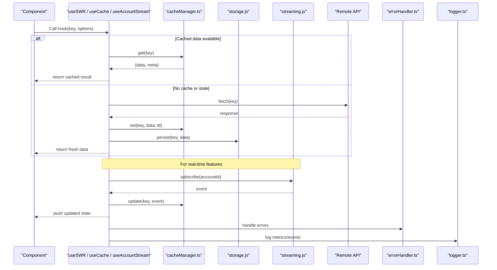
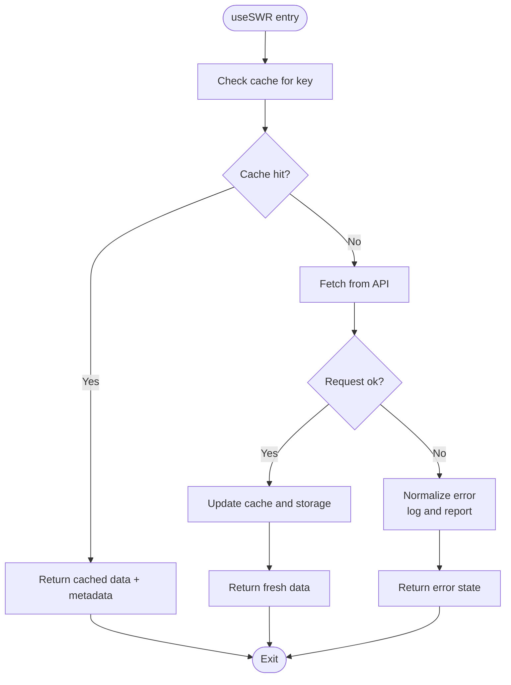
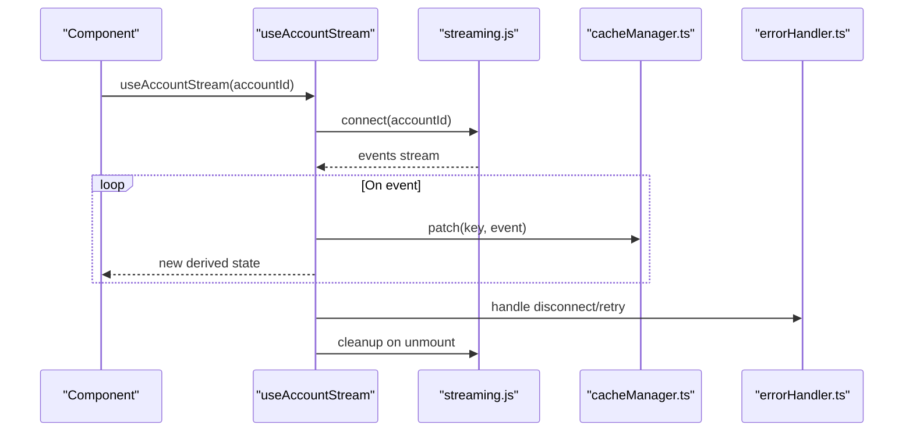
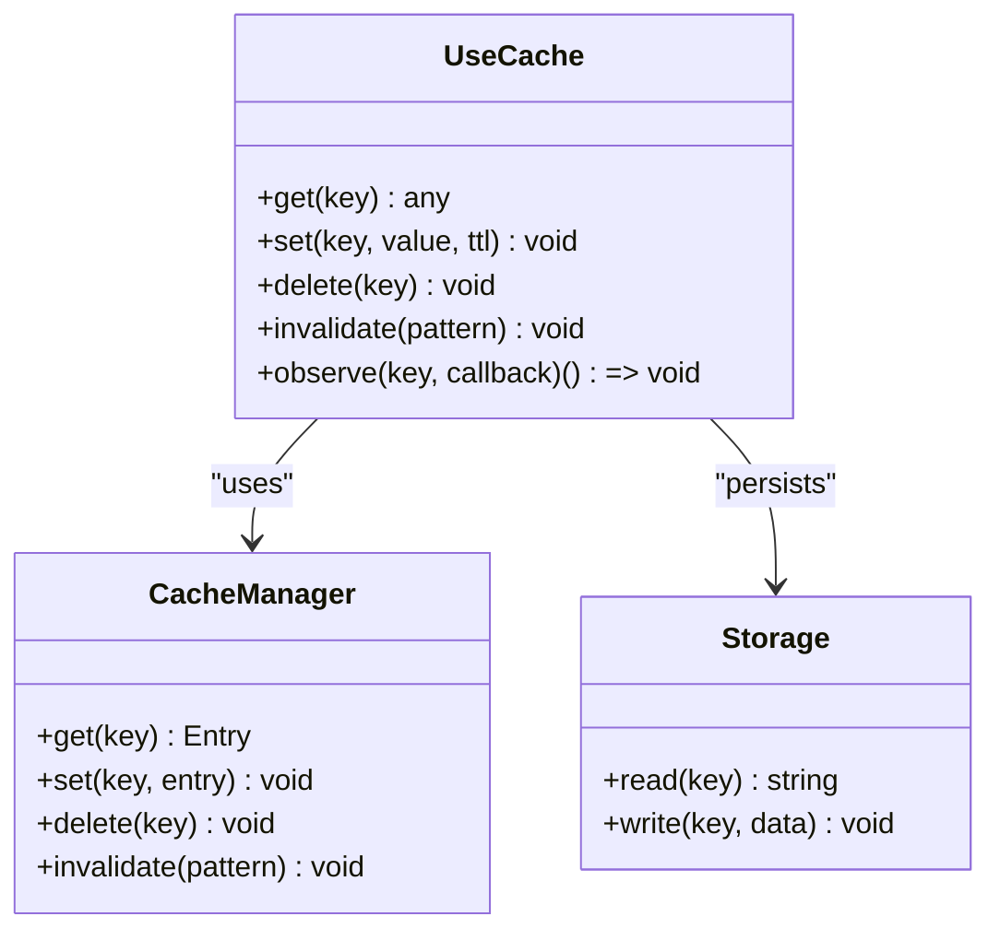
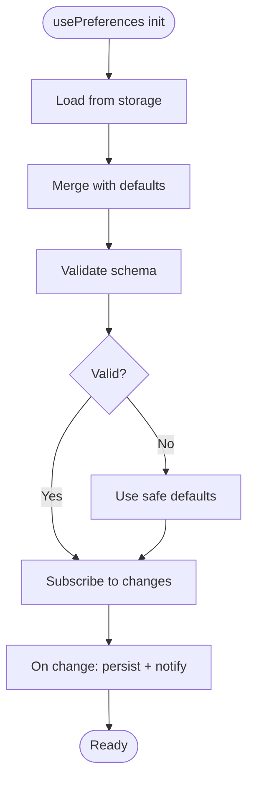
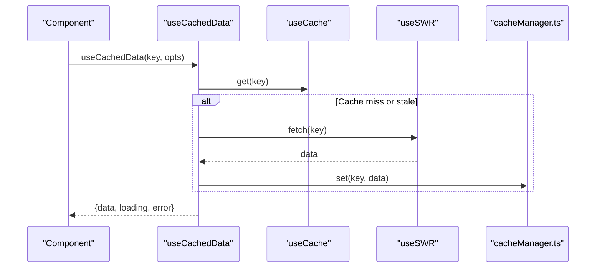
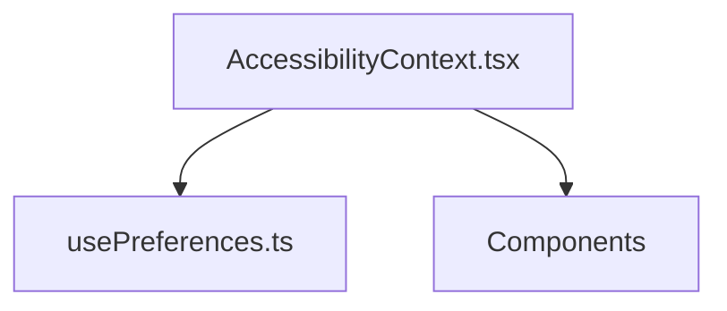
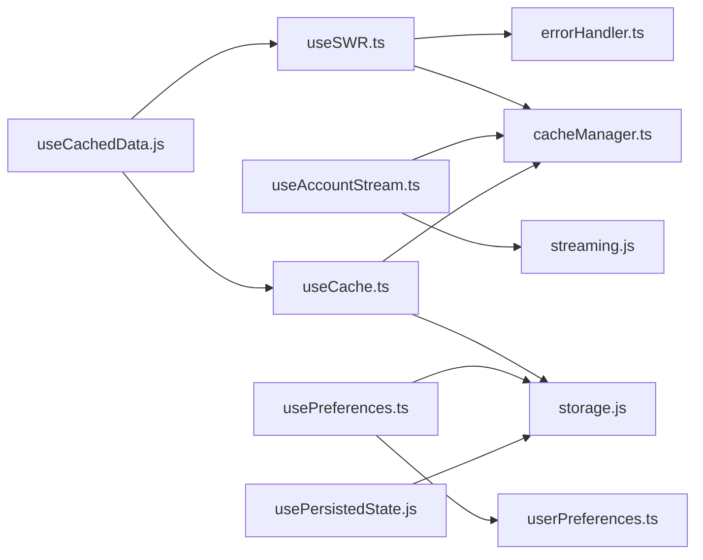

# React Hooks Architecture

<cite>
**Referenced Files in This Document**
- [src/hooks/index.ts](file://src/hooks/index.ts)
- [src/hooks/useAccountStream.ts](file://src/hooks/useAccountStream.ts)
- [src/hooks/useCache.ts](file://src/hooks/useCache.ts)
- [src/hooks/usePreferences.ts](file://src/hooks/usePreferences.ts)
- [src/hooks/useSWR.ts](file://src/hooks/useSWR.ts)
- [src/hooks/usePersistedState.js](file://src/hooks/usePersistedState.js)
- [src/hooks/useCachedData.js](file://src/hooks/useCachedData.js)
- [src/lib/cacheManager.ts](file://src/lib/cacheManager.ts)
- [src/lib/storage.js](file://src/lib/storage.js)
- [src/lib/streaming.js](file://src/lib/streaming.js)
- [src/lib/userPreferences.ts](file://src/lib/userPreferences.ts)
- [src/context/AccessibilityContext.tsx](file://src/context/AccessibilityContext.tsx)
- [src/components/ErrorBoundary.tsx](file://src/components/ErrorBoundary.tsx)
- [src/components/state/TimeTravelDebugger.tsx](file://src/components/state/TimeTravelDebugger.tsx)
- [src/utils/errorHandler.ts](file://src/utils/errorHandler.ts)
- [src/utils/logger.ts](file://src/utils/logger.ts)
- [src/App.tsx](file://src/App.tsx)
- [src/main.jsx](file://src/main.jsx)
</cite>

## Table of Contents
1. [Introduction](#introduction)
2. [Project Structure](#project-structure)
3. [Core Components](#core-components)
4. [Architecture Overview](#architecture-overview)
5. [Detailed Component Analysis](#detailed-component-analysis)
6. [Dependency Analysis](#dependency-analysis)
7. [Performance Considerations](#performance-considerations)
8. [Troubleshooting Guide](#troubleshooting-guide)
9. [Conclusion](#conclusion)
10. [Appendices](#appendices)

## Introduction
This document explains the React hooks-based state management architecture used across the application. It focuses on custom hook patterns for data fetching, caching, and UI state; composition strategies; dependency injection via context; and performance techniques such as memoization and selective re-renders. It also covers complex hooks like useAccountStream for real-time blockchain data, useCache for local storage persistence, and usePreferences for user settings, along with testing strategies, error boundary integration, and debugging approaches.

## Project Structure
The hooks are organized under src/hooks and integrate with libraries and utilities under src/lib and src/utils. Context providers live under src/context, while global app initialization is in src/main.jsx and src/App.tsx. Error boundaries and debugging tools are provided as reusable components.

```mermaid
graph TB
subgraph "App"
Main["main.jsx"]
App["App.tsx"]
end
subgraph "Hooks"
HIndex["hooks/index.ts"]
HAcc["useAccountStream.ts"]
HCache["useCache.ts"]
HPref["usePreferences.ts"]
HSWR["useSWR.ts"]
HPersist["usePersistedState.js"]
HCached["useCachedData.js"]
end
subgraph "Libraries"
LCache["lib/cacheManager.ts"]
LStorage["lib/storage.js"]
LStreaming["lib/streaming.js"]
LPrefs["lib/userPreferences.ts"]
end
subgraph "Context"
CtxA11y["context/AccessibilityContext.tsx"]
end
subgraph "Components"
ErrB["components/ErrorBoundary.tsx"]
TimeTrav["components/state/TimeTravelDebugger.tsx"]
end
subgraph "Utils"
UErr["utils/errorHandler.ts"]
ULog["utils/logger.ts"]
end
Main --> App
App --> HIndex
HIndex --> HAcc
HIndex --> HCache
HIndex --> HPref
HIndex --> HSWR
HIndex --> HPersist
HIndex --> HCached
HAcc --> LStreaming
HCache --> LCache
HCache --> LStorage
HPref --> LPrefs
HSWR --> LCache
App --> CtxA11y
App --> ErrB
App --> TimeTrav
HAcc --> UErr
HCache --> ULog
```

**Diagram sources**
- [src/main.jsx:1-200](file://src/main.jsx#L1-L200)
- [src/App.tsx:1-200](file://src/App.tsx#L1-L200)
- [src/hooks/index.ts:1-200](file://src/hooks/index.ts#L1-L200)
- [src/hooks/useAccountStream.ts:1-200](file://src/hooks/useAccountStream.ts#L1-L200)
- [src/hooks/useCache.ts:1-200](file://src/hooks/useCache.ts#L1-L200)
- [src/hooks/usePreferences.ts:1-200](file://src/hooks/usePreferences.ts#L1-L200)
- [src/hooks/useSWR.ts:1-200](file://src/hooks/useSWR.ts#L1-L200)
- [src/hooks/usePersistedState.js:1-200](file://src/hooks/usePersistedState.js#L1-L200)
- [src/hooks/useCachedData.js:1-200](file://src/hooks/useCachedData.js#L1-L200)
- [src/lib/cacheManager.ts:1-200](file://src/lib/cacheManager.ts#L1-L200)
- [src/lib/storage.js:1-200](file://src/lib/storage.js#L1-L200)
- [src/lib/streaming.js:1-200](file://src/lib/streaming.js#L1-L200)
- [src/lib/userPreferences.ts:1-200](file://src/lib/userPreferences.ts#L1-L200)
- [src/context/AccessibilityContext.tsx:1-200](file://src/context/AccessibilityContext.tsx#L1-L200)
- [src/components/ErrorBoundary.tsx:1-200](file://src/components/ErrorBoundary.tsx#L1-L200)
- [src/components/state/TimeTravelDebugger.tsx:1-200](file://src/components/state/TimeTravelDebugger.tsx#L1-L200)
- [src/utils/errorHandler.ts:1-200](file://src/utils/errorHandler.ts#L1-L200)
- [src/utils/logger.ts:1-200](file://src/utils/logger.ts#L1-L200)

**Section sources**
- [src/main.jsx:1-200](file://src/main.jsx#L1-L200)
- [src/App.tsx:1-200](file://src/App.tsx#L1-L200)
- [src/hooks/index.ts:1-200](file://src/hooks/index.ts#L1-L200)

## Core Components
- Data fetching hooks:
  - useSWR: A wrapper around SWR-like behavior to fetch and cache remote data with automatic retries and background refetch.
  - useAccountStream: Real-time streaming of account events using a streaming library, integrating error handling and lifecycle management.
- Caching hooks:
  - useCache: Provides read/write access to an in-memory and persistent cache layer, with TTL and invalidation support.
  - useCachedData: Higher-level hook that composes useCache and useSWR to serve cached-first responses and fallbacks.
- UI state hooks:
  - usePreferences: Manages user preferences with persistence and reactive updates.
  - usePersistedState: Generic persisted state hook backed by storage utilities.

Key responsibilities:
- Encapsulate side effects (network, streams, storage).
- Provide stable references via memoization.
- Expose minimal, typed interfaces to components.
- Centralize error handling and logging.

**Section sources**
- [src/hooks/useSWR.ts:1-200](file://src/hooks/useSWR.ts#L1-L200)
- [src/hooks/useAccountStream.ts:1-200](file://src/hooks/useAccountStream.ts#L1-L200)
- [src/hooks/useCache.ts:1-200](file://src/hooks/useCache.ts#L1-L200)
- [src/hooks/useCachedData.js:1-200](file://src/hooks/useCachedData.js#L1-L200)
- [src/hooks/usePreferences.ts:1-200](file://src/hooks/usePreferences.ts#L1-L200)
- [src/hooks/usePersistedState.js:1-200](file://src/hooks/usePersistedState.js#L1-L200)

## Architecture Overview
The hooks layer sits between components and infrastructure (cache, storage, streaming, APIs). Context provides cross-cutting dependencies (e.g., accessibility settings), while error boundaries isolate failures and debugging tools aid inspection.



**Diagram sources**
- [src/hooks/useSWR.ts:1-200](file://src/hooks/useSWR.ts#L1-L200)
- [src/hooks/useCache.ts:1-200](file://src/hooks/useCache.ts#L1-L200)
- [src/hooks/useAccountStream.ts:1-200](file://src/hooks/useAccountStream.ts#L1-L200)
- [src/lib/cacheManager.ts:1-200](file://src/lib/cacheManager.ts#L1-L200)
- [src/lib/storage.js:1-200](file://src/lib/storage.js#L1-L200)
- [src/lib/streaming.js:1-200](file://src/lib/streaming.js#L1-L200)
- [src/utils/errorHandler.ts:1-200](file://src/utils/errorHandler.ts#L1-L200)
- [src/utils/logger.ts:1-200](file://src/utils/logger.ts#L1-L200)

## Detailed Component Analysis

### useSWR Hook
Purpose:
- Fetches data with caching, background refetch, and retry logic.
- Returns stable state objects and functions to components.

Key behaviors:
- Key-based cache lookup before network request.
- Automatic refetch on focus/reconnect.
- Error normalization and logging.



**Diagram sources**
- [src/hooks/useSWR.ts:1-200](file://src/hooks/useSWR.ts#L1-L200)
- [src/lib/cacheManager.ts:1-200](file://src/lib/cacheManager.ts#L1-L200)
- [src/lib/storage.js:1-200](file://src/lib/storage.js#L1-L200)
- [src/utils/errorHandler.ts:1-200](file://src/utils/errorHandler.ts#L1-L200)

**Section sources**
- [src/hooks/useSWR.ts:1-200](file://src/hooks/useSWR.ts#L1-L200)

### useAccountStream Hook
Purpose:
- Subscribes to real-time account events and updates UI state reactively.
- Integrates with streaming library and cache for incremental updates.

Lifecycle:
- Initialize subscription on mount.
- Process incoming events and merge into cache.
- Clean up subscription on unmount.
- Handle connection errors and backoff.



**Diagram sources**
- [src/hooks/useAccountStream.ts:1-200](file://src/hooks/useAccountStream.ts#L1-L200)
- [src/lib/streaming.js:1-200](file://src/lib/streaming.js#L1-L200)
- [src/lib/cacheManager.ts:1-200](file://src/lib/cacheManager.ts#L1-L200)
- [src/utils/errorHandler.ts:1-200](file://src/utils/errorHandler.ts#L1-L200)

**Section sources**
- [src/hooks/useAccountStream.ts:1-200](file://src/hooks/useAccountStream.ts#L1-L200)

### useCache Hook
Purpose:
- Provides a unified interface to read/write cache entries with TTL and invalidation.
- Persists critical data to storage for resilience.

Operations:
- get/set/delete keys.
- invalidate by pattern or key.
- observe changes for reactive updates.



**Diagram sources**
- [src/hooks/useCache.ts:1-200](file://src/hooks/useCache.ts#L1-L200)
- [src/lib/cacheManager.ts:1-200](file://src/lib/cacheManager.ts#L1-L200)
- [src/lib/storage.js:1-200](file://src/lib/storage.js#L1-L200)

**Section sources**
- [src/hooks/useCache.ts:1-200](file://src/hooks/useCache.ts#L1-L200)

### usePreferences Hook
Purpose:
- Manages user preferences with persistence and reactive updates.
- Supports defaults, merging, and schema validation at load time.

Behavior:
- Load from storage on init.
- Merge with defaults.
- Persist on change.
- Emit updates to subscribers.



**Diagram sources**
- [src/hooks/usePreferences.ts:1-200](file://src/hooks/usePreferences.ts#L1-L200)
- [src/lib/userPreferences.ts:1-200](file://src/lib/userPreferences.ts#L1-L200)
- [src/lib/storage.js:1-200](file://src/lib/storage.js#L1-L200)

**Section sources**
- [src/hooks/usePreferences.ts:1-200](file://src/hooks/usePreferences.ts#L1-L200)

### useCachedData Hook
Purpose:
- Composes useCache and useSWR to provide cached-first data fetching.
- Handles fallbacks and optimistic updates.

Flow:
- Read from cache first.
- If missing/stale, trigger SWR fetch.
- Write results to cache and storage.
- Keep UI responsive with immediate cache values.



**Diagram sources**
- [src/hooks/useCachedData.js:1-200](file://src/hooks/useCachedData.js#L1-L200)
- [src/hooks/useCache.ts:1-200](file://src/hooks/useCache.ts#L1-L200)
- [src/hooks/useSWR.ts:1-200](file://src/hooks/useSWR.ts#L1-L200)
- [src/lib/cacheManager.ts:1-200](file://src/lib/cacheManager.ts#L1-L200)

**Section sources**
- [src/hooks/useCachedData.js:1-200](file://src/hooks/useCachedData.js#L1-L200)

### usePersistedState Hook
Purpose:
- Generic hook to persist arbitrary state to storage.
- Useful for UI toggles, form drafts, and ephemeral settings.

Characteristics:
- Initializes from storage if available.
- Syncs changes to storage asynchronously.
- Provides setter with optional batched updates.

**Section sources**
- [src/hooks/usePersistedState.js:1-200](file://src/hooks/usePersistedState.js#L1-L200)
- [src/lib/storage.js:1-200](file://src/lib/storage.js#L1-L200)

### Context Integration
Context usage:
- AccessibilityContext provides theme and accessibility-related dependencies to hooks and components.
- Hooks can consume context to adapt behavior (e.g., reduced motion, high contrast).



**Diagram sources**
- [src/context/AccessibilityContext.tsx:1-200](file://src/context/AccessibilityContext.tsx#L1-L200)
- [src/hooks/usePreferences.ts:1-200](file://src/hooks/usePreferences.ts#L1-L200)

**Section sources**
- [src/context/AccessibilityContext.tsx:1-200](file://src/context/AccessibilityContext.tsx#L1-L200)

## Dependency Analysis
- Direct dependencies:
  - useSWR depends on cacheManager and errorHandler.
  - useAccountStream depends on streaming and cacheManager.
  - useCache depends on cacheManager and storage.
  - usePreferences depends on userPreferences and storage.
  - useCachedData composes useCache and useSWR.
- Indirect dependencies:
  - Logging via logger.ts across hooks.
  - Global app bootstrap wires providers and error boundaries.



**Diagram sources**
- [src/hooks/useSWR.ts:1-200](file://src/hooks/useSWR.ts#L1-L200)
- [src/hooks/useAccountStream.ts:1-200](file://src/hooks/useAccountStream.ts#L1-L200)
- [src/hooks/useCache.ts:1-200](file://src/hooks/useCache.ts#L1-L200)
- [src/hooks/usePreferences.ts:1-200](file://src/hooks/usePreferences.ts#L1-L200)
- [src/hooks/useCachedData.js:1-200](file://src/hooks/useCachedData.js#L1-L200)
- [src/hooks/usePersistedState.js:1-200](file://src/hooks/usePersistedState.js#L1-L200)
- [src/lib/cacheManager.ts:1-200](file://src/lib/cacheManager.ts#L1-L200)
- [src/lib/storage.js:1-200](file://src/lib/storage.js#L1-L200)
- [src/lib/streaming.js:1-200](file://src/lib/streaming.js#L1-L200)
- [src/lib/userPreferences.ts:1-200](file://src/lib/userPreferences.ts#L1-L200)
- [src/utils/errorHandler.ts:1-200](file://src/utils/errorHandler.ts#L1-L200)

**Section sources**
- [src/hooks/index.ts:1-200](file://src/hooks/index.ts#L1-L200)

## Performance Considerations
- Memoization:
  - Stabilize returned objects and functions to prevent unnecessary re-renders.
  - Use selectors to derive minimal slices of state for consumers.
- Selective re-renders:
  - Split large state into focused hooks per feature area.
  - Avoid passing entire cache object down; pass only needed fields.
- Caching strategy:
  - Prefer cached-first reads; ensure TTL and invalidation policies are tuned.
  - Batch writes to storage to reduce I/O overhead.
- Streaming efficiency:
  - Debounce or coalesce frequent events before updating UI.
  - Unsubscribe promptly on unmount to avoid leaks.
- Network optimization:
  - Deduplicate identical requests.
  - Implement exponential backoff and jitter for retries.

[No sources needed since this section provides general guidance]

## Troubleshooting Guide
- Error boundaries:
  - Wrap feature areas with ErrorBoundary to catch rendering errors and display fallback UI.
- Debugging hooks:
  - Use TimeTravelDebugger to inspect state transitions and replay actions.
- Logging and metrics:
  - Centralized logging via logger.ts; correlate logs with cache operations and network calls.
- Common issues:
  - Stale cache: Invalidate keys after mutations or when server returns newer versions.
  - Memory leaks: Ensure subscriptions are cleaned up; verify no lingering timers.
  - Storage errors: Gracefully degrade when storage is unavailable; fall back to in-memory cache.

**Section sources**
- [src/components/ErrorBoundary.tsx:1-200](file://src/components/ErrorBoundary.tsx#L1-L200)
- [src/components/state/TimeTravelDebugger.tsx:1-200](file://src/components/state/TimeTravelDebugger.tsx#L1-L200)
- [src/utils/logger.ts:1-200](file://src/utils/logger.ts#L1-L200)

## Conclusion
The hooks-based architecture cleanly separates concerns: data fetching, caching, persistence, and real-time updates are encapsulated in reusable hooks. Composition patterns enable flexible feature building, while context provides shared dependencies. With careful memoization, caching policies, and robust error handling, the system delivers responsive and resilient user experiences.

[No sources needed since this section summarizes without analyzing specific files]

## Appendices

### Testing Strategies
- Unit tests:
  - Mock cacheManager and storage to assert cache behavior.
  - Stub streaming library to simulate events and verify state updates.
- Hook testing:
  - Render hooks within a test harness; assert returned state and callbacks.
  - Verify cleanup by unmounting and checking for absence of listeners.
- Integration tests:
  - Simulate full flows: fetch -> cache -> UI update -> mutation -> invalidation.
- Error scenarios:
  - Force network failures and storage errors; assert graceful degradation and logging.

[No sources needed since this section provides general guidance]

### Error Boundaries Integration
- Place ErrorBoundary around major sections to isolate failures.
- Provide actionable fallback UI and reporting hooks.
- Combine with TimeTravelDebugger for post-mortem analysis.

**Section sources**
- [src/components/ErrorBoundary.tsx:1-200](file://src/components/ErrorBoundary.tsx#L1-L200)
- [src/components/state/TimeTravelDebugger.tsx:1-200](file://src/components/state/TimeTravelDebugger.tsx#L1-L200)