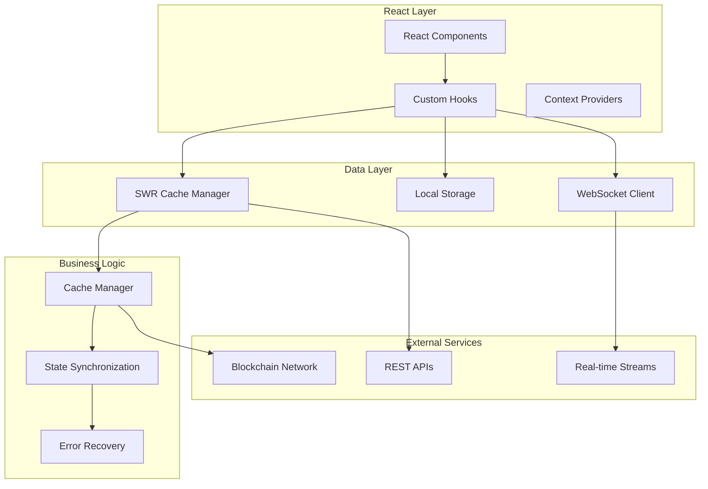
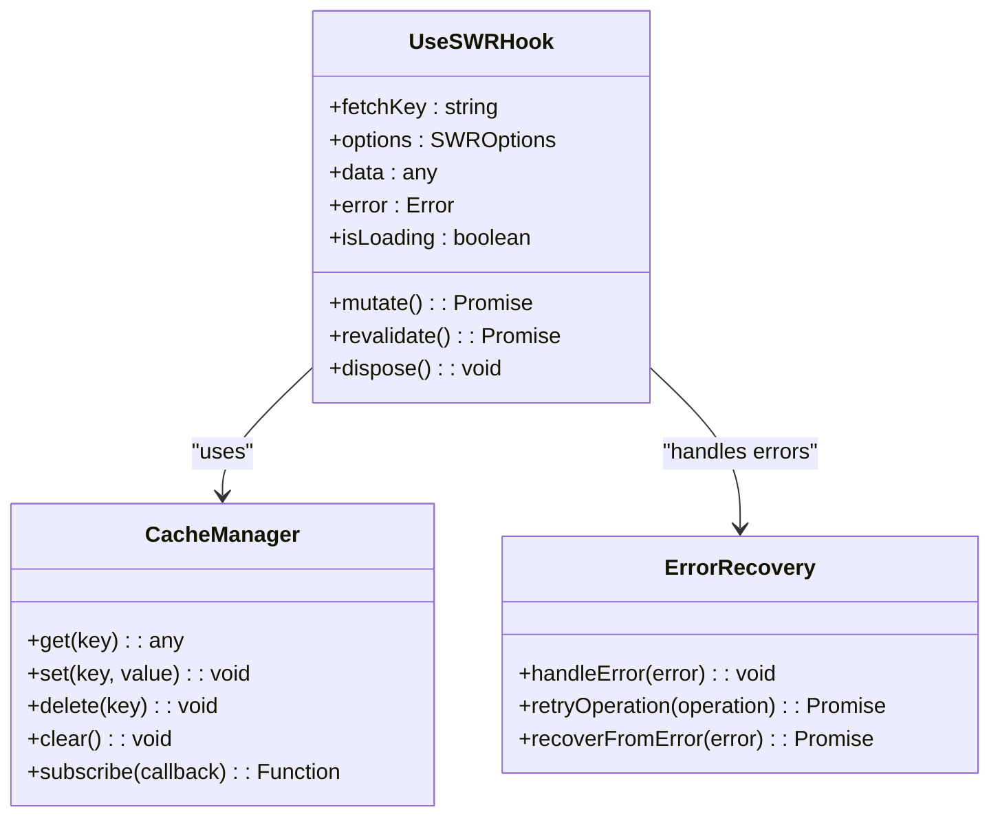
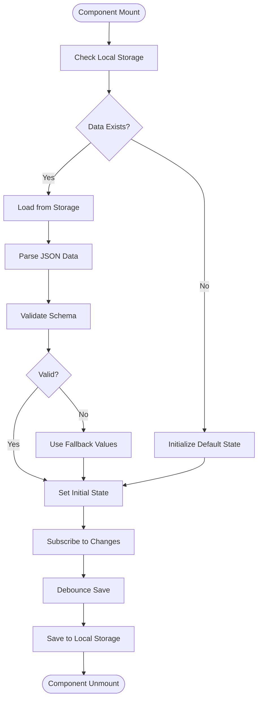
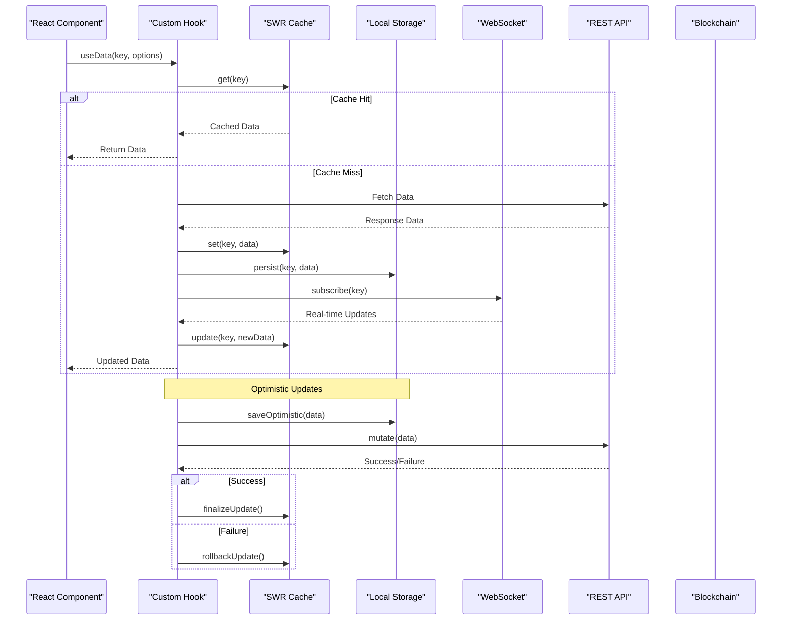
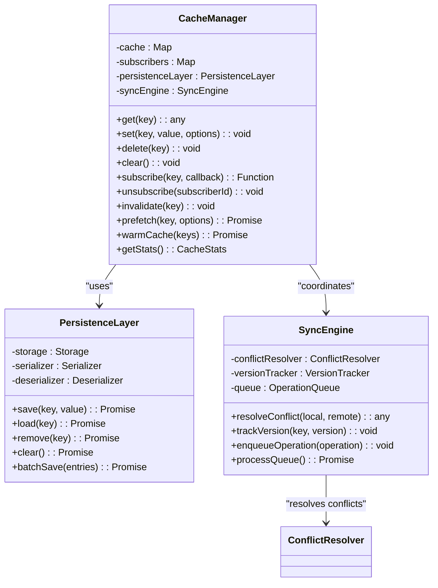
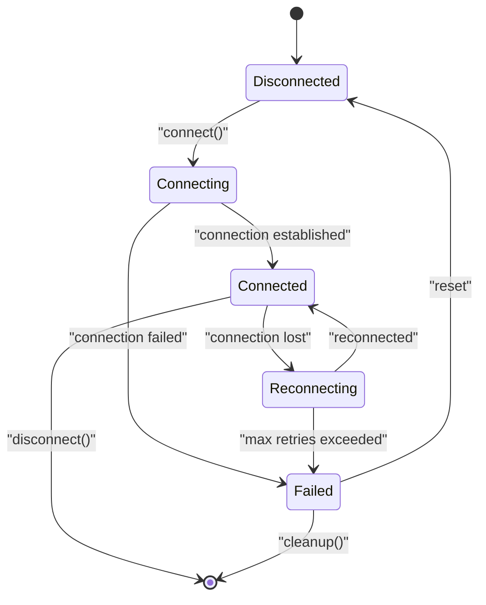
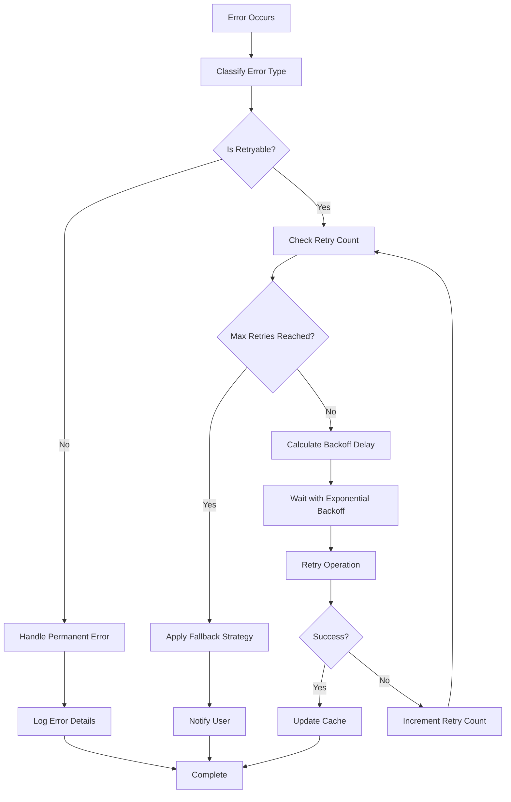
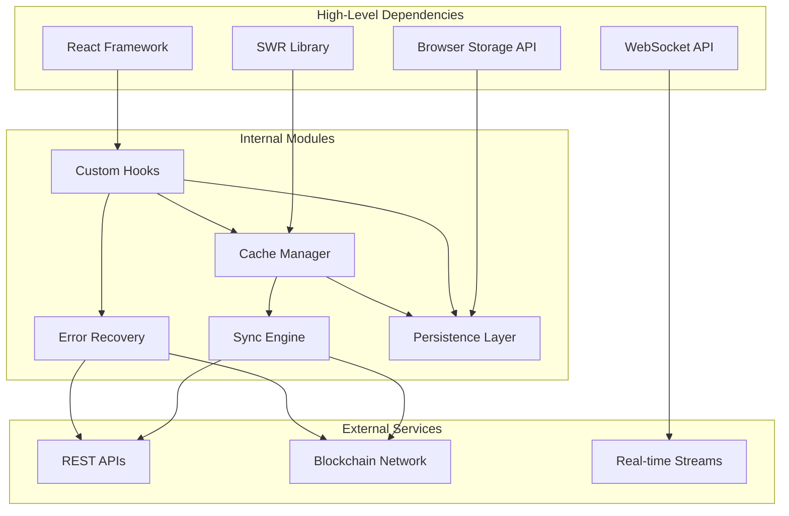
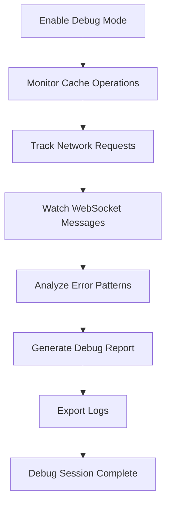

# State Management & Data Flow

<cite>
**Referenced Files in This Document**
- [useSWR.ts](file://src/hooks/useSWR.ts)
- [cacheManager.ts](file://src/lib/cacheManager.ts)
- [useCache.ts](file://src/hooks/useCache.ts)
- [usePersistedState.js](file://src/hooks/usePersistedState.js)
- [websocket.js](file://src/lib/websocket.js)
- [useAccountStream.ts](file://src/hooks/useAccountStream.ts)
- [useAccountWatch.ts](file://src/hooks/useAccountWatch.ts)
- [useRealTimeNotifications.ts](file://src/hooks/useRealTimeNotifications.ts)
- [useErrorRecovery.ts](file://src/hooks/useErrorRecovery.ts)
- [store.ts](file://src/lib/store.ts)
- [stateSync.js](file://src/utils/stateSync.js)
- [offline.js](file://src/utils/offline.js)
- [performance.ts](file://src/lib/performance.ts)
</cite>

## Table of Contents
1. [Introduction](#introduction)
2. [Project Structure](#project-structure)
3. [Core Components](#core-components)
4. [Architecture Overview](#architecture-overview)
5. [Detailed Component Analysis](#detailed-component-analysis)
6. [Dependency Analysis](#dependency-analysis)
7. [Performance Considerations](#performance-considerations)
8. [Troubleshooting Guide](#troubleshooting-guide)
9. [Conclusion](#conclusion)

## Introduction

This document provides comprehensive documentation for the state management architecture and data flow patterns implemented in the stellar-dev-dashboard application. The system employs a modern React hooks-based approach with sophisticated caching strategies using SWR, local storage persistence, WebSocket connections for real-time updates, and robust error recovery mechanisms.

The architecture is designed to handle complex financial data synchronization across multiple sources while maintaining optimal performance and user experience. It implements optimistic updates, conflict resolution strategies, and advanced debugging capabilities for managing intricate data flows in a blockchain dashboard environment.

## Project Structure

The state management system is organized into several key layers:

**Diagram sources**
- [useSWR.ts:1-50](file://src/hooks/useSWR.ts#L1-L50)
- [cacheManager.ts:1-100](file://src/lib/cacheManager.ts#L1-L100)
- [websocket.js:1-80](file://src/lib/websocket.js#L1-L80)

**Section sources**
- [useSWR.ts:1-100](file://src/hooks/useSWR.ts#L1-L100)
- [cacheManager.ts:1-200](file://src/lib/cacheManager.ts#L1-L200)
- [websocket.js:1-150](file://src/lib/websocket.js#L1-L150)

## Core Components

### Custom Hooks Architecture

The application implements a layered hooks architecture that abstracts complex data fetching and state management logic:

#### SWR Integration Hook
The primary data fetching hook wraps SWR with custom configuration and error handling:

**Diagram sources**
- [useSWR.ts:15-80](file://src/hooks/useSWR.ts#L15-L80)
- [cacheManager.ts:20-120](file://src/lib/cacheManager.ts#L20-L120)
- [useErrorRecovery.ts:10-60](file://src/hooks/useErrorRecovery.ts#L10-L60)

#### Persistence Hook
The local storage persistence hook manages state serialization and deserialization:

**Diagram sources**
- [usePersistedState.js:1-150](file://src/hooks/usePersistedState.js#L1-L150)

**Section sources**
- [useSWR.ts:1-200](file://src/hooks/useSWR.ts#L1-L200)
- [usePersistedState.js:1-200](file://src/hooks/usePersistedState.js#L1-L200)

## Architecture Overview

The state management system follows a reactive architecture pattern with multiple data sources and sophisticated synchronization mechanisms:

**Diagram sources**
- [useSWR.ts:50-150](file://src/hooks/useSWR.ts#L50-L150)
- [cacheManager.ts:80-180](file://src/lib/cacheManager.ts#L80-L180)
- [websocket.js:40-120](file://src/lib/websocket.js#L40-L120)

## Detailed Component Analysis

### Cache Manager Implementation

The cache manager serves as the central coordination point for all cached data, implementing advanced caching strategies:

**Diagram sources**
- [cacheManager.ts:1-200](file://src/lib/cacheManager.ts#L1-L200)
- [store.ts:1-150](file://src/lib/store.ts#L1-L150)

### WebSocket Connection Handling

The WebSocket implementation provides robust real-time communication with automatic reconnection and error handling:

**Diagram sources**
- [websocket.js:1-200](file://src/lib/websocket.js#L1-L200)

### Error Recovery Patterns

The error recovery system implements sophisticated retry logic and fallback mechanisms:

**Diagram sources**
- [useErrorRecovery.ts:1-200](file://src/hooks/useErrorRecovery.ts#L1-L200)

**Section sources**
- [cacheManager.ts:1-300](file://src/lib/cacheManager.ts#L1-L300)
- [websocket.js:1-250](file://src/lib/websocket.js#L1-L250)
- [useErrorRecovery.ts:1-250](file://src/hooks/useErrorRecovery.ts#L1-L250)

## Dependency Analysis

The state management system has well-defined dependencies and clear separation of concerns:

**Diagram sources**
- [useSWR.ts:1-100](file://src/hooks/useSWR.ts#L1-L100)
- [cacheManager.ts:1-150](file://src/lib/cacheManager.ts#L1-L150)
- [store.ts:1-100](file://src/lib/store.ts#L1-L100)

**Section sources**
- [useSWR.ts:1-150](file://src/hooks/useSWR.ts#L1-L150)
- [cacheManager.ts:1-250](file://src/lib/cacheManager.ts#L1-L250)
- [store.ts:1-200](file://src/lib/store.ts#L1-L200)

## Performance Considerations

The state management system implements several performance optimization techniques:

### Caching Strategies
- **Multi-level caching**: In-memory cache with local storage fallback
- **Cache warming**: Pre-fetching frequently accessed data
- **Selective invalidation**: Granular cache updates instead of full refreshes
- **Memory management**: Automatic cleanup of unused cache entries

### Data Synchronization
- **Batch operations**: Grouping multiple state updates
- **Debounced writes**: Preventing excessive local storage operations
- **Conflict resolution**: Intelligent merging of concurrent updates
- **Version tracking**: Detecting and resolving data conflicts

### Optimization Techniques
- **Memoization**: Using React.memo and useMemo for expensive computations
- **Lazy loading**: Loading heavy modules on demand
- **Virtual scrolling**: Efficient rendering of large datasets
- **Connection pooling**: Reusing WebSocket connections

## Troubleshooting Guide

### Common Issues and Solutions

#### Cache Inconsistency
When cache data becomes inconsistent with server state:
1. Clear specific cache entries using `cacheManager.invalidate(key)`
2. Force revalidation with `hook.revalidate()`
3. Check for network connectivity issues
4. Verify WebSocket connection status

#### WebSocket Connection Problems
For WebSocket connection failures:
1. Check browser console for connection errors
2. Verify server endpoint availability
3. Monitor reconnection attempts
4. Implement proper error boundaries

#### Memory Leaks
To prevent memory leaks:
1. Ensure proper cleanup in useEffect hooks
2. Remove event listeners on component unmount
3. Clear intervals and timeouts
4. Dispose of subscriptions properly

### Debugging Tools

The system includes comprehensive debugging capabilities:

**Diagram sources**
- [performance.ts:1-150](file://src/lib/performance.ts#L1-L150)

**Section sources**
- [useErrorRecovery.ts:150-250](file://src/hooks/useErrorRecovery.ts#L150-L250)
- [performance.ts:1-200](file://src/lib/performance.ts#L1-L200)

## Conclusion

The state management architecture in the stellar-dev-dashboard provides a robust, scalable solution for handling complex financial data in real-time. The combination of SWR caching, local storage persistence, WebSocket connections, and sophisticated error recovery creates a resilient system that maintains data consistency while providing excellent user experience.

Key strengths of the implementation include:
- **Comprehensive caching strategy** with multiple levels and intelligent invalidation
- **Robust real-time updates** through WebSocket connections with automatic reconnection
- **Advanced error recovery** with retry logic and fallback mechanisms
- **Efficient data synchronization** with conflict resolution and optimistic updates
- **Extensive debugging capabilities** for troubleshooting complex data flows

The modular architecture ensures maintainability and scalability, making it suitable for enterprise-level blockchain applications with demanding performance requirements.