# Testing Strategy & Quality Assurance

<cite>
**Referenced Files in This Document**
- [package.json](file://package.json)
- [jest.config.js](file://jest.config.js)
- [vitest.config.js](file://vitest.config.js)
- [playwright.config.ts](file://playwright.config.ts)
- [stryker.conf.json](file://stryker.conf.json)
- [lighthouserc.cjs](file://lighthouserc.cjs)
- [testing/coverage-thresholds.json](file://testing/coverage-thresholds.json)
- [scripts/check-coverage.mjs](file://scripts/check-coverage.mjs)
- [scripts/run-chromatic.mjs](file://scripts/run-chromatic.mjs)
- [tests/setup.js](file://tests/setup.js)
- [tests/__mocks__/fileMock.js](file://tests/__mocks__/fileMock.js)
- [tests/__mocks__/styleMock.js](file://tests/__mocks__/styleMock.js)
- [tests/mocks/server.js](file://tests/mocks/server.js)
- [tests/mocks/handlers.js](file://tests/mocks/handlers.js)
- [tests/mocks/handlers.ts](file://tests/mocks/handlers.ts)
- [tests/e2e/accessibility.spec.ts](file://tests/e2e/accessibility.spec.ts)
- [tests/e2e/a11y-gate.spec.ts](file://tests/e2e/a11y-gate.spec.ts)
- [tests/e2e/visual.spec.ts](file://tests/e2e/visual.spec.ts)
- [tests/integration/stellar-api.spec.ts](file://tests/integration/stellar-api.spec.ts)
- [tests/unit/lib/cacheManager.test.ts](file://tests/unit/lib/cacheManager.test.ts)
- [tests/unit/components/SignatureStatus.test.jsx](file://tests/unit/components/SignatureStatus.test.jsx)
- [tests/unit/performanceMonitoring.test.js](file://tests/unit/performanceMonitoring.test.js)
- [src/hooks/useDataExport.test.js](file://src/hooks/useDataExport.test.js)
- [src/plugins/__tests__/PluginManager.test.js](file://src/plugins/__tests__/PluginManager.test.js)
- [docs/PERFORMANCE.md](file://docs/PERFORMANCE.md)
</cite>

## Table of Contents
1. [Introduction](#introduction)
2. [Project Structure](#project-structure)
3. [Core Components](#core-components)
4. [Architecture Overview](#architecture-overview)
5. [Detailed Component Analysis](#detailed-component-analysis)
6. [Dependency Analysis](#dependency-analysis)
7. [Performance Considerations](#performance-considerations)
8. [Troubleshooting Guide](#troubleshooting-guide)
9. [Conclusion](#conclusion)
10. [Appendices](#appendices)

## Introduction
This document defines the multi-layered testing strategy for the project, covering unit, integration, end-to-end (E2E), and visual regression testing. It explains how Jest and Vitest are used for unit tests, how Playwright is configured for E2E and accessibility checks, and how visual regression is integrated. It also documents test organization patterns, mocking strategies, continuous integration setup, performance and accessibility automation, mutation testing with Stryker, test data management, parallel execution, reporting, and guidelines for writing maintainable tests and debugging failures.

## Project Structure
The testing infrastructure spans configuration files, scripts, and organized test suites:
- Unit tests live under tests/unit and src/*/*.test.* for colocated component and hook tests.
- Integration tests reside under tests/integration.
- E2E tests are under tests/e2e using Playwright.
- Visual regression tests are under tests/e2e and supported by Storybook and Chromatic.
- Mocks and factories are centralized under tests/__mocks__ and tests/__factories__.
- Coverage thresholds and reporting are managed via JSON and scripts.

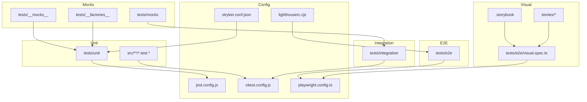

**Diagram sources**
- [jest.config.js](file://jest.config.js)
- [vitest.config.js](file://vitest.config.js)
- [playwright.config.ts](file://playwright.config.ts)
- [stryker.conf.json](file://stryker.conf.json)
- [lighthouserc.cjs](file://lighthouserc.cjs)
- [tests/__mocks__/fileMock.js](file://tests/__mocks__/fileMock.js)
- [tests/__mocks__/styleMock.js](file://tests/__mocks__/styleMock.js)
- [tests/mocks/server.js](file://tests/mocks/server.js)
- [tests/mocks/handlers.js](file://tests/mocks/handlers.js)
- [tests/mocks/handlers.ts](file://tests/mocks/handlers.ts)
- [tests/e2e/visual.spec.ts](file://tests/e2e/visual.spec.ts)
- [.storybook/main.ts](file://.storybook/main.ts)
- [stories/Button.stories.jsx](file://stories/Button.stories.jsx)

**Section sources**
- [package.json](file://package.json)
- [jest.config.js](file://jest.config.js)
- [vitest.config.js](file://vitest.config.js)
- [playwright.config.ts](file://playwright.config.ts)
- [stryker.conf.json](file://stryker.conf.json)
- [lighthouserc.cjs](file://lighthouserc.cjs)
- [testing/coverage-thresholds.json](file://testing/coverage-thresholds.json)
- [scripts/check-coverage.mjs](file://scripts/check-coverage.mjs)
- [scripts/run-chromatic.mjs](file://scripts/run-chromatic.mjs)
- [tests/setup.js](file://tests/setup.js)
- [tests/__mocks__/fileMock.js](file://tests/__mocks__/fileMock.js)
- [tests/__mocks__/styleMock.js](file://tests/__mocks__/styleMock.js)
- [tests/mocks/server.js](file://tests/mocks/server.js)
- [tests/mocks/handlers.js](file://tests/mocks/handlers.js)
- [tests/mocks/handlers.ts](file://tests/mocks/handlers.ts)
- [tests/e2e/visual.spec.ts](file://tests/e2e/visual.spec.ts)
- [docs/PERFORMANCE.md](file://docs/PERFORMANCE.md)

## Core Components
- Test runners and frameworks:
  - Jest for legacy or specific unit tests.
  - Vitest as the primary modern runner for unit and integration tests.
  - Playwright for E2E, cross-browser testing, and accessibility gates.
  - Storybook + Chromatic for visual regression.
- Configuration:
  - jest.config.js and vitest.config.js define environments, globals, coverage, and reporters.
  - playwright.config.ts configures browsers, base URL, timeouts, and hooks.
  - stryker.conf.json enables mutation testing across unit tests.
  - lighthouserc.cjs integrates Lighthouse CI for performance budgets.
- Reporting and thresholds:
  - coverage-thresholds.json enforces minimum coverage per file/type.
  - check-coverage.mjs validates coverage against thresholds.
  - run-chromatic.mjs orchestrates visual baseline comparisons.

**Section sources**
- [jest.config.js](file://jest.config.js)
- [vitest.config.js](file://vitest.config.js)
- [playwright.config.ts](file://playwright.config.ts)
- [stryker.conf.json](file://stryker.conf.json)
- [lighthouserc.cjs](file://lighthouserc.cjs)
- [testing/coverage-thresholds.json](file://testing/coverage-thresholds.json)
- [scripts/check-coverage.mjs](file://scripts/check-coverage.mjs)
- [scripts/run-chromatic.mjs](file://scripts/run-chromatic.mjs)

## Architecture Overview
The testing architecture layers ensure fast feedback at the bottom and high confidence at the top:
- Unit layer: Fast, isolated tests for utilities, hooks, components, and libraries.
- Integration layer: Tests that exercise interactions between modules and external services via mocks.
- E2E layer: Real browser flows validating critical user journeys, including accessibility and performance.
- Visual regression: Storybook-driven snapshots compared via Chromatic to detect UI drift.

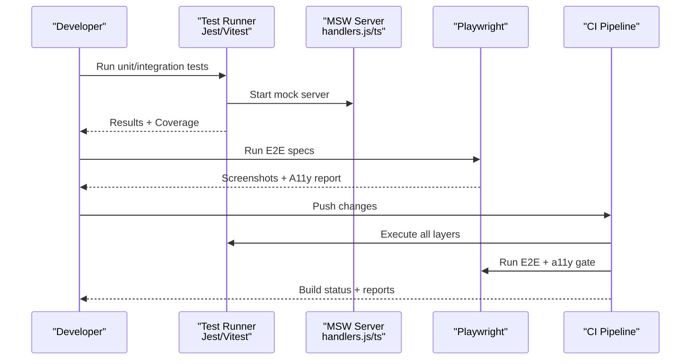

**Diagram sources**
- [vitest.config.js](file://vitest.config.js)
- [jest.config.js](file://jest.config.js)
- [tests/mocks/server.js](file://tests/mocks/server.js)
- [tests/mocks/handlers.js](file://tests/mocks/handlers.js)
- [tests/mocks/handlers.ts](file://tests/mocks/handlers.ts)
- [playwright.config.ts](file://playwright.config.ts)
- [tests/e2e/accessibility.spec.ts](file://tests/e2e/accessibility.spec.ts)

## Detailed Component Analysis

### Unit Testing with Jest and Vitest
- Organization:
  - Colocate tests near source where appropriate (src/**/tests or *.test.*).
  - Group shared logic under tests/unit for library-level tests.
- Environment and globals:
  - Configure DOM/JSDOM or browser-like APIs via vitest.config.js and jest.config.js.
  - Use setup files for global mocks and environment bootstrapping.
- Coverage:
  - Enforce thresholds via coverage-thresholds.json and validate with check-coverage.mjs.
- Examples:
  - Library tests: cache manager, transaction notifications, stellar utilities.
  - Hook/component tests: useDataExport.test.js, SignatureStatus.test.jsx.

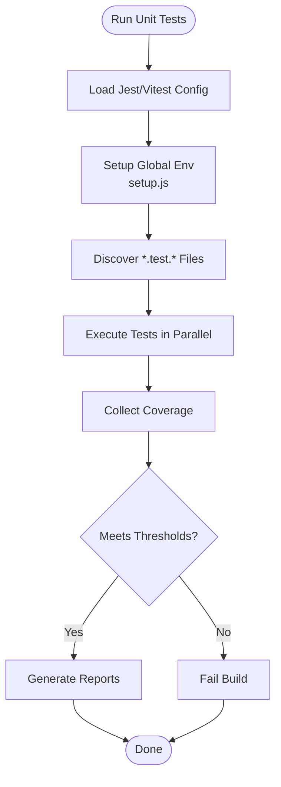

**Diagram sources**
- [vitest.config.js](file://vitest.config.js)
- [jest.config.js](file://jest.config.js)
- [tests/setup.js](file://tests/setup.js)
- [testing/coverage-thresholds.json](file://testing/coverage-thresholds.json)
- [scripts/check-coverage.mjs](file://scripts/check-coverage.mjs)

**Section sources**
- [vitest.config.js](file://vitest.config.js)
- [jest.config.js](file://jest.config.js)
- [tests/setup.js](file://tests/setup.js)
- [testing/coverage-thresholds.json](file://testing/coverage-thresholds.json)
- [scripts/check-coverage.mjs](file://scripts/check-coverage.mjs)
- [tests/unit/lib/cacheManager.test.ts](file://tests/unit/lib/cacheManager.test.ts)
- [tests/unit/components/SignatureStatus.test.jsx](file://tests/unit/components/SignatureStatus.test.jsx)
- [src/hooks/useDataExport.test.js](file://src/hooks/useDataExport.test.js)
- [src/plugins/__tests__/PluginManager.test.js](file://src/plugins/__tests__/PluginManager.test.js)

### Integration Testing Approaches
- Purpose: Validate module interactions and service boundaries without full E2E overhead.
- Mocking:
  - Use MSW (Mock Service Worker) server and handlers for API responses.
  - Centralize request/response fixtures and error scenarios.
- Scope:
  - Stellar API interactions, multisig workflows, session management, and signature collection.

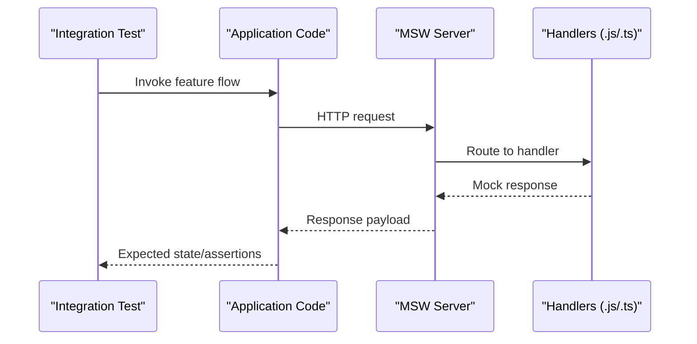

**Diagram sources**
- [tests/mocks/server.js](file://tests/mocks/server.js)
- [tests/mocks/handlers.js](file://tests/mocks/handlers.js)
- [tests/mocks/handlers.ts](file://tests/mocks/handlers.ts)
- [tests/integration/stellar-api.spec.ts](file://tests/integration/stellar-api.spec.ts)

**Section sources**
- [tests/mocks/server.js](file://tests/mocks/server.js)
- [tests/mocks/handlers.js](file://tests/mocks/handlers.js)
- [tests/mocks/handlers.ts](file://tests/mocks/handlers.ts)
- [tests/integration/stellar-api.spec.ts](file://tests/integration/stellar-api.spec.ts)

### End-to-End Testing with Playwright
- Scope: Critical user journeys, navigation, authentication flows, and complex dashboards.
- Accessibility gating: Automated a11y checks to prevent regressions.
- Visual regression: Capture screenshots for comparison and diffing.
- Configuration: Browsers, viewport sizes, timeouts, and global hooks.

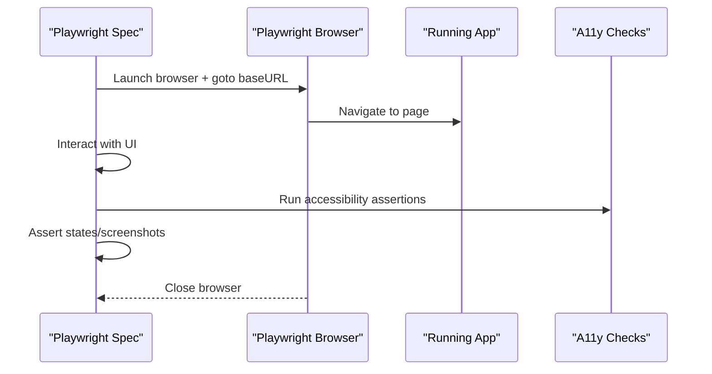

**Diagram sources**
- [playwright.config.ts](file://playwright.config.ts)
- [tests/e2e/accessibility.spec.ts](file://tests/e2e/accessibility.spec.ts)
- [tests/e2e/a11y-gate.spec.ts](file://tests/e2e/a11y-gate.spec.ts)
- [tests/e2e/visual.spec.ts](file://tests/e2e/visual.spec.ts)

**Section sources**
- [playwright.config.ts](file://playwright.config.ts)
- [tests/e2e/accessibility.spec.ts](file://tests/e2e/accessibility.spec.ts)
- [tests/e2e/a11y-gate.spec.ts](file://tests/e2e/a11y-gate.spec.ts)
- [tests/e2e/visual.spec.ts](file://tests/e2e/visual.spec.ts)

### Visual Regression Testing
- Storybook-driven components provide stable surfaces for snapshotting.
- Chromatic compares new builds against baselines to catch unintended UI changes.
- Scripts orchestrate runs and integrate with CI.

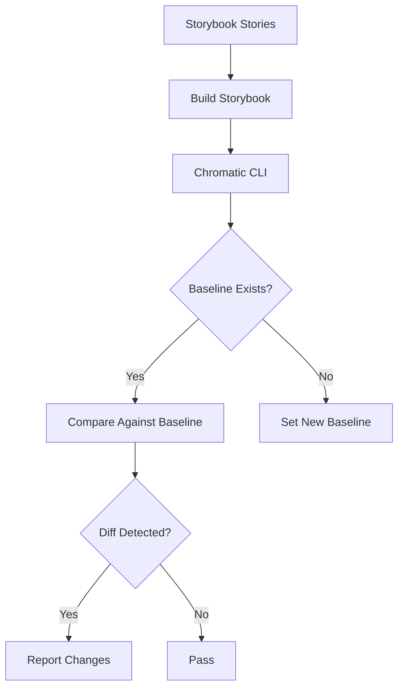

**Diagram sources**
- [scripts/run-chromatic.mjs](file://scripts/run-chromatic.mjs)
- [.storybook/main.ts](file://.storybook/main.ts)
- [stories/Button.stories.jsx](file://stories/Button.stories.jsx)

**Section sources**
- [scripts/run-chromatic.mjs](file://scripts/run-chromatic.mjs)
- [.storybook/main.ts](file://.storybook/main.ts)
- [stories/Button.stories.jsx](file://stories/Button.stories.jsx)

### Mocking Strategies
- File and style mocks:
  - fileMock.js and styleMock.js stub non-JS assets.
- API mocking:
  - MSW server and handlers define routes and responses for deterministic tests.
- Factories:
  - tests/__factories__ generate consistent test data.

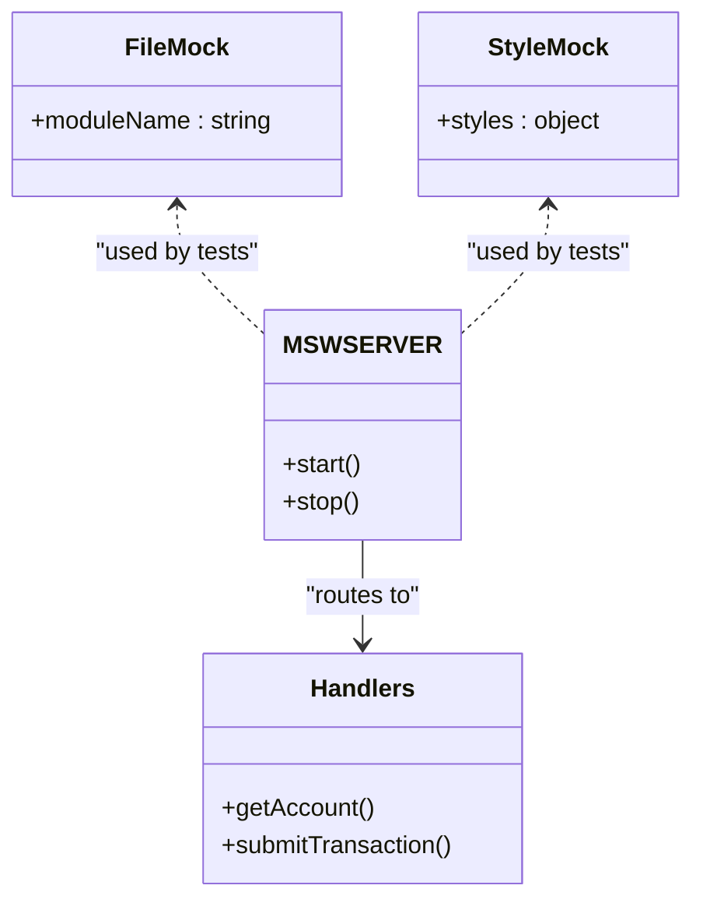

**Diagram sources**
- [tests/__mocks__/fileMock.js](file://tests/__mocks__/fileMock.js)
- [tests/__mocks__/styleMock.js](file://tests/__mocks__/styleMock.js)
- [tests/mocks/server.js](file://tests/mocks/server.js)
- [tests/mocks/handlers.js](file://tests/mocks/handlers.js)
- [tests/mocks/handlers.ts](file://tests/mocks/handlers.ts)

**Section sources**
- [tests/__mocks__/fileMock.js](file://tests/__mocks__/fileMock.js)
- [tests/__mocks__/styleMock.js](file://tests/__mocks__/styleMock.js)
- [tests/mocks/server.js](file://tests/mocks/server.js)
- [tests/mocks/handlers.js](file://tests/mocks/handlers.js)
- [tests/mocks/handlers.ts](file://tests/mocks/handlers.ts)

### Continuous Integration Setup
- Scripts:
  - check-coverage.mjs enforces coverage thresholds.
  - run-chromatic.mjs triggers visual regression.
- CI pipeline stages:
  - Unit + integration tests with coverage validation.
  - E2E + accessibility gate.
  - Visual regression baseline updates and diffs.

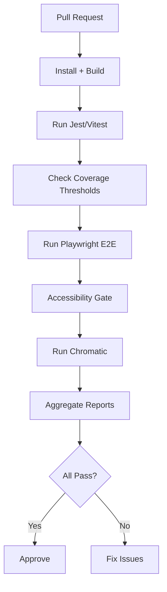

**Diagram sources**
- [scripts/check-coverage.mjs](file://scripts/check-coverage.mjs)
- [scripts/run-chromatic.mjs](file://scripts/run-chromatic.mjs)
- [playwright.config.ts](file://playwright.config.ts)
- [testing/coverage-thresholds.json](file://testing/coverage-thresholds.json)

**Section sources**
- [scripts/check-coverage.mjs](file://scripts/check-coverage.mjs)
- [scripts/run-chromatic.mjs](file://scripts/run-chromatic.mjs)
- [playwright.config.ts](file://playwright.config.ts)
- [testing/coverage-thresholds.json](file://testing/coverage-thresholds.json)

### Performance Testing Methodologies
- Lighthouse CI:
  - lighthouserc.cjs defines budgets and metrics for performance regression detection.
- Runtime monitoring:
  - Unit tests for performance monitoring utilities to assert timing and memory usage.
- Guidelines:
  - Measure before optimizing; set budgets; track regressions in CI.

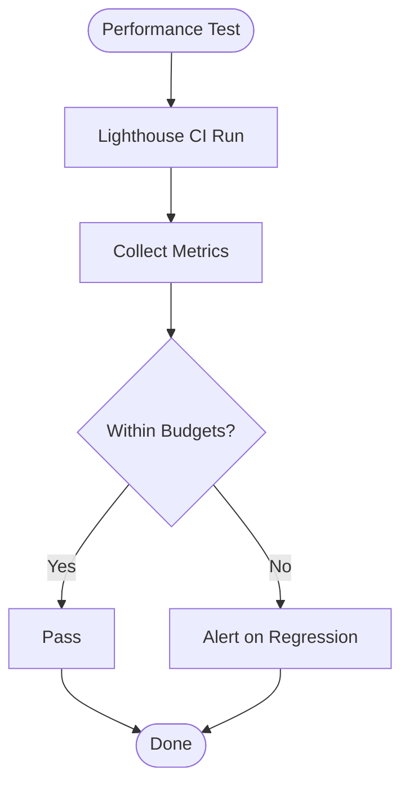

**Diagram sources**
- [lighthouserc.cjs](file://lighthouserc.cjs)
- [tests/unit/performanceMonitoring.test.js](file://tests/unit/performanceMonitoring.test.js)
- [docs/PERFORMANCE.md](file://docs/PERFORMANCE.md)

**Section sources**
- [lighthouserc.cjs](file://lighthouserc.cjs)
- [tests/unit/performanceMonitoring.test.js](file://tests/unit/performanceMonitoring.test.js)
- [docs/PERFORMANCE.md](file://docs/PERFORMANCE.md)

### Accessibility Testing Automation
- E2E a11y specs:
  - accessibility.spec.ts and a11y-gate.spec.ts enforce WCAG rules and keyboard navigation.
- Integration:
  - Fails builds on violations to prevent regressions.

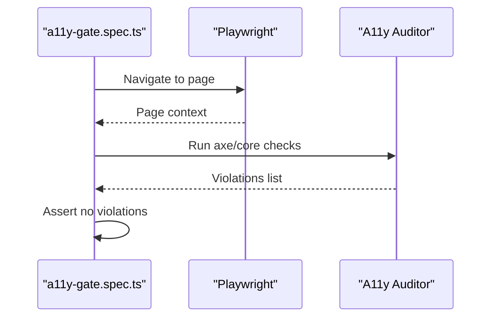

**Diagram sources**
- [tests/e2e/accessibility.spec.ts](file://tests/e2e/accessibility.spec.ts)
- [tests/e2e/a11y-gate.spec.ts](file://tests/e2e/a11y-gate.spec.ts)

**Section sources**
- [tests/e2e/accessibility.spec.ts](file://tests/e2e/accessibility.spec.ts)
- [tests/e2e/a11y-gate.spec.ts](file://tests/e2e/a11y-gate.spec.ts)

### Mutation Testing with Stryker
- Purpose: Increase confidence by mutating code and ensuring tests fail appropriately.
- Configuration:
  - stryker.conf.json defines targets, reporters, and thresholds.
- Execution:
  - Run against unit tests to identify weak areas.

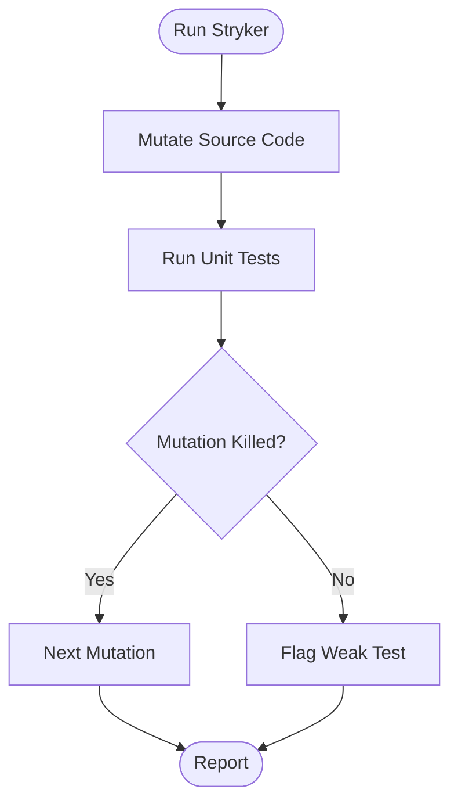

**Diagram sources**
- [stryker.conf.json](file://stryker.conf.json)

**Section sources**
- [stryker.conf.json](file://stryker.conf.json)

### Test Data Management
- Factories:
  - tests/__factories__ create consistent, reusable test data.
- Mocks:
  - Centralized handlers and servers for API responses.
- Best practices:
  - Keep fixtures small and focused; avoid coupling tests to implementation details.

**Section sources**
- [tests/__factories__/index.js](file://tests/__factories__/index.js)
- [tests/__factories__/stellarFactories.js](file://tests/__factories__/stellarFactories.js)
- [tests/mocks/handlers.js](file://tests/mocks/handlers.js)
- [tests/mocks/handlers.ts](file://tests/mocks/handlers.ts)

### Parallel Execution and Reporting
- Parallelism:
  - Vitest and Jest support parallel execution out-of-the-box; configure workers and concurrency.
- Reporting:
  - JUnit, HTML, and coverage reports generated for CI consumption.
- Threshold enforcement:
  - coverage-thresholds.json ensures minimum quality gates.

**Section sources**
- [vitest.config.js](file://vitest.config.js)
- [jest.config.js](file://jest.config.js)
- [testing/coverage-thresholds.json](file://testing/coverage-thresholds.json)
- [scripts/check-coverage.mjs](file://scripts/check-coverage.mjs)

### Guidelines for Writing Maintainable Tests
- Naming:
  - Clear, descriptive names indicating behavior and expected outcomes.
- Isolation:
  - Avoid shared mutable state; reset mocks between tests.
- Assertions:
  - Assert on observable behavior; prefer semantic selectors in E2E.
- Readability:
  - Keep tests concise; extract helpers for repeated setup.
- Stability:
  - Avoid flaky waits; use explicit assertions and retries where necessary.

[No sources needed since this section provides general guidance]

### Debugging Test Failures
- Local reproduction:
  - Run failing tests in isolation with verbose logging.
- Artifacts:
  - Capture screenshots and videos in Playwright; review coverage gaps.
- Incremental fixes:
  - Narrow down failing cases; add targeted assertions to stabilize tests.

**Section sources**
- [playwright.config.ts](file://playwright.config.ts)
- [tests/e2e/visual.spec.ts](file://tests/e2e/visual.spec.ts)

## Dependency Analysis
Testing dependencies are orchestrated through package.json scripts and configuration files. The following diagram shows key relationships among runners, configs, and scripts.

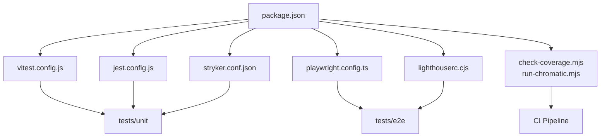

**Diagram sources**
- [package.json](file://package.json)
- [jest.config.js](file://jest.config.js)
- [vitest.config.js](file://vitest.config.js)
- [playwright.config.ts](file://playwright.config.ts)
- [stryker.conf.json](file://stryker.conf.json)
- [lighthouserc.cjs](file://lighthouserc.cjs)
- [scripts/check-coverage.mjs](file://scripts/check-coverage.mjs)
- [scripts/run-chromatic.mjs](file://scripts/run-chromatic.mjs)

**Section sources**
- [package.json](file://package.json)
- [jest.config.js](file://jest.config.js)
- [vitest.config.js](file://vitest.config.js)
- [playwright.config.ts](file://playwright.config.ts)
- [stryker.conf.json](file://stryker.conf.json)
- [lighthouserc.cjs](file://lighthouserc.cjs)
- [scripts/check-coverage.mjs](file://scripts/check-coverage.mjs)
- [scripts/run-chromatic.mjs](file://scripts/run-chromatic.mjs)

## Performance Considerations
- Prefer Vitest for faster unit and integration tests.
- Limit E2E scope to critical paths; keep specs deterministic.
- Use Lighthouse budgets to prevent performance regressions.
- Monitor runtime performance via dedicated unit tests for performance utilities.

[No sources needed since this section provides general guidance]

## Troubleshooting Guide
- Flaky tests:
  - Stabilize waits; isolate network calls with MSW; reduce randomness.
- Coverage drops:
  - Review thresholds; add missing assertions; refactor hard-to-test code.
- Visual diffs:
  - Update baselines intentionally; investigate component changes causing drift.
- Accessibility violations:
  - Address reported issues; add manual verification if automated checks are insufficient.

**Section sources**
- [testing/coverage-thresholds.json](file://testing/coverage-thresholds.json)
- [scripts/check-coverage.mjs](file://scripts/check-coverage.mjs)
- [scripts/run-chromatic.mjs](file://scripts/run-chromatic.mjs)
- [tests/e2e/a11y-gate.spec.ts](file://tests/e2e/a11y-gate.spec.ts)

## Conclusion
This multi-layered strategy balances speed, reliability, and confidence:
- Unit and integration tests provide rapid feedback and robust isolation.
- E2E and accessibility tests ensure real-world correctness and inclusivity.
- Visual regression safeguards UI consistency.
- Performance budgets and mutation testing strengthen quality gates.
Adhering to the outlined organization, mocking, and CI practices will keep the suite maintainable and effective over time.

[No sources needed since this section summarizes without analyzing specific files]

## Appendices
- Quick commands:
  - Unit tests: npm run test:unit
  - Integration tests: npm run test:integration
  - E2E tests: npm run test:e2e
  - Visual regression: npm run test:visual
  - Coverage check: npm run test:coverage
  - Mutation testing: npm run test:mutation
  - Lighthouse CI: npm run test:lighthouse

[No sources needed since this section provides general guidance]