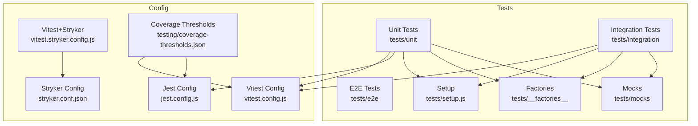
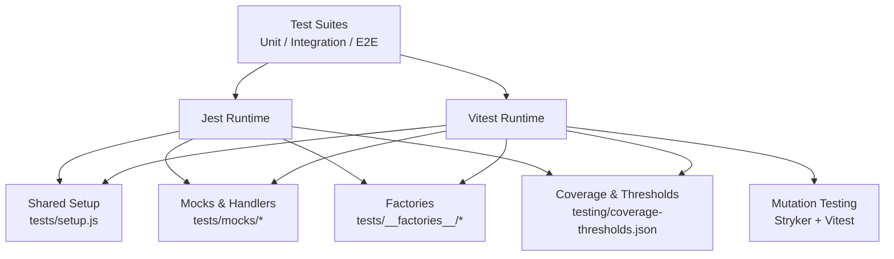
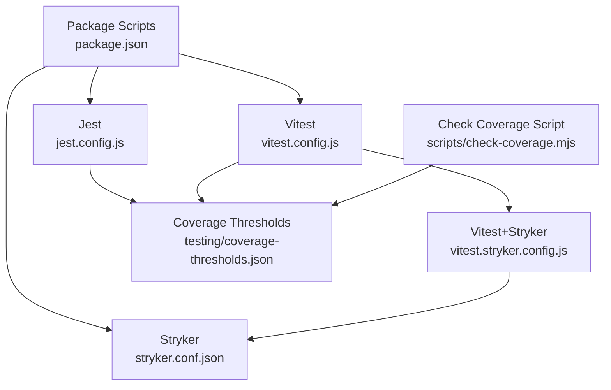

# Unit Testing with Jest & Vitest

<cite>
**Referenced Files in This Document**
- [jest.config.js](file://jest.config.js)
- [vitest.config.js](file://vitest.config.js)
- [vitest.stryker.config.js](file://vitest.stryker.config.js)
- [stryker.conf.json](file://stryker.conf.json)
- [package.json](file://package.json)
- [testing/coverage-thresholds.json](file://testing/coverage-thresholds.json)
- [tests/setup.js](file://tests/setup.js)
- [tests/__mocks__/fileMock.js](file://tests/__mocks__/fileMock.js)
- [tests/__mocks__/styleMock.js](file://tests/__mocks__/styleMock.js)
- [tests/mocks/server.ts](file://tests/mocks/server.ts)
- [tests/mocks/handlers.ts](file://tests/mocks/handlers.ts)
- [tests/unit/lib/stellar.test.ts](file://tests/unit/lib/stellar.test.ts)
- [tests/unit/lib/stellar.simulation.test.ts](file://tests/unit/lib/stellar.simulation.test.ts)
- [tests/unit/components/SignatureStatus.test.jsx](file://tests/unit/components/SignatureStatus.test.jsx)
- [tests/unit/components/SignerRow.test.jsx](file://tests/unit/components/SignerRow.test.jsx)
- [tests/unit/components/ThresholdBar.test.jsx](file://tests/unit/components/ThresholdBar.test.jsx)
- [tests/integration/stellar-api.spec.ts](file://tests/integration/stellar-api.spec.ts)
- [src/hooks/useDataExport.test.js](file://src/hooks/useDataExport.test.js)
- [src/plugins/__tests__/PluginManager.test.js](file://src/plugins/__tests__/PluginManager.test.js)
- [scripts/check-coverage.mjs](file://scripts/check-coverage.mjs)
</cite>

## Table of Contents
1. [Introduction](#introduction)
2. [Project Structure](#project-structure)
3. [Core Components](#core-components)
4. [Architecture Overview](#architecture-overview)
5. [Detailed Component Analysis](#detailed-component-analysis)
6. [Dependency Analysis](#dependency-analysis)
7. [Performance Considerations](#performance-considerations)
8. [Troubleshooting Guide](#troubleshooting-guide)
9. [Conclusion](#conclusion)
10. [Appendices](#appendices)

## Introduction
This document provides comprehensive guidance for unit testing strategies using Jest and Vitest within the project. It covers test organization patterns, mocking strategies for Stellar SDK and external dependencies, assertion library usage, component testing with React Testing Library, hook testing patterns, utility function testing, mutation testing with Stryker, CI/CD integration, and best practices for maintainable tests. The goal is to help teams write fast, reliable, and scalable tests that protect code quality and accelerate development.

## Project Structure
The repository organizes tests across multiple directories:
- Unit tests under tests/unit for isolated logic and components
- Integration tests under tests/integration for end-to-end flows and API interactions
- E2E tests under tests/e2e for browser-level scenarios
- Shared mocks and factories under tests/mocks and tests/__factories__
- Test setup and configuration files at the root and under testing/

**Diagram sources**
- [jest.config.js](file://jest.config.js)
- [vitest.config.js](file://vitest.config.js)
- [vitest.stryker.config.js](file://vitest.stryker.config.js)
- [stryker.conf.json](file://stryker.conf.json)
- [testing/coverage-thresholds.json](file://testing/coverage-thresholds.json)
- [tests/setup.js](file://tests/setup.js)
- [tests/mocks/server.ts](file://tests/mocks/server.ts)
- [tests/mocks/handlers.ts](file://tests/mocks/handlers.ts)

**Section sources**
- [jest.config.js](file://jest.config.js)
- [vitest.config.js](file://vitest.config.js)
- [vitest.stryker.config.js](file://vitest.stryker.config.js)
- [stryker.conf.json](file://stryker.conf.json)
- [testing/coverage-thresholds.json](file://testing/coverage-thresholds.json)
- [tests/setup.js](file://tests/setup.js)
- [tests/mocks/server.ts](file://tests/mocks/server.ts)
- [tests/mocks/handlers.ts](file://tests/mocks/handlers.ts)

## Core Components
Key testing infrastructure includes:
- Jest configuration for Node-based unit tests and coverage thresholds
- Vitest configuration for faster execution and modern features
- Stryker configuration for mutation testing
- Shared mocks for file assets, styles, and HTTP handlers
- Test setup utilities for global behaviors and environment setup

Highlights:
- Coverage thresholds are enforced via a dedicated JSON file and scripts
- Mock servers and handlers centralize network mocking for consistent tests
- Factories provide deterministic data generation for complex objects

**Section sources**
- [jest.config.js](file://jest.config.js)
- [vitest.config.js](file://vitest.config.js)
- [stryker.conf.json](file://stryker.conf.json)
- [testing/coverage-thresholds.json](file://testing/coverage-thresholds.json)
- [tests/mocks/server.ts](file://tests/mocks/server.ts)
- [tests/mocks/handlers.ts](file://tests/mocks/handlers.ts)
- [scripts/check-coverage.mjs](file://scripts/check-coverage.mjs)

## Architecture Overview
The testing architecture separates concerns between unit, integration, and e2e layers while sharing common mocks and setup. Jest and Vitest coexist to support different test suites and performance needs. Stryker integrates with Vitest to perform mutation testing on critical paths.

**Diagram sources**
- [jest.config.js](file://jest.config.js)
- [vitest.config.js](file://vitest.config.js)
- [vitest.stryker.config.js](file://vitest.stryker.config.js)
- [stryker.conf.json](file://stryker.conf.json)
- [tests/setup.js](file://tests/setup.js)
- [tests/mocks/server.ts](file://tests/mocks/server.ts)
- [tests/mocks/handlers.ts](file://tests/mocks/handlers.ts)
- [testing/coverage-thresholds.json](file://testing/coverage-thresholds.json)

## Detailed Component Analysis

### Jest Configuration and Usage
- Purpose: Configure Node-based unit tests, module resolution, coverage thresholds, and environment settings
- Key aspects:
  - Module name mapper for assets and styles
  - Coverage reporting and threshold enforcement
  - Test environment and globals setup
  - Script commands for running tests and checking coverage

Best practices:
- Keep Jest config minimal and centralized
- Use shared setup files for global mocks and polyfills
- Enforce coverage thresholds consistently across environments

**Section sources**
- [jest.config.js](file://jest.config.js)
- [package.json](file://package.json)
- [testing/coverage-thresholds.json](file://testing/coverage-thresholds.json)
- [scripts/check-coverage.mjs](file://scripts/check-coverage.mjs)

### Vitest Configuration and Usage
- Purpose: Provide a fast, modern runtime for unit and integration tests with native TypeScript support
- Key aspects:
  - Environment configuration for DOM and Node
  - Plugin integrations and aliasing
  - Coverage integration with V8 or c8
  - Mutation testing integration via vitest.stryker.config.js

Best practices:
- Prefer Vitest for new tests due to speed and DX
- Use aliases for imports to simplify test setup
- Centralize mock server initialization for network-dependent tests

**Section sources**
- [vitest.config.js](file://vitest.config.js)
- [vitest.stryker.config.js](file://vitest.stryker.config.js)
- [package.json](file://package.json)

### Stryker Mutation Testing
- Purpose: Validate test effectiveness by introducing mutations and ensuring tests fail appropriately
- Key aspects:
  - Mutation targets and exclusions
  - Report generation and thresholds
  - Integration with Vitest for execution

Best practices:
- Start with small scopes (critical modules)
- Gradually increase mutation coverage as tests improve
- Treat failing mutations as opportunities to strengthen assertions

**Section sources**
- [stryker.conf.json](file://stryker.conf.json)
- [vitest.stryker.config.js](file://vitest.stryker.config.js)

### Shared Test Setup and Mocks
- Purpose: Provide consistent environment and mocking behavior across all tests
- Key aspects:
  - Global setup for timers, fetch, and crypto APIs
  - File and style mocks for asset imports
  - MSW server and handlers for HTTP mocking

Best practices:
- Isolate side effects in setup files
- Use MSW for realistic network responses and error scenarios
- Keep mocks focused and composable

**Section sources**
- [tests/setup.js](file://tests/setup.js)
- [tests/__mocks__/fileMock.js](file://tests/__mocks__/fileMock.js)
- [tests/__mocks__/styleMock.js](file://tests/__mocks__/styleMock.js)
- [tests/mocks/server.ts](file://tests/mocks/server.ts)
- [tests/mocks/handlers.ts](file://tests/mocks/handlers.ts)

### Stellar SDK Mocking Strategies
- Purpose: Simulate Stellar SDK behavior without real network calls
- Key aspects:
  - Mocking Horizon endpoints and transaction simulation
  - Deterministic responses for account queries and transaction results
  - Error injection for rate limiting and network failures

Patterns:
- Use MSW handlers to intercept Horizon requests
- Provide factory-generated accounts and transactions
- Assert both success and failure paths

**Section sources**
- [tests/unit/lib/stellar.test.ts](file://tests/unit/lib/stellar.test.ts)
- [tests/unit/lib/stellar.simulation.test.ts](file://tests/unit/lib/stellar.simulation.test.ts)
- [tests/integration/stellar-api.spec.ts](file://tests/integration/stellar-api.spec.ts)
- [tests/mocks/server.ts](file://tests/mocks/server.ts)
- [tests/mocks/handlers.ts](file://tests/mocks/handlers.ts)

### Component Testing with React Testing Library
- Purpose: Verify UI behavior and accessibility without implementation details
- Key aspects:
  - Rendering components with context providers
  - Interacting via user events and querying by role/text
  - Assertions on state changes and side effects

Patterns:
- Keep tests focused on user-visible behavior
- Use custom render wrappers for providers and mocks
- Assert accessibility attributes and keyboard navigation

**Section sources**
- [tests/unit/components/SignatureStatus.test.jsx](file://tests/unit/components/SignatureStatus.test.jsx)
- [tests/unit/components/SignerRow.test.jsx](file://tests/unit/components/SignerRow.test.jsx)
- [tests/unit/components/ThresholdBar.test.jsx](file://tests/unit/components/ThresholdBar.test.jsx)

### Hook Testing Patterns
- Purpose: Validate custom hooks logic, state transitions, and async behavior
- Key aspects:
  - Using renderHook from React Testing Library
  - Mocking dependencies like network calls and storage
  - Asserting state updates and callbacks

Patterns:
- Test both synchronous and asynchronous outcomes
- Use fake timers for time-dependent logic
- Ensure cleanup to prevent cross-test pollution

**Section sources**
- [src/hooks/useDataExport.test.js](file://src/hooks/useDataExport.test.js)

### Utility Function Testing
- Purpose: Ensure pure functions and helpers behave correctly across edge cases
- Key aspects:
  - Input validation and output formatting
  - Deterministic outputs for given inputs
  - Error handling and exception propagation

Patterns:
- Parameterize tests for multiple scenarios
- Cover boundary conditions and invalid inputs
- Avoid coupling to external systems

**Section sources**
- [src/plugins/__tests__/PluginManager.test.js](file://src/plugins/__tests__/PluginManager.test.js)

### Data Factories
- Purpose: Generate consistent and realistic test data
- Key aspects:
  - Factory functions for accounts, transactions, and assets
  - Overridable fields for specific test scenarios
  - Composition of complex nested structures

Patterns:
- Keep factories simple and composable
- Provide defaults but allow overrides per test
- Centralize domain-specific data generation

**Section sources**
- [tests/__factories__/index.js](file://tests/__factories__/index.js)
- [tests/__factories__/stellarFactories.js](file://tests/__factories__/stellarFactories.js)

### Async Testing Patterns
- Purpose: Handle promises, timeouts, and streaming data reliably
- Key aspects:
  - Using async/await and proper error handling
  - Fake timers for controlled time progression
  - Retries and backoff strategies in tests

Patterns:
- Assert resolved values and rejected errors explicitly
- Avoid flaky tests by controlling timers and network delays
- Use helper utilities for common async patterns

**Section sources**
- [tests/unit/lib/stellar.test.ts](file://tests/unit/lib/stellar.test.ts)
- [tests/unit/lib/stellar.simulation.test.ts](file://tests/unit/lib/stellar.simulation.test.ts)
- [tests/integration/stellar-api.spec.ts](file://tests/integration/stellar-api.spec.ts)

### Integration with CI/CD Pipelines
- Purpose: Automate test execution, coverage checks, and mutation analysis
- Key aspects:
  - Scripts for running Jest and Vitest suites
  - Coverage threshold enforcement
  - Artifact generation for reports

Patterns:
- Fail builds on coverage thresholds
- Cache dependencies to speed up runs
- Parallelize suites where possible

**Section sources**
- [package.json](file://package.json)
- [scripts/check-coverage.mjs](file://scripts/check-coverage.mjs)
- [testing/coverage-thresholds.json](file://testing/coverage-thresholds.json)

## Dependency Analysis
Testing dependencies include Jest, Vitest, React Testing Library, MSW, and Stryker. They interact through configuration files and shared setup to provide a cohesive testing experience.

**Diagram sources**
- [package.json](file://package.json)
- [jest.config.js](file://jest.config.js)
- [vitest.config.js](file://vitest.config.js)
- [stryker.conf.json](file://stryker.conf.json)
- [vitest.stryker.config.js](file://vitest.stryker.config.js)
- [testing/coverage-thresholds.json](file://testing/coverage-thresholds.json)
- [scripts/check-coverage.mjs](file://scripts/check-coverage.mjs)

**Section sources**
- [package.json](file://package.json)
- [jest.config.js](file://jest.config.js)
- [vitest.config.js](file://vitest.config.js)
- [stryker.conf.json](file://stryker.conf.json)
- [vitest.stryker.config.js](file://vitest.stryker.config.js)
- [testing/coverage-thresholds.json](file://testing/coverage-thresholds.json)
- [scripts/check-coverage.mjs](file://scripts/check-coverage.mjs)

## Performance Considerations
- Prefer Vitest for faster test execution and better TypeScript support
- Use selective test running and parallelization to reduce CI times
- Minimize heavy mocks and avoid unnecessary re-renders in component tests
- Leverage snapshot testing judiciously to avoid brittle tests
- Monitor test suite growth and refactor slow tests proactively

[No sources needed since this section provides general guidance]

## Troubleshooting Guide
Common issues and resolutions:
- Flaky tests due to timers: Use fake timers and assert exact timings
- Network-related failures: Ensure MSW handlers cover all endpoints and error paths
- Coverage gaps: Add targeted tests for untested branches and edge cases
- Slow suites: Split large tests into smaller units and use lazy loading for mocks

Debugging tips:
- Enable verbose logging in Jest/Vitest
- Use console logs sparingly and remove them before committing
- Inspect mutation reports to identify weak assertions

**Section sources**
- [tests/setup.js](file://tests/setup.js)
- [tests/mocks/server.ts](file://tests/mocks/server.ts)
- [tests/mocks/handlers.ts](file://tests/mocks/handlers.ts)
- [stryker.conf.json](file://stryker.conf.json)

## Conclusion
Adopting robust unit testing practices with Jest and Vitest ensures code reliability, accelerates development, and reduces regressions. By organizing tests effectively, mocking external dependencies like Stellar SDK, and integrating mutation testing, teams can maintain high-quality codebases. Following the guidelines here will help build scalable, maintainable, and fast test suites that integrate seamlessly into CI/CD pipelines.

[No sources needed since this section summarizes without analyzing specific files]

## Appendices

### Best Practices Checklist
- Write small, focused tests with clear intent
- Mock only what you need and keep mocks stable
- Assert behavior, not implementation details
- Use factories for consistent test data
- Enforce coverage thresholds and review mutation reports
- Keep tests fast and deterministic

[No sources needed since this section provides general guidance]

### Example Test Workflows
- Unit test lifecycle: setup -> act -> assert -> teardown
- Integration test flow: mock server -> request -> response -> assertions
- Mutation testing flow: run baseline -> introduce mutations -> verify failures

[No sources needed since this section provides general guidance]