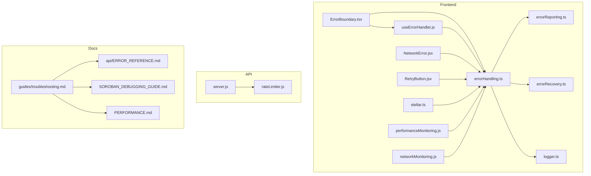
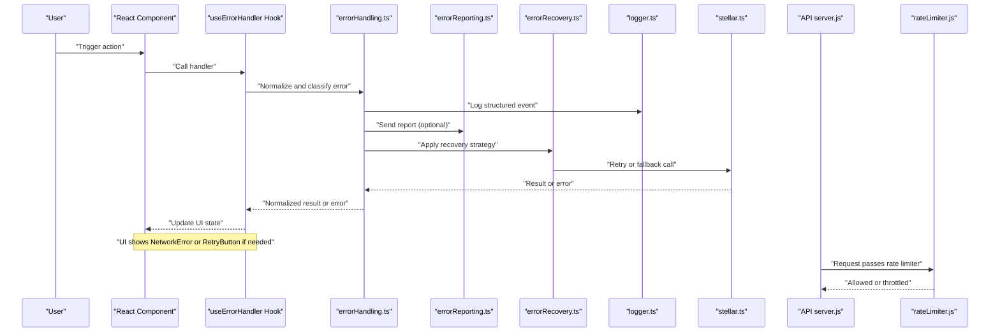
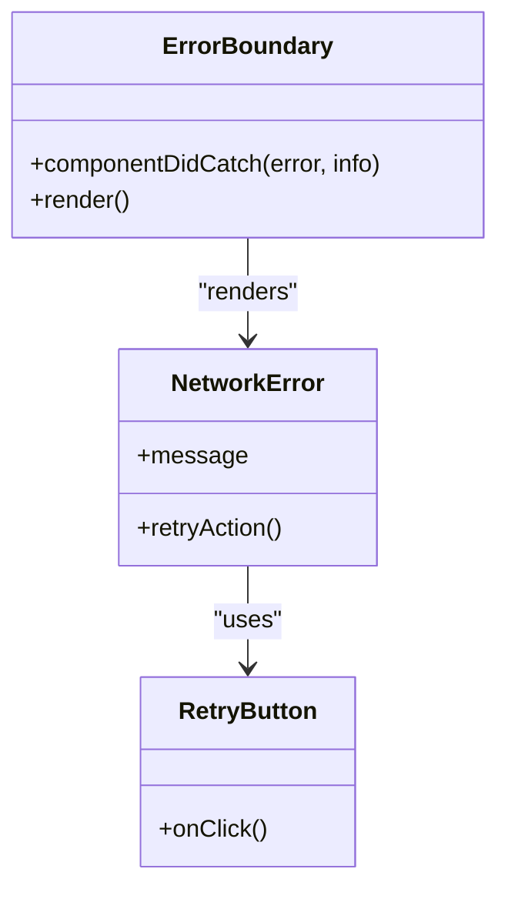
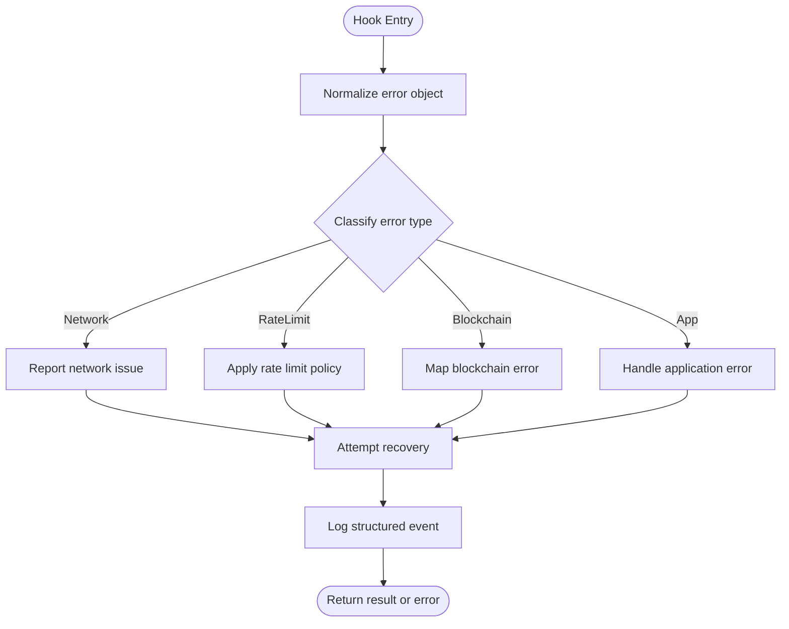
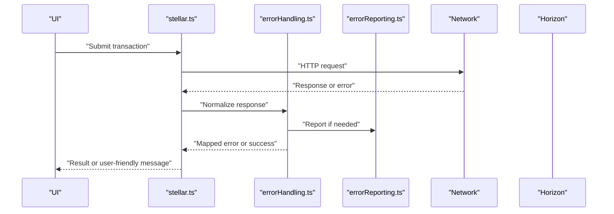
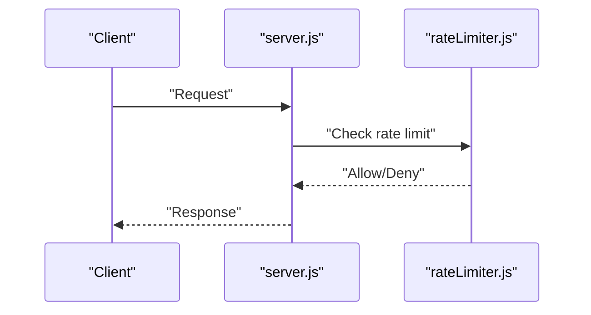
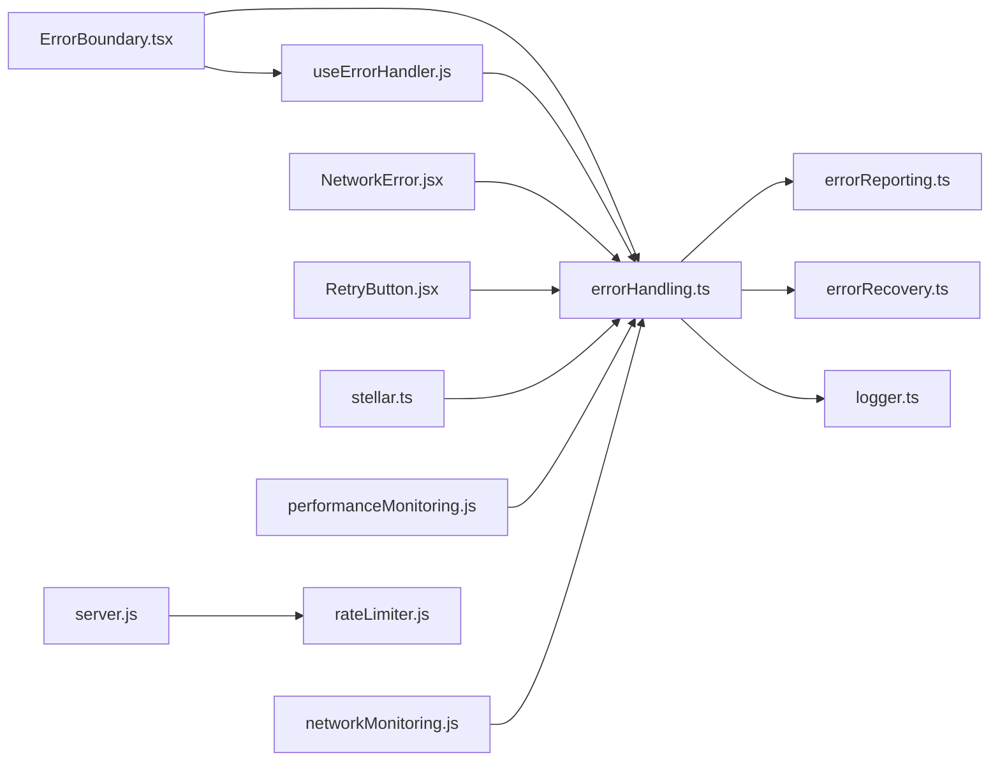

# Troubleshooting & FAQ

<cite>
**Referenced Files in This Document**
- [ERROR_HANDLING_GUIDE.md](file://ERROR_HANDLING_GUIDE.md)
- [docs/guides/troubleshooting.md](file://docs-site/docs/guides/troubleshooting.md)
- [docs/api/ERROR_REFERENCE.md](file://docs/api/ERROR_REFERENCE.md)
- [src/lib/errorHandling.ts](file://src/lib/errorHandling.ts)
- [src/lib/errorReporting.ts](file://src/lib/errorReporting.ts)
- [src/lib/errorRecovery.ts](file://src/lib/errorRecovery.ts)
- [src/utils/logger.ts](file://src/utils/logger.ts)
- [src/hooks/useErrorHandler.js](file://src/hooks/useErrorHandler.js)
- [src/components/errors/ErrorBoundary.tsx](file://src/components/errors/ErrorBoundary.tsx)
- [src/components/errors/NetworkError.jsx](file://src/components/errors/NetworkError.jsx)
- [src/components/errors/RetryButton.jsx](file://src/components/errors/RetryButton.jsx)
- [src/lib/performanceMonitoring.js](file://src/lib/performanceMonitoring.js)
- [src/lib/networkMonitoring.js](file://src/lib/networkMonitoring.js)
- [src/lib/stellar.ts](file://src/lib/stellar.ts)
- [api/server.js](file://api/server.js)
- [api/middleware/rateLimiter.js](file://api/middleware/rateLimiter.js)
- [docs-site/docs/api-reference/error-reference.md](file://docs-site/docs/api-reference/error-reference.md)
- [docs-site/docs/examples/errors/insufficient-funds.md](file://docs-site/docs/examples/errors/insufficient-funds.md)
- [docs-site/docs/examples/errors/rate-limit.md](file://docs-site/docs/examples/errors/rate-limit.md)
- [docs-site/docs/examples/errors/transaction-failed.md](file://docs-site/docs/examples/errors/transaction-failed.md)
- [docs/SOROBAN_DEBUGGING_GUIDE.md](file://docs/SOROBAN_DEBUGGING_GUIDE.md)
- [docs/PERFORMANCE.md](file://docs/PERFORMANCE.md)
- [docs/contributing.md](file://docs/contributing.md)
</cite>

## Table of Contents
1. [Introduction](#introduction)
2. [Project Structure](#project-structure)
3. [Core Components](#core-components)
4. [Architecture Overview](#architecture-overview)
5. [Detailed Component Analysis](#detailed-component-analysis)
6. [Dependency Analysis](#dependency-analysis)
7. [Performance Considerations](#performance-considerations)
8. [Troubleshooting Guide](#troubleshooting-guide)
9. [Conclusion](#conclusion)
10. [Appendices](#appendices)

## Introduction
This document provides a comprehensive troubleshooting and FAQ guide for the Stellar Dev Dashboard. It focuses on diagnosing and resolving common issues, understanding error messages, debugging techniques, performance tuning, network connectivity problems, blockchain integration issues, diagnostic tools usage, log analysis, error reporting procedures, platform-specific concerns, dependency conflicts, environment setup problems, and community support resources.

## Project Structure
The project includes dedicated modules for error handling, logging, recovery, monitoring, and user-facing error components. The documentation site also contains curated examples and references for errors and troubleshooting.

**Diagram sources**
- [src/lib/errorHandling.ts](file://src/lib/errorHandling.ts)
- [src/lib/errorReporting.ts](file://src/lib/errorReporting.ts)
- [src/lib/errorRecovery.ts](file://src/lib/errorRecovery.ts)
- [src/utils/logger.ts](file://src/utils/logger.ts)
- [src/hooks/useErrorHandler.js](file://src/hooks/useErrorHandler.js)
- [src/components/errors/ErrorBoundary.tsx](file://src/components/errors/ErrorBoundary.tsx)
- [src/components/errors/NetworkError.jsx](file://src/components/errors/NetworkError.jsx)
- [src/components/errors/RetryButton.jsx](file://src/components/errors/RetryButton.jsx)
- [src/lib/performanceMonitoring.js](file://src/lib/performanceMonitoring.js)
- [src/lib/networkMonitoring.js](file://src/lib/networkMonitoring.js)
- [src/lib/stellar.ts](file://src/lib/stellar.ts)
- [api/server.js](file://api/server.js)
- [api/middleware/rateLimiter.js](file://api/middleware/rateLimiter.js)
- [docs-site/docs/guides/troubleshooting.md](file://docs-site/docs/guides/troubleshooting.md)
- [docs/api/ERROR_REFERENCE.md](file://docs/api/ERROR_REFERENCE.md)
- [docs/SOROBAN_DEBUGGING_GUIDE.md](file://docs/SOROBAN_DEBUGGING_GUIDE.md)
- [docs/PERFORMANCE.md](file://docs/PERFORMANCE.md)

**Section sources**
- [docs-site/docs/guides/troubleshooting.md](file://docs-site/docs/guides/troubleshooting.md)
- [docs/api/ERROR_REFERENCE.md](file://docs/api/ERROR_REFERENCE.md)
- [src/lib/errorHandling.ts](file://src/lib/errorHandling.ts)
- [src/lib/errorReporting.ts](file://src/lib/errorReporting.ts)
- [src/lib/errorRecovery.ts](file://src/lib/errorRecovery.ts)
- [src/utils/logger.ts](file://src/utils/logger.ts)
- [src/hooks/useErrorHandler.js](file://src/hooks/useErrorHandler.js)
- [src/components/errors/ErrorBoundary.tsx](file://src/components/errors/ErrorBoundary.tsx)
- [src/components/errors/NetworkError.jsx](file://src/components/errors/NetworkError.jsx)
- [src/components/errors/RetryButton.jsx](file://src/components/errors/RetryButton.jsx)
- [src/lib/performanceMonitoring.js](file://src/lib/performanceMonitoring.js)
- [src/lib/networkMonitoring.js](file://src/lib/networkMonitoring.js)
- [src/lib/stellar.ts](file://src/lib/stellar.ts)
- [api/server.js](file://api/server.js)
- [api/middleware/rateLimiter.js](file://api/middleware/rateLimiter.js)

## Core Components
- Error Handling: Centralized logic to normalize, categorize, and propagate errors across the app.
- Error Reporting: Aggregates diagnostics and sends reports to configured backends or analytics.
- Error Recovery: Implements retry strategies, fallbacks, and graceful degradation.
- Logging: Structured logging utilities with levels, contexts, and correlation IDs.
- Hooks and UI: React hooks and components that surface actionable feedback and recovery options.
- Monitoring: Performance and network monitoring to detect regressions and outages.
- Blockchain Integration: Stellar client interactions with robust error mapping and retries.

**Section sources**
- [src/lib/errorHandling.ts](file://src/lib/errorHandling.ts)
- [src/lib/errorReporting.ts](file://src/lib/errorReporting.ts)
- [src/lib/errorRecovery.ts](file://src/lib/errorRecovery.ts)
- [src/utils/logger.ts](file://src/utils/logger.ts)
- [src/hooks/useErrorHandler.js](file://src/hooks/useErrorHandler.js)
- [src/components/errors/ErrorBoundary.tsx](file://src/components/errors/ErrorBoundary.tsx)
- [src/components/errors/NetworkError.jsx](file://src/components/errors/NetworkError.jsx)
- [src/components/errors/RetryButton.jsx](file://src/components/errors/RetryButton.jsx)
- [src/lib/performanceMonitoring.js](file://src/lib/performanceMonitoring.js)
- [src/lib/networkMonitoring.js](file://src/lib/networkMonitoring.js)
- [src/lib/stellar.ts](file://src/lib/stellar.ts)

## Architecture Overview
End-to-end flow from user action to error capture and recovery:

**Diagram sources**
- [src/hooks/useErrorHandler.js](file://src/hooks/useErrorHandler.js)
- [src/lib/errorHandling.ts](file://src/lib/errorHandling.ts)
- [src/lib/errorReporting.ts](file://src/lib/errorReporting.ts)
- [src/lib/errorRecovery.ts](file://src/lib/errorRecovery.ts)
- [src/utils/logger.ts](file://src/utils/logger.ts)
- [src/lib/stellar.ts](file://src/lib/stellar.ts)
- [api/server.js](file://api/server.js)
- [api/middleware/rateLimiter.js](file://api/middleware/rateLimiter.js)

## Detailed Component Analysis

### Error Boundary and User-Facing Errors
- Purpose: Catch rendering/runtime errors, display friendly messages, and provide recovery actions.
- Key behaviors:
  - Captures stack traces and context.
  - Renders NetworkError when connectivity fails.
  - Offers RetryButton for idempotent operations.

**Diagram sources**
- [src/components/errors/ErrorBoundary.tsx](file://src/components/errors/ErrorBoundary.tsx)
- [src/components/errors/NetworkError.jsx](file://src/components/errors/NetworkError.jsx)
- [src/components/errors/RetryButton.jsx](file://src/components/errors/RetryButton.jsx)

**Section sources**
- [src/components/errors/ErrorBoundary.tsx](file://src/components/errors/ErrorBoundary.tsx)
- [src/components/errors/NetworkError.jsx](file://src/components/errors/NetworkError.jsx)
- [src/components/errors/RetryButton.jsx](file://src/components/errors/RetryButton.jsx)

### Error Handling Hook and Utilities
- Purpose: Provide a consistent interface for error normalization, classification, and recovery orchestration.
- Responsibilities:
  - Map low-level errors to domain codes.
  - Attach contextual metadata (request IDs, endpoints).
  - Trigger reporting and recovery flows.

**Diagram sources**
- [src/hooks/useErrorHandler.js](file://src/hooks/useErrorHandler.js)
- [src/lib/errorHandling.ts](file://src/lib/errorHandling.ts)
- [src/lib/errorReporting.ts](file://src/lib/errorReporting.ts)
- [src/lib/errorRecovery.ts](file://src/lib/errorRecovery.ts)
- [src/utils/logger.ts](file://src/utils/logger.ts)

**Section sources**
- [src/hooks/useErrorHandler.js](file://src/hooks/useErrorHandler.js)
- [src/lib/errorHandling.ts](file://src/lib/errorHandling.ts)
- [src/lib/errorReporting.ts](file://src/lib/errorReporting.ts)
- [src/lib/errorRecovery.ts](file://src/lib/errorRecovery.ts)
- [src/utils/logger.ts](file://src/utils/logger.ts)

### Blockchain Integration (Stellar)
- Purpose: Interact with Horizon/Stellar networks and translate protocol errors into dashboard-friendly messages.
- Focus areas:
  - Transaction submission failures.
  - Insufficient funds and trustline issues.
  - Network timeouts and retries.

**Diagram sources**
- [src/lib/stellar.ts](file://src/lib/stellar.ts)
- [src/lib/errorHandling.ts](file://src/lib/errorHandling.ts)
- [src/lib/errorReporting.ts](file://src/lib/errorReporting.ts)

**Section sources**
- [src/lib/stellar.ts](file://src/lib/stellar.ts)
- [src/lib/errorHandling.ts](file://src/lib/errorHandling.ts)
- [src/lib/errorReporting.ts](file://src/lib/errorReporting.ts)

### API Server and Rate Limiting
- Purpose: Serve dashboard APIs and enforce rate limits to protect backend resources.
- Common issues:
  - 429 Too Many Requests due to rate limiting.
  - Misconfigured CORS or authentication middleware.

**Diagram sources**
- [api/server.js](file://api/server.js)
- [api/middleware/rateLimiter.js](file://api/middleware/rateLimiter.js)

**Section sources**
- [api/server.js](file://api/server.js)
- [api/middleware/rateLimiter.js](file://api/middleware/rateLimiter.js)

## Dependency Analysis
Key relationships between error-related modules and their roles:

**Diagram sources**
- [src/components/errors/ErrorBoundary.tsx](file://src/components/errors/ErrorBoundary.tsx)
- [src/hooks/useErrorHandler.js](file://src/hooks/useErrorHandler.js)
- [src/lib/errorHandling.ts](file://src/lib/errorHandling.ts)
- [src/lib/errorReporting.ts](file://src/lib/errorReporting.ts)
- [src/lib/errorRecovery.ts](file://src/lib/errorRecovery.ts)
- [src/utils/logger.ts](file://src/utils/logger.ts)
- [src/components/errors/NetworkError.jsx](file://src/components/errors/NetworkError.jsx)
- [src/components/errors/RetryButton.jsx](file://src/components/errors/RetryButton.jsx)
- [src/lib/stellar.ts](file://src/lib/stellar.ts)
- [src/lib/performanceMonitoring.js](file://src/lib/performanceMonitoring.js)
- [src/lib/networkMonitoring.js](file://src/lib/networkMonitoring.js)
- [api/server.js](file://api/server.js)
- [api/middleware/rateLimiter.js](file://api/middleware/rateLimiter.js)

**Section sources**
- [src/components/errors/ErrorBoundary.tsx](file://src/components/errors/ErrorBoundary.tsx)
- [src/hooks/useErrorHandler.js](file://src/hooks/useErrorHandler.js)
- [src/lib/errorHandling.ts](file://src/lib/errorHandling.ts)
- [src/lib/errorReporting.ts](file://src/lib/errorReporting.ts)
- [src/lib/errorRecovery.ts](file://src/lib/errorRecovery.ts)
- [src/utils/logger.ts](file://src/utils/logger.ts)
- [src/components/errors/NetworkError.jsx](file://src/components/errors/NetworkError.jsx)
- [src/components/errors/RetryButton.jsx](file://src/components/errors/RetryButton.jsx)
- [src/lib/stellar.ts](file://src/lib/stellar.ts)
- [src/lib/performanceMonitoring.js](file://src/lib/performanceMonitoring.js)
- [src/lib/networkMonitoring.js](file://src/lib/networkMonitoring.js)
- [api/server.js](file://api/server.js)
- [api/middleware/rateLimiter.js](file://api/middleware/rateLimiter.js)

## Performance Considerations
- Use performance monitoring to identify slow requests, memory spikes, and render bottlenecks.
- Tune retry/backoff policies to avoid thundering herds during outages.
- Cache frequently accessed data and invalidate strategically to reduce load.
- Monitor network latency and packet loss; adjust timeouts accordingly.
- Profile heavy components and virtualize large lists.

[No sources needed since this section provides general guidance]

## Troubleshooting Guide

### Quick Checks
- Verify network connectivity and firewall rules.
- Confirm correct network selection (testnet/mainnet).
- Check browser console and application logs for errors.
- Ensure required environment variables are set.

**Section sources**
- [docs-site/docs/guides/troubleshooting.md](file://docs-site/docs/guides/troubleshooting.md)

### Error Messages and References
- Consult the centralized error reference for definitions and resolutions.
- Review example scenarios for common cases like insufficient funds, rate limits, and transaction failures.

**Section sources**
- [docs/api/ERROR_REFERENCE.md](file://docs/api/ERROR_REFERENCE.md)
- [docs-site/docs/api-reference/error-reference.md](file://docs-site/docs/api-reference/error-reference.md)
- [docs-site/docs/examples/errors/insufficient-funds.md](file://docs-site/docs/examples/errors/insufficient-funds.md)
- [docs-site/docs/examples/errors/rate-limit.md](file://docs-site/docs/examples/errors/rate-limit.md)
- [docs-site/docs/examples/errors/transaction-failed.md](file://docs-site/docs/examples/errors/transaction-failed.md)

### Debugging Techniques
- Enable detailed logging and correlate events using request IDs.
- Use the error boundary to capture runtime errors and stack traces.
- Leverage the error hook to inspect normalized errors and recovery attempts.
- For Soroban contracts, follow the dedicated debugging guide.

**Section sources**
- [src/utils/logger.ts](file://src/utils/logger.ts)
- [src/components/errors/ErrorBoundary.tsx](file://src/components/errors/ErrorBoundary.tsx)
- [src/hooks/useErrorHandler.js](file://src/hooks/useErrorHandler.js)
- [docs/SOROBAN_DEBUGGING_GUIDE.md](file://docs/SOROBAN_DEBUGGING_GUIDE.md)

### Performance Troubleshooting
- Identify slow endpoints and long-running tasks via performance monitoring.
- Reduce payload sizes and enable compression where applicable.
- Implement pagination and virtualization for large datasets.
- Analyze memory usage and fix leaks by profiling component lifecycles.

**Section sources**
- [src/lib/performanceMonitoring.js](file://src/lib/performanceMonitoring.js)
- [docs/PERFORMANCE.md](file://docs/PERFORMANCE.md)

### Network Connectivity Issues
- Diagnose HTTP errors, timeouts, and CORS misconfigurations.
- Validate proxy settings and corporate firewall exceptions.
- Use network monitoring to track latency and failure rates.

**Section sources**
- [src/lib/networkMonitoring.js](file://src/lib/networkMonitoring.js)
- [src/components/errors/NetworkError.jsx](file://src/components/errors/NetworkError.jsx)

### Blockchain Integration Problems
- Map Horizon/Stellar errors to user-friendly messages.
- Handle insufficient funds, trustline issues, and fee bumps.
- Apply retry and backoff strategies for transient failures.

**Section sources**
- [src/lib/stellar.ts](file://src/lib/stellar.ts)
- [src/lib/errorHandling.ts](file://src/lib/errorHandling.ts)
- [docs-site/docs/examples/errors/transaction-failed.md](file://docs-site/docs/examples/errors/transaction-failed.md)

### Diagnostic Tools Usage
- Use the built-in logger to export structured logs.
- Capture error reports with context and stack traces.
- Employ retry buttons for safe re-execution of idempotent actions.

**Section sources**
- [src/utils/logger.ts](file://src/utils/logger.ts)
- [src/lib/errorReporting.ts](file://src/lib/errorReporting.ts)
- [src/components/errors/RetryButton.jsx](file://src/components/errors/RetryButton.jsx)

### Log Analysis Techniques
- Filter logs by level, module, and correlation ID.
- Aggregate logs around failed transactions or contract calls.
- Correlate frontend logs with API server logs for end-to-end tracing.

**Section sources**
- [src/utils/logger.ts](file://src/utils/logger.ts)
- [api/server.js](file://api/server.js)

### Error Reporting Procedures
- Configure reporting endpoints and sensitive data redaction.
- Include environment, version, and user context in reports.
- Deduplicate and batch reports to minimize overhead.

**Section sources**
- [src/lib/errorReporting.ts](file://src/lib/errorReporting.ts)

### Platform-Specific Issues
- Browser compatibility and polyfills.
- Mobile device constraints and offline behavior.
- Node.js vs. browser environments for shared libraries.

**Section sources**
- [docs-site/docs/guides/troubleshooting.md](file://docs-site/docs/guides/troubleshooting.md)

### Dependency Conflicts and Environment Setup
- Resolve conflicting versions and peer dependencies.
- Validate environment variables and secrets management.
- Rebuild after updating lockfiles and reinstall dependencies.

**Section sources**
- [docs-site/docs/guides/troubleshooting.md](file://docs-site/docs/guides/troubleshooting.md)

### Community Support and Contribution
- Refer to contribution guidelines for bug reports and improvements.
- Follow standardized templates and include reproduction steps.
- Engage with community channels for help and updates.

**Section sources**
- [docs/contributing.md](file://docs/contributing.md)

## Conclusion
By leveraging the centralized error handling, logging, recovery, and monitoring modules, you can quickly diagnose and resolve issues across the dashboard. Use the provided references, examples, and guides to streamline troubleshooting, improve reliability, and contribute to the project’s ongoing quality.

## Appendices

### Appendix A: Common Scenarios and Resolutions
- Insufficient funds: Adjust amounts or add assets to the account.
- Rate limited: Back off and retry with exponential delay.
- Transaction failed: Inspect error code and adjust parameters or fees.

**Section sources**
- [docs-site/docs/examples/errors/insufficient-funds.md](file://docs-site/docs/examples/errors/insufficient-funds.md)
- [docs-site/docs/examples/errors/rate-limit.md](file://docs-site/docs/examples/errors/rate-limit.md)
- [docs-site/docs/examples/errors/transaction-failed.md](file://docs-site/docs/examples/errors/transaction-failed.md)

### Appendix B: Useful Links
- Error handling guide
- Error reference
- Soroban debugging guide
- Performance guide
- Troubleshooting guide

**Section sources**
- [ERROR_HANDLING_GUIDE.md](file://ERROR_HANDLING_GUIDE.md)
- [docs/api/ERROR_REFERENCE.md](file://docs/api/ERROR_REFERENCE.md)
- [docs/SOROBAN_DEBUGGING_GUIDE.md](file://docs/SOROBAN_DEBUGGING_GUIDE.md)
- [docs/PERFORMANCE.md](file://docs/PERFORMANCE.md)
- [docs-site/docs/guides/troubleshooting.md](file://docs-site/docs/guides/troubleshooting.md)