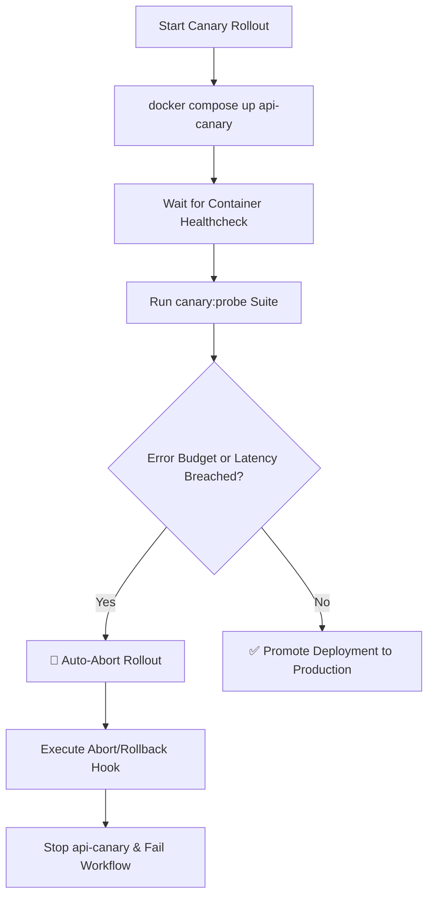

# Canary Deployment Health Probes & Rollout Guide

This document describes the automated Canary Deployment Health Probe system for the Stellar Dev Dashboard API service, introduced in issue #900.

## Overview

Canary rollouts allow new versions of the API service to be tested with real network probes before routing live production traffic. The canary health probe engine monitors critical API endpoints, evaluates error and latency budgets, and automatically halts (auto-aborts) the deployment if reliability thresholds are breached.



---

## Architecture & Target Areas

### 1. Docker Compose Services (`docker-compose.yml`)

The API service is declared in `docker-compose.yml` with dual profiles for baseline and canary instances:

| Service      | Target Port | Profile                | Purpose                                        | Healthcheck                                             |
| ------------ | ----------- | ---------------------- | ---------------------------------------------- | ------------------------------------------------------- |
| `api`        | `4000:4000` | `production`, `api`    | Baseline production API service                | `wget -qO- http://localhost:4000/health` (10s interval) |
| `api-canary` | `4001:4000` | `canary`               | Staged canary instance running candidate build | `wget -qO- http://localhost:4000/health` (5s interval)  |
| `redis`      | `6379:6379` | `production`, `canary` | Shared Redis cache / rate limiter store        | `redis-cli ping` (10s interval)                         |

To run the canary service locally:

```bash
docker compose --profile canary up -d --build redis api-canary
```

To stop and remove canary resources:

```bash
docker compose --profile canary down
```

### 2. Deployment Workflow (`.github/workflows/deploy.yml`)

The production deploy workflow executes the `canary-rollout` gate prior to production deployment:

1. Spins up `redis` and `api-canary` via Docker Compose.
2. Awaits container health status.
3. Runs `pnpm run canary:probe` targeting `http://localhost:4001`.
4. Evaluates error budget (default: 5%) and p95 latency budget (default: 2000ms).
5. If the error budget is breached: triggers auto-abort, stops `api-canary`, and fails the workflow.
6. If all probes pass within budget: proceeds to the production `deploy` job.

---

## Probed Critical API Routes

The health probe suite verifies the following critical API routes across multiple iterations:

| Route ID            | Method | Endpoint                      | Auth | Success Condition                                            |
| ------------------- | ------ | ----------------------------- | ---- | ------------------------------------------------------------ |
| `liveness`          | `GET`  | `/health`                     | No   | HTTP 200, `status === 'ok'`                                  |
| `readiness`         | `GET`  | `/health/deep`                | No   | HTTP 200, `status === 'healthy'`, memory & Redis operational |
| `api-docs`          | `GET`  | `/api/docs`                   | No   | HTTP 200, `apiVersion` present in response                   |
| `account-lookup`    | `GET`  | `/api/v1/accounts/:accountId` | Yes  | HTTP 200, account record returned                            |
| `transaction-query` | `GET`  | `/api/v1/transactions`        | Yes  | HTTP 200, `data` transaction list returned                   |
| `gas-prediction`    | `POST` | `/api/v1/gas/predict`         | Yes  | HTTP 200, `predictedTotalFee` numeric result                 |

---

## Error Budget & Auto-Abort Mechanism

The probe engine evaluates two independent reliability budgets:

1. **Error Budget**:
   $$\text{Error Rate} = \frac{\text{Failed Probes}}{\text{Total Probes}}$$
   If $\text{Error Rate} > \text{Error Budget}$ (default `0.05` / `5%`), the rollout is **auto-aborted**.
   _Boundary Note:_ If error rate is exactly equal to the budget threshold (e.g., exactly 5.0%), the budget is preserved and rollout continues.

2. **Latency Budget**:
   Measures high-resolution p95 round-trip latency. If p95 latency exceeds `--latency-budget-ms` (default: 2000ms), auto-abort is triggered.

When an abort occurs:

- The script exits with status code `1`.
- If `--abort-command` is provided (e.g. `docker compose stop api-canary`), the rollback command is executed immediately.
- A summary diagnostic is posted to `$GITHUB_STEP_SUMMARY` in CI environments.

---

## CLI & Environment Variables Reference

Run the canary probe runner locally:

```bash
pnpm run canary:probe -- [options]
```

### Options

| Flag                   | Env Variable                      | Default                 | Description                                                                   |
| ---------------------- | --------------------------------- | ----------------------- | ----------------------------------------------------------------------------- |
| `--url`, `-u`          | `CANARY_URL`                      | `http://localhost:4000` | Target URL of the canary API service                                          |
| `--error-budget`, `-b` | `CANARY_ERROR_BUDGET`             | `0.05`                  | Max tolerable error budget ratio (e.g. `0.05` or `5%`)                        |
| `--latency-budget-ms`  | `CANARY_LATENCY_BUDGET_MS`        | `2000`                  | Max p95 latency threshold in milliseconds                                     |
| `--iterations`, `-n`   | `CANARY_PROBE_ROUNDS`             | `3`                     | Number of probe rounds to execute                                             |
| `--interval-ms`        | `CANARY_PROBE_INTERVAL_MS`        | `500`                   | Pacing delay between rounds in ms                                             |
| `--timeout-ms`         | `CANARY_TIMEOUT_MS`               | `5000`                  | HTTP request timeout in ms                                                    |
| `--env`, `-e`          | `CANARY_ENVIRONMENT` / `NODE_ENV` | `production`            | Target environment (`production`, `staging`, `canary`, `test`, `development`) |
| `--auth-token`         | `CANARY_AUTH_TOKEN`               | internal token          | Bearer token for authenticated endpoints                                      |
| `--abort-command`      | `CANARY_ABORT_COMMAND`            | none                    | Shell command to execute if aborted                                           |

---

## Compatibility, Security & Migration Notes

### Compatibility Notes

- **Node.js**: Requires Node.js `>= 20`.
- **Docker Compose**: Compatible with Docker Compose v2 (`docker compose`).
- **Operating Systems**: Tested on Linux (CI runners) and Windows (development environments).

### Security Notes

- **Probe Safety**: All default probe payloads use idempotent read queries or stateless gas simulation requests; no persistent production state is modified during probing.
- **Token Security**: In production CI, provide `CANARY_AUTH_TOKEN` via repository secrets. Never commit tokens to source control.
- **Liveness/Readiness Separation**: The public `/health` and `/health/deep` endpoints do not expose sensitive infrastructure credentials or keys.

### Migration Notes

- For operators migrating from single-stage deploys:
  - Add the `canary-rollout` job to custom deployment scripts or pipelines.
  - Set `skip_canary: true` during emergency break-glass rollback procedures if needed.
