# Flaky Test Quarantine & Triage Framework

## Overview

The **Flaky Test Quarantine & Triage Framework** isolates repeatedly flaky automated tests into a managed registry (`.github/test-quarantine.json`). Quarantined tests are excluded from blocking pull request checks to prevent developer disruption, while executing in isolated matrix jobs to track remediation.

### The Core Rule: Mandatory Owner Assignment

> [!IMPORTANT]
> **No test can be reinstated from quarantine without an assigned owner.**
> Reinstatement is strictly blocked until a verified developer handle (or team) is assigned and the test passes at least **5 consecutive runs** in quarantine verification.

---

## The Flaky Test Lifecycle

```mermaid
flowchart LR
    A[CI Test Run] -->|Flake Detected >= 2x| B[Auto-Quarantine]
    B -->|Excluded from Main CI| C[Registry: .github/test-quarantine.json]
    C -->|Triage Required| D[Assign Owner Handle]
    D -->|Fix Implemented| E[Isolated Verification Matrix]
    E -->|>= 5 Consecutive Passes| F[Ready for Reinstatement]
    F -->|Owner Sign-Off| G[Reinstated to Main CI]
```



1. **Detection & Quarantine**: When a test fails and passes on retry, or fails across multiple runs, it is automatically cataloged with `status: "quarantined"`.
2. **Owner Triage**: The QA lead or on-call engineer assigns an owner (`@developer` or `team/name`) and links a tracking issue. Status becomes `"triaged"`.
3. **Remediation & Verification**: The owner investigates the root cause (e.g., race condition, async timeout, unmocked network). Quarantined tests run in an isolated scheduled job (`.github/workflows/test-quarantine.yml`).
4. **Reinstatement Approval**: Once the test achieves at least 5 consecutive clean passes and the owner signs off, the test is reinstated with `status: "reinstated"`.

---

## Quarantine Registry Schema

Located at [`.github/test-quarantine.json`](file:///c:/Users/DELL/Documents/GitHub/stellar-dev-dashboardAnorak/.github/test-quarantine.json):

```json
{
  "version": "1.0.0",
  "policy": {
    "flakinessThreshold": 2,
    "requiredPassesForReinstatement": 5,
    "requireOwnerBeforeReinstatement": true,
    "maxQuarantineDays": 30
  },
  "quarantinedTests": [
    {
      "id": "a1b2c3d4e5f6",
      "testFile": "src/lib/__tests__/dex.test.ts",
      "testName": "fetches live orderbook depth with polling retry",
      "status": "triaged",
      "quarantinedAt": "2026-09-26T14:00:00.000Z",
      "flakinessCount": 3,
      "consecutivePasses": 5,
      "owner": {
        "handle": "@alex-dev",
        "assignedAt": "2026-09-26T14:15:00.000Z",
        "team": "frontend-core"
      },
      "issueUrl": "https://github.com/Nanle-code/stellar-dev-dashboard/issues/898",
      "notes": "Fix applied: added deterministic fake timers"
    }
  ]
}
```

---

## CLI Commands & Developer Playbook

The quarantine manager is available via `scripts/flaky-test-quarantine.mjs` and npm scripts:

### 1. Check Quarantine Health

Audits registry integrity and flags unassigned or aging tests (> 30 days):

```bash
pnpm run test:quarantine:check
```

### 2. Generate Triage Report

Generates a markdown triage summary (and writes to GitHub Step Summary in CI):

```bash
pnpm run test:quarantine:report
```

### 3. Assign an Owner to a Quarantined Test

```bash
node scripts/flaky-test-quarantine.mjs --assign-owner @username --test-id a1b2c3d4e5f6 --issue https://github.com/org/repo/issues/123
```

### 4. Reinstate a Fixed Test

```bash
# Will succeed only if owner is assigned AND consecutive passes >= 5
node scripts/flaky-test-quarantine.mjs --reinstate --test-id a1b2c3d4e5f6 --notes "Resolved async race condition"
```

### 5. Export Test Runner Exclusion Filter

Used by Vitest / Playwright to filter out active quarantined tests:

```bash
node scripts/flaky-test-quarantine.mjs --filter
```

---

## CI/CD Workflow Integration

- **Audit Job**: [`.github/workflows/test-quarantine.yml`](file:///c:/Users/DELL/Documents/GitHub/stellar-dev-dashboardAnorak/.github/workflows/test-quarantine.yml) runs daily and on PRs affecting quarantine files to ensure policy compliance.
- **Isolated Verification**: Executes quarantined tests in a non-blocking matrix to record pass/fail streaks without failing pull request builds.
- **Aging Alerts**: Tests quarantined for more than 30 days without resolution trigger high-visibility alerts in the daily triage report.

---

## Security, Compatibility & Migration Notes

- **Owner Format**: Supported formats include `@handle`, `username`, `team/subteam`, and `developer@domain.com`.
- **Merge Conflict Prevention**: All quarantine CLI commands preserve standard JSON key ordering and indentation to minimize merge conflicts across branches.
- **Backward Compatibility**: If `.github/test-quarantine.json` does not exist, tools automatically create a valid default registry.
