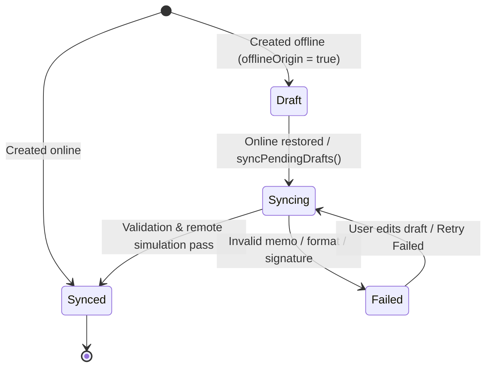

# Offline Transaction Draft Queue & Sync Indicators

## Overview

The Offline Transaction Draft Queue provides PWA resilience for the Stellar Developer Dashboard. When connectivity is interrupted or lost, developers can continue building, editing, and staging transaction drafts. Drafts created offline are stored in a dedicated local draft queue and automatically synced and validated against the Stellar network when connectivity is restored.

---

## Key Features

1. **Offline Draft Queueing**: Persistently queues transaction snapshots created offline with network-tagging and metadata tracking.
2. **Clear Sync Indicators**: Five-state sync state machine (`draft`, `syncing`, `synced`, `failed`, `conflict`) with intuitive color badges and explanatory tooltips.
3. **Auto-Sync on Reconnect**: Listens to real-time network connectivity changes (`subscribeToConnectivity`) and triggers batch validation and synchronization when online.
4. **Resilient Quota & Storage Fallback**: Bounds queue capacity to 50 drafts (FIFO pruning) with an automatic in-memory fallback store if `localStorage` is full, disabled, or running in SSR/Node.
5. **Real-Time Reactive Pub/Sub**: `subscribeToDraftSync` notifies UI components (`OfflineBanner`, `OfflineDraftQueue`, `SyncStatusIndicator`) on state transitions.

---

## Sync Status Lifecycle



### Sync Status Definitions

| Status | Color Badge | Meaning |
| :--- | :--- | :--- |
| `draft` | Amber / Clock | Created or modified offline. Queued for synchronization when online. |
| `syncing` | Sky / Spinner | Currently validating operations and synchronizing with the Stellar network. |
| `synced` | Emerald / Check | Successfully verified against network constraints; timestamp recorded in `lastSyncedAt`. |
| `failed` | Rose / Alert | Validation or remote simulation failed. Explanatory message stored in `syncError`. |
| `conflict` | Purple / Warning | Sequence number or account configuration conflict detected. |

---

## API Reference (`src/lib/offlineDrafts.ts`)

### Data Structures

```typescript
export type DraftSyncStatus = 'draft' | 'syncing' | 'synced' | 'failed' | 'conflict';

export interface OfflineDraft {
  id: string;
  name: string;
  createdAt: number;
  updatedAt: number;
  network: string; // 'testnet' | 'public' | 'futurenet'
  syncStatus: DraftSyncStatus;
  syncError?: string;
  lastSyncedAt?: number;
  snapshot: TxSnapshot;
  offlineOrigin: boolean;
  tags?: string[];
  version?: number;
}

export interface DraftSyncSummary {
  total: number;
  offlineCount: number;
  syncingCount: number;
  syncedCount: number;
  failedCount: number;
  conflictCount: number;
  hasPendingSync: boolean;
}
```

### Core Functions

- **`saveOfflineDraft(options)`**: Saves or updates a draft. Automatically detects offline mode or honors `forceOffline`. Prunes oldest drafts when capacity exceeds 50.
- **`getOfflineDraft(id)`**: Fetches a draft by unique identifier.
- **`listOfflineDrafts(filters)`**: Lists drafts with optional filtering by `network`, `syncStatus`, or `offlineOriginOnly`.
- **`deleteOfflineDraft(id)`**: Deletes a specific draft and updates subscribers.
- **`clearOfflineDrafts()`**: Clears the entire draft queue.
- **`validateDraftForSync(draft)`**: Validates snapshot structure, Stellar public keys, operation arrays, and memo length boundaries (e.g. 28-byte text memo limits).
- **`syncPendingDrafts(options)`**: Transitions `draft` and `failed` entries through `syncing` to `synced` or `failed`.
- **`retryFailedDrafts(network?)`**: Retries all failed drafts for a given network.
- **`subscribeToDraftSync(listener)`**: Subscribes to reactive draft updates; invokes listener immediately with current summary and drafts.
- **`initDraftAutoSync()`**: Initializes idempotent network listener to trigger synchronization on reconnect.

---

## UI Components

### 1. `SyncStatusIndicator` (`src/components/common/SyncStatusIndicator.tsx`)
A status badge displaying the draft state with accessible labels, icons, and contextual tooltips.

```tsx
import SyncStatusIndicator from '@/components/common/SyncStatusIndicator';

<SyncStatusIndicator
  status={draft.syncStatus}
  error={draft.syncError}
  lastSyncedAt={draft.lastSyncedAt}
  size="sm"
/>
```

### 2. `OfflineDraftQueue` (`src/components/dashboard/OfflineDraftQueue.tsx`)
A queue management component with summary metrics, status and network filtering, sync actions, and draft loading.

```tsx
import OfflineDraftQueue from '@/components/dashboard/OfflineDraftQueue';

<OfflineDraftQueue
  currentNetwork="testnet"
  onSelectDraft={(draft) => loadDraftIntoBuilder(draft)}
/>
```

### 3. `OfflineBanner` (`src/components/layout/OfflineBanner.tsx`)
Displays live offline status, queued write operation count, and pending offline draft count.

---

## Security, Compatibility & Migration Notes

- **Security**: Draft snapshots are stored exclusively in local client storage (`localStorage` / in-memory). Private keys and seed phrases are **never** stored in transaction drafts.
- **Storage Quota Resilience**: Handles `QuotaExceededError` gracefully by falling back to an in-memory session store so that user actions are never interrupted.
- **Backwards Compatibility**: Fully backwards compatible with `txHistory.ts` and `offlineReadOnly.ts`. Existing draft records are automatically upgraded.
